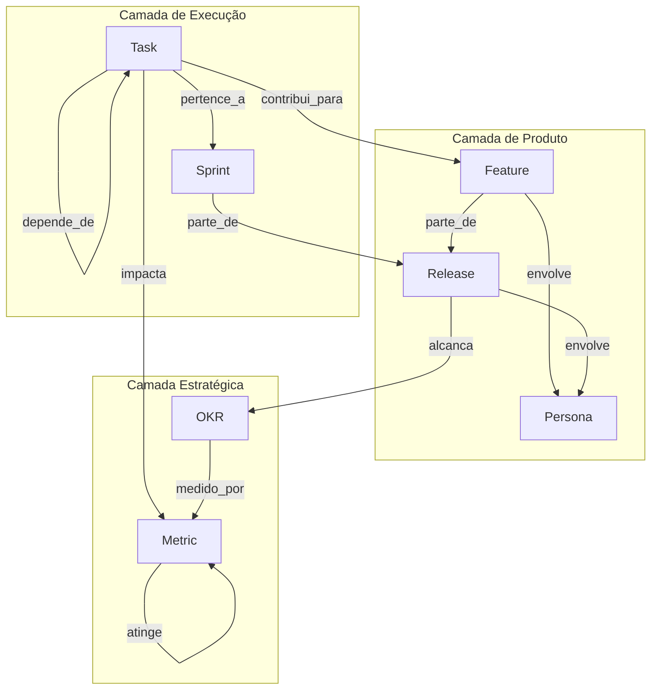
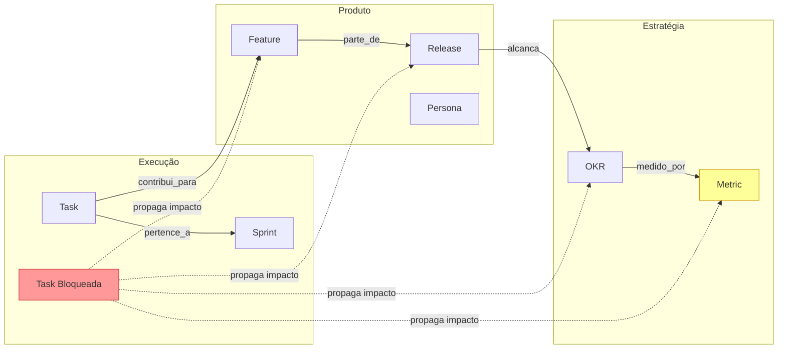

# Catálogo de Tipos de Aresta — Knowledge Graph do APOS

**Documento:** EDGE_TYPES.md  
**Release:** R0 | **Sprint:** 0.4  
**Tarefa:** T0.4.3 — Catálogo de tipos de aresta  
**Dependência:** KNOWLEDGE_GRAPH.md (modelo formal), NODE_TYPES.md (catálogo de nós)  
**Criado em:** 2026-07-21  
**Versão:** v0.1-draft

---

## Índice

1. [Introdução](#1-introdução)
2. [Estrutura da Edge](#2-estrutura-da-edge)
3. [CONTRIBUI_PARA](#3-contribui_para)
4. [PARTE_DE](#4-parte_de)
5. [ALCANCA](#5-alcanca)
6. [MEDIDO_POR](#6-medido_por)
7. [IMPACTA](#7-impacta)
8. [BLOQUEIA](#8-bloqueia)
9. [DEPENDE_DE](#9-depende_de)
10. [PERTENCE_A](#10-pertence_a)
11. [ENVOLVE](#11-envolve)
12. [ATINGE](#12-atinge)
13. [Matriz Gráfica Source × Target](#13-matriz-gráfica-source--target)
14. [Regras de Propagação de Impacto](#14-regras-de-propagação-de-impacto)
15. [Glossário de Termos](#15-glossário-de-termos)

---

## 1. Introdução

### 1.1 Propósito

O Knowledge Graph do APOS define **10 tipos de aresta** que materializam as relações ontológicas (Camada 1) entre os 7 tipos de nó. Enquanto `NODE_TYPES.md` cataloga _o que_ existe no grafo, `EDGE_TYPES.md` cataloga _como_ esses nós se conectam — o vocabulário completo de relações do grafo.

Cada aresta é direcionada (source → target), possui peso semântico e carrega metadados de rastreabilidade. A partir destas arestas, é possível navegar entre camadas (Task → Feature → Release → OKR → Metric), inferir impactos e propagar mudanças.

### 1.2 Os 10 EdgeTypes

| # | EdgeType | Source → Target | Categoria |
|---|----------|----------------|-----------|
| 1 | `contribui_para` | Task → Feature | Alinhamento tático |
| 2 | `parte_de` | Feature → Release, Sprint → Release | Hierarquia |
| 3 | `alcanca` | Release → OKR | Estratégia |
| 4 | `medido_por` | OKR → Metric | Mensuração |
| 5 | `impacta` | Task → Metric | Inferência |
| 6 | `bloqueia` | Task → Task | Dependência |
| 7 | `depende_de` | Task → Task | Dependência reversa |
| 8 | `pertence_a` | Task → Sprint | Alocação temporal |
| 9 | `envolve` | Feature → Persona, Release → Persona | Stakeholder |
| 10 | `atinge` | Metric → Metric | Meta |

---

## 2. Estrutura da Edge

### 2.1 Definição Formal

```python
@dataclass
class Edge:
    source: str       # URN do nó origem
    target: str       # URN do nó destino
    type: EdgeType    # Tipo da aresta (enum)
    weight: float     # Peso [0.0, 1.0] (padrão: 1.0)
    metadata: EdgeMetadata  # Metadados da aresta

@dataclass
class EdgeMetadata:
    created_at: str       # ISO 8601
    updated_at: str       # ISO 8601
    version: int          # Versão incremental
    confidence: float     # Confiança na relação [0.0, 1.0] (default: 1.0)
    reason: str | None    # Razão contextual (opcional)
```

### 2.2 EdgeType (Enum)

```python
class EdgeType(Enum):
    CONTRIBUI_PARA = "contribui_para"   # Task → Feature
    PARTE_DE       = "parte_de"         # Feature → Release, Sprint → Release
    ALCANCA        = "alcanca"          # Release → OKR
    MEDIDO_POR     = "medido_por"       # OKR → Metric
    IMPACTA        = "impacta"          # Task → Metric (inferência)
    BLOQUEIA       = "bloqueia"         # Task → Task (dependência)
    DEPENDE_DE     = "depende_de"       # Task → Task (dependência reversa)
    PERTENCE_A     = "pertence_a"       # Task → Sprint
    ENVOLVE        = "envolve"          # Feature → Persona, Release → Persona
    ATINGE         = "atinge"           # Metric → Metric (valor alvo)
```

### 2.3 Componentes

| Campo | Tipo | Obrigatório | Descrição |
|-------|------|-------------|-----------|
| `source` | `str` (URN) | ✅ | URN do nó de origem |
| `target` | `str` (URN) | ✅ | URN do nó de destino |
| `type` | `EdgeType` (enum) | ✅ | Tipo ontológico da relação |
| `weight` | `float` | ✅ | Peso da relação [0.0, 1.0]; default 1.0 |
| `metadata.created_at` | `str` (ISO 8601) | ✅ | Data de criação |
| `metadata.updated_at` | `str` (ISO 8601) | ✅ | Data da última modificação |
| `metadata.version` | `int` | ✅ | Versão incremental (1-based) |
| `metadata.confidence` | `float` | ✅ | Confiança [0.0, 1.0]; default 1.0 |
| `metadata.reason` | `str` | ❌ | Razão contextual da relação |

### 2.4 EdgeMetadata — Campos Detalhados

| Campo | Descrição | Uso Típico |
|-------|-----------|-----------|
| `created_at` | Momento em que a aresta foi criada no grafo | Auditoria, timeline |
| `updated_at` | Momento da última alteração na aresta | Controle de versão |
| `version` | Contador incremental de modificações | Detecção de concorrência |
| `confidence` | Grau de certeza de que a relação existe | Inferência automática vs. mapeamento direto |
| `reason` | Explicação textual de por que a aresta existe | Rastreabilidade, debug |

---

## 3. CONTRIBUI_PARA

### 3.1 Nome e Descrição

**`contribui_para`** — Relaciona uma **Task** à **Feature** da qual ela faz parte. É a relação mais fundamental do grafo: toda task existe para entregar valor a exatamente uma feature. Sem esta aresta, a task é órfã — não contribui para nenhum objetivo de produto.

Em linguagem de negócio: _"A task X contribui para a feature Y"_.

### 3.2 Source → Target

| Source | Target | Exemplo de URN |
|--------|--------|----------------|
| `urn:apos:task:{local_id}` | `urn:apos:feature:{local_id}` | `task:oauth-123` → `feature:faster-auth` |

### 3.3 Cardinalidade

**N:1** — Muitas tasks contribuem para exatamente uma feature.

- Uma task **DEVE** ter exatamente 1 aresta `contribui_para` (regra KG-008).
- Uma feature **PODE** ter 0, 1 ou N tasks contribuindo.
- Violação: task com 2+ arestas `contribui_para` → REJECT.

**Justificativa:** Tasks são unidades atômicas que compõem uma feature. Uma task não pode pertencer a duas features simultaneamente — isso quebraria a rastreabilidade de entrega.

### 3.4 Peso Semântico (weight)

| Peso | Significado | Quando Usar |
|------|-------------|-------------|
| `1.0` | Forte | A task é **essencial** para a feature (sem ela, a feature não é entregue) |
| `0.7` | Médio | A task **agrega valor** mas a feature pode ser entregue sem ela (nice-to-have) |
| `0.5` | Fraco | A task é **acessória** ou complementar |
| `0.0–0.3` | Inferido | Relação inferida por similaridade (evitar em R0; uso futuro) |

### 3.5 Propagação

```
Task A --contribui_para--> Feature X --parte_de--> Release R
                                                       |
                                                       v
                                                  OKR O --medido_por--> Metric M
```

Se a Task A contribui para Feature X, e Feature X parte_de Release R, então:

- **Task A concluída** → Feature X avança (completeness aumenta)
- **Task A bloqueada** → Feature X atrasada → Release R em risco → OKR O ameaçado → Metric M não atinge target

### 3.6 Regras de Validação

| Regra | Descrição |
|-------|-----------|
| KG-002 | `contribui_para` só é válido para source=Task → target=Feature |
| KG-008 | Uma Task DEVE contribuir para exatamente 1 Feature (N:1) |

### 3.7 Exemplo JSON

```json
{
  "source": "urn:apos:task:oauth-123",
  "target": "urn:apos:feature:faster-auth",
  "type": "contribui_para",
  "weight": 1.0,
  "metadata": {
    "created_at": "2026-07-15T10:00:00Z",
    "updated_at": "2026-07-15T10:00:00Z",
    "version": 1,
    "confidence": 1.0,
    "reason": "Mapeamento direto Jira → APOS: task componente da feature Faster Auth"
  }
}
```

---

## 4. PARTE_DE

### 4.1 Nome e Descrição

**`parte_de`** — Relaciona uma **Feature** ou **Sprint** à **Release** da qual faz parte. É a relação hierárquica que organiza o trabalho em versões entregáveis.

Em linguagem de negócio: _"A feature X faz parte da release R"_, _"A sprint S faz parte da release R"_.

### 4.2 Source → Target

| Source | Target | Exemplo de URN |
|--------|--------|----------------|
| `urn:apos:feature:{local_id}` | `urn:apos:release:{local_id}` | `feature:faster-auth` → `release:v2-1` |
| `urn:apos:sprint:{local_id}` | `urn:apos:release:{local_id}` | `sprint:s0-4` → `release:v2-1` |

### 4.3 Cardinalidade

| Source → Target | Cardinalidade | Justificativa |
|----------------|---------------|---------------|
| Feature → Release | **N:1** | Uma feature pertence a exatamente 1 release (KG-009). Uma release contém N features. |
| Sprint → Release | **N:1** | Uma sprint pertence a exatamente 1 release. Uma release pode conter N sprints. |

**Justificativa:** Features e sprints são unidades de planejamento que fazem parte de uma release específica. Uma feature não pode estar em duas releases simultaneamente — isso criaria ambiguidade de versão.

### 4.4 Peso Semântico (weight)

| Peso | Significado | Quando Usar |
|------|-------------|-------------|
| `1.0` | Forte | Feature/Sprint **confirmada** na release (default) |
| `0.7` | Médio | Feature **planejada** mas ainda não confirmada (backlog da release) |
| `0.5` | Fraco | Feature **candidata** — pode ser movida para outra release |
| `0.0` | Removida | Feature foi removida da release (aresta mantida para auditoria) |

### 4.5 Propagação

```
Feature/Sprint --parte_de--> Release
                                  |
                                  v
                            OKR O --medido_por--> Metric M
```

- **Feature removida** da Release → Release perde escopo → impacto indireto nos OKRs
- **Sprint concluída** → Release avança → OKRs progredidos

### 4.6 Regras de Validação

| Regra | Descrição |
|-------|-----------|
| KG-002 | `parte_de` válido para Feature→Release e Sprint→Release |
| KG-009 | Uma Feature DEVE pertencer a exatamente 1 Release (N:1) |
| KG-011 | Se Feature está `shipped`, a Release deve estar `shipped` (WARN) |

### 4.7 Exemplo JSON

```json
{
  "source": "urn:apos:feature:faster-auth",
  "target": "urn:apos:release:v2-1",
  "type": "parte_de",
  "weight": 1.0,
  "metadata": {
    "created_at": "2026-07-10T10:00:00Z",
    "updated_at": "2026-07-20T14:00:00Z",
    "version": 2,
    "confidence": 1.0,
    "reason": "Feature alocada na Summer Release 2026"
  }
}
```

```json
{
  "source": "urn:apos:sprint:s0-4",
  "target": "urn:apos:release:v2-1",
  "type": "parte_de",
  "weight": 1.0,
  "metadata": {
    "created_at": "2026-07-20T08:00:00Z",
    "updated_at": "2026-07-20T08:00:00Z",
    "version": 1,
    "confidence": 1.0,
    "reason": "Sprint de design alocada na release v2.1"
  }
}
```

---

## 5. ALCANCA

### 5.1 Nome e Descrição

**`alcanca`** — Relaciona uma **Release** a um **OKR** que ela ajuda a atingir. É a ponte entre a execução tática (release com suas features/tasks) e a estratégia de negócio (OKRs). Uma release pode contribuir para múltiplos OKRs, e um OKR pode ser alcançado por múltiplas releases.

Em linguagem de negócio: _"A release R alcança o OKR O"_.

### 5.2 Source → Target

| Source | Target | Exemplo de URN |
|--------|--------|----------------|
| `urn:apos:release:{local_id}` | `urn:apos:okr:{local_id}` | `release:v2-1` → `okr:churn-5pct` |

### 5.3 Cardinalidade

**N:M** — Muitas releases podem alcançar muitos OKRs.

- Uma release PODE alcançar 0, 1 ou N OKRs.
- Um OKR PODE ser alcançado por 0, 1 ou N releases.
- Releases planejadas sem OKR → WARN (permitido para releases infra/tech-debt).

**Justificativa:** Releases entregam valor de negócio que frequentemente impacta múltiplos objetivos estratégicos. Um OKR como "Reduzir churn em 5%" pode ser alcançado por releases sucessivas.

### 5.4 Peso Semântico (weight)

| Peso | Significado | Quando Usar |
|------|-------------|-------------|
| `1.0` | Forte | Release é **determinante** para o OKR (sem ela, OKR não é atingido) |
| `0.7` | Médio | Release **contribui significativamente** para o OKR |
| `0.5` | Fraco | Release **contribui marginalmente** (ex: release de infra afeta indiretamente) |
| `0.3` | Mínimo | Release **tange** o OKR de forma remota |
| `0.0` | Nulo | Aresta removida ou inferida sem evidência |

### 5.5 Propagação

```
Task T --contribui_para--> Feature F --parte_de--> Release R --alcanca--> OKR O
                                                                                |
                                                                                v
                                                                          Metric M
```

- **Release concluída** → OKR progride → Métricas melhoram
- **Release atrasada** → OKR em risco → alertas de métrica acionados
- **OKR removido** → releases associadas perdem vínculo estratégico (WARN)

### 5.6 Regras de Validação

| Regra | Descrição |
|-------|-----------|
| KG-002 | `alcanca` válido apenas para Release → OKR |
| KG-012 | weight deve estar em [0.0, 1.0] |

### 5.7 Exemplo JSON

```json
{
  "source": "urn:apos:release:v2-1",
  "target": "urn:apos:okr:churn-5pct",
  "type": "alcanca",
  "weight": 0.7,
  "metadata": {
    "created_at": "2026-07-01T08:00:00Z",
    "updated_at": "2026-07-20T10:00:00Z",
    "version": 1,
    "confidence": 0.9,
    "reason": "Release v2.1 contém Faster Auth que reduz atrito de login, contribuindo para redução de churn"
  }
}
```

---

## 6. MEDIDO_POR

### 6.1 Nome e Descrição

**`medido_por`** — Relaciona um **OKR** a uma **Metric** que quantifica seu progresso. É a relação de mensuração: um OKR não é verificável sem métricas associadas. Cada métrica vinculada a um OKR representa um Key Result (KR).

Em linguagem de negócio: _"O OKR O é medido pela métrica M"_.

### 6.2 Source → Target

| Source | Target | Exemplo de URN |
|--------|--------|----------------|
| `urn:apos:okr:{local_id}` | `urn:apos:metric:{local_id}` | `okr:churn-5pct` → `metric:login-time` |

### 6.3 Cardinalidade

**1:N** — Um OKR é medido por 1 ou mais métricas. Cada métrica pode medir exatamente 1 OKR.

- Um OKR DEVE ter ≥ 1 métrica associada (regra KG-010, WARN se vazio).
- Uma métrica PODE medir no máximo 1 OKR.

**Justificativa:** Um Key Result é uma métrica com alvo. Se a mesma métrica medisse dois OKRs, não seria possível atribuir progresso — viola o princípio de responsabilidade única. A cardinalidade 1:N (não N:M) garante rastreabilidade clara.

### 6.4 Peso Semântico (weight)

| Peso | Significado | Quando Usar |
|------|-------------|-------------|
| `1.0` | Forte | Métrica é o **principal indicador** do OKR (default) |
| `0.7` | Médio | Métrica **complementar** — um KR secundário |
| `0.5` | Fraco | Métrica **contextual** — informativa, não determinante |

### 6.5 Propagação

```
OKR O --medido_por--> Metric M

Se Metric M está at_risk ou critical:
  → OKR O fica at_risk → Release R impactada → Features/Tasks em alerta

Se Metric M melhora (atinge target):
  → OKR O progride → Pode atingir status achieved
```

### 6.6 Regras de Validação

| Regra | Descrição |
|-------|-----------|
| KG-002 | `medido_por` válido apenas para OKR → Metric |
| KG-010 | Um OKR DEVE ter ≥ 1 métrica associada (WARN se vazio) |

### 6.7 Exemplo JSON

```json
{
  "source": "urn:apos:okr:churn-5pct",
  "target": "urn:apos:metric:login-time",
  "type": "medido_por",
  "weight": 1.0,
  "metadata": {
    "created_at": "2026-06-20T08:00:00Z",
    "updated_at": "2026-06-20T08:00:00Z",
    "version": 1,
    "confidence": 1.0,
    "reason": "Login time < 2s é o Key Result primário do OKR de redução de churn"
  }
}
```

---

## 7. IMPACTA

### 7.1 Nome e Descrição

**`impacta`** — Relaciona uma **Task** a uma **Metric** que ela afeta direta ou indiretamente. É a única aresta do grafo que conecta o nível mais granular (tasks) diretamente a métricas, permitindo inferir o impacto de mudanças operacionais em indicadores de negócio.

Em linguagem de negócio: _"A task T impacta a métrica M"_.

### 7.2 Source → Target

| Source | Target | Exemplo de URN |
|--------|--------|----------------|
| `urn:apos:task:{local_id}` | `urn:apos:metric:{local_id}` | `task:oauth-123` → `metric:login-time` |

### 7.3 Cardinalidade

**N:M** — Muitas tasks podem impactar muitas métricas.

- Uma task PODE impactar 0, 1 ou N métricas.
- Uma métrica PODE ser impactada por 0, 1 ou N tasks.
- Relação inferida ou declarada explicitamente.

**Justificativa:** Múltiplas tasks podem afetar a mesma métrica (ex: login-time impactado por tasks de cache, auth, UI). Uma task pode afetar múltiplas métricas (ex: uma task de infra afeta latência e error-rate).

### 7.4 Peso Semântico (weight)

| Peso | Significado | Quando Usar |
|------|-------------|-------------|
| `1.0` | Forte | Task **determina** o valor da métrica (causalidade direta) |
| `0.7–0.9` | Alto | Task tem **impacto significativo** na métrica |
| `0.4–0.6` | Médio | Task **influencia** a métrica mas não é dominante |
| `0.1–0.3` | Baixo | Task tem **impacto marginal** (inferido por similaridade) |
| `0.0` | Nulo | Impacto inferido e rejeitado (aresta mantida como histórico de inferência) |

⚠️ **Atenção:** Arestas `impacta` com weight ≤ 0.5 têm `confidence` proporcionalmente menor. Devem ser validadas antes de usar em propagação de impacto.

### 7.5 Propagação

```
Task T --impacta, w=0.8--> Metric M

Se Task T é concluída:
  → Metric M melhora (current_value se aproxima do target)

Se Task T é bloqueada:
  → Metric M em risco → OKR O (via medido_por reverso)

Cadeia inferida (sem aresta explícita):
Task T --contribui_para--> Feature F --parte_de--> Release R --alcanca--> OKR O
  (impacta inferido)                                                |
                                                                     v
                                                              Metric M
```

### 7.6 Regras de Validação

| Regra | Descrição |
|-------|-----------|
| KG-002 | `impacta` válido apenas para Task → Metric |
| KG-012 | weight deve estar em [0.0, 1.0] |

### 7.7 Exemplo JSON

```json
{
  "source": "urn:apos:task:oauth-123",
  "target": "urn:apos:metric:login-time",
  "type": "impacta",
  "weight": 0.8,
  "metadata": {
    "created_at": "2026-07-15T10:00:00Z",
    "updated_at": "2026-07-15T10:00:00Z",
    "version": 1,
    "confidence": 0.9,
    "reason": "Implementação de OAuth reduz tempo de login ao eliminar redirects manuais"
  }
}
```

---

## 8. BLOQUEIA

### 8.1 Nome e Descrição

**`bloqueia`** — Relaciona uma **Task** a outra **Task** que ela impede de progredir. A origem (source) é a task bloqueadora, o destino (target) é a task bloqueada. Modela dependências de precedência no fluxo de trabalho.

Em linguagem de negócio: _"A task A bloqueia a task B"_ (B não pode começar ou concluir enquanto A não estiver `done`).

### 8.2 Source → Target

| Source | Target | Exemplo de URN |
|--------|--------|----------------|
| `urn:apos:task:{local_id}` | `urn:apos:task:{local_id}` | `task:oauth-123` → `task:session-mgmt` |

### 8.3 Cardinalidade

**N:M** — Muitas tasks podem bloquear muitas tasks.

- Uma task PODE bloquear 0, 1 ou N tasks.
- Uma task PODE ser bloqueada por 0, 1 ou N tasks.
- O grafo NÃO permite ciclos de bloqueio (detecção por algoritmo de detecção de ciclos).

**Justificativa:** Dependências reais de projeto frequentemente têm fan-out (uma task bloqueia várias) e fan-in (uma task depende de várias).

### 8.4 Peso Semântico (weight)

| Peso | Significado | Quando Usar |
|------|-------------|-------------|
| `1.0` | Forte | Bloqueio **total** — task B não pode nem começar sem task A |
| `0.7` | Médio | Bloqueio **parcial** — task B pode começar mas não concluir sem task A |
| `0.5` | Fraco | Bloqueio **temporário** — workaround existe, mas A é a solução definitiva |
| `0.3` | Mínimo | Bloqueio **soft** — prefere-se A antes de B, mas não é mandatório |

### 8.5 Propagação

```
Task A --bloqueia, w=1.0--> Task B --contribui_para--> Feature F

Se Task A está blocked ou in_progress:
  → Task B fica blocked
  → Feature F não avança (completeness estagnada)
  → Cadeia: Feature F --parte_de--> Release R --alcanca--> OKR O
  → Métrica associada ao OKR em risco

Propagação automática:
  Task A bloqueia Task B + Task B bloqueia Task C
  ⇒ Task A bloqueia Task C (transitividade)
```

### 8.6 Regras de Validação

| Regra | Descrição |
|-------|-----------|
| KG-002 | `bloqueia` válido apenas para Task → Task |
| KG-012 | weight deve estar em [0.0, 1.0] |
| — | Detecção de ciclos: source → ... → source é REJECT |

### 8.7 Exemplo JSON

```json
{
  "source": "urn:apos:task:oauth-123",
  "target": "urn:apos:task:session-mgmt",
  "type": "bloqueia",
  "weight": 1.0,
  "metadata": {
    "created_at": "2026-07-15T10:30:00Z",
    "updated_at": "2026-07-15T10:30:00Z",
    "version": 1,
    "confidence": 1.0,
    "reason": "Session management depende do fluxo OAuth para validar tokens de sessão"
  }
}
```

---

## 9. DEPENDE_DE

### 9.1 Nome e Descrição

**`depende_de`** — Relaciona uma **Task** a outra **Task** da qual ela depende. É a relação inversa de `bloqueia`: source é a task que depende, target é a task necessária. As duas arestas sempre coexistem como um par complementar.

Em linguagem de negócio: _"A task B depende da task A"_ (sinônimo de "A bloqueia B").

### 9.2 Source → Target

| Source | Target | Exemplo de URN |
|--------|--------|----------------|
| `urn:apos:task:{local_id}` | `urn:apos:task:{local_id}` | `task:session-mgmt` → `task:oauth-123` |

### 9.3 Cardinalidade

**N:M** — Muitas tasks podem depender de muitas tasks.

- Se `A --bloqueia--> B` existe, então `B --depende_de--> A` DEVE existir (aresta complementar obrigatória).
- Uma task PODE depender de 0, 1 ou N tasks.
- O grafo NÃO permite ciclos.

**Justificativa:** A bidirecionalidade `bloqueia`/`depende_de` permite navegar o grafo em ambas as direções semânticas: "o que bloqueia esta task" (incoming bloqueia) e "de que esta task depende" (outgoing depende_de).

### 9.4 Peso Semântico (weight)

O peso de `depende_de` **DEVE ser idêntico** ao peso da aresta `bloqueia` correspondente.

| Peso | Significado |
|------|-------------|
| `1.0` | Dependência total |
| `0.7` | Dependência parcial |
| `0.5` | Dependência temporária |
| `0.3` | Dependência soft |

### 9.5 Propagação

```
Task B --depende_de--> Task A

Se Task A altera status (ex: in_progress → done):
  → Task B pode progredir (se não há outros bloqueios)

Se Task A é removida:
  → Task B não tem pré-requisito → B fica impossibilitada

Cadeia transitiva:
  Task C --depende_de--> Task B --depende_de--> Task A
  ⇒ Task C depende indiretamente de Task A
```

### 9.6 Regras de Validação

| Regra | Descrição |
|-------|-----------|
| KG-002 | `depende_de` válido apenas para Task → Task |
| KG-012 | weight deve estar em [0.0, 1.0] |
| — | `depende_de` DEVE ter aresta `bloqueia` complementar no sentido inverso |

### 9.7 Exemplo JSON

```json
{
  "source": "urn:apos:task:session-mgmt",
  "target": "urn:apos:task:oauth-123",
  "type": "depende_de",
  "weight": 1.0,
  "metadata": {
    "created_at": "2026-07-15T10:30:00Z",
    "updated_at": "2026-07-15T10:30:00Z",
    "version": 1,
    "confidence": 1.0,
    "reason": "Session management requer OAuth pois usa tokens de sessão gerados pelo fluxo OAuth"
  }
}
```

---

## 10. PERTENCE_A

### 10.1 Nome e Descrição

**`pertence_a`** — Relaciona uma **Task** a uma **Sprint** na qual ela é executada. Modela a alocação temporal do trabalho: uma task é executada dentro de uma sprint. A sprint define o período em que a task deve ser concluída.

Em linguagem de negócio: _"A task T pertence à sprint S"_.

### 10.2 Source → Target

| Source | Target | Exemplo de URN |
|--------|--------|----------------|
| `urn:apos:task:{local_id}` | `urn:apos:sprint:{local_id}` | `task:oauth-123` → `sprint:s0-4` |

### 10.3 Cardinalidade

**N:1** — Muitas tasks pertencem a exatamente uma sprint.

- Uma task DEVE pertencer a exatamente 1 sprint (obrigatório em R0+).
- Uma sprint PODE ter 0, 1 ou N tasks.

**Justificativa:** Uma task não pode estar em duas sprints simultaneamente — isso violaria o princípio de alocação temporal única. Se uma task não é alocada, é backlog (não pertence a sprint alguma, o que é válido).

### 10.4 Peso Semântico (weight)

| Peso | Significado | Quando Usar |
|------|-------------|-------------|
| `1.0` | Forte | Task **comprometida** para a sprint (default) |
| `0.7` | Médio | Task **planejada** mas não comprometida (stretch goal) |
| `0.5` | Fraco | Task **candidata** — pode ser movida para outra sprint |
| `0.3` | Mínimo | Task **em avaliação** para a sprint |
| `0.0` | Removida | Task foi removida da sprint (auditoria) |

### 10.5 Propagação

```
Task T --pertence_a--> Sprint S --parte_de--> Release R

Se Sprint S termina:
  → Tasks não concluídas são re-planejadas (nova sprint ou backlog)
  → Release R tem escopo ajustado

Se Sprint S é cancelada:
  → Todas as tasks da sprint retornam ao backlog
  → Release R impactada
```

### 10.6 Regras de Validação

| Regra | Descrição |
|-------|-----------|
| KG-002 | `pertence_a` válido apenas para Task → Sprint |

### 10.7 Exemplo JSON

```json
{
  "source": "urn:apos:task:oauth-123",
  "target": "urn:apos:sprint:s0-4",
  "type": "pertence_a",
  "weight": 1.0,
  "metadata": {
    "created_at": "2026-07-20T08:00:00Z",
    "updated_at": "2026-07-20T08:00:00Z",
    "version": 1,
    "confidence": 1.0,
    "reason": "Task alocada na Sprint 0.4 durante planning"
  }
}
```

---

## 11. ENVOLVE

### 11.1 Nome e Descrição

**`envolve`** — Relaciona uma **Feature** ou **Release** a uma **Persona** impactada por ela. Conecta entregas de produto aos stakeholders, permitindo rastrear quem é afetado por mudanças no escopo.

Em linguagem de negócio: _"A feature/release X envolve a persona P"_.

### 11.2 Source → Target

| Source | Target | Exemplo de URN |
|--------|--------|----------------|
| `urn:apos:feature:{local_id}` | `urn:apos:persona:{local_id}` | `feature:faster-auth` → `persona:developer` |
| `urn:apos:release:{local_id}` | `urn:apos:persona:{local_id}` | `release:v2-1` → `persona:developer` |

### 11.3 Cardinalidade

| Source → Target | Cardinalidade | Justificativa |
|----------------|---------------|---------------|
| Feature → Persona | **N:M** | Uma feature pode impactar múltiplas personas; uma persona pode ser impactada por múltiplas features |
| Release → Persona | **N:M** | Uma release pode impactar múltiplas personas; uma persona pode ser impactada por múltiplas releases |

**Justificativa:** Produtos reais têm múltiplos stakeholders. Uma feature de autenticação impacta developers (que implementam) e end-users (que usam). Releases agrupam features que coletivamente impactam personas.

### 11.4 Peso Semântico (weight)

| Peso | Significado | Quando Usar |
|------|-------------|-------------|
| `1.0` | Forte | Feature/Release **diretamente relevante** para a persona (default) |
| `0.7` | Médio | Feature/Release **indiretamente relevante** |
| `0.5` | Fraco | Persona é **marginalmente impactada** |
| `0.3` | Mínimo | Persona tem **interesse periférico** |

### 11.5 Propagação

```
Feature F --envolve--> Persona P

Se Feature F é adiada ou removida:
  → Persona P não recebe o valor esperado
  → Satisfação da persona é impactada

Se Release R --envolve--> Persona P:
  → Todas as features de R que também envolvem P sofrem o mesmo impacto
```

### 11.6 Regras de Validação

| Regra | Descrição |
|-------|-----------|
| KG-002 | `envolve` válido para Feature→Persona e Release→Persona |

### 11.7 Exemplo JSON

```json
{
  "source": "urn:apos:feature:faster-auth",
  "target": "urn:apos:persona:developer",
  "type": "envolve",
  "weight": 1.0,
  "metadata": {
    "created_at": "2026-07-01T08:00:00Z",
    "updated_at": "2026-07-01T08:00:00Z",
    "version": 1,
    "confidence": 1.0,
    "reason": "Feature Faster Auth impacta diretamente developers que consomem a API de autenticação"
  }
}
```

```json
{
  "source": "urn:apos:release:v2-1",
  "target": "urn:apos:persona:developer",
  "type": "envolve",
  "weight": 0.7,
  "metadata": {
    "created_at": "2026-07-01T08:00:00Z",
    "updated_at": "2026-07-01T08:00:00Z",
    "version": 1,
    "confidence": 0.8,
    "reason": "Release v2.1 contém múltiplas features de API que afetam developers"
  }
}
```

---

## 12. ATINGE

### 12.1 Nome e Descrição

**`atinge`** — Relaciona uma **Metric** a outra **Metric** que funciona como seu valor alvo, baseline, ou derivação. Permite modelar hierarquia entre métricas — por exemplo, uma métrica composta (NPS) derivada de métricas de componentes (satisfação, retenção). A aresta pode ser autorreferente (metric → mesma metric) para rastrear evolução temporal.

Em linguagem de negócio: _"A métrica M atinge o alvo T"_.

### 12.2 Source → Target

| Source | Target | Exemplo de URN |
|--------|--------|----------------|
| `urn:apos:metric:{local_id}` | `urn:apos:metric:{local_id}` | `metric:login-time` → `metric:login-time` |

### 12.3 Cardinalidade

**N:1** — Muitas métricas podem atingir o mesmo valor alvo.

- Uma métrica PODE ter 0 ou 1 aresta `atinge` para outra métrica (alvo).
- Uma métrica PODE ser alvo de 0, 1 ou N métricas.
- Autorreferência permitida (source = target) para rastreamento temporal.

**Justificativa:** A cardinalidade N:1 reflete que uma métrica composta serve como alvo para suas métricas componentes. A autorreferência existe porque o valor atual de uma métrica "atinge" seu próprio valor alvo — conceito útil para snapshot temporal.

### 12.4 Peso Semântico (weight)

| Peso | Significado | Quando Usar |
|------|-------------|-------------|
| `1.0` | Forte | Métrica source **atingiu completamente** o target (default para relações diretas) |
| `0.7–0.9` | Próximo | Métrica source **quase atingiu** o target |
| `0.4–0.6` | Médio | Métrica source **em progresso** em direção ao target |
| `0.1–0.3` | Distante | Métrica source **longe** do target |
| `0.0` | Não atingido | Target não foi atingido (estado inicial) |

### 12.5 Propagação

```
Metric M1 --atinge, w=0.8--> Metric M1 (autorreferência)

Se M1.current_value melhora:
  → weight da aresta `atinge` aumenta
  → Se M1 mede OKR O, O progride

Metric M_componente --atinge--> Metric M_composta

Se M_componente.current_value melhora:
  → M_composta melhora (se calculada como agregação)
```

### 12.6 Regras de Validação

| Regra | Descrição |
|-------|-----------|
| KG-002 | `atinge` válido apenas para Metric → Metric |
| KG-012 | weight deve estar em [0.0, 1.0] |

### 12.7 Exemplo JSON

```json
{
  "source": "urn:apos:metric:login-time",
  "target": "urn:apos:metric:login-time",
  "type": "atinge",
  "weight": 0.8,
  "metadata": {
    "created_at": "2026-06-20T08:00:00Z",
    "updated_at": "2026-07-20T12:00:00Z",
    "version": 3,
    "confidence": 1.0,
    "reason": "Login time atual (2.5s) vs target (2.0s): 80% do caminho"
  }
}
```

---

## 13. Matriz Gráfica Source × Target

### 13.1 Matriz Source × Target com EdgeTypes

A matriz abaixo consolida todos os pares source → target válidos, com os EdgeTypes permitidos para cada combinação.

| Source ↓ Target → | **Task** | **Feature** | **Release** | **OKR** | **Metric** | **Sprint** | **Persona** |
|-------------------|----------|-------------|-------------|---------|------------|------------|-------------|
| **Task** | `bloqueia`<br/>`depende_de` | `contribui_para` | — | — | `impacta` | `pertence_a` | — |
| **Feature** | — | — | `parte_de` | — | — | — | `envolve` |
| **Release** | — | — | — | `alcanca` | — | — | `envolve` |
| **OKR** | — | — | — | — | `medido_por` | — | — |
| **Metric** | — | — | — | — | `atinge` | — | — |
| **Sprint** | — | — | `parte_de` | — | — | — | — |
| **Persona** | — | — | — | — | — | — | — |

**Legenda:** `—` = relação não definida (aresta inválida pela regra KG-002).

### 13.2 Grafo de Relações (Mermaid)



### 13.3 Tabela de Cardinalidade Consolidada

| # | Source | EdgeType | Target | Cardinalidade |
|---|--------|----------|--------|---------------|
| 1 | Task | `contribui_para` | Feature | N:1 |
| 2 | Task | `impacta` | Metric | N:M |
| 3 | Task | `bloqueia` | Task | N:M |
| 4 | Task | `depende_de` | Task | N:M |
| 5 | Task | `pertence_a` | Sprint | N:1 |
| 6 | Feature | `parte_de` | Release | N:1 |
| 7 | Feature | `envolve` | Persona | N:M |
| 8 | Sprint | `parte_de` | Release | N:1 |
| 9 | Release | `alcanca` | OKR | N:M |
| 10 | Release | `envolve` | Persona | N:M |
| 11 | OKR | `medido_por` | Metric | 1:N |
| 12 | Metric | `atinge` | Metric | N:1 |

### 13.4 Regras de Validação (Resumo)

| ID | Regra | Severidade | Descrição |
|----|-------|-----------|-----------|
| KG-002 | Tipo de aresta válido | CRITICAL | O par (source_type, edge_type, target_type) deve estar na matriz acima |
| KG-004 | Null checks Edge | CRITICAL | Edge.source, Edge.target, Edge.type, Edge.weight são NOT NULL |
| KG-006 | Integridade source | CRITICAL | Edge.source DEVE referenciar um Node existente |
| KG-007 | Integridade target | CRITICAL | Edge.target DEVE referenciar um Node existente |
| KG-008 | Cardinalidade Task→Feature | CRITICAL | Uma Task DEVE contribuir para exatamente 1 Feature |
| KG-009 | Cardinalidade Feature→Release | CRITICAL | Uma Feature DEVE pertencer a exatamente 1 Release |
| KG-010 | Cardinalidade OKR→Metric | WARNING | Um OKR DEVE ter ≥ 1 métrica associada |
| KG-012 | Peso da Edge | CRITICAL | 0.0 ≤ Edge.weight ≤ 1.0 |

---

## 14. Regras de Propagação de Impacto

### 14.1 Diagrama de Propagação



### 14.2 Regra 1: Task Bloqueada → Métrica em Risco

```
Contexto:
  Task A --blockeia--> Task B
  Task B --contribui_para--> Feature F
  Feature F --parte_de--> Release R
  Release R --alcanca--> OKR O
  OKR O --medido_por--> Metric M

Impacto:
  Task A bloqueada ⇒ Task B bloqueada ⇒ Feature F não avança
  ⇒ Release R atrasa ⇒ OKR O em risco ⇒ Metric M não atinge target

Nível de propagação:
  - Direto (1 salto): Feature F.completeness estagnada
  - Indireto (2 saltos): Release R.date postergada
  - Estratégico (3+ saltos): OKR O.status = at_risk, Metric M.status = critical
```

### 14.3 Regra 2: Task Concluída → Feature Avança → OKR Progride

```
Contexto:
  Task T --contribui_para--> Feature F
  Feature F --parte_de--> Release R
  Release R --alcanca--> OKR O
  OKR O --medido_por--> Metric M

Propagação:
  1. Task T.status = done
  2. Feature F.completeness = tasks_done / total_tasks (percentual)
  3. Se F.completeness == 1.0 ⇒ F.status = shipped
  4. Se todas features de R shipped ⇒ R.status = shipped
  5. R shipped ⇒ OKR O.current_value aproxima-se de target_value
  6. Metric M.current_value melhora
```

### 14.4 Regra 3: Feature Removida → Release Impactada

```
Contexto:
  Feature F --parte_de--> Release R

Impacto:
  1. Feature F removida (aresta parte_de com weight = 0.0 ou removida)
  2. Release R perde escopo
  3. Se F era essencial (weight alta) ⇒ R pode ser adiada
  4. Se F tinha aresta envolve ⇒ Persona P deixa de receber valor
  5. OKRs que R alcança perdem contribuidor
```

### 14.5 Regra 4: Propagação Transitiva de Bloqueio

```
Regra: Se A --blockeia--> B e B --blockeia--> C, então A --blockeia--> C (transitivo)

Grafo:
  A --blockeia--> B --blockeia--> C
  ⇒ A bloqueia C indiretamente

Uso:
  - Calcular caminho crítico (cadeia de bloqueios)
  - Identificar bottlenecks: tasks que bloqueiam muitas outras
  - Estimar impacto de atraso: se A atrasa 1 dia, C atrasa 2+ dias
```

### 14.6 Regra 5: Impacto via Cadeia de Métricas

```
Contexto:
  Task T --impacta, w=0.8--> Metric M_login_time
  Metric M_login_time --atinge, w=0.9--> Metric M_login_time (autorreferência)

Propagação:
  1. Task T concluída ⇒ M_login_time.current_value melhora
  2. weight da aresta atinge aumenta (current_value se aproxima de target)
  3. Se M_login_time mede OKR O_componente
     ⇒ O_componente.current_value melhora
  4. Se O_componente alimenta OKR O_pai (relação futura)
     ⇒ O_pai progride
```

### 14.7 Resumo de Caminhos de Propagação

| Gatilho | Cadeia de Propagação | Nós Afetados |
|---------|---------------------|--------------|
| Task concluída | T→F→R→O→M | Feature, Release, OKR, Metric |
| Task bloqueada | T↛→F→R→O→M | Feature (estagna), Release (atrasa), OKR (risco), Metric (crítico) |
| Feature removida | F↛→R→O→M + F↛→P | Release, OKR, Metric, Persona |
| Sprint cancelada | S↛→R→(features)→O→M | Release, Features, OKRs, Metrics |
| OKR at_risk | O→M + O←R←F | Metric, Release, Features |
| Métrica crítica | M←O←R←F←T | OKR, Release, Feature, Task |

---

## 15. Glossário de Termos

### 15.1 Termos Técnicos

| Termo | Definição | Aplicação no Grafo |
|-------|-----------|-------------------|
| **Edge** | Aresta direcionada entre dois nós no grafo | Unidade fundamental de relação |
| **EdgeType** | Tipo ontológico da aresta (enum com 10 valores) | Define a semântica da relação |
| **Source** | Nó de origem da aresta (URN) | Ponto de partida da relação |
| **Target** | Nó de destino da aresta (URN) | Ponto de chegada da relação |
| **Weight** | Peso semântico [0.0, 1.0] | Intensidade/importância da relação |
| **Confidence** | Confiança na existência da relação [0.0, 1.0] | Arestas inferidas têm confidence < 1.0 |
| **Version** | Número de versão incremental (1-based) | Controle de concorrência e auditoria |
| **Propagação** | Travessia do impacto através de arestas conectadas | Como uma mudança em um nó afeta nós adjacentes |
| **Inferência** | Dedução de relações não explícitas a partir de arestas existentes | Ex: Task → Metric inferida via Feature → Release → OKR |

### 15.2 Diferença entre Weight e Confidence

| Aspecto | **Weight** | **Confidence** |
|---------|------------|----------------|
| **O que mede** | Intensidade/importância da relação | Certeza de que a relação existe |
| **Quem define** | Domain expert (humano) | Sistema (inferência) ou humano |
| **Escala** | 0.0 (sem importância) a 1.0 (determinante) | 0.0 (incerto) a 1.0 (certificado) |
| **Exemplo alto** | task essencial para feature → weight=1.0 | Mapeamento Jira → APOS direto → confidence=1.0 |
| **Exemplo baixo** | task acessória → weight=0.3 | Relação inferida por NLP → confidence=0.6 |
| **Variação** | Estática (definida na criação) | Pode aumentar com validação |

### 15.3 Tipos de Propagação

| Tipo | Definição | Exemplo |
|------|-----------|---------|
| **Propagação direta** | Impacto se move no sentido source → target | Task → Feature → Release |
| **Propagação reversa** | Impacto se move no sentido target → source | Métrica → OKR → Release |
| **Propagação transitiva** | Impacto atravessa múltiplos saltos | A bloqueia B → B bloqueia C ⇒ A bloqueia C |
| **Propagação ponderada** | Impacto é atenuado pelo peso das arestas | weight=0.5 reduz impacto em 50% |

### 15.4 Status de Health do Grafo

| Status | Descrição | Critério |
|--------|-----------|----------|
| **Consistente** | Grafo sem violações de regras | Todas as regras KG passam |
| **Com alertas** | Grafo com WARNs não bloqueantes | KG-010 ou KG-011 ativos |
| **Inconsistente** | Grafo com violações CRITICAL | KG-002, KG-008, KG-009, KG-012 etc. |
| **Órfão** | Nós sem arestas de entrada ou saída | Tasks sem `contribui_para`, OKRs sem `medido_por` |

---

## Apêndice A — Convenções de Nomenclatura

| Contexto | Convenção | Exemplo |
|----------|-----------|---------|
| **Edge type** | `snake_case` (português) | `contribui_para`, `parte_de` |
| **Node type** | `PascalCase` (inglês) | `Task`, `Feature`, `OKR`, `Metric` |
| **Attribute keys** | `snake_case` | `story_points`, `current_value` |
| **Metadata keys** | `snake_case` | `created_at`, `updated_at` |
| **Enum values** | `snake_case` | `in_progress`, `on_track` |
| **URN (local_id)** | `lowercase-kebab-case` | `faster-auth`, `churn-5pct` |

## Apêndice B — Referências

| Documento | Conteúdo |
|-----------|----------|
| **KNOWLEDGE_GRAPH.md** | Modelo formal do grafo (estrutura de nós, arestas, URNs, KG rules) |
| **NODE_TYPES.md** | Catálogo detalhado dos 7 tipos de nó com atributos e matriz de relações |
| **ONTOLOGY_SPEC.md** | Definição formal de conceitos + restrições (Camada 1) |
| **QUERY_PATTERNS.md** | Padrões de navegação e inferência no grafo (T0.4.4) |
| **types.py + graph.py** | Implementação base dos dataclasses e grafo (T0.4.5) |
