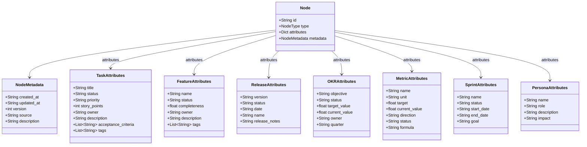
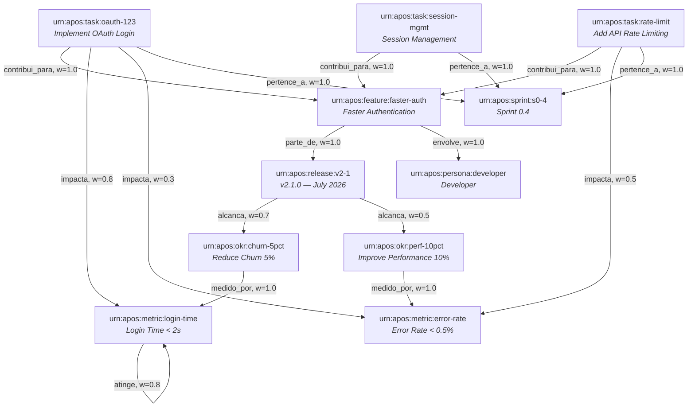

# APOS Knowledge Graph — Modelo Formal (Camada 3)

**Documento:** KNOWLEDGE_GRAPH.md  
**Release:** R0 | **Sprint:** 0.4  
**Tarefa:** T0.4.1 — Modelo formal do grafo  
**Dependência:** ONTOLOGY_FOUNDATIONS.md (Camada 1 + 2)  
**Próximo:** T0.4.2 (NODE_TYPES.md), T0.4.5 (types.py + graph.py)  
**Criado em:** 2026-07-21  
**Versão:** v0.1-draft

---

## Índice

1. [Introdução](#1-introdução)
2. [Estrutura de Nós (Nodes)](#2-estrutura-de-nós-nodes)
3. [Estrutura de Arestas (Edges)](#3-estrutura-de-arestas-edges)
4. [Identificadores Únicos (URN Schema)](#4-identificadores-únicos-urn-schema)
5. [Esquema de Dados](#5-esquema-de-dados)
6. [Regras de Integridade](#6-regras-de-integridade)
7. [Convenções de Nomenclatura](#7-convenções-de-nomenclatura)
8. [Exemplo de Grafo Completo](#8-exemplo-de-grafo-completo)
9. [R0 vs R1](#9-r0-vs-r1)

---

## 1. Introdução

### 1.1 O Que É o Knowledge Graph do APOS

O **Knowledge Graph do APOS** é a **Camada 3** do framework de camada semântica. Trata-se de uma instância formal de **dados conectados e alinhados à ontologia** (Camada 1), com identificadores únicos (URNs), estrutura padronizada de nós e arestas, e regras de integridade referencial.

Diferentemente da **Ontologia** (Camada 1), que define _o que as coisas são_ em termos conceituais, o Knowledge Graph materializa esses conceitos em um **grafo real navegável**. Enquanto a Ontologia diz "existe uma relação `contribui_para` entre Task e Feature", o Knowledge Graph diz "Task-123 `contribui_para` Feature-X com peso 1.0 e foi criada em 2026-07-15".

### 1.2 Propósito

| Capacidade | Descrição |
|-----------|-----------|
| **Materialização** | Ontologia se torna grafo real de dados com instâncias concretas |
| **Navegação** | Percursos como `Task-123 → Feature-X → Release-v2.1 → OKR-Churn → Métrica-LoginTime` |
| **Inferência** | "Se mudo Task-123, qual Métrica é afetada?" — resposta via travessia |
| **Rastreabilidade** | Cada entidade tem URN única, versão, metadados de criação e atualização |
| **Serialização** | Grafo exportável para JSON, passível de carga em sistemas externos |

### 1.3 Diferença entre Ontologia e Knowledge Graph

| Aspecto | Ontologia (Camada 1) | Knowledge Graph (Camada 3) |
|---------|---------------------|---------------------------|
| **Natureza** | Especificação formal (intenção) | Instância real (extensão) |
| **Conteúdo** | Conceitos, relações, restrições | Nós, arestas, pesos, metadados |
| **Exemplo** | "Task `contribui_para` Feature" | "urn:apos:task:oauth-123 --contribui_para→ urn:apos:feature:faster-auth" |
| **Mudança** | Rara (evolui por release) | Frequente (dados do dia a dia) |
| **Validação** | Restrições de domínio | Integridade referencial entre URNs |

### 1.4 Posição nas 5 Camadas

```
Camada 1: Ontologia        (conceitos + relações + restrições)
Camada 2: Semantic Layer   (regras de negócio + normalização)
Camada 3: Knowledge Graph  ← ESTE DOCUMENTO (dados conectados)
Camada 4: Catálogo de Dados (linhagem + proveniência)
Camada 5: MCP              (transporte)
```

> O Knowledge Graph é a **ponte entre a especificação (ontologia) e os dados reais (catálogo + MCP loaders)**.

---

## 2. Estrutura de Nós (Nodes)

### 2.1 Definição Formal

Um **Node** (nó) é a unidade fundamental do Knowledge Graph. Representa uma instância concreta de um conceito da ontologia.

```python
@dataclass
class Node:
    id: str               # URN única (ex: "urn:apos:task:oauth-123")
    type: NodeType        # Tipo do nó (enum: TASK, FEATURE, RELEASE, OKR, METRIC, SPRINT, PERSONA)
    attributes: dict      # Atributos específicos do tipo (snake_case)
    metadata: NodeMetadata  # Metadados do nó (criação, atualização, versão)
```

### 2.2 Componentes do Node

| Campo | Tipo | Obrigatório | Descrição |
|-------|------|-------------|-----------|
| `id` | `str` (URN) | ✅ | Identificador único global no formato `urn:apos:{type}:{id}` |
| `type` | `NodeType` (enum) | ✅ | Tipo ontológico do nó (Task, Feature, Release, OKR, Metric, Sprint, Persona) |
| `attributes` | `dict[str, Any]` | ✅ | Mapa de atributos específicos do tipo (ver seção 5) |
| `metadata` | `NodeMetadata` | ✅ | Metadados estruturais do nó |

### 2.3 NodeMetadata

```python
@dataclass
class NodeMetadata:
    created_at: str       # ISO 8601 — data de criação do nó no grafo
    updated_at: str       # ISO 8601 — data da última modificação
    version: int          # Número de versão incremental (1-based)
    source: str | None    # Fonte original (opcional, usado pelo Catálogo - Camada 4)
    description: str | None  # Descrição legível (opcional)
```

### 2.4 NodeType (Enum)

```python
class NodeType(Enum):
    TASK     = "task"
    FEATURE  = "feature"
    RELEASE  = "release"
    OKR      = "okr"
    METRIC   = "metric"
    SPRINT   = "sprint"
    PERSONA  = "persona"
```

### 2.5 Exemplo de Node (JSON)

```json
{
  "id": "urn:apos:task:oauth-123",
  "type": "task",
  "attributes": {
    "title": "Implement OAuth login",
    "status": "in_progress",
    "priority": "high",
    "story_points": 5,
    "owner": "agent-oauth"
  },
  "metadata": {
    "created_at": "2026-07-15T10:00:00Z",
    "updated_at": "2026-07-20T14:30:00Z",
    "version": 3,
    "source": "jira:PROJ-456",
    "description": "Implementar fluxo OAuth 2.0 com Google e GitHub"
  }
}
```

---

## 3. Estrutura de Arestas (Edges)

### 3.1 Definição Formal

Uma **Edge** (aresta) é uma relação direcionada entre dois Nodes. Representa uma instância de uma relação ontológica.

```python
@dataclass
class Edge:
    source: str       # URN do nó origem
    target: str       # URN do nó destino
    type: EdgeType    # Tipo da aresta (enum)
    weight: float     # Peso da relação [0.0, 1.0] (padrão: 1.0)
    metadata: EdgeMetadata  # Metadados da aresta
```

### 3.2 Componentes da Edge

| Campo | Tipo | Obrigatório | Descrição |
|-------|------|-------------|-----------|
| `source` | `str` (URN) | ✅ | URN do nó de origem |
| `target` | `str` (URN) | ✅ | URN do nó de destino |
| `type` | `EdgeType` (enum) | ✅ | Tipo ontológico da relação |
| `weight` | `float` | ✅ | Peso [0.0, 1.0]; default 1.0 para relações fortes |
| `metadata` | `EdgeMetadata` | ✅ | Metadados estruturais da aresta |

### 3.3 EdgeMetadata

```python
@dataclass
class EdgeMetadata:
    created_at: str       # ISO 8601
    updated_at: str       # ISO 8601
    version: int          # Versão incremental
    confidence: float     # Confiança na relação [0.0, 1.0] (default: 1.0)
    reason: str | None    # Razão contextual (opcional)
```

### 3.4 EdgeType (Enum)

```python
class EdgeType(Enum):
    CONTRIBUI_PARA = "contribui_para"   # Task → Feature
    PARTE_DE       = "parte_de"         # Feature → Release, Sprint → Release
    ALCANCA        = "alcanca"          # Release → OKR
    MEDIDO_POR     = "medido_por"       # OKR → Metric
    IMPACTA        = "impacta"          # Task → Metric (inferência)
    BLOQUEIA       = "bloqueia"         # Task → Task (dependência)
    DEPENDE_DE     = "depende_de"       # Task → Task (dependência reversa)
    PERTENCE_A     = "pertence_a"       # Task → Sprint
    ENVOLVE        = "envolve"          # Feature → Persona, Release → Persona
    ATINGE         = "atinge"           # Metric → Target (valor alvo)
```

### 3.5 Matriz de Relações Válidas

| EdgeType | Source → Target | Cardinalidade | Descrição |
|----------|----------------|---------------|-----------|
| `contribui_para` | Task → Feature | N:1 | Toda Task contribui a exatamente 1 Feature |
| `parte_de` | Feature → Release | N:1 | Toda Feature pertence a exatamente 1 Release |
| `parte_de` | Sprint → Release | N:1 | Sprint pertence a 1 Release |
| `alcanca` | Release → OKR | N:M | Release pode alcançar múltiplos OKRs |
| `medido_por` | OKR → Metric | 1:N | OKR medido por 1+ Métricas |
| `impacta` | Task → Metric | N:M | Task impacta Métrica (via cadeia inferida) |
| `bloqueia` | Task → Task | N:M | Task A bloqueia Task B |
| `depende_de` | Task → Task | N:M | Task A depende de Task B (inversa de bloqueia) |
| `pertence_a` | Task → Sprint | N:1 | Task alocada em 1 Sprint |
| `envolve` | Feature → Persona | N:M | Feature envolve 1+ Personas |
| `envolve` | Release → Persona | N:M | Release impacta 1+ Personas |
| `atinge` | Metric → Metric | N:1 | Métrica atinge valor alvo |

### 3.6 Exemplo de Edge (JSON)

```json
{
  "source": "urn:apos:task:oauth-123",
  "target": "urn:apos:feature:faster-auth",
  "type": "contribui_para",
  "weight": 1.0,
  "metadata": {
    "created_at": "2026-07-15T10:00:00Z",
    "updated_at": "2026-07-15T10:00:00Z",
    "version": 1,
    "confidence": 1.0,
    "reason": "Mapeamento direto Jira → APOS"
  }
}
```

---

## 4. Identificadores Únicos (URN Schema)

### 4.1 Formato Geral

```
urn:apos:{entity_type}:{local_id}
```

Onde:
- `urn:apos:` — prefixo fixo do namespace APOS
- `{entity_type}` — tipo da entidade (ver seção 4.2)
- `{local_id}` — identificador local único dentro do tipo (ver seção 4.3)

### 4.2 Esquema por Tipo de Entidade

| Entidade | URN Pattern | Exemplo |
|----------|-------------|---------|
| **Task** | `urn:apos:task:{local_id}` | `urn:apos:task:oauth-123` |
| **Feature** | `urn:apos:feature:{local_id}` | `urn:apos:feature:faster-auth` |
| **Release** | `urn:apos:release:{local_id}` | `urn:apos:release:v2-1` |
| **OKR** | `urn:apos:okr:{local_id}` | `urn:apos:okr:churn-5pct` |
| **Métrica** | `urn:apos:metric:{local_id}` | `urn:apos:metric:login-time` |
| **Sprint** | `urn:apos:sprint:{local_id}` | `urn:apos:sprint:s0-4` |
| **Persona** | `urn:apos:persona:{local_id}` | `urn:apos:persona:developer` |

### 4.3 Regras para `local_id`

| Regra | Descrição | ✅ Correto | ❌ Incorreto |
|-------|-----------|-----------|-------------|
| **lowercase** | Apenas letras minúsculas | `oauth-123` | `OAuth-123` |
| **hífens** | Separadores com hífen (`-`) | `faster-auth` | `faster_auth` |
| **sem underlines** | Proibido underscore | `churn-5pct` | `churn_5pct` |
| **sem espaços** | Proibido espaços | `login-time` | `login time` |
| **sem acentos** | Apenas ASCII | `churn-5pct` | `churn-5%` |
| **sem maiúsculas** | Apenas lowercase | `v2-1` | `v2.1` |
| **tamanho máx** | ≤ 64 caracteres | `feature-biometric-auth-flow` | (ok) |
| **caracteres permitidos** | `[a-z0-9\-]` | `task-123` | `task_123!` |

### 4.4 URNs Compostas (uso futuro, R2+)

Para rastreabilidade entre sistemas (Camada 4 — Catálogo):

```
urn:apos:task:{source_system}:{source_id}
```

Exemplo: `urn:apos:task:jira:PROJ-456` (Task que veio do Jira, id PROJ-456)

### 4.5 Exemplos de URN por Tipo

```python
# Python ilustrativo — geração de URNs

def make_urn(entity_type: str, local_id: str) -> str:
    """Gera URN no padrão APOS."""
    local_id = local_id.lower().replace("_", "-").replace(" ", "-")
    return f"urn:apos:{entity_type}:{local_id}"

# Exemplos de uso
tasks = [
    make_urn("task", "OAuth login"),        # → urn:apos:task:oauth-login
    make_urn("task", "API Rate Limiting"),  # → urn:apos:task:api-rate-limiting
    make_urn("feature", "Faster Auth"),     # → urn:apos:feature:faster-auth
    make_urn("release", "v2.1"),           # → urn:apos:release:v2-1
    make_urn("okr", "Churn 5%"),           # → urn:apos:okr:churn-5pct
    make_urn("metric", "Login Time"),       # → urn:apos:metric:login-time
    make_urn("sprint", "Sprint 0.4"),      # → urn:apos:sprint:sprint-0-4
    make_urn("persona", "Developer"),      # → urn:apos:persona:developer
]
```

---

## 5. Esquema de Dados

### 5.1 NodeTypes com Atributos Obrigatórios e Opcionais

#### Task

| Campo | Tipo | Obrigatório | Exemplo |
|-------|------|-------------|---------|
| `title` | `str` | ✅ | "Implement OAuth login" |
| `status` | `enum[str]` | ✅ | `"open"`, `"in_progress"`, `"done"`, `"blocked"` |
| `priority` | `enum[str]` | ❌ | `"high"`, `"medium"`, `"low"` |
| `story_points` | `int` | ❌ | `5` |
| `owner` | `str` | ❌ | `"agent-oauth"` |
| `description` | `str` | ❌ | "Implementar fluxo OAuth 2.0..." |
| `acceptance_criteria` | `list[str]` | ❌ | `["Login com Google OK", "Login com GitHub OK"]` |
| `tags` | `list[str]` | ❌ | `["auth", "security"]` |

#### Feature

| Campo | Tipo | Obrigatório | Exemplo |
|-------|------|-------------|---------|
| `name` | `str` | ✅ | "Faster Authentication" |
| `status` | `enum[str]` | ✅ | `"planned"`, `"in_progress"`, `"shipped"` |
| `completeness` | `float` | ❌ | `0.75` (75% das tasks concluídas) |
| `owner` | `str` | ❌ | `"team-auth"` |
| `description` | `str` | ❌ | "Reduzir tempo de login para < 2s" |
| `tags` | `list[str]` | ❌ | `["auth", "ux"]` |

#### Release

| Campo | Tipo | Obrigatório | Exemplo |
|-------|------|-------------|---------|
| `version` | `str` | ✅ | `"2.1.0"` |
| `status` | `enum[str]` | ✅ | `"planned"`, `"in_progress"`, `"shipped"` |
| `date` | `str` (ISO 8601) | ❌ | `"2026-07-31"` |
| `name` | `str` | ❌ | `"Summer Release 2026"` |
| `release_notes` | `str` | ❌ | "## O que há de novo..." |

#### OKR

| Campo | Tipo | Obrigatório | Exemplo |
|-------|------|-------------|---------|
| `objective` | `str` | ✅ | "Reduce customer churn by 5%" |
| `status` | `enum[str]` | ✅ | `"on_track"`, `"at_risk"`, `"behind"`, `"achieved"` |
| `target_value` | `float` | ❌ | `5.0` |
| `current_value` | `float` | ❌ | `3.2` |
| `owner` | `str` | ❌ | `"jader"` |
| `quarter` | `str` | ❌ | `"2026-Q3"` |

#### Métrica (Metric)

| Campo | Tipo | Obrigatório | Exemplo |
|-------|------|-------------|---------|
| `name` | `str` | ✅ | "Login Time" |
| `unit` | `str` | ✅ | `"seconds"`, `"percent"`, `"count"` |
| `target` | `float` | ✅ | `2.0` |
| `current_value` | `float` | ❌ | `2.5` |
| `direction` | `enum[str]` | ❌ | `"lower_is_better"`, `"higher_is_better"` |
| `status` | `enum[str]` | ❌ | `"healthy"`, `"at_risk"`, `"critical"` |
| `formula` | `str` | ❌ | `"avg(login_duration_ms) / 1000"` |

#### Sprint

| Campo | Tipo | Obrigatório | Exemplo |
|-------|------|-------------|---------|
| `name` | `str` | ✅ | "Sprint 0.4" |
| `status` | `enum[str]` | ✅ | `"planned"`, `"active"`, `"completed"` |
| `start_date` | `str` (ISO 8601) | ❌ | `"2026-07-21"` |
| `end_date` | `str` (ISO 8601) | ❌ | `"2026-07-25"` |
| `goal` | `str` | ❌ | "Finalizar design do Knowledge Graph" |

#### Persona

| Campo | Tipo | Obrigatório | Exemplo |
|-------|------|-------------|---------|
| `name` | `str` | ✅ | "Developer" |
| `role` | `str` | ✅ | `"engineer"`, `"pm"`, `"designer"` |
| `description` | `str` | ❌ | "Engenheiro de software que implementa features" |
| `impact` | `str` | ❌ | "Impactado por mudanças na API" |

### 5.2 Resumo Visual — Atributos por NodeType



---

## 6. Regras de Integridade

### 6.1 Unicidade de URN

```
RULE KG-001: Unicidade de URN
  SCOPE: Todo Node no grafo
  CONSTRAINT: id é UNIQUE em todo o grafo
  VIOLATION: Tentativa de inserir Node com URN já existente → REJECT
  MESSAGE: "Node com URN '{urn}' já existe (type={existing_type})"
```

### 6.2 Tipos Válidos de Aresta por Par Source/Target

```
RULE KG-002: Validação de tipo de aresta
  SCOPE: Toda Edge inserida
  CONSTRAINT: O par (source_type, edge_type, target_type) deve estar na matriz
              de tipos válidos (seção 3.5)
  VIOLATION: EdgeType inválido para o par source/target → REJECT
  MESSAGE: "EdgeType '{edge_type}' não é válido para source={source_type} → target={target_type}"
```

**Matriz de validação:**

| Source → Target | EdgeTypes Permitidos |
|-----------------|---------------------|
| Task → Feature | `contribui_para` |
| Task → Metric | `impacta` |
| Task → Task | `bloqueia`, `depende_de` |
| Task → Sprint | `pertence_a` |
| Feature → Release | `parte_de` |
| Feature → Persona | `envolve` |
| Feature → OKR | `alcanca` (via Release) |
| Sprint → Release | `parte_de` |
| Release → OKR | `alcanca` |
| Release → Persona | `envolve` |
| OKR → Metric | `medido_por` |
| Metric → Metric | `atinge` |

### 6.3 Null Checks (Campos Obrigatórios)

```
RULE KG-003: Null checks em Node
  SCOPE: Todo Node inserido ou atualizado
  CONSTRAINT: Node.id, Node.type, Node.metadata.created_at, Node.metadata.version
              são NOT NULL
  VIOLATION: Campo obrigatório ausente → REJECT
  MESSAGE: "Node.id é obrigatório" / "Node.metadata.created_at é obrigatório"
```

```
RULE KG-004: Null checks em Edge
  SCOPE: Toda Edge inserida ou atualizada
  CONSTRAINT: Edge.source, Edge.target, Edge.type, Edge.weight são NOT NULL
  VIOLATION: Campo obrigatório ausente → REJECT
```

```
RULE KG-005: Null checks em atributos específicos
  SCOPE: Atributos de cada NodeType
  CONSTRAINT: Campos marcados como Obrigatório na seção 5 devem estar presentes
  VIOLATION: Atributo obrigatório ausente no dict attributes → REJECT
  EXEMPLO: Node type=task sem attributes['title'] → REJECT
```

### 6.4 Integridade Referencial

```
RULE KG-006: Integridade referencial de source
  SCOPE: Toda Edge inserida
  CONSTRAINT: Edge.source DEVE referenciar um Node existente no grafo
  VIOLATION: Source URN não encontrada → REJECT
  MESSAGE: "Edge.source '{urn}' não encontrado no grafo"
```

```
RULE KG-007: Integridade referencial de target
  SCOPE: Toda Edge inserida
  CONSTRAINT: Edge.target DEVE referenciar um Node existente no grafo
  VIOLATION: Target URN não encontrada → REJECT
  MESSAGE: "Edge.target '{urn}' não encontrado no grafo"
```

### 6.5 Cardinalidade

```
RULE KG-008: Task → Feature (N:1)
  SCOPE: Toda Edge type=contribui_para
  CONSTRAINT: Uma Task DEVE contribuir para exatamente 1 Feature
  VIOLATION: Task com >1 edge contribui_para → REJECT
  MESSAGE: "Task {urn} já contribui para Feature {existing_target}"
```

```
RULE KG-009: Feature → Release (N:1)
  SCOPE: Toda Edge type=parte_de (source=Feature)
  CONSTRAINT: Uma Feature DEVE pertencer a exatamente 1 Release
  VIOLATION: Feature com >1 edge parte_de → REJECT
```

```
RULE KG-010: OKR → Metric (1:N)
  SCOPE: Toda Edge type=medido_por
  CONSTRAINT: Um OKR DEVE ter ≥1 métrica associada
  VIOLATION: OKR sem edge medido_por → WARN (permitido temporariamente)
  MESSAGE: "OKR {urn} não possui métrica associada"
```

### 6.6 Consistência de Status

```
RULE KG-011: Consistência Feature/Release
  SCOPE: Node type=feature com status='shipped'
  CONSTRAINT: Feature 'shipped' implica que sua Release tem status='shipped'
  VIOLATION: Feature shipped mas Release não → WARN (não bloqueante)
  MESSAGE: "Feature {feature_urn} shipped mas Release {release_urn} tem status={release_status}"
```

```
RULE KG-012: Consistência de Peso
  SCOPE: Toda Edge
  CONSTRAINT: 0.0 ≤ Edge.weight ≤ 1.0
  VIOLATION: weight fora do intervalo → REJECT
```

### 6.7 Resumo das Regras

| ID | Regra | Severidade | Ação |
|----|-------|-----------|------|
| KG-001 | Unicidade de URN | CRITICAL | REJECT |
| KG-002 | Tipo de aresta válido | CRITICAL | REJECT |
| KG-003 | Null checks Node | CRITICAL | REJECT |
| KG-004 | Null checks Edge | CRITICAL | REJECT |
| KG-005 | Atributos obrigatórios | CRITICAL | REJECT |
| KG-006 | Integridade source | CRITICAL | REJECT |
| KG-007 | Integridade target | CRITICAL | REJECT |
| KG-008 | Cardinalidade Task→Feature | CRITICAL | REJECT |
| KG-009 | Cardinalidade Feature→Release | CRITICAL | REJECT |
| KG-010 | Cardinalidade OKR→Metric | WARNING | WARN |
| KG-011 | Consistência Feature/Release | WARNING | WARN |
| KG-012 | Peso da Edge | CRITICAL | REJECT |

---

## 7. Convenções de Nomenclatura

### 7.1 Tabela de Convenções

| Contexto | Convenção | Exemplo |
|----------|-----------|---------|
| **URN (local_id)** | `lowercase-kebab-case` | `faster-auth`, `churn-5pct` |
| **Node type** | `PascalCase` (inglês) | `Task`, `Feature`, `OKR`, `Metric` |
| **Edge type** | `snake_case` (português) | `contribui_para`, `parte_de` |
| **Attribute keys** | `snake_case` | `story_points`, `current_value` |
| **Metadata keys** | `snake_case` | `created_at`, `updated_at` |
| **Enum values** | `snake_case` | `in_progress`, `on_track` |
| **Arquivos** | `UPPER_CASE` | `KNOWLEDGE_GRAPH.md` |
| **Constantes Python** | `UPPER_CASE` | `MAX_WEIGHT = 1.0` |
| **Variáveis Python** | `snake_case` | `node_id`, `edge_type` |

### 7.2 Justificativa

- **URNs em lowercase-kebab-case**: Universal em sistemas de URN/URI, evita problemas de case-sensitivity em bancos e queries
- **Node types em PascalCase**: Alinhado à nomenclatura de classes na implementação Python
- **Edge types em snake_case português**: Termos de negócio do domínio APOS em português, legíveis por stakeholders
- **Attribute keys em snake_case**: Padrão Python para dicionários e dataclasses

### 7.3 Padrão de Encoding

```
Sistema: UTF-8
Caracteres: ASCII puro para URNs
Atributos: UTF-8 completo (aceita acentos, caracteres especiais em descrições)
```

---

## 8. Exemplo de Grafo Completo

### 8.1 Estrutura do Grafo



### 8.2 Instância Completa (JSON)

```json
{
  "graph": {
    "nodes": [
      {
        "id": "urn:apos:task:oauth-123",
        "type": "task",
        "attributes": {
          "title": "Implement OAuth Login",
          "status": "in_progress",
          "priority": "high",
          "story_points": 5,
          "owner": "agent-oauth",
          "description": "Implementar fluxo OAuth 2.0 com Google e GitHub",
          "tags": ["auth", "security"]
        },
        "metadata": {
          "created_at": "2026-07-15T10:00:00Z",
          "updated_at": "2026-07-20T14:30:00Z",
          "version": 3,
          "source": "jira:PROJ-456"
        }
      },
      {
        "id": "urn:apos:task:rate-limit",
        "type": "task",
        "attributes": {
          "title": "Add API Rate Limiting",
          "status": "open",
          "priority": "medium",
          "story_points": 3,
          "owner": "agent-infra",
          "tags": ["infra", "security"]
        },
        "metadata": {
          "created_at": "2026-07-16T08:00:00Z",
          "updated_at": "2026-07-16T08:00:00Z",
          "version": 1,
          "source": "jira:PROJ-457"
        }
      },
      {
        "id": "urn:apos:task:session-mgmt",
        "type": "task",
        "attributes": {
          "title": "Session Management",
          "status": "done",
          "priority": "high",
          "story_points": 8,
          "owner": "agent-auth",
          "tags": ["auth", "infra"]
        },
        "metadata": {
          "created_at": "2026-07-10T09:00:00Z",
          "updated_at": "2026-07-18T16:00:00Z",
          "version": 2,
          "source": "jira:PROJ-455"
        }
      },
      {
        "id": "urn:apos:feature:faster-auth",
        "type": "feature",
        "attributes": {
          "name": "Faster Authentication",
          "status": "in_progress",
          "completeness": 0.75,
          "owner": "team-auth",
          "description": "Reduzir tempo de login para < 2s"
        },
        "metadata": {
          "created_at": "2026-07-10T10:00:00Z",
          "updated_at": "2026-07-20T14:00:00Z",
          "version": 4,
          "description": "Feature de autenticação mais rápida"
        }
      },
      {
        "id": "urn:apos:release:v2-1",
        "type": "release",
        "attributes": {
          "version": "2.1.0",
          "status": "in_progress",
          "date": "2026-07-31",
          "name": "Summer Release 2026",
          "release_notes": "## Faster Authentication\nRedução significativa no tempo de login."
        },
        "metadata": {
          "created_at": "2026-07-01T08:00:00Z",
          "updated_at": "2026-07-20T10:00:00Z",
          "version": 5
        }
      },
      {
        "id": "urn:apos:okr:churn-5pct",
        "type": "okr",
        "attributes": {
          "objective": "Reduce customer churn by 5%",
          "status": "on_track",
          "target_value": 5.0,
          "current_value": 3.2,
          "owner": "jader",
          "quarter": "2026-Q3"
        },
        "metadata": {
          "created_at": "2026-06-15T08:00:00Z",
          "updated_at": "2026-07-20T09:00:00Z",
          "version": 6,
          "source": "spreadsheet:google-sheets#abc123"
        }
      },
      {
        "id": "urn:apos:okr:perf-10pct",
        "type": "okr",
        "attributes": {
          "objective": "Improve system performance by 10%",
          "status": "at_risk",
          "target_value": 10.0,
          "current_value": 4.5,
          "owner": "jader",
          "quarter": "2026-Q3"
        },
        "metadata": {
          "created_at": "2026-06-15T08:00:00Z",
          "updated_at": "2026-07-19T11:00:00Z",
          "version": 4
        }
      },
      {
        "id": "urn:apos:metric:login-time",
        "type": "metric",
        "attributes": {
          "name": "Login Time",
          "unit": "seconds",
          "target": 2.0,
          "current_value": 2.5,
          "direction": "lower_is_better",
          "status": "at_risk",
          "formula": "avg(login_duration_ms) / 1000"
        },
        "metadata": {
          "created_at": "2026-06-20T08:00:00Z",
          "updated_at": "2026-07-20T12:00:00Z",
          "version": 3
        }
      },
      {
        "id": "urn:apos:metric:error-rate",
        "type": "metric",
        "attributes": {
          "name": "API Error Rate",
          "unit": "percent",
          "target": 0.5,
          "current_value": 0.3,
          "direction": "lower_is_better",
          "status": "healthy",
          "formula": "(error_count / total_requests) * 100"
        },
        "metadata": {
          "created_at": "2026-06-20T08:00:00Z",
          "updated_at": "2026-07-19T15:00:00Z",
          "version": 2
        }
      },
      {
        "id": "urn:apos:sprint:s0-4",
        "type": "sprint",
        "attributes": {
          "name": "Sprint 0.4",
          "status": "active",
          "start_date": "2026-07-21",
          "end_date": "2026-07-25",
          "goal": "Finalizar design do Knowledge Graph"
        },
        "metadata": {
          "created_at": "2026-07-20T08:00:00Z",
          "updated_at": "2026-07-21T08:00:00Z",
          "version": 1
        }
      },
      {
        "id": "urn:apos:persona:developer",
        "type": "persona",
        "attributes": {
          "name": "Developer",
          "role": "engineer",
          "description": "Engenheiro de software que implementa features",
          "impact": "Impactado por mudanças na API de autenticação"
        },
        "metadata": {
          "created_at": "2026-07-01T08:00:00Z",
          "updated_at": "2026-07-01T08:00:00Z",
          "version": 1
        }
      }
    ],
    "edges": [
      {"source": "urn:apos:task:oauth-123",   "target": "urn:apos:feature:faster-auth",  "type": "contribui_para", "weight": 1.0, "metadata": {"created_at": "2026-07-15T10:00:00Z", "version": 1, "confidence": 1.0}},
      {"source": "urn:apos:task:rate-limit",   "target": "urn:apos:feature:faster-auth",  "type": "contribui_para", "weight": 1.0, "metadata": {"created_at": "2026-07-16T08:00:00Z", "version": 1, "confidence": 1.0}},
      {"source": "urn:apos:task:session-mgmt", "target": "urn:apos:feature:faster-auth",  "type": "contribui_para", "weight": 1.0, "metadata": {"created_at": "2026-07-10T09:00:00Z", "version": 1, "confidence": 1.0}},
      {"source": "urn:apos:feature:faster-auth", "target": "urn:apos:release:v2-1",       "type": "parte_de",       "weight": 1.0, "metadata": {"created_at": "2026-07-10T10:00:00Z", "version": 1, "confidence": 1.0}},
      {"source": "urn:apos:release:v2-1",       "target": "urn:apos:okr:churn-5pct",      "type": "alcanca",        "weight": 0.7, "metadata": {"created_at": "2026-07-01T08:00:00Z", "version": 1, "confidence": 0.9}},
      {"source": "urn:apos:release:v2-1",       "target": "urn:apos:okr:perf-10pct",      "type": "alcanca",        "weight": 0.5, "metadata": {"created_at": "2026-07-01T08:00:00Z", "version": 1, "confidence": 0.8}},
      {"source": "urn:apos:okr:churn-5pct",     "target": "urn:apos:metric:login-time",   "type": "medido_por",     "weight": 1.0, "metadata": {"created_at": "2026-06-20T08:00:00Z", "version": 1, "confidence": 1.0}},
      {"source": "urn:apos:okr:perf-10pct",     "target": "urn:apos:metric:error-rate",   "type": "medido_por",     "weight": 1.0, "metadata": {"created_at": "2026-06-20T08:00:00Z", "version": 1, "confidence": 1.0}},
      {"source": "urn:apos:task:oauth-123",     "target": "urn:apos:metric:login-time",   "type": "impacta",        "weight": 0.8, "metadata": {"created_at": "2026-07-15T10:00:00Z", "version": 1, "confidence": 0.9}},
      {"source": "urn:apos:task:oauth-123",     "target": "urn:apos:metric:error-rate",   "type": "impacta",        "weight": 0.3, "metadata": {"created_at": "2026-07-15T10:00:00Z", "version": 1, "confidence": 0.7}},
      {"source": "urn:apos:task:rate-limit",    "target": "urn:apos:metric:error-rate",   "type": "impacta",        "weight": 0.5, "metadata": {"created_at": "2026-07-16T08:00:00Z", "version": 1, "confidence": 0.8}},
      {"source": "urn:apos:task:oauth-123",     "target": "urn:apos:sprint:s0-4",         "type": "pertence_a",    "weight": 1.0, "metadata": {"created_at": "2026-07-20T08:00:00Z", "version": 1, "confidence": 1.0}},
      {"source": "urn:apos:task:rate-limit",    "target": "urn:apos:sprint:s0-4",         "type": "pertence_a",    "weight": 1.0, "metadata": {"created_at": "2026-07-20T08:00:00Z", "version": 1, "confidence": 1.0}},
      {"source": "urn:apos:task:session-mgmt",  "target": "urn:apos:sprint:s0-4",         "type": "pertence_a",    "weight": 1.0, "metadata": {"created_at": "2026-07-20T08:00:00Z", "version": 1, "confidence": 1.0}},
      {"source": "urn:apos:feature:faster-auth", "target": "urn:apos:persona:developer",  "type": "envolve",        "weight": 1.0, "metadata": {"created_at": "2026-07-01T08:00:00Z", "version": 1, "confidence": 1.0}},
      {"source": "urn:apos:metric:login-time",  "target": "urn:apos:metric:login-time",   "type": "atinge",        "weight": 0.8, "metadata": {"created_at": "2026-06-20T08:00:00Z", "version": 1, "confidence": 1.0}}
    ]
  }
}
```

### 8.3 Navegação no Grafo (Query Patterns)

**Pergunta:** "Se a Task `oauth-123` for bloqueada, qual OKR é afetado?"

```
Trajeto: Task(oauth-123) → contribui_para → Feature(faster-auth)
        → parte_de → Release(v2-1) → alcanca → OKR(churn-5pct)
        → medido_por → Metric(login-time)

Resposta: OKR "Reduce customer churn by 5%" é afetado via Feature →
          Release → cadeia de impacto.
```

**Pergunta:** "Quais tasks impactam a Métrica `error-rate`?"

```
Trajeto: Metric(error-rate) ← impacta ← Task(oauth-123)
        Metric(error-rate) ← impacta ← Task(rate-limit)

Resposta: oauth-123 (peso 0.3) e rate-limit (peso 0.5)
```

**Pergunta:** "A Release `v2-1` está completa?"

```
Trajeto: Release(v2-1) → alcanca → OKR(churn-5pct) → medido_por → Metric(login-time)
        Release(v2-1) → alcanca → OKR(perf-10pct) → medido_por → Metric(error-rate)

Verificação: A Release está completa IFF todos os OKRs que alcança
             estão com status='achieved' e todas as métricas ≥ target.

Status atual: OKR(churn-5pct)=on_track, Metric(login-time)=2.5s > 2.0s (target)
             → Release NÃO completa (OKR at_risk, métrica acima do target)
```

### 8.4 Python Ilustrativo — Criação do Grafo

```python
from dataclasses import dataclass, field
from enum import Enum
from datetime import datetime, timezone

# --- Enums ---
class NodeType(Enum):
    TASK    = "task"
    FEATURE = "feature"
    RELEASE = "release"
    OKR     = "okr"
    METRIC  = "metric"
    SPRINT  = "sprint"
    PERSONA = "persona"

class EdgeType(Enum):
    CONTRIBUI_PARA = "contribui_para"
    PARTE_DE       = "parte_de"
    ALcANCA        = "alcanca"
    MEDIDO_POR     = "medido_por"
    IMPACTA        = "impacta"
    BLOQUEIA       = "bloqueia"
    DEPENDE_DE     = "depende_de"
    PERTENCE_A     = "pertence_a"
    ENVOLVE        = "envolve"
    ATINGE         = "atinge"

# --- Data Classes ---
@dataclass
class NodeMetadata:
    created_at: str
    updated_at: str
    version: int = 1
    source: str | None = None
    description: str | None = None

@dataclass
class EdgeMetadata:
    created_at: str
    updated_at: str = ""
    version: int = 1
    confidence: float = 1.0
    reason: str | None = None

@dataclass
class Node:
    id: str
    type: NodeType
    attributes: dict
    metadata: NodeMetadata

@dataclass
class Edge:
    source: str
    target: str
    type: EdgeType
    weight: float = 1.0
    metadata: EdgeMetadata = field(default_factory=lambda: EdgeMetadata(
        created_at=datetime.now(timezone.utc).isoformat()
    ))

@dataclass
class KnowledgeGraph:
    nodes: dict[str, Node] = field(default_factory=dict)   # key = URN
    edges: list[Edge] = field(default_factory=list)

    def add_node(self, node: Node) -> None:
        """Adiciona nó com validação de unicidade."""
        if node.id in self.nodes:
            raise ValueError(f"KG-001: Node {node.id} já existe")
        self.nodes[node.id] = node

    def add_edge(self, edge: Edge) -> None:
        """Adiciona aresta com validação de integridade referencial."""
        if edge.source not in self.nodes:
            raise ValueError(f"KG-006: source {edge.source} não encontrado")
        if edge.target not in self.nodes:
            raise ValueError(f"KG-007: target {edge.target} não encontrado")
        if not (0.0 <= edge.weight <= 1.0):
            raise ValueError(f"KG-012: weight {edge.weight} fora do intervalo [0,1]")
        self.edges.append(edge)

    def get_outbound(self, node_id: str) -> list[Edge]:
        """Retorna arestas saindo de um nó."""
        return [e for e in self.edges if e.source == node_id]

    def get_inbound(self, node_id: str) -> list[Edge]:
        """Retorna arestas chegando em um nó."""
        return [e for e in self.edges if e.target == node_id]

    def traverse(self, source_id: str, edge_type: EdgeType | None = None) -> list[Node]:
        """Navega para nós adjacentes, opcionalmente filtrando por tipo de aresta."""
        targets = []
        for e in self.edges:
            if e.source == source_id and (edge_type is None or e.type == edge_type):
                targets.append(self.nodes[e.target])
        return targets

    def infer_impact(self, task_id: str) -> list[dict]:
        """Infere quais métricas uma task impacta (via cadeia do grafo)."""
        impacts = []
        for e in self.edges:
            if e.source == task_id and e.type == EdgeType.IMPACTA:
                metric = self.nodes.get(e.target)
                if metric:
                    impacts.append({
                        "task": task_id,
                        "metric": e.target,
                        "weight": e.weight,
                        "current_value": metric.attributes.get("current_value"),
                        "target": metric.attributes.get("target"),
                    })
        return impacts


# --- Exemplo de uso ---
kg = KnowledgeGraph()

# Cria nós
task = Node(
    id="urn:apos:task:oauth-123",
    type=NodeType.TASK,
    attributes={"title": "Implement OAuth", "status": "in_progress", "story_points": 5},
    metadata=NodeMetadata(created_at="2026-07-15T10:00:00Z", updated_at="2026-07-20T14:30:00Z", version=3),
)
feature = Node(
    id="urn:apos:feature:faster-auth",
    type=NodeType.FEATURE,
    attributes={"name": "Faster Auth", "status": "in_progress", "completeness": 0.75},
    metadata=NodeMetadata(created_at="2026-07-10T10:00:00Z", updated_at="2026-07-20T14:00:00Z", version=2),
)

kg.add_node(task)
kg.add_node(feature)

# Cria aresta
kg.add_edge(Edge(
    source="urn:apos:task:oauth-123",
    target="urn:apos:feature:faster-auth",
    type=EdgeType.CONTRIBUI_PARA,
    weight=1.0,
))

# Navegação
feature_nodes = kg.traverse("urn:apos:task:oauth-123", EdgeType.CONTRIBUI_PARA)
print(f"Task contribui para: {[n.id for n in feature_nodes]}")
# → Task contribui para: ['urn:apos:feature:faster-auth']
```

---

## 9. R0 vs R1

### 9.1 O Que Este Sprint Entrega (R0 — Sprint 0.4)

| Item | Descrição | Documento |
|------|-----------|-----------|
| ✅ **Modelo formal do grafo** | Estrutura de nós, arestas, URNs, esquemas | `KNOWLEDGE_GRAPH.md` (este) |
| ✅ **Catálogo de tipos de nó** | Task, Feature, Release, OKR, Metric, Sprint, Persona | `NODE_TYPES.md` (T0.4.2) |
| ✅ **Catálogo de tipos de aresta** | `contribui_para`, `parte_de`, `alcanca`, etc. | `EDGE_TYPES.md` (T0.4.3) |
| ✅ **Padrões de query** | Navegação, inferência de impacto | `QUERY_PATTERNS.md` (T0.4.4) |
| ✅ **Implementação base** | `types.py` + `graph.py` com Node/Edge dataclasses | Código (T0.4.5) |
| ✅ **Testes unitários** | >80% cobertura | Testes (T0.4.6) |

### 9.2 O Que R1 Implementa (Próxima Release)

| Item | Descrição |
|------|-----------|
| 🔄 **Loaders de dados reais** | Jira → APOS KG, Notion → APOS KG, Slack → APOS KG |
| 🔄 **100+ entidades populadas** | Dados reais de projetos pilotos |
| 🔄 **Sincronização em tempo real** | Atualização automática via MCP |
| 🔄 **Bulk import/export** | JSON import/export para sincronização |
| 🔄 **API de consulta** | Endpoint REST para queries no grafo |
| 🔄 **Validação de integridade** | Runner de regras KG-001 a KG-012 |

### 9.3 Linha do Tempo

```
R0 (Sprint 0.4) — Design Formal
  ├── T0.4.1 KNOWLEDGE_GRAPH.md     ← ESTE DOCUMENTO
  ├── T0.4.2 NODE_TYPES.md
  ├── T0.4.3 EDGE_TYPES.md
  ├── T0.4.4 QUERY_PATTERNS.md
  ├── T0.4.5 types.py + graph.py
  └── T0.4.6 Testes

R1 — Instanciação Real
  ├── Loaders MCP (Jira, Notion, Slack)
  ├── 100+ entidades no grafo
  ├── API REST de consulta
  └── Sincronização contínua
```

### 9.4 Critérios de Aceitação (SCRUM-30)

| # | Critério | Status |
|---|----------|--------|
| 1 | Documento KNOWLEDGE_GRAPH.md criado | ✅ |
| 2 | Define estrutura de nós (Node): id, type, attributes, metadata | ✅ (Seção 2) |
| 3 | Define estrutura de arestas (Edge): source, target, type, weight, metadata | ✅ (Seção 3) |
| 4 | Define esquema de identificadores únicos (URN) para cada entidade | ✅ (Seção 4) |
| 5 | Regras de integridade referencial documentadas | ✅ (Seção 6) |
| 6 | Pronto para T0.4.2 (NODE_TYPES) usar como base | ✅ |

---

## Apêndice A — Glossário

| Termo | Definição |
|-------|-----------|
| **Node** | Unidade fundamental do grafo; representa uma instância de conceito ontológico |
| **Edge** | Relação direcionada entre dois Nodes |
| **URN** | Uniform Resource Name; identificador único global no formato `urn:apos:{tipo}:{id}` |
| **Atributo** | Propriedade específica do tipo de nó (ex: `status`, `title`) |
| **Metadado** | Informação estrutural do nó/aresta (criação, versão, fonte) |
| **Peso (weight)** | Força da relação entre 0.0 e 1.0 |
| **Confiança (confidence)** | Nível de certeza na existência da relação |
| **Travessia** | Navegação no grafo seguindo arestas |
| **Inferência** | Dedução de impacto via cadeia de relações |

## Apêndice B — Referências

- **ONTOLOGY_FOUNDATIONS.md** — Base conceitual das 5 camadas (Camada 3: Knowledge Graph)
- **ONTOLOGY_SPEC.md** — Definição formal de conceitos + restrições (Camada 1)
- **SEMANTIC_LAYER_SPEC.md** — Regras de negócio (Camada 2)
- **NODE_TYPES.md** — Catálogo detalhado de tipos de nó (T0.4.2)
- **EDGE_TYPES.md** — Catálogo detalhado de tipos de aresta (T0.4.3)
- **QUERY_PATTERNS.md** — Padrões de navegação e inferência (T0.4.4)
- Triggo.ai: [Ontologia, Semantic Layer e Knowledge Graph](https://triggo.ai/pt/ebook/ontologia-contexto)
