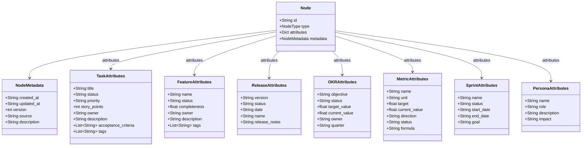

# Catálogo de Tipos de Nó — Knowledge Graph do APOS

**Documento:** NODE_TYPES.md  
**Release:** R0 | **Sprint:** 0.4  
**Tarefa:** T0.4.2 — Catálogo de tipos de nó  
**Dependência:** KNOWLEDGE_GRAPH.md (modelo formal do grafo)  
**Criado em:** 2026-07-21  
**Versão:** v0.1-draft

---

## Índice

1. [Visão Geral](#1-visão-geral)
2. [Task](#2-task)
3. [Feature](#3-feature)
4. [Release](#4-release)
5. [OKR](#5-okr)
6. [Metric](#6-metric)
7. [Sprint](#7-sprint)
8. [Persona](#8-persona)
9. [Matriz de Relações](#9-matriz-de-relações)
10. [Resumo de Atributos](#10-resumo-de-atributos)

---

## 1. Visão Geral

### 1.1 Propósito

O Knowledge Graph do APOS define **7 tipos de nó** que materializam os conceitos da ontologia (Camada 1) em dados conectados e navegáveis. Este documento serve como catálogo de referência para cada tipo, detalhando seus atributos obrigatórios e opcionais, exemplos de instância, e relações válidas com outros tipos.

### 1.2 Estrutura Comum

Todo nó segue a estrutura abaixo, definida em `KNOWLEDGE_GRAPH.md`:

```python
@dataclass
class Node:
    id: str               # URN única (ex: "urn:apos:task:oauth-123")
    type: NodeType        # Tipo do nó (enum)
    attributes: dict      # Atributos específicos do tipo (snake_case)
    metadata: NodeMetadata  # created_at, updated_at, version, source, description
```

O campo `metadata` segue o formato padronizado `NodeMetadata`:

```python
@dataclass
class NodeMetadata:
    created_at: str       # ISO 8601 — obrigatório
    updated_at: str       # ISO 8601 — obrigatório
    version: int          # 1-based — obrigatório
    source: str | None    # Fonte original (ex: "jira:PROJ-456") — opcional
    description: str | None  # Descrição legível — opcional
```

### 1.3 NodeType (Enum)

```python
class NodeType(Enum):
    TASK     = "task"
    FEATURE  = "feature"
    RELEASE  = "release"
    OKR      = "okr"
    METRIC   = "metric"
    SPRINT   = "sprint"
    PERSONA  = "persona"
```

### 1.4 URN Schema

Toda entidade é identificada por uma URN no formato:

```
urn:apos:{entity_type}:{local_id}
```

| Tipo | URN Pattern | Exemplo |
|------|-------------|---------|
| **Task** | `urn:apos:task:{local_id}` | `urn:apos:task:oauth-123` |
| **Feature** | `urn:apos:feature:{local_id}` | `urn:apos:feature:faster-auth` |
| **Release** | `urn:apos:release:{local_id}` | `urn:apos:release:v2-1` |
| **OKR** | `urn:apos:okr:{local_id}` | `urn:apos:okr:churn-5pct` |
| **Metric** | `urn:apos:metric:{local_id}` | `urn:apos:metric:login-time` |
| **Sprint** | `urn:apos:sprint:{local_id}` | `urn:apos:sprint:s0-4` |
| **Persona** | `urn:apos:persona:{local_id}` | `urn:apos:persona:developer` |

### 1.5 Diagrama de Classes



---

## 2. Task

### 2.1 Descrição

Uma **Task** representa uma unidade atômica de trabalho no ecossistema APOS. É o nó mais granular do grafo e o principal ponto de entrada para rastreabilidade. Toda task contribui para exatamente uma Feature, pode impactar métricas, e é alocada em uma Sprint.

### 2.2 URN Pattern

```
urn:apos:task:{local_id}
```

**Exemplos:**  
- `urn:apos:task:oauth-123`  
- `urn:apos:task:api-rate-limiting`  
- `urn:apos:task:session-mgmt`

### 2.3 Atributos Obrigatórios

| Campo | Tipo | Descrição | Exemplo |
|-------|------|-----------|---------|
| `title` | `str` | Título descritivo da task | `"Implement OAuth login"` |
| `status` | `enum[str]` | Status atual: `open` / `in_progress` / `done` / `blocked` | `"in_progress"` |

### 2.4 Atributos Opcionais

| Campo | Tipo | Descrição | Exemplo |
|-------|------|-----------|---------|
| `priority` | `enum[str]` | Prioridade: `high` / `medium` / `low` | `"high"` |
| `story_points` | `int` | Estimativa de esforço em pontos | `5` |
| `owner` | `str` | Responsável pela execução | `"agent-oauth"` |
| `description` | `str` | Descrição detalhada do trabalho | `"Implementar fluxo OAuth 2.0 com Google e GitHub"` |
| `acceptance_criteria` | `list[str]` | Critérios de aceitação | `["Login com Google OK", "Login com GitHub OK"]` |
| `tags` | `list[str]` | Tags de categorização | `["auth", "security"]` |

### 2.5 Exemplo de Instância

```json
{
  "id": "urn:apos:task:oauth-123",
  "type": "task",
  "attributes": {
    "title": "Implement OAuth Login",
    "status": "in_progress",
    "priority": "high",
    "story_points": 5,
    "owner": "agent-oauth",
    "description": "Implementar fluxo OAuth 2.0 com Google e GitHub",
    "acceptance_criteria": [
      "Login com Google funciona",
      "Login com GitHub funciona",
      "Refresh token implementado"
    ],
    "tags": ["auth", "security"]
  },
  "metadata": {
    "created_at": "2026-07-15T10:00:00Z",
    "updated_at": "2026-07-20T14:30:00Z",
    "version": 3,
    "source": "jira:PROJ-456",
    "description": "Implementar fluxo OAuth 2.0 com Google e GitHub"
  }
}
```

### 2.6 Relações Válidas

| Direção | Tipo de Aresta | Alvo | Descrição |
|---------|----------------|------|-----------|
| **Source** | `contribui_para` | Feature | A task contribui para uma feature (N:1) |
| **Source** | `impacta` | Metric | A task impacta diretamente uma métrica (N:M) |
| **Source** | `bloqueia` | Task | A task bloqueia outra task (N:M) |
| **Source** | `depende_de` | Task | A task depende de outra task (N:M) |
| **Source** | `pertence_a` | Sprint | A task pertence a uma sprint (N:1) |
| **Target** | `bloqueia` | Task | Outra task bloqueia esta task |
| **Target** | `depende_de` | Task | Outra task depende desta task |

---

## 3. Feature

### 3.1 Descrição

Uma **Feature** representa uma funcionalidade ou capacidade de produto. Agrega um conjunto de tasks que, juntas, entregam valor de negócio. Cada feature pertence a exatamente uma Release e pode envolver múltiplas personas.

### 3.2 URN Pattern

```
urn:apos:feature:{local_id}
```

**Exemplos:**  
- `urn:apos:feature:faster-auth`  
- `urn:apos:feature:biometric-auth-flow`  
- `urn:apos:feature:dashboard-v2`

### 3.3 Atributos Obrigatórios

| Campo | Tipo | Descrição | Exemplo |
|-------|------|-----------|---------|
| `name` | `str` | Nome da feature | `"Faster Authentication"` |
| `status` | `enum[str]` | Status atual: `planned` / `in_progress` / `shipped` | `"in_progress"` |

### 3.4 Atributos Opcionais

| Campo | Tipo | Descrição | Exemplo |
|-------|------|-----------|---------|
| `completeness` | `float` | Percentual de conclusão [0.0, 1.0] | `0.75` |
| `owner` | `str` | Time ou responsável | `"team-auth"` |
| `description` | `str` | Descrição da feature | `"Reduzir tempo de login para < 2s"` |
| `tags` | `list[str]` | Tags de categorização | `["auth", "ux"]` |

### 3.5 Exemplo de Instância

```json
{
  "id": "urn:apos:feature:faster-auth",
  "type": "feature",
  "attributes": {
    "name": "Faster Authentication",
    "status": "in_progress",
    "completeness": 0.75,
    "owner": "team-auth",
    "description": "Reduzir tempo de login para < 2 segundos",
    "tags": ["auth", "ux"]
  },
  "metadata": {
    "created_at": "2026-07-10T10:00:00Z",
    "updated_at": "2026-07-20T14:00:00Z",
    "version": 4,
    "source": "notion:features-db",
    "description": "Feature de autenticação mais rápida"
  }
}
```

### 3.6 Relações Válidas

| Direção | Tipo de Aresta | Alvo | Descrição |
|---------|----------------|------|-----------|
| **Source** | `parte_de` | Release | A feature pertence a uma release (N:1) |
| **Source** | `envolve` | Persona | A feature impacta uma persona (N:M) |
| **Target** | `contribui_para` | Task | Tasks contribuem para esta feature |

---

## 4. Release

### 4.1 Descrição

Uma **Release** representa uma versão entregável do produto. Agrega features e sprints, e está vinculada a OKRs de negócio. Releases podem alcançar múltiplos OKRs e envolver múltiplas personas.

### 4.2 URN Pattern

```
urn:apos:release:{local_id}
```

**Exemplos:**  
- `urn:apos:release:v2-1`  
- `urn:apos:release:v1-0`  
- `urn:apos:release:sprint-0-4`

### 4.3 Atributos Obrigatórios

| Campo | Tipo | Descrição | Exemplo |
|-------|------|-----------|---------|
| `version` | `str` | Versão semântica da release | `"2.1.0"` |
| `status` | `enum[str]` | Status atual: `planned` / `in_progress` / `shipped` | `"in_progress"` |

### 4.4 Atributos Opcionais

| Campo | Tipo | Descrição | Exemplo |
|-------|------|-----------|---------|
| `date` | `str` (ISO 8601) | Data prevista ou real de lançamento | `"2026-07-31"` |
| `name` | `str` | Nome comercial da release | `"Summer Release 2026"` |
| `release_notes` | `str` | Notas de release (markdown) | `"## O que há de novo...\\nRedução significativa no tempo de login."` |

### 4.5 Exemplo de Instância

```json
{
  "id": "urn:apos:release:v2-1",
  "type": "release",
  "attributes": {
    "version": "2.1.0",
    "status": "in_progress",
    "date": "2026-07-31",
    "name": "Summer Release 2026",
    "release_notes": "## Faster Authentication\nRedução significativa no tempo de login.\n\n## Melhorias de Performance\nOtimizações na API de rate limiting."
  },
  "metadata": {
    "created_at": "2026-07-01T08:00:00Z",
    "updated_at": "2026-07-20T10:00:00Z",
    "version": 5,
    "source": "github:releases",
    "description": "Release de julho com foco em autenticação e performance"
  }
}
```

### 4.6 Relações Válidas

| Direção | Tipo de Aresta | Alvo | Descrição |
|---------|----------------|------|-----------|
| **Source** | `alcanca` | OKR | A release contribui para um OKR (N:M) |
| **Source** | `envolve` | Persona | A release impacta uma persona (N:M) |
| **Target** | `parte_de` | Feature | Features que pertencem a esta release |
| **Target** | `parte_de` | Sprint | Sprints que pertencem a esta release |

---

## 5. OKR

### 5.1 Descrição

Um **OKR** (Objectives and Key Results) representa um objetivo estratégico de negócio. É medido por uma ou mais métricas, e é alcançado por releases. OKRs são o elo entre a execução tática (tasks) e a estratégia de produto.

### 5.2 URN Pattern

```
urn:apos:okr:{local_id}
```

**Exemplos:**  
- `urn:apos:okr:churn-5pct`  
- `urn:apos:okr:perf-10pct`  
- `urn:apos:okr:nps-50`

### 5.3 Atributos Obrigatórios

| Campo | Tipo | Descrição | Exemplo |
|-------|------|-----------|---------|
| `objective` | `str` | Declaração do objetivo | `"Reduce customer churn by 5%"` |
| `status` | `enum[str]` | Status: `on_track` / `at_risk` / `behind` / `achieved` | `"on_track"` |

### 5.4 Atributos Opcionais

| Campo | Tipo | Descrição | Exemplo |
|-------|------|-----------|---------|
| `target_value` | `float` | Valor alvo (key result) | `5.0` |
| `current_value` | `float` | Valor atual | `3.2` |
| `owner` | `str` | Responsável pelo OKR | `"jader"` |
| `quarter` | `str` | Trimestre de vigência | `"2026-Q3"` |

### 5.5 Exemplo de Instância

```json
{
  "id": "urn:apos:okr:churn-5pct",
  "type": "okr",
  "attributes": {
    "objective": "Reduce customer churn by 5%",
    "status": "on_track",
    "target_value": 5.0,
    "current_value": 3.2,
    "owner": "jader",
    "quarter": "2026-Q3"
  },
  "metadata": {
    "created_at": "2026-06-15T08:00:00Z",
    "updated_at": "2026-07-20T09:00:00Z",
    "version": 6,
    "source": "spreadsheet:google-sheets#abc123",
    "description": "OKR principal do Q3 2026"
  }
}
```

### 5.6 Relações Válidas

| Direção | Tipo de Aresta | Alvo | Descrição |
|---------|----------------|------|-----------|
| **Source** | `medido_por` | Metric | O OKR é medido por uma métrica (1:N) |
| **Target** | `alcanca` | Release | Releases que contribuem para este OKR |

---

## 6. Metric

### 6.1 Descrição

Uma **Metric** (Métrica) é uma medida quantificável usada para avaliar o progresso de OKRs e o impacto de tasks. Métricas têm unidades, valores alvo, e podem ser auto-referenciadas para rastreamento de evolução ao longo do tempo.

### 6.2 URN Pattern

```
urn:apos:metric:{local_id}
```

**Exemplos:**  
- `urn:apos:metric:login-time`  
- `urn:apos:metric:error-rate`  
- `urn:apos:metric:user-satisfaction`

### 6.3 Atributos Obrigatórios

| Campo | Tipo | Descrição | Exemplo |
|-------|------|-----------|---------|
| `name` | `str` | Nome da métrica | `"Login Time"` |
| `unit` | `str` | Unidade de medida | `"seconds"` |
| `target` | `float` | Valor alvo (baseline) | `2.0` |

### 6.4 Atributos Opcionais

| Campo | Tipo | Descrição | Exemplo |
|-------|------|-----------|---------|
| `current_value` | `float` | Valor atual da métrica | `2.5` |
| `direction` | `enum[str]` | Direção desejada: `lower_is_better` / `higher_is_better` | `"lower_is_better"` |
| `status` | `enum[str]` | Status de saúde: `healthy` / `at_risk` / `critical` | `"at_risk"` |
| `formula` | `str` | Fórmula de cálculo | `"avg(login_duration_ms) / 1000"` |

### 6.5 Exemplo de Instância

```json
{
  "id": "urn:apos:metric:login-time",
  "type": "metric",
  "attributes": {
    "name": "Login Time",
    "unit": "seconds",
    "target": 2.0,
    "current_value": 2.5,
    "direction": "lower_is_better",
    "status": "at_risk",
    "formula": "avg(login_duration_ms) / 1000"
  },
  "metadata": {
    "created_at": "2026-06-20T08:00:00Z",
    "updated_at": "2026-07-20T12:00:00Z",
    "version": 3,
    "source": "datadog:dashboard-auth",
    "description": "Tempo médio de login dos usuários"
  }
}
```

### 6.6 Relações Válidas

| Direção | Tipo de Aresta | Alvo | Descrição |
|---------|----------------|------|-----------|
| **Source** | `atinge` | Metric | A métrica atinge um valor alvo (N:1, autorreferência ou derivação) |
| **Target** | `medido_por` | OKR | OKRs que usam esta métrica como key result |
| **Target** | `impacta` | Task | Tasks que impactam diretamente esta métrica |

---

## 7. Sprint

### 7.1 Descrição

Uma **Sprint** é um período de tempo no qual um conjunto de tasks é executado. Sprints pertencem a uma release e agregam tasks que são executadas dentro do período definido.

### 7.2 URN Pattern

```
urn:apos:sprint:{local_id}
```

**Exemplos:**  
- `urn:apos:sprint:s0-4`  
- `urn:apos:sprint:s1-0`  
- `urn:apos:sprint:bug-bash-julho`

### 7.3 Atributos Obrigatórios

| Campo | Tipo | Descrição | Exemplo |
|-------|------|-----------|---------|
| `name` | `str` | Nome da sprint | `"Sprint 0.4"` |
| `status` | `enum[str]` | Status: `planned` / `active` / `completed` | `"active"` |

### 7.4 Atributos Opcionais

| Campo | Tipo | Descrição | Exemplo |
|-------|------|-----------|---------|
| `start_date` | `str` (ISO 8601) | Data de início | `"2026-07-21"` |
| `end_date` | `str` (ISO 8601) | Data de término | `"2026-07-25"` |
| `goal` | `str` | Objetivo da sprint | `"Finalizar design do Knowledge Graph"` |

### 7.5 Exemplo de Instância

```json
{
  "id": "urn:apos:sprint:s0-4",
  "type": "sprint",
  "attributes": {
    "name": "Sprint 0.4",
    "status": "active",
    "start_date": "2026-07-21",
    "end_date": "2026-07-25",
    "goal": "Finalizar design do Knowledge Graph"
  },
  "metadata": {
    "created_at": "2026-07-20T08:00:00Z",
    "updated_at": "2026-07-21T08:00:00Z",
    "version": 1,
    "source": "jira:sprint-board",
    "description": "Sprint de design do Knowledge Graph"
  }
}
```

### 7.6 Relações Válidas

| Direção | Tipo de Aresta | Alvo | Descrição |
|---------|----------------|------|-----------|
| **Source** | `parte_de` | Release | A sprint pertence a uma release (N:1) |
| **Target** | `pertence_a` | Task | Tasks alocadas nesta sprint |

---

## 8. Persona

### 8.1 Descrição

Uma **Persona** representa um perfil de stakeholder ou usuário do produto. Personas são envolvidas por features e releases, permitindo rastrear o impacto de entregas em diferentes tipos de usuário.

### 8.2 URN Pattern

```
urn:apos:persona:{local_id}
```

**Exemplos:**  
- `urn:apos:persona:developer`  
- `urn:apos:persona:jader-pm`  
- `urn:apos:persona:end-user`

### 8.3 Atributos Obrigatórios

| Campo | Tipo | Descrição | Exemplo |
|-------|------|-----------|---------|
| `name` | `str` | Nome da persona | `"Developer"` |
| `role` | `enum[str]` | Papel/função: `engineer` / `pm` / `designer` / `executive` / `end_user` | `"engineer"` |

### 8.4 Atributos Opcionais

| Campo | Tipo | Descrição | Exemplo |
|-------|------|-----------|---------|
| `description` | `str` | Descrição da persona | `"Engenheiro de software que implementa features"` |
| `impact` | `str` | Como é impactado pelo produto | `"Impactado por mudanças na API de autenticação"` |

### 8.5 Exemplo de Instância

```json
{
  "id": "urn:apos:persona:developer",
  "type": "persona",
  "attributes": {
    "name": "Developer",
    "role": "engineer",
    "description": "Engenheiro de software que implementa features",
    "impact": "Impactado por mudanças na API de autenticação"
  },
  "metadata": {
    "created_at": "2026-07-01T08:00:00Z",
    "updated_at": "2026-07-01T08:00:00Z",
    "version": 1,
    "source": "product:persona-research",
    "description": "Persona principal do ecossistema APOS"
  }
}
```

### 8.6 Relações Válidas

| Direção | Tipo de Aresta | Alvo | Descrição |
|---------|----------------|------|-----------|
| **Target** | `envolve` | Feature | Features que envolvem esta persona |
| **Target** | `envolve` | Release | Releases que impactam esta persona |

---

## 9. Matriz de Relações

### 9.1 Matriz Source × Target com EdgeTypes

A matriz abaixo consolida todas as relações válidas entre tipos de nó no Knowledge Graph. Cada célula indica o(s) `EdgeType`(s) permitido(s) para o par source → target.

| Source ↓ Target → | **Task** | **Feature** | **Release** | **OKR** | **Metric** | **Sprint** | **Persona** |
|-------------------|----------|-------------|-------------|---------|------------|------------|-------------|
| **Task** | `bloqueia`<br/>`depende_de` | `contribui_para` | — | — | `impacta` | `pertence_a` | — |
| **Feature** | — | — | `parte_de` | — | — | — | `envolve` |
| **Release** | — | — | — | `alcanca` | — | — | `envolve` |
| **OKR** | — | — | — | — | `medido_por` | — | — |
| **Metric** | — | — | — | — | `atinge` | — | — |
| **Sprint** | — | — | `parte_de` | — | — | — | — |
| **Persona** | — | — | — | — | — | — | — |

**Legenda:** `—` = relação não definida (aresta inválida)

### 9.2 Relações por Tipo (Visão Detalhada)

| # | Source | EdgeType | Target | Cardinalidade | Descrição |
|---|--------|----------|--------|---------------|-----------|
| 1 | Task | `contribui_para` | Feature | N:1 | Toda task contribui para exatamente 1 feature |
| 2 | Task | `impacta` | Metric | N:M | Task impacta métrica (via cadeia inferida) |
| 3 | Task | `bloqueia` | Task | N:M | Task A bloqueia Task B |
| 4 | Task | `depende_de` | Task | N:M | Task A depende de Task B (inversa de bloqueia) |
| 5 | Task | `pertence_a` | Sprint | N:1 | Task alocada em 1 sprint |
| 6 | Feature | `parte_de` | Release | N:1 | Feature pertence a exatamente 1 release |
| 7 | Feature | `envolve` | Persona | N:M | Feature envolve uma ou mais personas |
| 8 | Sprint | `parte_de` | Release | N:1 | Sprint pertence a 1 release |
| 9 | Release | `alcanca` | OKR | N:M | Release pode alcançar múltiplos OKRs |
| 10 | Release | `envolve` | Persona | N:M | Release impacta uma ou mais personas |
| 11 | OKR | `medido_por` | Metric | 1:N | OKR medido por uma ou mais métricas |
| 12 | Metric | `atinge` | Metric | N:1 | Métrica atinge valor alvo |

### 9.3 Regras de Validação

| ID | Regra | Severidade | Descrição |
|----|-------|-----------|-----------|
| KG-002 | Tipo de aresta válido | CRITICAL | O par (source_type, edge_type, target_type) deve estar na matriz acima |
| KG-008 | Cardinalidade Task→Feature | CRITICAL | Uma Task DEVE contribuir para exatamente 1 Feature |
| KG-009 | Cardinalidade Feature→Release | CRITICAL | Uma Feature DEVE pertencer a exatamente 1 Release |
| KG-010 | Cardinalidade OKR→Metric | WARNING | Um OKR DEVE ter ≥ 1 métrica associada |

---

## 10. Resumo de Atributos

### 10.1 Tabela Consolidada

| # | Tipo | Atributo | Tipo de Dado | Obrigatório | Exemplo |
|---|------|----------|-------------|-------------|---------|
| 1 | **Task** | `title` | `str` | ✅ | `"Implement OAuth login"` |
| 2 | **Task** | `status` | `enum[str]` | ✅ | `"in_progress"` |
| 3 | **Task** | `priority` | `enum[str]` | ❌ | `"high"` |
| 4 | **Task** | `story_points` | `int` | ❌ | `5` |
| 5 | **Task** | `owner` | `str` | ❌ | `"agent-oauth"` |
| 6 | **Task** | `description` | `str` | ❌ | `"Implementar fluxo OAuth..."` |
| 7 | **Task** | `acceptance_criteria` | `list[str]` | ❌ | `["Login com Google OK"]` |
| 8 | **Task** | `tags` | `list[str]` | ❌ | `["auth", "security"]` |
| 9 | **Feature** | `name` | `str` | ✅ | `"Faster Authentication"` |
| 10 | **Feature** | `status` | `enum[str]` | ✅ | `"in_progress"` |
| 11 | **Feature** | `completeness` | `float` | ❌ | `0.75` |
| 12 | **Feature** | `owner` | `str` | ❌ | `"team-auth"` |
| 13 | **Feature** | `description` | `str` | ❌ | `"Reduzir tempo de login..."` |
| 14 | **Feature** | `tags` | `list[str]` | ❌ | `["auth", "ux"]` |
| 15 | **Release** | `version` | `str` | ✅ | `"2.1.0"` |
| 16 | **Release** | `status` | `enum[str]` | ✅ | `"in_progress"` |
| 17 | **Release** | `date` | `str` (ISO 8601) | ❌ | `"2026-07-31"` |
| 18 | **Release** | `name` | `str` | ❌ | `"Summer Release 2026"` |
| 19 | **Release** | `release_notes` | `str` | ❌ | `"## O que há de novo..."` |
| 20 | **OKR** | `objective` | `str` | ✅ | `"Reduce customer churn by 5%"` |
| 21 | **OKR** | `status` | `enum[str]` | ✅ | `"on_track"` |
| 22 | **OKR** | `target_value` | `float` | ❌ | `5.0` |
| 23 | **OKR** | `current_value` | `float` | ❌ | `3.2` |
| 24 | **OKR** | `owner` | `str` | ❌ | `"jader"` |
| 25 | **OKR** | `quarter` | `str` | ❌ | `"2026-Q3"` |
| 26 | **Metric** | `name` | `str` | ✅ | `"Login Time"` |
| 27 | **Metric** | `unit` | `str` | ✅ | `"seconds"` |
| 28 | **Metric** | `target` | `float` | ✅ | `2.0` |
| 29 | **Metric** | `current_value` | `float` | ❌ | `2.5` |
| 30 | **Metric** | `direction` | `enum[str]` | ❌ | `"lower_is_better"` |
| 31 | **Metric** | `status` | `enum[str]` | ❌ | `"at_risk"` |
| 32 | **Metric** | `formula` | `str` | ❌ | `"avg(login_duration_ms)/1000"` |
| 33 | **Sprint** | `name` | `str` | ✅ | `"Sprint 0.4"` |
| 34 | **Sprint** | `status` | `enum[str]` | ✅ | `"active"` |
| 35 | **Sprint** | `start_date` | `str` (ISO 8601) | ❌ | `"2026-07-21"` |
| 36 | **Sprint** | `end_date` | `str` (ISO 8601) | ❌ | `"2026-07-25"` |
| 37 | **Sprint** | `goal` | `str` | ❌ | `"Finalizar design..."` |
| 38 | **Persona** | `name` | `str` | ✅ | `"Developer"` |
| 39 | **Persona** | `role` | `enum[str]` | ✅ | `"engineer"` |
| 40 | **Persona** | `description` | `str` | ❌ | `"Engenheiro de software..."` |
| 41 | **Persona** | `impact` | `str` | ❌ | `"Impactado por mudanças..."` |

### 10.2 Contagem de Atributos por Tipo

| Tipo | Obrigatórios | Opcionais | Total |
|------|:------------:|:---------:|:-----:|
| **Task** | 2 | 6 | 8 |
| **Feature** | 2 | 4 | 6 |
| **Release** | 2 | 3 | 5 |
| **OKR** | 2 | 4 | 6 |
| **Metric** | 3 | 4 | 7 |
| **Sprint** | 2 | 3 | 5 |
| **Persona** | 2 | 2 | 4 |

### 10.3 Enums de Status por Tipo

| Tipo | Valores Válidos |
|------|----------------|
| **Task** | `open`, `in_progress`, `done`, `blocked` |
| **Feature** | `planned`, `in_progress`, `shipped` |
| **Release** | `planned`, `in_progress`, `shipped` |
| **OKR** | `on_track`, `at_risk`, `behind`, `achieved` |
| **Metric** | `healthy`, `at_risk`, `critical` |
| **Sprint** | `planned`, `active`, `completed` |
| **Persona** | `engineer`, `pm`, `designer`, `executive`, `end_user` |

---

## Apêndice A — Convenções de Nomenclatura

| Contexto | Convenção | Exemplo |
|----------|-----------|---------|
| **Node type** | `PascalCase` | `Task`, `Feature`, `OKR`, `Metric` |
| **Attribute keys** | `snake_case` | `story_points`, `current_value` |
| **Enum values** | `snake_case` | `in_progress`, `on_track` |
| **URN (local_id)** | `lowercase-kebab-case` | `faster-auth`, `churn-5pct` |
| **Encoding** | UTF-8 (ASCII para URNs) | |

## Apêndice B — Referências

- **KNOWLEDGE_GRAPH.md** — Modelo formal do grafo (estrutura de nós, arestas, URNs, regras de integridade)
- **ONTOLOGY_SPEC.md** — Definição formal de conceitos + restrições (Camada 1)
- **EDGE_TYPES.md** — Catálogo detalhado de tipos de aresta (T0.4.3)
- **QUERY_PATTERNS.md** — Padrões de navegação e inferência (T0.4.4)
- **types.py + graph.py** — Implementação base (T0.4.5)
