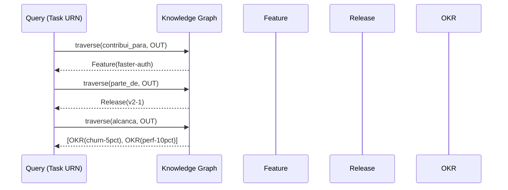
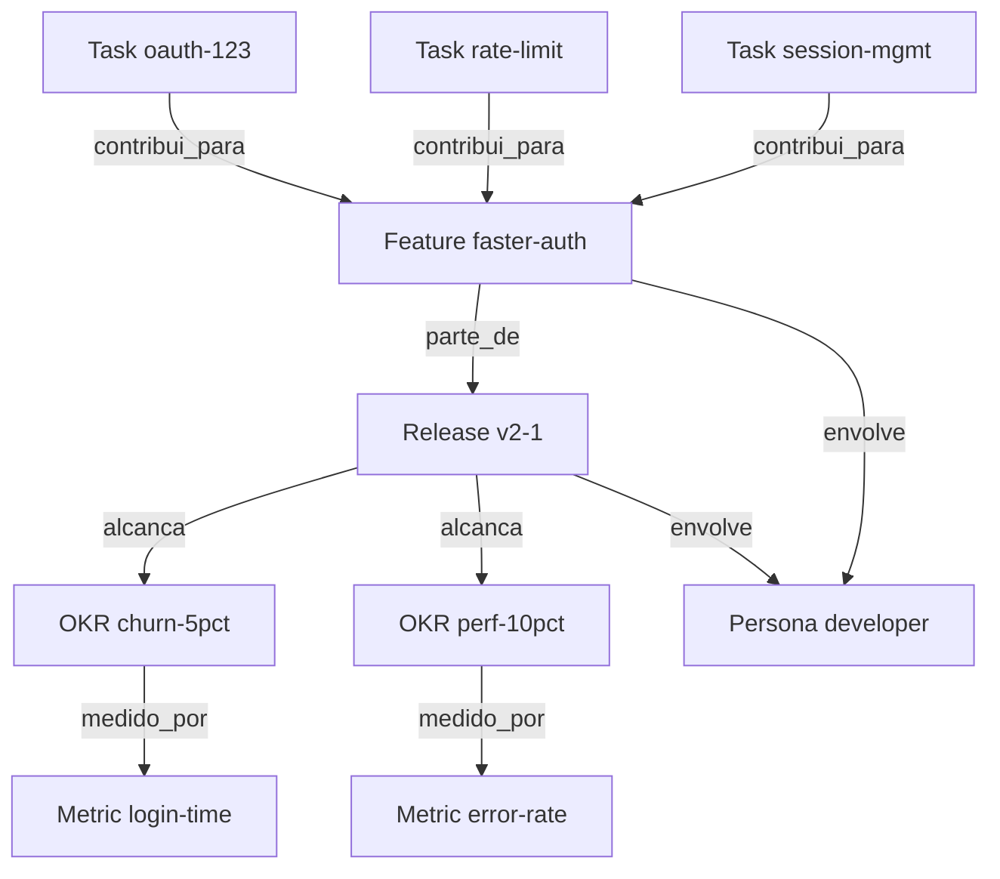
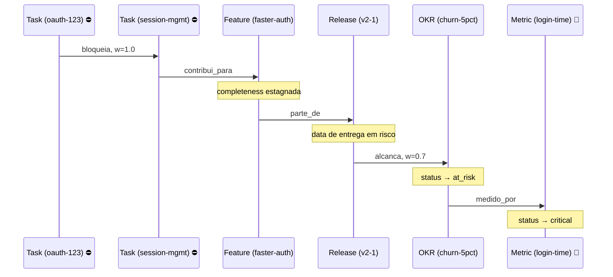
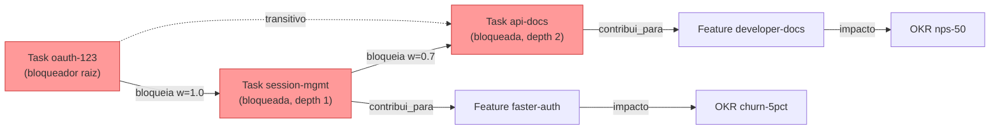
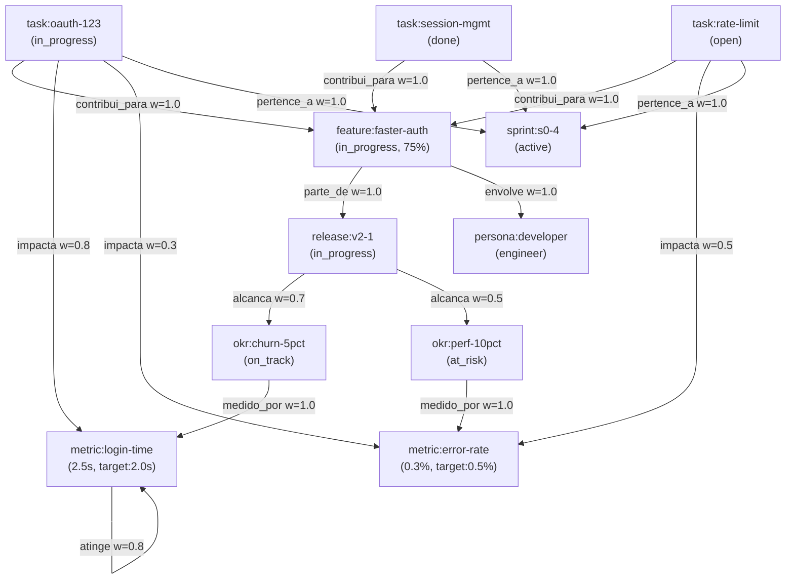
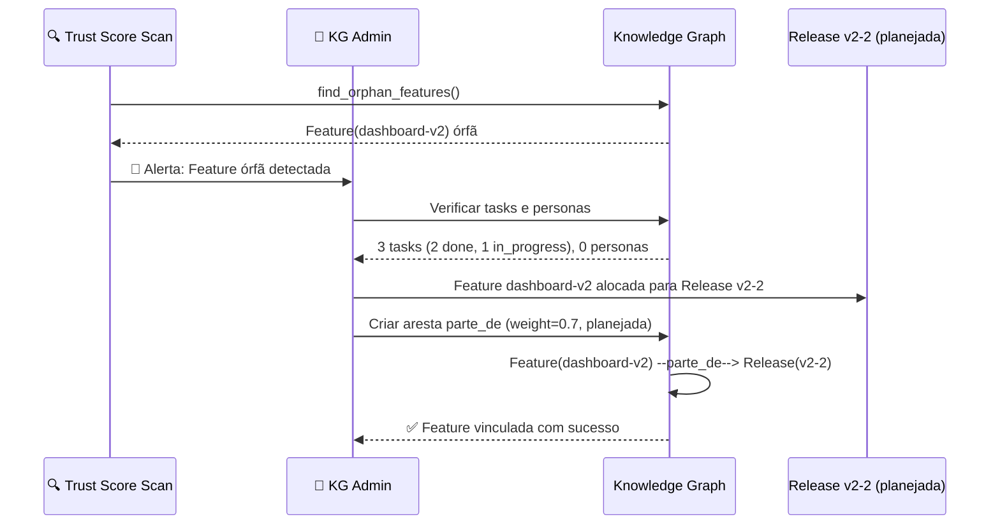

# Padrões de Navegação e Inferência — Knowledge Graph do APOS

**Documento:** QUERY_PATTERNS.md  
**Release:** R0 | **Sprint:** 0.4  
**Tarefa:** T0.4.4 — Padrões de navegação e inferência do Knowledge Graph  
**Dependência:** KNOWLEDGE_GRAPH.md (regras KG-001 a KG-012), NODE_TYPES.md (7 tipos de nó), EDGE_TYPES.md (10 tipos de aresta, propagação)  
**Criado em:** 2026-07-21  
**Versão:** v0.1-draft

---

## Índice

1. [Introdução](#1-introdução)
2. [Parte 1 — Padrões de Navegação (Traversal)](#2-parte-1--padrões-de-navegação-traversal)
3. [Parte 2 — Cálculo de Impacto](#3-parte-2--cálculo-de-impacto)
4. [Parte 3 — Detecção de Órfãos](#4-parte-3--detecção-de-órfãos)
5. [Parte 4 — Cálculo de Trust Score](#5-parte-4--cálculo-de-trust-score)
6. [Parte 5 — Exemplos de Uso (Cenários Completos)](#6-parte-5--exemplos-de-uso-cenários-completos)
7. [Referências](#7-referências)

---

## 1. Introdução

### 1.1 Propósito

Este documento cataloga os **padrões de navegação (traversal)** e **inferência** que o Knowledge Graph do APOS deve suportar. Cada padrão descreve:

- O **ponto de partida** (nó ou conjunto de nós)
- O **caminho percorrido** (sequência de arestas)
- O **resultado esperado** (nós, atributos, ou métricas derivadas)
- O **pseudocódigo** da query no grafo
- Um **exemplo concreto** com URNs do APOS

### 1.2 Convenções

| Símbolo | Significado |
|---------|-------------|
| `→` | Aresta no sentido source → target |
| `←` | Aresta no sentido target → source (navegação reversa) |
| `⇒` | Inferência ou propagação |
| `T`, `F`, `R`, `O`, `M`, `S`, `P` | Abreviações de Task, Feature, Release, OKR, Metric, Sprint, Persona |
| `--[tipo]-->` | Aresta com tipo específico |
| `w=X` | Peso (weight) da aresta |

### 1.3 Abreviações de EdgeType

| Abreviação | EdgeType | Caminho |
|------------|----------|---------|
| `cp` | `contribui_para` | Task → Feature |
| `pd` | `parte_de` | Feature/Sprint → Release |
| `al` | `alcanca` | Release → OKR |
| `mp` | `medido_por` | OKR → Metric |
| `im` | `impacta` | Task → Metric |
| `bl` | `bloqueia` | Task → Task |
| `dd` | `depende_de` | Task → Task |
| `pa` | `pertence_a` | Task → Sprint |
| `en` | `envolve` | Feature/Release → Persona |
| `at` | `atinge` | Metric → Metric |

### 1.4 Cadeia Canônica de Navegação

```
Task --contribui_para--> Feature --parte_de--> Release --alcanca--> OKR --medido_por--> Metric
```

Esta cadeia de 4 saltos (T→F→R→O→M) é a **espinha dorsal** do grafo e a base para todos os padrões de inferência de impacto.

---

## 2. Parte 1 — Padrões de Navegação (Traversal)

### Padrão Q01: Task → OKR

**Nome:** `task-to-okr`  
**Descrição:** Dada uma Task, encontrar os OKRs que ela impacta através da cadeia completa.  
**Ponto de partida:** URN de uma Task  
**Caminho percorrido:** `Task --cp--> Feature --pd--> Release --al--> OKR`  
**Resultado esperado:** Lista de URNs de OKR com peso do alcance e status

**Pseudocódigo:**

```
FUNCTION find_okrs_for_task(task_urn):
  // 1. Encontra Feature via contribui_para
  feature = graph.traverse(source=task_urn, edge_type="contribui_para", direction=OUT)
  IF feature is empty: RETURN []

  // 2. Encontra Release via parte_de
  release = graph.traverse(source=feature[0].id, edge_type="parte_de", direction=OUT)
  IF release is empty: RETURN []

  // 3. Encontra OKRs via alcanca
  okrs = graph.traverse(source=release[0].id, edge_type="alcanca", direction=OUT)

  RETURN [{ okr.id, okr.objective, okr.status, weight: edge.weight } for each]
```

**Exemplo com URNs:**

```
INPUT:  urn:apos:task:oauth-123
SALTO 1: urn:apos:task:oauth-123 --contribui_para--> urn:apos:feature:faster-auth
SALTO 2: urn:apos:feature:faster-auth --parte_de--> urn:apos:release:v2-1
SALTO 3: urn:apos:release:v2-1 --alcanca, w=0.7--> urn:apos:okr:churn-5pct

OUTPUT:
[
  { "okr": "urn:apos:okr:churn-5pct", "objective": "Reduce customer churn by 5%",
    "status": "on_track", "alcanca_weight": 0.7 },
  { "okr": "urn:apos:okr:perf-10pct", "objective": "Improve system performance by 10%",
    "status": "at_risk", "alcanca_weight": 0.5 }
]
```

**Diagrama Mermaid:**



---

### Padrão Q02: Feature → Métricas

**Nome:** `feature-to-metrics`  
**Descrição:** Dada uma Feature, encontrar todas as Métricas impactadas (caminho indireto via Release e OKR).  
**Ponto de partida:** URN de uma Feature  
**Caminho percorrido:** `Feature --pd--> Release --al--> OKR --mp--> Metric`  
**Resultado esperado:** Lista de métricas com nome, current_value, target, status

**Pseudocódigo:**

```
FUNCTION find_metrics_for_feature(feature_urn):
  // 1. Encontra Release via parte_de
  release = graph.traverse(source=feature_urn, edge_type="parte_de", direction=OUT)
  IF release is empty: RETURN []

  // 2. Encontra OKRs via alcanca
  okrs = graph.traverse(source=release[0].id, edge_type="alcanca", direction=OUT)

  // 3. Para cada OKR, encontra métricas via medido_por
  metrics = []
  FOR each okr IN okrs:
    okr_metrics = graph.traverse(source=okr.id, edge_type="medido_por", direction=OUT)
    metrics.append({ okr: okr.id, metrics: okr_metrics })

  RETURN metrics
```

**Exemplo com URNs:**

```
INPUT:  urn:apos:feature:faster-auth
SALTO 1: urn:apos:feature:faster-auth --parte_de--> urn:apos:release:v2-1
SALTO 2: urn:apos:release:v2-1 --alcanca--> urn:apos:okr:churn-5pct
                                     --alcanca--> urn:apos:okr:perf-10pct
SALTO 3a: urn:apos:okr:churn-5pct --medido_por--> urn:apos:metric:login-time
SALTO 3b: urn:apos:okr:perf-10pct --medido_por--> urn:apos:metric:error-rate

OUTPUT:
[
  { "okr": "urn:apos:okr:churn-5pct",
    "metrics": [
      { "id": "urn:apos:metric:login-time", "name": "Login Time",
        "current_value": 2.5, "target": 2.0, "status": "at_risk" }
    ]
  },
  { "okr": "urn:apos:okr:perf-10pct",
    "metrics": [
      { "id": "urn:apos:metric:error-rate", "name": "API Error Rate",
        "current_value": 0.3, "target": 0.5, "status": "healthy" }
    ]
  }
]
```

---

### Padrão Q03: Release → OKRs → Métricas

**Nome:** `release-to-okrs-and-metrics`  
**Descrição:** Dada uma Release, listar todos os OKRs e Métricas associados, incluindo features e tasks que compõem a Release.  
**Ponto de partida:** URN de uma Release  
**Caminho percorrido:** `Release --al--> OKR --mp--> Metric` (forward) + `Feature ←pd-- Release` (reverse)  
**Resultado esperado:** Visão consolidada da Release com OKRs, métricas, features e tasks

**Pseudocódigo:**

```
FUNCTION get_release_dashboard(release_urn):
  // 1. OKRs forward
  okrs = graph.traverse(source=release_urn, edge_type="alcanca", direction=OUT)
  FOR each okr:
    metrics = graph.traverse(source=okr.id, edge_type="medido_por", direction=OUT)
    okr.metrics = metrics

  // 2. Features reverse
  features = graph.traverse(target=release_urn, edge_type="parte_de", direction=IN)
  FOR each feature:
    tasks = graph.traverse(target=feature.id, edge_type="contribui_para", direction=IN)
    personas = graph.traverse(source=feature.id, edge_type="envolve", direction=OUT)
    feature.tasks = tasks
    feature.personas = personas

  // 3. Personas diretamente na Release
  personas = graph.traverse(source=release_urn, edge_type="envolve", direction=OUT)

  RETURN { okrs, features, personas }
```

**Parâmetros de entrada/saída:**

| Parâmetro | Tipo | Descrição |
|-----------|------|-----------|
| `release_urn` | `str` (URN) | URN da Release |
| **Output** | `dict` | Release com OKRs, métricas, features, tasks, personas |

**Exemplo com URNs:**

```
INPUT: urn:apos:release:v2-1

OUTPUT:
{
  "release": {
    "version": "2.1.0",
    "status": "in_progress",
    "name": "Summer Release 2026"
  },
  "okrs": [
    { "objective": "Reduce customer churn by 5%", "status": "on_track",
      "metrics": [{ "name": "Login Time", "current_value": 2.5, "target": 2.0 }] },
    { "objective": "Improve system performance by 10%", "status": "at_risk",
      "metrics": [{ "name": "API Error Rate", "current_value": 0.3, "target": 0.5 }] }
  ],
  "features": [
    { "name": "Faster Authentication", "status": "in_progress",
      "tasks": ["oauth-123", "rate-limit", "session-mgmt"],
      "personas": ["developer"] }
  ],
  "personas": ["developer"]
}
```

**Diagrama Mermaid:**



---

### Padrão Q04: Task → Sprint

**Nome:** `task-to-sprint`  
**Descrição:** Dada uma Task, encontrar o Sprint ao qual ela pertence.  
**Ponto de partida:** URN de uma Task  
**Caminho percorrido:** `Task --pa--> Sprint`  
**Resultado esperado:** Sprint com nome, status, datas, e goal

**Pseudocódigo:**

```
FUNCTION find_sprint_for_task(task_urn):
  sprints = graph.traverse(source=task_urn, edge_type="pertence_a", direction=OUT)
  IF sprints is empty:
    RETURN { "status": "backlog", "message": "Task não alocada em nenhuma Sprint" }
  RETURN sprints[0].attributes
```

**Parâmetros de entrada/saída:**

| Parâmetro | Tipo | Descrição |
|-----------|------|-----------|
| `task_urn` | `str` (URN) | URN da Task |
| **Output** | `dict` ou `string` | Atributos da Sprint ou mensagem de backlog |

**Exemplo com URNs:**

```
INPUT:  urn:apos:task:oauth-123
SALTO:  urn:apos:task:oauth-123 --pertence_a--> urn:apos:sprint:s0-4

OUTPUT:
{
  "name": "Sprint 0.4",
  "status": "active",
  "start_date": "2026-07-21",
  "end_date": "2026-07-25",
  "goal": "Finalizar design do Knowledge Graph"
}

// Task em backlog (sem aresta pertence_a):
INPUT:  urn:apos:task:backlog-item-001
OUTPUT: { "status": "backlog", "message": "Task não alocada em nenhuma Sprint" }
```

---

### Padrão Q05: Persona → Features

**Nome:** `persona-to-features`  
**Descrição:** Dada uma Persona, listar todas as Features que a envolvem.  
**Ponto de partida:** URN de uma Persona  
**Caminho percorrido:** `Feature --en--> Persona` (navegação reversa: Persona ←en-- Feature)  
**Resultado esperado:** Lista de Features que impactam a Persona

**Pseudocódigo:**

```
FUNCTION find_features_for_persona(persona_urn):
  // Navegação reversa: arestas que chegam na Persona com tipo "envolve"
  incoming = graph.traverse(target=persona_urn, edge_type="envolve", direction=IN)
  features = []
  releases = []
  FOR each edge IN incoming:
    node = graph.get_node(edge.source)
    IF node.type == "feature":
      features.append(node)
    IF node.type == "release":
      releases.append(node)
  RETURN { features, releases }
```

**Parâmetros de entrada/saída:**

| Parâmetro | Tipo | Descrição |
|-----------|------|-----------|
| `persona_urn` | `str` (URN) | URN da Persona |
| **Output** | `dict` | Features e Releases que envolvem a Persona |

**Exemplo com URNs:**

```
INPUT:  urn:apos:persona:developer

Navegação reversa:
  urn:apos:feature:faster-auth  --envolve--> urn:apos:persona:developer
  urn:apos:release:v2-1         --envolve--> urn:apos:persona:developer

OUTPUT:
{
  "features": [
    { "id": "urn:apos:feature:faster-auth", "name": "Faster Authentication",
      "status": "in_progress", "weight": 1.0 }
  ],
  "releases": [
    { "id": "urn:apos:release:v2-1", "version": "2.1.0",
      "status": "in_progress", "weight": 0.7 }
  ],
  "impact_summary": "Persona 'Developer' é impactada por 1 feature e 1 release"
}
```

---

### Padrão Q06: Task Bloqueada → Métricas em Risco

**Nome:** `blocked-task-to-metrics`  
**Descrição:** Dada uma Task bloqueada (status=blocked ou com aresta `bloqueia` incoming), encontrar todas as Métricas impactadas pela propagação do bloqueio.  
**Ponto de partida:** URN de uma Task bloqueada  
**Caminho percorrido:** `Task --bl--> Task --cp--> Feature --pd--> Release --al--> OKR --mp--> Metric`  
**Resultado esperado:** Lista de métricas em risco com cadeia de bloqueio

**Pseudocódigo:**

```
FUNCTION find_metrics_at_risk_from_blocked(task_urn):
  // 1. Verifica se task está bloqueada
  if graph.get_node(task_urn).attributes.status != "blocked":
    RETURN { "warning": "Task não está bloqueada" }

  // 2. Encontra tasks que esta task bloqueia (transitivo)
  blocked_tasks = bfs(
    source=task_urn,
    edge_type="bloqueia",
    direction=OUT,
    transitive=true
  )

  // 3. Para cada task bloqueada, segue a cadeia até metrics
  metrics_at_risk = []
  FOR each bt IN blocked_tasks:
    impact_path = find_metrics_for_task(bt.id)
    metrics_at_risk.append({
      "blocked_task": bt.id,
      "impact_path": impact_path
    })

  RETURN metrics_at_risk
```

**Exemplo com URNs:**

```
INPUT: urn:apos:task:oauth-123  (status: "blocked")

Cadeia de bloqueio:
  Task(oauth-123) --bloqueia, w=1.0--> Task(session-mgmt) --contribui_para-->
    Feature(faster-auth) --parte_de--> Release(v2-1) --alcanca-->
      OKR(churn-5pct) --medido_por--> Metric(login-time)

OUTPUT:
{
  "blocking_task": "urn:apos:task:oauth-123",
  "status": "blocked",
  "blocked_downstream": [
    {
      "task": "urn:apos:task:session-mgmt",
      "status": "blocked",
      "block_weight": 1.0,
      "feature": "urn:apos:feature:faster-auth",
      "release": "urn:apos:release:v2-1",
      "okr": {
        "id": "urn:apos:okr:churn-5pct",
        "objective": "Reduce customer churn by 5%",
        "status": "at_risk"
      },
      "metric": {
        "id": "urn:apos:metric:login-time",
        "name": "Login Time",
        "current_value": 2.5,
        "target": 2.0,
        "status": "at_risk",
        "risk_level": "CRITICAL"
      }
    }
  ]
}
```

**Diagrama Mermaid — Fluxo de Bloqueio:**



**Resumo dos Padrões de Navegação (Q01–Q06):**

| # | Padrão | Partida | Caminho | Saltos | Resultado |
|---|--------|---------|---------|:------:|-----------|
| Q01 | Task → OKR | Task | `--cp-->F--pd-->R--al-->O` | 3 | OKRs com peso e status |
| Q02 | Feature → Métricas | Feature | `--pd-->R--al-->O--mp-->M` | 3 | Métricas com valores |
| Q03 | Release Dashboard | Release | `--al-->O--mp-->M` + `←pd--F` | 1-4 | Visão consolidada |
| Q04 | Task → Sprint | Task | `--pa-->S` | 1 | Sprint com atributos |
| Q05 | Persona → Features | Persona | `←en--F` + `←en--R` (reverse) | 1 | Features e Releases |
| Q06 | Task Bloqueada → Métricas | Task (blocked) | `--bl-->T--cp-->F--pd-->R--al-->O--mp-->M` | 5 | Métricas em risco |

---

## 3. Parte 2 — Cálculo de Impacto

### Padrão Q07: Impacto de Mudança de Task

**Nome:** `task-change-impact`  
**Descrição:** "Se mudo a Task X, quais Métricas são afetadas?" — caminho completo de impacto com propagação ponderada.  
**Gatilho:** Mudança de status, prioridade, ou escopo de uma Task  
**Caminho:** `Task --cp--> Feature --pd--> Release --al--> OKR --mp--> Metric`  
**Resultado esperado:** Métricas afetadas com fator de impacto ponderado

**Pseudocódigo:**

```
FUNCTION calculate_task_change_impact(task_urn, change_type, new_value):
  // 1. Cadeia canônica de impacto indireto
  indirect = find_okrs_for_task(task_urn)

  // 2. Impacto direto (arestas impacta)
  direct = graph.traverse(source=task_urn, edge_type="impacta", direction=OUT)

  // 3. Calcula fator de impacto combinado
  impact_score = 0.0
  FOR each metric_edge IN direct:
    weight = metric_edge.weight
    baseline = graph.get_node(metric_edge.target).attributes.current_value
    target = graph.get_node(metric_edge.target).attributes.target
    delta = abs(baseline - target)
    impact_score = weight * delta

  RETURN {
    "task": task_urn,
    "change": { "type": change_type, "new_value": new_value },
    "direct_impacts": direct_metrics,
    "indirect_paths": indirect_paths,
    "combined_risk_score": impact_score
  }
```

**Exemplo com URNs:**

```
Cenário: Task "oauth-123" muda de "in_progress" para "done"

INPUT:
  task_urn: "urn:apos:task:oauth-123"
  change: { "field": "status", "from": "in_progress", "to": "done" }

Cálculo de impacto:
  1. Efeito direto: Feature(faster-auth).completeness sobe de 0.75 para 1.0
  2. Impacta direto: Metric(login-time) — weight=0.8 → melhora estimada
  3. Cadeia indireta: Release(v2-1) avança → OKR(churn-5pct) progride

OUTPUT:
{
  "task": "urn:apos:task:oauth-123",
  "change": { "field": "status", "from": "in_progress", "to": "done" },
  "direct_impacts": [
    { "target": "urn:apos:metric:login-time", "weight": 0.8,
      "estimated_improvement": "current_value 2.5 → ~2.0s" }
  ],
  "indirect_paths": [
    { "feature": "faster-auth",
      "feature_impact": "completeness: 0.75 → 1.0 (feature pode ser shipped)",
      "release": "v2-1",
      "release_impact": "Features shipped: 1/1 → release shipped",
      "okrs": [{ "id": "churn-5pct", "status_impact": "on_track → achieved" }]
    }
  ],
  "combined_risk_score": 0.8
}
```

---

### Padrão Q08: Impacto de Feature Removida

**Nome:** `feature-removal-impact`  
**Descrição:** "Se removo a Feature Y, quais OKRs são afetados?" — cálculo de impacto de perda de escopo.  
**Gatilho:** Feature removida (aresta `parte_de` com weight=0.0 ou deletada)  
**Caminho:** `Feature --pd--> Release --al--> OKR --mp--> Metric` + `Feature --en--> Persona`  
**Resultado esperado:** OKRs afetados, métricas, personas, e severidade do impacto

**Pseudocódigo:**

```
FUNCTION calculate_feature_removal_impact(feature_urn):
  // 1. Encontra Release
  release_edge = graph.get_edge(source=feature_urn, edge_type="parte_de")

  // 2. Encontra OKRs via Release
  okrs = graph.traverse(source=release_edge.target, edge_type="alcanca", direction=OUT)

  // 3. Para cada OKR, calcula perda de contribuição
  affected_okrs = []
  FOR each okr_edge IN okrs:
    // Peso da Feature na Release * peso da Release no OKR
    feature_weight = release_edge.weight  // quão essencial é a feature
    okr_weight = okr_edge.weight          // quão determinante é a release pro OKR
    total_impact = feature_weight * okr_weight
    affected_okrs.append({
      okr: okr_edge.target,
      impact_factor: total_impact,
      severity: classify_severity(total_impact)
    })

  // 4. Encontra Personas afetadas
  personas = graph.traverse(source=feature_urn, edge_type="envolve", direction=OUT)

  RETURN {
    feature: feature_urn,
    release: release_edge.target,
    affected_okrs: affected_okrs,
    affected_personas: [p.id for p in personas],
    mitigation: "Feature deve ser re-planejada para próxima release ou descartada"
  }
```

**Exemplo com URNs:**

```
INPUT: urn:apos:feature:faster-auth (removida da Release v2-1)

Cálculo:
  Feature(faster-auth) --parte_de, w=1.0--> Release(v2-1)
  Release(v2-1) --alcanca, w=0.7--> OKR(churn-5pct)
  Release(v2-1) --alcanca, w=0.5--> OKR(perf-10pct)
  Feature(faster-auth) --envolve, w=1.0--> Persona(developer)

OUTPUT:
{
  "feature": "urn:apos:feature:faster-auth",
  "release": "urn:apos:release:v2-1",
  "release_impact": "Release v2-1 perde 100% do escopo de Faster Auth.
                      Cobertura de OKRs reduzida.",
  "affected_okrs": [
    { "okr": "urn:apos:okr:churn-5pct",
      "current_status": "on_track",
      "new_risk_status": "behind",
      "impact_factor": 0.7,
      "severity": "HIGH",
      "reason": "Feature Faster Auth é o principal contribuidor deste OKR" },
    { "okr": "urn:apos:okr:perf-10pct",
      "current_status": "at_risk",
      "new_risk_status": "behind",
      "impact_factor": 0.5,
      "severity": "MEDIUM",
      "reason": "Feature Faster Auth contribuía marginalmente para performance" }
  ],
  "affected_personas": ["urn:apos:persona:developer"],
  "mitigation": "Feature deve ser re-planejada para próxima release ou descartada"
}
```

**Tabela de Classificação de Severidade:**

| Impact Factor | Severidade | Ação |
|:------------:|------------|------|
| 0.7 – 1.0 | **CRITICAL** | OKR pode não ser atingido — replanejamento urgente |
| 0.4 – 0.69 | **HIGH** | OKR significativamente impactado — monitorar |
| 0.2 – 0.39 | **MEDIUM** | OKR marginalmente impactado — aceitável |
| 0.0 – 0.19 | **LOW** | Impacto mínimo — informativo |

---

### Padrão Q09: Propagação de Bloqueio

**Nome:** `blockage-propagation`  
**Descrição:** Task A bloqueia Task B — qual o impacto cascata? Calcula o **caminho crítico** de bloqueios com transitividade.  
**Gatilho:** Aresta `bloqueia` inserida ou task bloqueadora alterada  
**Caminho:** `Task --bl--> Task --bl--> Task --cp--> Feature --pd--> Release --al--> OKR --mp--> Metric`  
**Resultado esperado:** Grafo de bloqueio com profundidade, tasks afetadas, e impacto nos OKRs/Métricas

**Pseudocódigo:**

```
FUNCTION propagate_blockage(root_task_urn):
  // BFS com transitividade — encontra todas as tasks bloqueadas
  queue = [(root_task_urn, 0)]     // (task_urn, depth)
  visited = set()
  blockage_chain = []

  WHILE queue is not empty:
    current, depth = queue.pop(0)
    blocked = graph.traverse(source=current, edge_type="bloqueia", direction=OUT)
    FOR each edge IN blocked:
      if edge.target not in visited:
        visited.add(edge.target)
        queue.append((edge.target, depth + 1))
        blockage_chain.append({
          "blocker": current,
          "blocked": edge.target,
          "depth": depth + 1,
          "weight": edge.weight
        })

  // Para cada task bloqueada, calcula impacto estratégico
  strategic_impact = []
  FOR each item IN blockage_chain:
    impact = find_okrs_for_task(item.blocked)
    strategic_impact.append(item + { "strategic": impact })

  RETURN {
    "root_blocker": root_task_urn,
    "total_blocked": len(blockage_chain),
    "max_depth": max(item.depth for item in blockage_chain),
    "chain": blockage_chain,
    "strategic_impact": strategic_impact
  }
```

**Exemplo com URNs:**

```
INPUT: urn:apos:task:oauth-123  (tasks que esta task bloqueia)

Grafo de bloqueio:
  Task(oauth-123) --bloqueia, w=1.0--> Task(session-mgmt)
    Task(session-mgmt) --bloqueia, w=0.7--> Task(api-docs)
      Task(api-docs) --contribui_para--> Feature(developer-docs)

OUTPUT:
{
  "root_blocker": "urn:apos:task:oauth-123",
  "root_status": "in_progress",
  "total_blocked": 2,
  "max_depth": 2,
  "estimated_delay_days": 3,
  "critical_path": true,
  "chain": [
    {
      "blocker": "urn:apos:task:oauth-123",
      "blocked": "urn:apos:task:session-mgmt",
      "depth": 1,
      "weight": 1.0,
      "feature": "urn:apos:feature:faster-auth",
      "blocked_task_status": "blocked"
    },
    {
      "blocker": "urn:apos:task:session-mgmt",
      "blocked": "urn:apos:task:api-docs",
      "depth": 2,
      "weight": 0.7,
      "feature": "urn:apos:feature:developer-docs",
      "blocked_task_status": "blocked"
    }
  ],
  "strategic_impact": [
    {
      "blocked": "urn:apos:task:session-mgmt",
      "okrs": [
        { "okr": "churn-5pct", "impact": "Feature faster-auth atrasada → churn OKR em risco" }
      ]
    },
    {
      "blocked": "urn:apos:task:api-docs",
      "okrs": [
        { "okr": "nps-50", "impact": "Feature developer-docs atrasada → NPS impactado" }
      ]
    }
  ]
}
```

**Diagrama Mermaid — Propagação Transitiva:**



**Resumo dos Padrões de Cálculo de Impacto (Q07–Q09):**

| # | Padrão | Gatilho | Caminho | Saltos | Severidade |
|---|--------|---------|---------|:------:|:----------:|
| Q07 | Mudança de Task | Status/escopo alterado | T→F→R→O→M | 4 | Calculada por weight |
| Q08 | Feature Removida | Aresta `parte_de` removida | F→R→O→M + F→P | 2-4 | CRITICAL/MEDIUM/LOW |
| Q09 | Propagação de Bloqueio | Aresta `bloqueia` inserida | T→T(transitivo)→F→R→O→M | 1-5+ | Baseada em profundidade |

---

## 4. Parte 3 — Detecção de Órfãos

### Padrão Q10: Tasks Órfãs

**Nome:** `orphan-tasks`  
**Descrição:** Tasks sem aresta `contribui_para` — não contribuem para nenhuma Feature.  
**Regra violada:** KG-008 (Task DEVE contribuir para exatamente 1 Feature)  
**Query:** Encontrar todos os nós `type=task` sem aresta outgoing `contribui_para`

**Pseudocódigo:**

```
FUNCTION find_orphan_tasks():
  orphan_tasks = []
  FOR each node IN graph.nodes:
    IF node.type != "task": CONTINUE
    contrib = graph.find_edge(source=node.id, edge_type="contribui_para")
    IF contrib is None:
      orphan_tasks.append(node)
  RETURN orphan_tasks
```

**Exemplo com URNs:**

```
INPUT: (scan do grafo)

Tasks órfãs encontradas:
[
  {
    "id": "urn:apos:task:unlinked-task-001",
    "title": "Investigate database indexes",
    "status": "open",
    "sprint": "urn:apos:sprint:s0-4",
    "has_sprint": true,
    "has_feature": false,
    "severity": "HIGH",
    "violation": "KG-008 — Task sem contribui_para"
  },
  {
    "id": "urn:apos:task:spike-esbuild",
    "title": "Spike: esbuild migration",
    "status": "done",
    "sprint": null,
    "has_sprint": false,
    "has_feature": false,
    "severity": "MEDIUM",
    "violation": "KG-008 — Task sem contribui_para (e sem sprint)"
  }
]
```

---

### Padrão Q11: Features Órfãs

**Nome:** `orphan-features`  
**Descrição:** Features sem aresta `parte_de` — não pertencem a nenhuma Release.  
**Regra violada:** KG-009 (Feature DEVE pertencer a exatamente 1 Release)  
**Query:** Encontrar todos os nós `type=feature` sem aresta outgoing `parte_de`

**Pseudocódigo:**

```
FUNCTION find_orphan_features():
  orphan_features = []
  FOR each node IN graph.nodes:
    IF node.type != "feature": CONTINUE
    parte_de = graph.find_edge(source=node.id, edge_type="parte_de")
    IF parte_de is None:
      tasks = graph.traverse(target=node.id, edge_type="contribui_para", direction=IN)
      orphan_features.append({
        feature: node,
        has_tasks: len(tasks) > 0,
        task_count: len(tasks)
      })
  RETURN orphan_features
```

**Exemplo com URNs:**

```
INPUT: (scan do grafo)

Features órfãs encontradas:
[
  {
    "id": "urn:apos:feature:dashboard-v2",
    "name": "Dashboard V2",
    "status": "planned",
    "task_count": 3,
    "has_tasks": true,
    "has_release": false,
    "severity": "HIGH",
    "remediation": "Criar aresta parte_de para uma Release ou mover para backlog"
  },
  {
    "id": "urn:apos:feature:biometric-auth-flow",
    "name": "Biometric Auth Flow",
    "status": "planned",
    "task_count": 0,
    "has_tasks": false,
    "has_release": false,
    "severity": "MEDIUM",
    "remediation": "Feature sem tasks e sem Release — candidata a remoção"
  }
]
```

---

### Padrão Q12: Métricas Órfãs

**Nome:** `orphan-metrics`  
**Descrição:** Métricas sem aresta incoming `medido_por` — não medem nenhum OKR.  
**Regra violada:** KG-010 (OKR DEVE ter ≥ 1 métrica, mas métrica sem OKR é um warning de rastreabilidade)  
**Query:** Encontrar todos os nós `type=metric` sem aresta incoming `medido_por`

**Pseudocódigo:**

```
FUNCTION find_orphan_metrics():
  orphan_metrics = []
  FOR each node IN graph.nodes:
    IF node.type != "metric": CONTINUE
    incoming = graph.traverse(target=node.id, edge_type="medido_por", direction=IN)
    IF incoming is empty:
      tasks_impacting = graph.traverse(target=node.id, edge_type="impacta", direction=IN)
      orphan_metrics.append({
        metric: node,
        has_tasks_impacting: len(tasks_impacting) > 0,
        task_impact_count: len(tasks_impacting)
      })
  RETURN orphan_metrics
```

**Exemplo com URNs:**

```
INPUT: (scan do grafo)

Métricas órfãs encontradas:
[
  {
    "id": "urn:apos:metric:user-satisfaction",
    "name": "User Satisfaction Score",
    "unit": "score",
    "target": 85.0,
    "current_value": 72.0,
    "status": "at_risk",
    "has_okr": false,
    "tasks_impacting": 0,
    "severity": "HIGH",
    "violation": "Métrica sem OKR — ninguém é responsável por este indicador"
  }
]
```

---

### Padrão Q13: OKRs Órfãos

**Nome:** `orphan-okrs`  
**Descrição:** OKRs sem aresta incoming `alcanca` — nenhuma Release os alcança.  
**Regra violada:** Boa prática (OKR sem Release é um objetivo sem execução)  
**Query:** Encontrar todos os nós `type=okr` sem aresta incoming `alcanca`

**Pseudocódigo:**

```
FUNCTION find_orphan_okrs():
  orphan_okrs = []
  FOR each node IN graph.nodes:
    IF node.type != "okr": CONTINUE
    incoming = graph.traverse(target=node.id, edge_type="alcanca", direction=IN)
    metrics = graph.traverse(source=node.id, edge_type="medido_por", direction=OUT)
    IF incoming is empty:
      orphan_okrs.append({
        okr: node,
        has_metrics: len(metrics) > 0,
        metric_count: len(metrics)
      })
  RETURN orphan_okrs
```

**Exemplo com URNs:**

```
INPUT: (scan do grafo)

OKRs órfãos encontrados:
[
  {
    "id": "urn:apos:okr:nps-50",
    "objective": "Achieve NPS >= 50",
    "status": "planned",
    "quarter": "2026-Q3",
    "has_release": false,
    "metrics": [
      { "id": "urn:apos:metric:user-satisfaction", "name": "User Satisfaction Score" }
    ],
    "severity": "HIGH",
    "remediation": "Vincular a uma Release via aresta alcanca, ou mover para Q4 se sem execução"
  }
]
```

---

### Resumo dos Padrões de Detecção de Órfãos (Q10–Q13)

| # | Padrão | Tipo Órfão | Condição | Regra Violada | Severidade |
|---|--------|------------|----------|:-------------:|:----------:|
| Q10 | Tasks Órfãs | Task | Sem `contribui_para` outgoing | KG-008 | CRITICAL |
| Q11 | Features Órfãs | Feature | Sem `parte_de` outgoing | KG-009 | CRITICAL |
| Q12 | Métricas Órfãs | Metric | Sem `medido_por` incoming | KG-010 (WARN) | WARNING |
| Q13 | OKRs Órfãos | OKR | Sem `alcanca` incoming | Boa prática | HIGH |

**Tabela de Ações de Remediação:**

| Tipo Órfão | Ação Automática | Ação Manual |
|------------|----------------|-------------|
| Task órfã | Criar aresta `contribui_para` para Feature existente | Alocar task a uma feature ou mover para backlog |
| Feature órfã | Criar aresta `parte_de` para Release ativa | Feature sem release = backlog — decidir destino |
| Métrica órfã | Vincular a OKR existente via `medido_por` | Criar OKR para a métrica ou arquivar |
| OKR órfão | Vincular a Release via `alcanca` | OKR sem release = sem execução — planejar |

---

## 5. Parte 4 — Cálculo de Trust Score

### Padrão Q14: Coverage (Cobertura)

**Nome:** `trust-coverage`  
**Descrição:** Mede a proporção de nós que estão conectados ao grafo (possuem arestas obrigatórias).  
**Fórmula:** `coverage = (total_nós_linkados) / (total_nós)` por tipo de nó

**Pseudocódigo:**

```
FUNCTION calculate_coverage():
  stats = {}
  FOR each type IN [task, feature, release, okr, metric, sprint, persona]:
    nodes_of_type = graph.get_nodes_by_type(type)
    total = len(nodes_of_type)
    linked = 0

    IF type == "task":
      linked = count with contribui_para
    ELIF type == "feature":
      linked = count with parte_de (to release)
    ELIF type == "okr":
      linked = count with medido_por (to metric)
    ELIF type == "metric":
      linked = count with medido_por (from okr)
    ELIF type == "sprint":
      linked = count with parte_de (to release)
    // persona e release são opcionais

    stats[type] = {
      total: total,
      linked: linked,
      coverage_pct: round(linked / total * 100, 1) if total > 0 else 0
    }

  // Coverage geral (média ponderada)
  overall = weighted_avg(stats)
  RETURN stats + { overall: overall }
```

**Exemplo de saída:**

```json
{
  "coverage_by_type": {
    "task":     { "total": 47, "linked": 42, "coverage_pct": 89.4, "severity": "GREEN" },
    "feature":  { "total": 12, "linked": 10, "coverage_pct": 83.3, "severity": "YELLOW" },
    "release":  { "total": 4,  "linked": 4,  "coverage_pct": 100.0, "severity": "GREEN" },
    "okr":      { "total": 8,  "linked": 6,  "coverage_pct": 75.0, "severity": "YELLOW" },
    "metric":   { "total": 15, "linked": 12, "coverage_pct": 80.0, "severity": "YELLOW" },
    "sprint":   { "total": 3,  "linked": 3,  "coverage_pct": 100.0, "severity": "GREEN" },
    "persona":  { "total": 5,  "linked": 4,  "coverage_pct": 80.0, "severity": "YELLOW" }
  },
  "overall_coverage": 85.2,
  "verdict": "YELLOW — Órfãos detectados. Revisar tasks sem feature e OKRs sem métrica.",
  "timestamp": "2026-07-21T12:00:00Z"
}
```

**Tabela de Thresholds:**

| Coverage | Status | Ação |
|:--------:|--------|------|
| ≥ 95% | 🟢 GREEN | Grafo saudável |
| 80 – 94% | 🟡 YELLOW | Órfãos presentes — revisão recomendada |
| 50 – 79% | 🟠 ORANGE | Órfãos significativos — ação necessária |
| < 50% | 🔴 RED | Grafo não confiável — reconstruir conexões |

---

### Padrão Q15: Quality (Qualidade Referencial)

**Nome:** `trust-quality`  
**Descrição:** Valida a integridade referencial do grafo — todas as URNs referenciadas em arestas existem como nós?  
**Fórmula:** `quality = (arestas_com_source_target_existente) / (total_arestas)`

**Pseudocódigo:**

```
FUNCTION calculate_quality():
  total_edges = len(graph.edges)
  valid_source = 0
  valid_target = 0
  violations = []

  FOR each edge IN graph.edges:
    source_ok = edge.source in graph.nodes
    target_ok = edge.target in graph.nodes

    IF source_ok: valid_source += 1
    ELSE: violations.append({ "edge": edge, "violation": "KG-006", "missing": "source" })

    IF target_ok: valid_target += 1
    ELSE: violations.append({ "edge": edge, "violation": "KG-007", "missing": "target" })

  source_quality = valid_source / total_edges * 100
  target_quality = valid_target / total_edges * 100

  RETURN {
    total_edges: total_edges,
    source_integrity_pct: source_quality,
    target_integrity_pct: target_quality,
    overall_quality: (source_quality + target_quality) / 2,
    violations: violations,
    verdict: "PASS" if overall_quality == 100 else "DANGLING_REFERENCES"
  }
```

**Exemplo de saída:**

```json
{
  "total_edges": 124,
  "source_integrity_pct": 100.0,
  "target_integrity_pct": 99.2,
  "overall_quality": 99.6,
  "violations": [
    {
      "edge": { "source": "urn:apos:task:deleted-task", "target": "urn:apos:feature:faster-auth" },
      "violation": "KG-006",
      "missing": "source",
      "severity": "CRITICAL"
    }
  ],
  "verdict": "DANGLING_REFERENCES — 1 aresta com source inexistente. Remover ou recriar nó.",
  "timestamp": "2026-07-21T12:00:00Z"
}
```

---

### Padrão Q16: Consistency (Consistência)

**Nome:** `trust-consistency`  
**Descrição:** Detecta conflitos e inconsistências lógicas entre nós conectados.  
**Regras verificadas:** KG-011 (Feature shipped → Release shipped), ciclos de bloqueio, status conflitantes

**Pseudocódigo:**

```
FUNCTION calculate_consistency():
  conflicts = []

  // 1. KG-011: Feature shipped mas Release não
  FOR each feature IN graph.get_nodes_by_type("feature"):
    IF feature.attributes.status == "shipped":
      release_edge = graph.find_edge(source=feature.id, edge_type="parte_de")
      IF release_edge:
        release = graph.get_node(release_edge.target)
        IF release.attributes.status != "shipped":
          conflicts.append({
            type: "KG-011",
            severity: "WARN",
            message: f"Feature {feature.id} shipped mas Release {release.id} está {release.attributes.status}",
            nodes: [feature.id, release.id]
          })

  // 2. Task "done" mas dependente "blocked"
  FOR each edge IN graph.get_edges_by_type("bloqueia"):
    blocker = graph.get_node(edge.source)
    blocked = graph.get_node(edge.target)
    IF blocker.attributes.status == "done" AND blocked.attributes.status == "blocked":
      conflicts.append({
        type: "STATE_INCONSISTENCY",
        severity: "WARN",
        message: f"Task {blocker.id} done mas {blocked.id} ainda blocked"
      })

  // 3. Ciclos de bloqueio
  cycles = detect_cycles(edge_type="bloqueia")
  FOR each cycle IN cycles:
    conflicts.append({
      type: "BLOCK_CYCLE",
      severity: "CRITICAL",
      message: f"Ciclo de bloqueio detectado: {'→'.join(cycle)}"
    })

  // 4. Métrica com status "healthy" mas current_value acima do target
  FOR each metric IN graph.get_nodes_by_type("metric"):
    if metric.attributes.direction == "lower_is_better":
      if metric.attributes.current_value > metric.attributes.target AND metric.attributes.status == "healthy":
        conflicts.append({
          type: "METRIC_INCONSISTENCY",
          severity: "WARN",
          message: f"Métrica {metric.id}: current_value > target mas status = healthy"
        })

  RETURN {
    total_conflicts: len(conflicts),
    by_severity: {
      critical: count(severity=CRITICAL),
      warning: count(severity=WARN)
    },
    conflicts: conflicts,
    consistency_score: max(0, 100 - len(conflicts) * 10),
    verdict: classify_consistency(consistency_score)
  }
```

**Exemplo de saída:**

```json
{
  "total_conflicts": 3,
  "by_severity": { "critical": 1, "warning": 2 },
  "consistency_score": 70,
  "verdict": "YELLOW — Inconsistências detectadas. Revisar conflitos.",
  "conflicts": [
    {
      "type": "KG-011",
      "severity": "WARN",
      "message": "Feature faster-auth shipped mas Release v2-1 está in_progress",
      "nodes": ["urn:apos:feature:faster-auth", "urn:apos:release:v2-1"]
    },
    {
      "type": "BLOCK_CYCLE",
      "severity": "CRITICAL",
      "message": "Ciclo de bloqueio: task:A → task:B → task:A",
      "nodes": ["urn:apos:task:A", "urn:apos:task:B"]
    },
    {
      "type": "METRIC_INCONSISTENCY",
      "severity": "WARN",
      "message": "Métrica login-time: current_value(2.5) > target(2.0) mas status = healthy",
      "nodes": ["urn:apos:metric:login-time"]
    }
  ],
  "timestamp": "2026-07-21T12:00:00Z"
}
```

---

### Trust Score Consolidado

O **Trust Score** geral do grafo é calculado como uma média ponderada dos três scores:

```python
TRUST_SCORE = (
    COVERAGE_SCORE  * 0.30 +
    QUALITY_SCORE   * 0.40 +
    CONSISTENCY_SCORE * 0.30
)
```

| Score | Classificação | Descrição |
|:-----:|:-------------:|-----------|
| 95–100 | 🟢 **EXCELLENT** | Grafo confiável para tomada de decisão |
| 80–94 | 🟡 **GOOD** | Pequenos ajustes recomendados |
| 60–79 | 🟠 **FAIR** | Órfãos ou inconsistências — revisão necessária |
| < 60 | 🔴 **POOR** | Grafo não confiável — ação corretiva urgente |

**Exemplo consolidado:**

```json
{
  "trust_score": 84.9,
  "classification": "GOOD",
  "components": {
    "coverage":     { "score": 85.2, "weight": 0.30 },
    "quality":      { "score": 99.6, "weight": 0.40 },
    "consistency":  { "score": 70.0, "weight": 0.30 }
  },
  "orphan_summary": {
    "orphan_tasks": 5,
    "orphan_features": 2,
    "orphan_okrs": 2,
    "orphan_metrics": 3
  },
  "timestamp": "2026-07-21T12:00:00Z"
}
```

---

## 6. Parte 5 — Exemplos de Uso (Cenários Completos)

### Cenário A: "Feature Faster Auth com 3 Tasks, 1 OKR, 2 Métricas"

**Descrição:** Grafo completo da Feature "Faster Authentication" com todas as suas conexões.

**Grafo:**



**Queries executadas:**

```python
# Q01: Task → OKR
find_okrs_for_task("urn:apos:task:oauth-123")
# → [OKR(churn-5pct, w=0.7), OKR(perf-10pct, w=0.5)]

# Q02: Feature → Metrics
find_metrics_for_feature("urn:apos:feature:faster-auth")
# → [OKR(churn-5pct) → Metric(login-time), OKR(perf-10pct) → Metric(error-rate)]

# Q03: Release Dashboard
get_release_dashboard("urn:apos:release:v2-1")
# → Dashboard completo com 2 OKRs, 2 metrics, 1 feature, 3 tasks, 1 persona

# Q04: Task → Sprint
find_sprint_for_task("urn:apos:task:oauth-123")
# → Sprint(s0-4, active, 2026-07-21 → 2026-07-25)

# Q05: Persona → Features
find_features_for_persona("urn:apos:persona:developer")
# → Feature(faster-auth), Release(v2-1)
```

**Health Check do cenário:**

| Indicador | Valor | Status |
|-----------|:-----:|:------:|
| Tasks com Feature (Q10) | 3/3 (100%) | ✅ |
| Features com Release (Q11) | 1/1 (100%) | ✅ |
| OKRs com Métrica (Q12) | 2/2 (100%) | ✅ |
| Release com OKR | 1/1 (100%) | ✅ |
| Tasks na Sprint (Q04) | 3/3 (100%) | ✅ |
| Tasks com Persona | 1/1 (100%) | ✅ |
| **Coverage** | **100%** | 🟢 GREEN |

---

### Cenário B: "Task Bloqueada, Métrica em Risco"

**Descrição:** A Task `oauth-123` está `blocked` (dependente de API externa). Qual o impacto cascata?

**Cadeia de Bloqueio:**

```
Task(oauth-123) blocked
  ↓ bloqueia w=1.0
Task(session-mgmt) blocked
  ↓ contribui_para w=1.0
Feature(faster-auth) completeness stagna em 75%
  ↓ parte_de w=1.0
Release(v2-1) data de entrega em risco
  ↓ alcanca w=0.7
OKR(churn-5pct) → status = at_risk
  ↓ medido_por w=1.0
Metric(login-time) current_value=2.5s > target=2.0s → status = critical
```

**Detecção de Risco:**

```json
{
  "scenario": "Task bloqueada → Métrica em risco",
  "root_cause": {
    "task": "urn:apos:task:oauth-123",
    "status": "blocked",
    "block_reason": "API externa de autenticação indisponível"
  },
  "propagation": {
    "depth_1_direct": {
      "blocked_task": "urn:apos:task:session-mgmt",
      "feature_impact": "completeness estagnada em 75%",
      "feature_status": "at_risk"
    },
    "depth_2_release": {
      "release": "urn:apos:release:v2-1",
      "release_impact": "Data de entrega pode ser postergada",
      "release_status": "at_risk"
    },
    "depth_3_strategic": {
      "okrs": [
        {
          "okr": "urn:apos:okr:churn-5pct",
          "status": "at_risk",
          "impact_severity": "HIGH",
          "contribution_loss": 0.7
        },
        {
          "okr": "urn:apos:okr:perf-10pct",
          "status": "at_risk",
          "impact_severity": "MEDIUM",
          "contribution_loss": 0.5
        }
      ]
    },
    "depth_4_metrics": {
      "metrics_at_risk": [
        {
          "metric": "urn:apos:metric:login-time",
          "current_value": 2.5,
          "target": 2.0,
          "status": "critical",
          "direction": "lower_is_better",
          "risk_level": "CRITICAL"
        },
        {
          "metric": "urn:apos:metric:error-rate",
          "current_value": 0.3,
          "target": 0.5,
          "status": "healthy",
          "direction": "lower_is_better",
          "risk_level": "LOW"
        }
      ]
    }
  },
  "remediation_suggestions": [
    "Desbloquear task oauth-123 (contatar time de infra)",
    "Re-planejar task session-mgmt para próxima sprint",
    "Notificar OKR owner sobre impacto no churn",
    "Se bloqueio persistir > 2 dias, considerar escalar para gestão"
  ],
  "risk_score": 0.75,
  "timestamp": "2026-07-21T12:00:00Z"
}
```

**Diagrama Mermaid — Propagação de Risco:**

```mermaid
flowchart TB
    subgraph "Execução"
        T1["⛔ Task oauth-123<br/>status: blocked"]
        T2["⛔ Task session-mgmt<br/>status: blocked"]
    end
    subgraph "Produto"
        F1["⚠️ Feature faster-auth<br/>completeness: 75% (estagnada)"]
        R1["⚠️ Release v2-1<br/>data: em risco"]
    end
    subgraph "Estratégia"
        O1["🔶 OKR churn-5pct<br/>status: at_risk"]
        O2["⚠️ OKR perf-10pct<br/>status: at_risk"]
        M1["🔴 Metric login-time<br/>status: critical<br/>2.5s > 2.0s target"]
        M2["✅ Metric error-rate<br/>status: healthy<br/>0.3% < 0.5% target"]
    end

    T1 -->|bloqueia| T2
    T2 -->|contribui_para| F1
    F1 -->|parte_de| R1
    R1 -->|alcanca w=0.7| O1
    R1 -->|alcanca w=0.5| O2
    O1 -->|medido_por| M1
    O2 -->|medido_por| M2
```



---

### Cenário C: "Feature Órfã Detectada"

**Descrição:** O Trust Score revealou uma Feature sem Release (órfã). Processo completo de detecção e remediação.

**1. Detecção:**

```json
{
  "pattern": "Q11 — Orphan Features",
  "trigger": "Trust Score scan (24h)",
  "found": {
    "id": "urn:apos:feature:dashboard-v2",
    "name": "Dashboard V2",
    "status": "planned",
    "created_at": "2026-06-01",
    "last_updated": "2026-06-15",
    "age_days": 50,
    "has_tasks": true,
    "tasks": [
      { "id": "urn:apos:task:chart-library", "title": "Evaluate chart libraries", "status": "done" },
      { "id": "urn:apos:task:wireframe-dash", "title": "Create dashboard wireframes", "status": "done" },
      { "id": "urn:apos:task:data-fetch-layer", "title": "Implement data fetch layer", "status": "in_progress" }
    ]
  }
}
```

**2. Análise de Impacto (Q08) — "E se removermos esta feature?":**

```json
{
  "feature_removal_analysis": {
    "feature": "urn:apos:feature:dashboard-v2",
    "task_count": 3,
    "tasks_stuck": 1,       // data-fetch-layer em progresso
    "personas_affected": 0,  // sem aresta envolve
    "okrs_affected": 0,      // não alcança nenhum OKR
    "severity": "MEDIUM",
    "recommendation": "Vincular a Release v2-2 ou mover para backlog de R2"
  }
}
```

**3. Remediação:**



**4. Resultado Pós-Remediação:**

```json
{
  "before": {
    "orphan_features": 2,
    "coverage_pct": 83.3
  },
  "action": "Feature dashboard-v2 vinculada à Release v2-2 (planejada)",
  "after": {
    "orphan_features": 1,
    "coverage_pct": 91.7,
    "improvement": "+8.4%"
  },
  "remediation_metadata": {
    "edge": {
      "source": "urn:apos:feature:dashboard-v2",
      "target": "urn:apos:release:v2-2",
      "type": "parte_de",
      "weight": 0.7,
      "reason": "Feature órfã detectada por scan de Trust Score — alocada como planejada"
    },
    "created_at": "2026-07-21T12:00:00Z"
  }
}
```

---

### Matriz de Padrões vs. Cenários

| Padrão | Cenário A (Faster Auth) | Cenário B (Bloqueio) | Cenário C (Feature Órfã) |
|--------|:-----------------------:|:--------------------:|:------------------------:|
| Q01 — Task → OKR | ✅ `oauth-123` → 2 OKRs | ✅ Cadeia de impacto crítico | — |
| Q02 — Feature → Métricas | ✅ 2 métricas | ✅ login-time critical | — |
| Q03 — Release Dashboard | ✅ completo | ✅ parcial (bloqueio) | — |
| Q04 — Task → Sprint | ✅ 3 tasks na s0-4 | ✅ session-mgmt na s0-4 | — |
| Q05 — Persona → Features | ✅ developer | ✅ developer afetado | — |
| Q06 — Bloqueio → Métricas | — | ✅ Cadeia completa | — |
| Q07 — Mudança de Task | — | Task in_progress → blocked | — |
| Q08 — Feature Removida | — | — | ✅ Impacto analisado |
| Q09 — Propagação | — | ✅ Transitiva (2 níveis) | — |
| Q10 — Tasks Órfãs | ✅ 0 tasks órfãs | — | — |
| Q11 — Features Órfãs | ✅ 0 features órfãs | — | ✅ Feature órfã detectada |
| Q12 — Métricas Órfãs | ✅ 0 métricas órfãs | — | — |
| Q13 — OKRs Órfãos | ✅ 0 OKRs órfãos | — | — |
| Q14 — Coverage | ✅ 100% | ✅ 100% (parcial) | ✅ 83% → 92% |
| Q15 — Quality | ✅ 100% | ✅ 100% | ✅ 100% |
| Q16 — Consistency | ✅ Sem conflitos | ⚠️ Status conflitantes | ✅ Sem conflitos |

---

## 7. Referências

| Documento | Conteúdo |
|-----------|----------|
| **KNOWLEDGE_GRAPH.md** | Modelo formal do grafo (estrutura de nós, arestas, URNs, KG-001 a KG-012) |
| **NODE_TYPES.md** | Catálogo detalhado dos 7 tipos de nó com atributos e matriz de relações |
| **EDGE_TYPES.md** | Catálogo detalhado dos 10 tipos de aresta com propagação e validação |
| **ONTOLOGY_SPEC.md** | Definição formal de conceitos + restrições (Camada 1) |
| **types.py + graph.py** | Implementação base dos dataclasses e grafo (T0.4.5) |

---

## Apêndice A — Resumo de Todos os Padrões

| # | Padrão | Categoria | Tipo | Partida | Destino | Saltos |
|---|--------|-----------|:----:|---------|---------|:------:|
| Q01 | Task → OKR | Navegação | Forward | Task | OKR | 3 |
| Q02 | Feature → Métricas | Navegação | Forward | Feature | Metric | 3 |
| Q03 | Release Dashboard | Navegação | Bidirectional | Release | Todos | 1-4 |
| Q04 | Task → Sprint | Navegação | Forward | Task | Sprint | 1 |
| Q05 | Persona → Features | Navegação | Reverse | Persona | Feature | 1 |
| Q06 | Task Bloqueada → Métricas | Navegação | Forward+Propagation | Task | Metric | 5 |
| Q07 | Mudança de Task | Impacto | Forward+Ponderado | Task | Metric | 4 |
| Q08 | Feature Removida | Impacto | Forward+Ponderado | Feature | OKR+Persona | 2-4 |
| Q09 | Propagação de Bloqueio | Impacto | Transitivo+Ponderado | Task | Task chain | 1-5+ |
| Q10 | Tasks Órfãs | Órfão | Scan | — | — | — |
| Q11 | Features Órfãs | Órfão | Scan | — | — | — |
| Q12 | Métricas Órfãs | Órfão | Scan | — | — | — |
| Q13 | OKRs Órfãos | Órfão | Scan | — | — | — |
| Q14 | Coverage | Trust Score | Aggregate | — | — | — |
| Q15 | Quality | Trust Score | Aggregate | — | — | — |
| Q16 | Consistency | Trust Score | Aggregate | — | — | — |

---

## Apêndice B — Glossário de Termos de Query

| Termo | Definição |
|-------|-----------|
| **Traversal** | Navegação no grafo seguindo arestas (forward ou reverse) |
| **Forward** | Navegação no sentido source → target |
| **Reverse** | Navegação no sentido target → source (arestas inbound) |
| **BFS** | Busca em largura — encontra todos os nós alcançáveis por um tipo de aresta |
| **Propagação** | Impacto que se move através de arestas conectadas |
| **Propagação transitiva** | A→B e B→C ⇒ A→C (ex: bloqueio) |
| **Propagação ponderada** | Impacto atenuado pelo peso das arestas no caminho |
| **Órfão** | Nó sem arestas obrigatórias (conexão faltante) |
| **Trust Score** | Métrica composta de cobertura, qualidade e consistência |
| **Cadeia canônica** | T→F→R→O→M (4 saltos, espinha dorsal do grafo) |
| **Salto (hop)** | Travessia de uma aresta |
| **Profundidade** | Número de saltos da origem ao destino |
