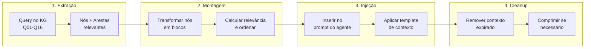
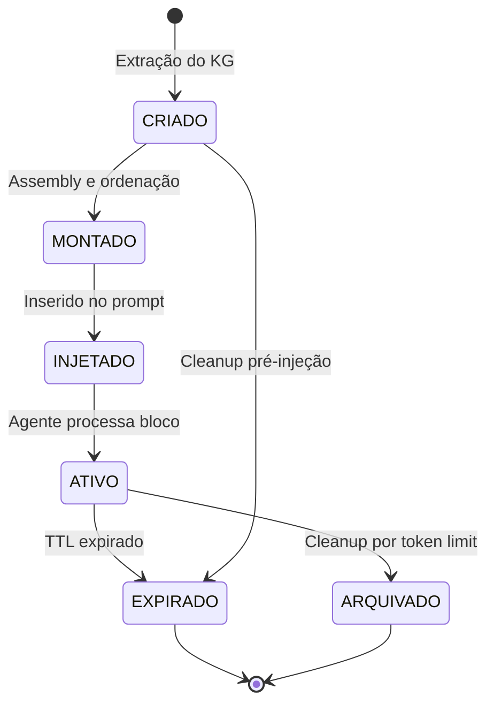

# APOS Context Model — Contexto para Agentes de IA (Camada 3.5)

**Documento:** CONTEXT_MODEL.md  
**Release:** R0 | **Sprint:** 0.5  
**Tarefa:** T0.5.1 — Modelo de contexto para agentes  
**Dependência:** KNOWLEDGE_GRAPH.md (estrutura do grafo), QUERY_PATTERNS.md (Q01–Q16)  
**Criado em:** 2026-07-21  
**Versão:** v0.1-draft

---

## Índice

1. [Introdução](#1-introdução)
2. [Pipeline Contexto](#2-pipeline-contexto)
3. [Estrutura de Contexto](#3-estrutura-de-contexto)
4. [Ciclo de Vida](#4-ciclo-de-vida)
5. [Relevância e Priorização](#5-relevância-e-priorização)
6. [Context Window Management](#6-context-window-management)
7. [Formatos de Saída](#7-formatos-de-saída)
8. [Exemplo Completo](#8-exemplo-completo)
9. [Referências](#9-referências)

---

## 1. Introdução

### 1.1 O Que É o Context Model do APOS

O **Context Model** define **como o Knowledge Graph se transforma em contexto consumível por agentes de IA**. Ele é a **ponte semântica** entre os dados estruturados do grafo (nós, arestas, URNs, pesos) e a janela de contexto limitada de um modelo de linguagem.

Enquanto o Knowledge Graph (Camada 3) responde _"o que está conectado a quê"_, o Context Model responde _"como apresentar essas conexões a um agente para que ele possa agir"_.

### 1.2 Posição nas Camadas

```
Camada 1: Ontologia          (conceitos + relações + restrições)
Camada 2: Semantic Layer     (regras de negócio + normalização)
Camada 3: Knowledge Graph    (dados conectados — nós + arestas)
Camada 3.5: Context Model   ← ESTE DOCUMENTO (ponte grafo → agente)
Camada 4: Catálogo de Dados  (linhagem + proveniência)
Camada 5: MCP                (transporte)
```

A Camada 3.5 é uma **camada conceitual** — não uma implementação separada, mas um conjunto de **procedimentos, formatos e algoritmos** que operam sobre o Knowledge Graph para gerar contexto.

### 1.3 Diferença entre Knowledge Graph e Context Model

| Aspecto | Knowledge Graph (KG) | Context Model (CM) |
|---------|---------------------|-------------------|
| **Natureza** | Estrutura de dados persistente | Pipeline de transformação sob demanda |
| **Conteúdo** | Nós, arestas, pesos, metadados | Blocos de contexto com relevância, prioridade, TTL |
| **Persistência** | Armazenamento contínuo (memória/banco) | Gerado sob demanda, expira após uso |
| **Destinatário** | Sistemas, queries, APIs | Agentes de IA (LLMs) |
| **Preocupação** | Integridade referencial (KG-001 a KG-012) | Otimização de janela de contexto, relevância |
| **Exemplo** | `KG.traverse("urn:apos:task:oauth-123", [cp, pd, al])` | `CM.build_context("urn:apos:task:oauth-123", max_tokens=4000)` |

### 1.4 Princípios de Design

1. **Fidelidade ao Grafo** — Todo contexto gerado deriva de dados reais do KG, sem alucinações.
2. **Eficiência de Tokens** — Cada token no contexto deve ter propósito; informação redundante ou de baixa relevância é removida.
3. **Rastreabilidade** — Cada bloco de contexto carrega sua origem (URN do nó fonte) e metadados de frescor.
4. **Decaimento Temporal** — Contexto envelhece; informação antiga perde prioridade ou é removida.
5. **Adaptabilidade** — O mesmo grafo pode gerar contextos diferentes para agentes diferentes (task agents, OKR agents, release agents).

---

## 2. Pipeline Contexto

O pipeline transforma dados do Knowledge Graph em contexto para o prompt do agente em 4 etapas:



### 2.1 Etapa 1 — Extração

A extração consulta o Knowledge Graph usando os padrões de navegação Q01–Q16 definidos em `QUERY_PATTERNS.md`. O contexto começa com um **nó âncora** (o nó sobre o qual o agente precisa agir) e expande radialmente.

**Algoritmo de Extração:**

```python
def extract_context(anchor_urn: str, depth: int = 2, kg: KnowledgeGraph) -> list[dict]:
    """
    Extrai contexto do KG a partir de uma URN âncora.

    Args:
        anchor_urn: URN do nó central do contexto.
        depth: Profundidade máxima de expansão (padrão: 2 saltos).
        kg: Instância do Knowledge Graph.

    Returns:
        Lista de dicts brutos com {urn, type, attributes, edges}.
    """
    raw_nodes = {}
    visited: set[str] = set()
    queue: list[tuple[str, int]] = [(anchor_urn, 0)]

    while queue:
        current_urn, current_depth = queue.pop(0)
        if current_urn in visited or current_depth > depth:
            continue
        visited.add(current_urn)

        node = kg.get_node(current_urn)
        if node is None:
            continue

        # Coleta arestas de entrada e saída
        out_edges = kg._get_outbound(current_urn)
        in_edges = kg._get_inbound(current_urn)

        raw_nodes[current_urn] = {
            "urn": current_urn,
            "type": node.type.value,
            "attributes": node.attributes,
            "metadata": {
                "created_at": node.metadata.created_at,
                "updated_at": node.metadata.updated_at,
                "version": node.metadata.version,
            },
            "out_edges": [
                {"target": e.target, "type": e.type.value, "weight": e.weight}
                for e in out_edges
            ],
            "in_edges": [
                {"source": e.source, "type": e.type.value, "weight": e.weight}
                for e in in_edges
            ],
        }

        # Expande para os vizinhos (próximo salto)
        if current_depth < depth:
            for e in out_edges:
                if e.target not in visited:
                    queue.append((e.target, current_depth + 1))
            for e in in_edges:
                if e.source not in visited:
                    queue.append((e.source, current_depth + 1))

    return list(raw_nodes.values())
```

**Estratégia de Queries por Tipo de Nó Âncora:**

| Tipo Âncora | Query Primária | Query Secundária | Profundidade |
|-------------|---------------|------------------|:------------:|
| Task | Q01 — Task → OKR | Q04 — Task → Sprint, Q06 — Bloqueios | 2-3 |
| Feature | Q02 — Feature → Métricas | Q05 → Personas, Q08 — Impacto remoção | 2-3 |
| Release | Q03 — Release Dashboard | Q05 → Personas | 1-3 |
| OKR | Q13 — Órfãos (reverse) | Q02 — Métricas vinculadas | 2 |
| Metric | Q12 — Órfãos (reverse) | Q07 — Tasks que impactam | 2 |
| Sprint | Q04 (reverse) — Tasks no Sprint | — | 1 |

### 2.2 Etapa 2 — Montagem

A montagem transforma os dados brutos extraídos em **blocos de contexto** estruturados (ver seção 3). Cada nó vira um bloco. A ordem de montagem segue:

1. **Nó âncora** — sempre primeiro (o "sobre o que" o agente está agindo)
2. **Relações diretas** — nós conectados por 1 aresta (features, sprints)
3. **Relações indiretas** — nós a 2+ saltos (OKRs, métricas, releases)
4. **Contexto suplementar** — trust scores, órfãos, alertas do grafo

```python
def assemble_context(raw_nodes: list[dict], anchor_urn: str) -> list[ContextBlock]:
    """
    Monta blocos de contexto a partir de dados brutos do KG.

    Args:
        raw_nodes: Lista de nós extraídos (formato da Etapa 1).
        anchor_urn: URN do nó âncora para ordenação.

    Returns:
        Lista de ContextBlock ordenados por relevância.
    """
    blocks: list[ContextBlock] = []

    for node_data in raw_nodes:
        block = ContextBlock(
            source=node_data["urn"],
            type=node_data["type"],
            content=format_node_content(node_data),
            metadata={
                "freshness": node_data["metadata"]["updated_at"],
                "version": node_data["metadata"]["version"],
            },
        )
        blocks.append(block)

    from datetime import datetime, timezone

    now = datetime.now(timezone.utc).isoformat()

    for block in blocks:
        score = calculate_relevance(
            block=block,
            anchor_urn=anchor_urn,
            freshness=block.metadata.get("freshness", now),
        )
        block.relevance = score

    blocks.sort(key=lambda b: b.relevance, reverse=True)
    return blocks
```

### 2.3 Etapa 3 — Injeção

A injeção insere os blocos de contexto montados no **system prompt** do agente. O contexto pode ser injetado de duas formas:

**a) Injeção Direta (System Prompt Rendered):**

O contexto é renderizado como parte do system prompt, antes da mensagem do usuário. Adequado para consultas únicas onde todo o contexto cabe na janela.

```
System: Você é um agente APOS. Abaixo está o contexto atual do grafo:

[Bloco 1 — Task: oauth-123]  (relevância: 0.95)
[Bloco 2 — Feature: faster-auth]  (relevância: 0.85)
[Bloco 3 — Sprint: s0-4]  (relevância: 0.72)

User: Qual o impacto de mudar a Task oauth-123 para "blocked"?
```

**b) Injeção por Referência (Tool/Function Calling):**

O agente recebe apenas referências (URNs) e decide quais blocos carregar via function calling. Adequado para workflows multi-turn onde o agente gerencia sua própria carga de contexto.

```
System: Você é um agente APOS. Contexto disponível:

  urn:apos:task:oauth-123       (Task)    — relevância 0.95
  urn:apos:feature:faster-auth  (Feature) — relevância 0.85
  urn:apos:sprint:s0-4          (Sprint)  — relevância 0.72

Use a ferramenta `load_context(urns: list[str])` para carregar blocos.
```

**Injeção via Template:**

```python
CONTEXT_TEMPLATE = """\
## Contexto do Grafo APOS

### Nó Âncora
{anchor_block}

### Relações Diretas
{direct_blocks}

### Relações Indiretas
{indirect_blocks}

### Trust Score do Grafo
{trust_summary}
"""

def inject_context(blocks: list[ContextBlock], template: str = CONTEXT_TEMPLATE) -> str:
    anchor = blocks[0] if blocks else None
    direct = [b for b in blocks[1:] if b.relevance >= 0.7]
    indirect = [b for b in blocks[1:] if 0.4 <= b.relevance < 0.7]

    return template.format(
        anchor_block=anchor.render() if anchor else "N/A",
        direct_blocks="\n".join(b.render() for b in direct) if direct else "Nenhuma",
        indirect_blocks="\n".join(b.render() for b in indirect) if indirect else "Nenhuma",
        trust_summary=_get_trust_summary(),
    )
```

### 2.4 Etapa 4 — Cleanup

O cleanup assegura que o contexto não ultrapasse os limites da janela e que informação expirada seja removida.

**Operações de Cleanup:**

| Operação | Gatilho | Ação |
|----------|---------|------|
| **Podagem** | Contexto > `max_tokens` | Remove blocos de menor relevância (bottom-N) |
| **Compressão** | Blocos individuais > `block_max_tokens` | Resume atributos de baixa prioridade |
| **Expurgo** | Bloco com `ttl_hours` expirado | Remove completamente |
| **Deduplicação** | URN duplicada detectada | Mantém apenas a mais recente |

```python
def cleanup_context(
    blocks: list[ContextBlock],
    max_tokens: int = 8000,
    block_max_tokens: int = 1500,
) -> list[ContextBlock]:
    """
    Limpa e otimiza a lista de blocos para caber na janela de contexto.

    Args:
        blocks: Lista ordenada de blocos.
        max_tokens: Limite total de tokens permitido.
        block_max_tokens: Limite de tokens por bloco individual.

    Returns:
        Lista filtrada e comprimida de blocos.
    """
    from datetime import datetime, timezone

    now = datetime.now(timezone.utc)

    # 1. Expurgo por TTL
    valid = []
    for b in blocks:
        ttl = b.metadata.get("ttl_hours")
        freshness = b.metadata.get("freshness")
        if ttl and freshness:
            age_hours = (now - datetime.fromisoformat(freshness)).total_seconds() / 3600
            if age_hours > ttl:
                continue  # bloco expirado
        valid.append(b)

    # 2. Deduplicação (mantém o mais recente)
    seen: dict[str, ContextBlock] = {}
    for b in valid:
        if b.source not in seen:
            seen[b.source] = b
        else:
            # Mantém o de maior relevância
            if b.relevance > seen[b.source].relevance:
                seen[b.source] = b
    deduped = list(seen.values())

    # 3. Ordena por relevância (decrescente)
    deduped.sort(key=lambda b: b.relevance, reverse=True)

    # 4. Podagem — remove blocos de baixa relevância até caber
    token_count = sum(b.estimate_tokens() for b in deduped)
    while token_count > max_tokens and len(deduped) > 1:
        removed = deduped.pop()  # remove o de menor relevância
        token_count = sum(b.estimate_tokens() for b in deduped)

    # 5. Compressão de blocos muito grandes
    for i, b in enumerate(deduped):
        if b.estimate_tokens() > block_max_tokens:
            deduped[i] = b.compress()

    return deduped
```

---

## 3. Estrutura de Contexto

### 3.1 Formato Padrão de um Bloco de Contexto

Cada entidade do grafo é representada como um **ContextBlock** — uma unidade autônoma de informação com estrutura fixa:

```json
{
  "source": "urn:apos:task:oauth-123",
  "type": "task",
  "relevance": 0.92,
  "content": {
    "title": "Implement OAuth Login",
    "status": "in_progress",
    "priority": "high",
    "story_points": 5,
    "owner": "agent-oauth",
    "description": "Implementar fluxo OAuth 2.0 com Google e GitHub"
  },
  "metadata": {
    "freshness": "2026-07-21T14:30:00Z",
    "ttl_hours": 24,
    "version": 3,
    "depth": 0
  }
}
```

### 3.2 Esquema do ContextBlock

| Campo | Tipo | Obrigatório | Descrição |
|-------|------|-------------|-----------|
| `source` | `str` (URN) | ✅ | URN do nó que originou este bloco |
| `type` | `enum` | ✅ | Tipo do nó: `task`, `feature`, `release`, `okr`, `metric`, `sprint`, `persona` |
| `relevance` | `float` [0.0, 1.0] | ✅ | Score de relevância calculado (ver seção 5) |
| `content` | `dict` | ✅ | Atributos do nó formatados para consumo do agente |
| `metadata` | `dict` | ✅ | Metadados do bloco (freshness, TTL, versão, profundidade) |

### 3.3 Metadados do Bloco

| Campo | Tipo | Obrigatório | Descrição | Exemplo |
|-------|------|-------------|-----------|---------|
| `freshness` | `str` (ISO 8601) | ✅ | Data da última atualização do nó no KG | `"2026-07-21T14:30:00Z"` |
| `ttl_hours` | `int` | ✅ | Horas até o bloco expirar (default: 24) | `24` |
| `version` | `int` | ✅ | Versão do nó no KG | `3` |
| `depth` | `int` | ✅ | Distância do nó âncora (0 = âncora) | `0` |
| `edge_type` | `str` | ❌ | Tipo de aresta que conecta ao nó âncora (se direto) | `"contribui_para"` |
| `edge_weight` | `float` | ❌ | Peso da aresta de conexão | `1.0` |

### 3.4 Representação em Python

```python
@dataclass
class ContextBlock:
    source: str                    # URN do nó
    type: str                      # Tipo do nó
    relevance: float               # Score de relevância [0.0, 1.0]
    content: dict                  # Atributos formatados
    metadata: dict                 # Freshness, TTL, versão, profundidade

    def estimate_tokens(self) -> int:
        """Estima o número de tokens deste bloco."""
        import json
        text = json.dumps(self.content, ensure_ascii=False)
        # Estimativa aproximada: 1 token ≈ 4 caracteres
        return len(text) // 4 + 20  # +20 para overhead do bloco

    def render(self, fmt: str = "markdown") -> str:
        """Renderiza o bloco em formato texto."""
        if fmt == "markdown":
            return self._to_markdown()
        elif fmt == "json":
            return self._to_json()
        return self._to_markdown()

    def compress(self) -> "ContextBlock":
        """Comprime o bloco mantendo apenas campos essenciais."""
        essential_keys = {"title", "name", "objective", "status",
                          "current_value", "target", "version"}
        compressed = {
            k: v for k, v in self.content.items()
            if k in essential_keys
        }
        if len(compressed) < len(self.content):
            compressed["_compressed"] = True
            compressed["_fields_removed"] = len(self.content) - len(compressed)
        return ContextBlock(
            source=self.source,
            type=self.type,
            relevance=self.relevance,
            content=compressed,
            metadata={**self.metadata, "compressed": True},
        )

    def _to_markdown(self) -> str:
        """Renderiza como Markdown."""
        lines = [
            f"**{self.type.upper()}:** `{self.source}`",
            f"  - Relevância: {self.relevance:.2f}",
        ]
        for key, value in self.content.items():
            lines.append(f"  - {key}: {value}")
        lines.append(f"  - Atualizado em: {self.metadata.get('freshness', 'N/A')}")
        return "\n".join(lines)

    def _to_json(self) -> str:
        """Renderiza como JSON."""
        import json
        return json.dumps({
            "source": self.source,
            "type": self.type,
            "relevance": self.relevance,
            "content": self.content,
            "metadata": self.metadata,
        }, ensure_ascii=False, indent=2)
```

---

## 4. Ciclo de Vida

### 4.1 Estados de um Bloco de Contexto



### 4.2 Parâmetros de Ciclo de Vida

| Parâmetro | Valor Padrão | Descrição |
|-----------|:------------:|-----------|
| `ttl_hours` | 24 (task), 48 (feature/release), 72 (okr/metric) | Tempo de vida do bloco em horas |
| `max_reuse` | 3 | Número máximo de vezes que o mesmo bloco é re-injetado |
| `archive_threshold` | 0.3 | Abaixo deste relevance, bloco é arquivado em vez de injetado |
| `stale_warning` | 12h antes do TTL expirar | Adiciona flag `stale: true` ao bloco |

### 4.3 Política de TTL por Tipo de Nó

| Tipo | TTL Padrão | Justificativa |
|------|:----------:|---------------|
| Task | 24h | Tasks mudam frequentemente (status, owner, blockers) |
| Feature | 48h | Features têm mudanças moderadas (completeness, status) |
| Release | 48h | Releases mudam com sprints e milestones |
| Sprint | 24h | Sprints ativos têm mudanças diárias |
| OKR | 72h | OKRs mudam semanalmente (status review) |
| Metric | 72h | Métricas mudam com coleta de dados |
| Persona | 168h (7d) | Personas raramente mudam |

### 4.4 Arquivo de Contexto

Blocos arquivados (removidos do prompt ativo) podem ser armazenados em um **cache de contexto** para reativação rápida:

```json
{
  "urn:apos:metric:login-time": {
    "last_injected": "2026-07-21T10:00:00Z",
    "injection_count": 3,
    "last_relevance": 0.45,
    "archived_at": "2026-07-21T10:30:00Z",
    "ttl_remaining_hours": 14
  }
}
```

---

## 5. Relevância e Priorização

### 5.1 Score de Relevância

O **relevance score** determina quais blocos entram no prompt quando a janela de contexto é limitada. É calculado como uma combinação ponderada de quatro fatores:

```python
def calculate_relevance(
    block: ContextBlock,
    anchor_urn: str,
    freshness: str,
    weight_distance: float = 0.35,
    weight_confidence: float = 0.25,
    weight_freshness: float = 0.25,
    weight_recency: float = 0.15,
) -> float:
    """
    Calcula o score de relevância de um bloco de contexto.

    Args:
        block: Bloco de contexto a avaliar.
        anchor_urn: URN do nó âncora.
        freshness: ISO 8601 da última atualização.
        weight_*: Pesos de cada fator (devem somar 1.0).

    Returns:
        Float entre 0.0 e 1.0.
    """
    from datetime import datetime, timezone

    now = datetime.now(timezone.utc)

    # 1. Score de Distância (quão perto do âncora)
    depth = block.metadata.get("depth", 99)
    if block.source == anchor_urn:
        distance_score = 1.0
    elif depth == 0:
        distance_score = 1.0  # âncora
    elif depth == 1:
        distance_score = 0.8
    elif depth == 2:
        distance_score = 0.5
    else:
        distance_score = 0.2

    # 2. Score de Confiança (pesos das arestas no caminho)
    edge_weight = block.metadata.get("edge_weight", 0.5)
    confidence_score = edge_weight

    # 3. Score de Frescor (quão recente é a atualização)
    try:
        updated = datetime.fromisoformat(freshness)
        age_hours = (now - updated).total_seconds() / 3600
        if age_hours <= 1:
            freshness_score = 1.0
        elif age_hours <= 24:
            freshness_score = 0.9 - (age_hours - 1) * (0.4 / 23)  # 0.9 → 0.5
        elif age_hours <= 72:
            freshness_score = 0.5 - (age_hours - 24) * (0.3 / 48)  # 0.5 → 0.2
        else:
            freshness_score = 0.1
    except (ValueError, TypeError):
        freshness_score = 0.5  # fallback para datas inválidas

    # 4. Score de Recência (frequência de acesso/blocos similares)
    # Blocos que foram acessados recentemente recebem boost
    recency_score = block.metadata.get("recency_boost", 0.5)

    # Score combinado
    relevance = (
        weight_distance * distance_score
        + weight_confidence * confidence_score
        + weight_freshness * freshness_score
        + weight_recency * recency_score
    )

    return round(min(max(relevance, 0.0), 1.0), 4)
```

### 5.2 Fatores de Relevância

| Fator | Peso Padrão | Descrição | Fórmula |
|-------|:-----------:|-----------|---------|
| **Distância** | 0.35 | Proximidade no grafo do nó âncora | 1.0 (âncora) → 0.2 (3+ saltos) |
| **Confiança** | 0.25 | Peso acumulado das arestas no caminho | `prod(w1 * w2 * ...)` |
| **Frescor** | 0.25 | Tempo desde a última atualização | 1.0 (<1h) → 0.1 (>72h) |
| **Recência** | 0.15 | Frequência de uso do bloco | 0.0–1.0 (tracking externo) |

### 5.3 Ordenação por Prioridade

Após calcular os scores, os blocos são ordenados em **3 tiers de prioridade**:

```python
# Constantes de prioridade
PRIORITY_TIERS = {
    "critical": (0.8, 1.0),   # Âncora + relações diretas de alto peso
    "high":     (0.5, 0.79),   # Relações indiretas relevantes
    "normal":   (0.0, 0.49),   # Contexto suplementar
}
```

**Regras de Prioridade:**

| Prioridade | Relevance Min | Ocupa Contexto | Pode Ser Comprimido | Removido Primeiro |
|:----------:|:-------------:|:--------------:|:-------------------:|:-----------------:|
| CRITICAL | ≥ 0.8 | Sempre | Não | Nunca |
| HIGH | ≥ 0.5 | Se couber | Sim | Depois de Normal |
| NORMAL | < 0.5 | Se couber | Sim | Sim |

### 5.4 Limite de Tokens por Tier

```python
TOKEN_LIMITS = {
    "critical": 0.50,  # 50% da janela para blocos críticos
    "high":     0.35,  # 35% para blocos de alta prioridade
    "normal":   0.15,  # 15% para contexto suplementar
}
```

**Exemplo para janela de 8000 tokens:**

| Tier | % da Janela | Tokens Alocados |
|:----:|:-----------:|:---------------:|
| Critical | 50% | 4000 |
| High | 35% | 2800 |
| Normal | 15% | 1200 |
| **Total** | **100%** | **8000** |

### 5.5 Pseudocódigo de Priorização

```python
def prioritize_blocks(
    blocks: list[ContextBlock],
    max_tokens: int = 8000,
    token_limits: dict[str, float] = None,
) -> list[ContextBlock]:
    """
    Prioriza blocos para caber na janela de contexto.

    1. Ordena por relevance score (decrescente)
    2. Aloca tokens por tier de prioridade
    3. Remove blocos de tiers inferiores se exceder limite
    """
    if token_limits is None:
        token_limits = TOKEN_LIMITS

    # Ordena por relevance
    sorted_blocks = sorted(blocks, key=lambda b: b.relevance, reverse=True)

    # Classifica por tier
    result: list[ContextBlock] = []
    tokens_used = 0

    for priority, (min_score, max_score) in PRIORITY_TIERS.items():
        tier_blocks = [
            b for b in sorted_blocks
            if min_score <= b.relevance <= max_score
        ]
        tier_tokens = 0
        tier_max = int(max_tokens * token_limits[priority])

        for block in tier_blocks:
            block_tokens = block.estimate_tokens()
            if tier_tokens + block_tokens <= tier_max:
                result.append(block)
                tier_tokens += block_tokens
                tokens_used += block_tokens
            else:
                break  # tier lotado

    # Garante que o nó âncora sempre esteja presente
    anchors = [b for b in sorted_blocks if b.relevance == 1.0]
    for anchor in anchors:
        if anchor not in result:
            result.insert(0, anchor)

    return result
```

---

## 6. Context Window Management

### 6.1 O Que Manter Sempre (Core Context)

O **Core Context** é o conjunto mínimo de blocos que SEMPRE devem estar no prompt do agente, independentemente de limite de tokens:

| Bloco | Motivo |
|-------|--------|
| Nó âncora | É o objeto da ação do agente |
| Nós com `bloqueia` incoming | Alertas de bloqueio ativo |
| Nós âncora com status `critical` ou `at_risk` | Requerem atenção imediata |
| Trust Score < 80% | Indica grafo não confiável |

**Core Context mínimo — limite de segurança:**

```python
CORE_CONTEXT_URNS = {
    "min_always": 1,      # Nó âncora
    "min_blockers": 5,    # Até 5 bloqueios relevantes
    "min_alerts": 3,      # Até 3 alertas de risco
}

def get_core_context(anchor_urn: str, kg: KnowledgeGraph) -> list[ContextBlock]:
    """Retorna o core context mínimo que sempre deve ser injetado."""
    core: list[ContextBlock] = []

    # 1. Nó âncora
    anchor_node = kg.get_node(anchor_urn)
    if anchor_node:
        core.append(ContextBlock(
            source=anchor_urn,
            type=anchor_node.type.value,
            relevance=1.0,
            content=anchor_node.attributes,
            metadata={"freshness": anchor_node.metadata.updated_at,
                      "depth": 0, "ttl_hours": 24},
        ))

    # 2. Bloqueios incoming (arestas bloqueia que chegam no âncora)
    blockers = kg._get_inbound(anchor_urn, EdgeType.BLOQUEIA)
    for edge in blockers[:CORE_CONTEXT_URNS["min_blockers"]]:
        blocker_node = kg.get_node(edge.source)
        if blocker_node:
            core.append(ContextBlock(
                source=edge.source,
                type="task",
                relevance=0.95,
                content=blocker_node.attributes,
                metadata={"freshness": blocker_node.metadata.updated_at,
                          "depth": 1, "ttl_hours": 12},
            ))

    # 3. Nós com status crítico
    for edge in kg._get_outbound(anchor_urn):
        target = kg.get_node(edge.target)
        if target and target.attributes.get("status") in ("critical", "at_risk"):
            core.append(ContextBlock(
                source=target.id,
                type=target.type.value,
                relevance=0.9,
                content=target.attributes,
                metadata={"freshness": target.metadata.updated_at,
                          "depth": 1, "ttl_hours": 12},
            ))

    return core
```

### 6.2 O Que Pode Ser Comprimido

Blocos de prioridade **HIGH** e **NORMAL** podem ser comprimidos quando o limite de tokens é atingido.

**O que é removido na compressão:**

| Campo | Ação na Compressão |
|-------|--------------------|
| `description` | Removido (pode ser recuperado sob demanda) |
| `acceptance_criteria` | Removido (mantido apenas se status = "blocked") |
| `tags` | Removido |
| `release_notes` | Removido |
| `formula` (metric) | Removido |
| `source` (metadata) | Removido |

**O que é mantido na compressão:**

| Campo | Mantido? |
|-------|:--------:|
| `title` / `name` / `objective` | ✅ |
| `status` | ✅ |
| `current_value` / `target` (metrics) | ✅ |
| `priority` | ✅ |
| `story_points` (tasks) | ✅ |
| `version` (release) | ✅ |
| `owner` | ✅ |

### 6.3 O Que Pode Ser Removido

Blocos que podem ser removidos primeiro quando a janela estourar:

| Critério de Remoção | Prioridade |
|---------------------|:----------:|
| Blocos com relevance < 0.3 | 🔴 Remove primeiro |
| Blocos com TTL expirado (> 72h sem atualização) | 🔴 Remove primeiro |
| Personas sem conexão direta com o âncora | 🟡 Remove em segundo |
| Métricas com status "healthy" e sem alertas | 🟡 Remove em segundo |
| Releases finalizadas (status = "shipped") | 🟢 Remove por último |
| Tasks concluídas (status = "done") sem blockers | 🟢 Remove por último |

### 6.4 Fallback — Quando Estourar o Limite

Quando mesmo o core context comprimido não cabe na janela, o sistema entra em **modo fallback**:

```python
def fallback_strategy(
    core: list[ContextBlock],
    max_tokens: int,
) -> tuple[list[ContextBlock], str]:
    """
    Estratégia de fallback quando o core context não cabe na janela.

    Returns:
        (blocos_reduzidos, modo_operação)
    """
    total_tokens = sum(b.estimate_tokens() for b in core)

    if total_tokens <= max_tokens:
        return core, "full"

    # Modo 1: Compressão máxima de todos os blocos
    compressed = [b.compress() for b in core]
    compressed_tokens = sum(b.estimate_tokens() for b in compressed)
    if compressed_tokens <= max_tokens:
        return compressed, "compressed"

    # Modo 2: Apenas sumário (sem atributos detalhados)
    summary = []
    for b in core:
        summary_block = ContextBlock(
            source=b.source,
            type=b.type,
            relevance=b.relevance,
            content={"status": b.content.get("status", "unknown"),
                     "_summary_only": True},
            metadata={**b.metadata, "summary_mode": True},
        )
        summary.append(summary_block)
    summary_tokens = sum(b.estimate_tokens() for b in summary)
    if summary_tokens <= max_tokens:
        return summary, "summary_only"

    # Modo 3: Apenas URNs (referências mínimas)
    urn_list = [b.source for b in core[:5]]  # Máximo 5 URNs
    return [
        ContextBlock(
            source="fallback",
            type="urn_list",
            relevance=0.0,
            content={"urns": urn_list,
                     "message": "Contexto excedeu limite de tokens — carregue URNs sob demanda"},
            metadata={"fallback": True},
        )
    ], "urns_only"
```

**Tabela de Modos de Operação:**

| Modo | Tokens (aprox.) | Informação Disponível | Uso |
|:----:|:---------------:|-----------------------|-----|
| Full | 6000–8000 | Atributos completos | Padrão |
| Compressed | 3000–5000 | Campos essenciais apenas | Limite moderado |
| Summary Only | 1000–2000 | Status + flags | Limite apertado |
| URNs Only | < 500 | Apenas URNs | Limite crítico |

---

## 7. Formatos de Saída

O Context Model suporta três formatos de saída para o contexto chegar ao agente, cada um com trade-offs diferentes.

### 7.1 Texto Plano (Markdown)

Formato mais legível para agentes que recebem contexto no system prompt como texto corrido.

**Template:**

```markdown
## Contexto APOS — Nó Âncora: {anchor_urn}

### 🎯 Informações Centrais
- **Tipo:** {type}
- **Status:** {status}
- **Prioridade:** {priority}
- **Responsável:** {owner}
- **Última atualização:** {freshness}

### 🔗 Conexões Diretas
| Tipo | URN | Status | Peso |
|------|-----|--------|:----:|
| Feature | urn:apos:feature:faster-auth | in_progress | 1.0 |
| Sprint | urn:apos:sprint:s0-4 | active | 1.0 |

### 📊 Impacto Estratégico
| OKR | Status | Métrica | Valor Atual | Target | Peso |
|-----|--------|---------|:-----------:|:------:|:----:|
| churn-5pct | on_track | login-time | 2.5s | 2.0s | 0.7 |

### ⚠️ Alertas
- Task oauth-123 está **blocked** — impacto crítico na métrica login-time
```

**Prós:** Máximo de informações em formato natural, fácil de parsear por LLMs.  
**Contras:** Consome mais tokens que JSON para a mesma informação.

### 7.2 JSON Estruturado

Formato ideal para agentes que usam function calling e preferem parsear contexto programaticamente.

```json
{
  "context": {
    "anchor": "urn:apos:task:oauth-123",
    "generated_at": "2026-07-21T14:30:00Z",
    "format": "json",
    "schema_version": "1.0"
  },
  "blocks": [
    {
      "source": "urn:apos:task:oauth-123",
      "type": "task",
      "relevance": 1.0,
      "content": {
        "title": "Implement OAuth Login",
        "status": "in_progress",
        "priority": "high",
        "story_points": 5,
        "owner": "agent-oauth"
      },
      "metadata": {
        "freshness": "2026-07-21T14:30:00Z",
        "ttl_hours": 24,
        "depth": 0
      }
    },
    {
      "source": "urn:apos:feature:faster-auth",
      "type": "feature",
      "relevance": 0.85,
      "content": {
        "name": "Faster Authentication",
        "status": "in_progress",
        "completeness": 0.75,
        "owner": "team-auth"
      },
      "metadata": {
        "freshness": "2026-07-20T14:00:00Z",
        "ttl_hours": 48,
        "depth": 1,
        "edge_type": "contribui_para",
        "edge_weight": 1.0
      }
    }
  ],
  "trust": {
    "coverage": 85.2,
    "quality": 99.6,
    "consistency": 70.0,
    "overall": 84.9,
    "classification": "GOOD"
  }
}
```

**Prós:** Parseável por código, menor consumo de tokens quando bem estruturado, suporta schema versioning.  
**Contras:** Menos natural para LLMs sem fine-tuning específico.

### 7.3 Template com Slots

Formato intermediário que combina a estrutura do JSON com a legibilidade do Markdown. O template é preenchido com os valores dos blocos de contexto.

```python
SLOT_TEMPLATE = """\
## Contexto APOS — Slot: {slot_name}

**Âncora:**
  URN: {anchor_urn}
  Tipo: {anchor_type}
  Status: {anchor_status}

**Atributos:**
{attributes_slot}

**Conexões:**
{connections_slot}

**Alertas:**
{alerts_slot}
"""

def fill_slot_template(
    slot_name: str,
    anchor_block: ContextBlock,
    related_blocks: list[ContextBlock],
    alerts: list[str],
) -> str:
    """Preenche um template com slots com os dados do contexto."""
    attrs = "\n".join(
        f"  - {k}: {v}"
        for k, v in anchor_block.content.items()
        if not k.startswith("_")
    )
    conns = "\n".join(
        f"  - [{b.type}] {b.source} (relevância: {b.relevance:.2f})"
        for b in related_blocks[:5]
    )
    alerts_text = "\n".join(f"  ⚠️ {a}" for a in alerts) if alerts else "  Nenhum"

    return SLOT_TEMPLATE.format(
        slot_name=slot_name,
        anchor_urn=anchor_block.source,
        anchor_type=anchor_block.type,
        anchor_status=anchor_block.content.get("status", "N/A"),
        attributes_slot=attrs,
        connections_slot=conns,
        alerts_slot=alerts_text,
    )
```

**Prós:** Balanceia legibilidade e estrutura, fácil de adaptar por tipo de agente.  
**Contras:** Requer manutenção de templates específicos.

### 7.4 Comparação de Formatos

| Aspecto | Markdown | JSON | Template com Slots |
|---------|:--------:|:----:|:------------------:|
| **Legibilidade para LLM** | ⭐⭐⭐ | ⭐⭐ | ⭐⭐⭐ |
| **Eficiência de Tokens** | ⭐⭐ | ⭐⭐⭐ | ⭐⭐ |
| **Parseabilidade** | ⭐ | ⭐⭐⭐ | ⭐⭐ |
| **Facilidade de Manutenção** | ⭐⭐⭐ | ⭐⭐⭐ | ⭐⭐ |
| **Suporte a Versionamento** | ⭐ | ⭐⭐⭐ | ⭐⭐ |
| **Custo Computacional** | Baixo | Médio | Médio |
| **Recomendado para** | Prompts diretos | Function calling | Workflows multi-agente |

---

## 8. Exemplo Completo

### Cenário: "Agente consulta Task-123, recebe contexto de Task, Feature, Release, OKR e Métricas relacionadas"

**Contexto:** Um agente de IA precisa entender o impacto de mudar a Task `urn:apos:task:oauth-123` de `in_progress` para `done`. O sistema monta o contexto completo usando o pipeline de 4 etapas.

### 8.1 Knowledge Graph (Dados de Origem)

```json
{
  "nodes": [
    {
      "id": "urn:apos:task:oauth-123",
      "type": "task",
      "attributes": {
        "title": "Implement OAuth Login",
        "status": "in_progress",
        "priority": "high",
        "story_points": 5,
        "owner": "agent-oauth"
      },
      "metadata": {
        "created_at": "2026-07-15T10:00:00Z",
        "updated_at": "2026-07-21T14:30:00Z",
        "version": 3
      }
    },
    {
      "id": "urn:apos:feature:faster-auth",
      "type": "feature",
      "attributes": {
        "name": "Faster Authentication",
        "status": "in_progress",
        "completeness": 0.75
      },
      "metadata": {
        "created_at": "2026-07-10T10:00:00Z",
        "updated_at": "2026-07-20T14:00:00Z",
        "version": 4
      }
    },
    {
      "id": "urn:apos:release:v2-1",
      "type": "release",
      "attributes": {
        "version": "2.1.0",
        "status": "in_progress",
        "date": "2026-07-31"
      },
      "metadata": {
        "created_at": "2026-07-01T08:00:00Z",
        "updated_at": "2026-07-20T10:00:00Z",
        "version": 5
      }
    },
    {
      "id": "urn:apos:okr:churn-5pct",
      "type": "okr",
      "attributes": {
        "objective": "Reduce customer churn by 5%",
        "status": "on_track",
        "current_value": 3.2,
        "target_value": 5.0
      },
      "metadata": {
        "created_at": "2026-06-15T08:00:00Z",
        "updated_at": "2026-07-20T09:00:00Z",
        "version": 6
      }
    },
    {
      "id": "urn:apos:metric:login-time",
      "type": "metric",
      "attributes": {
        "name": "Login Time",
        "unit": "seconds",
        "current_value": 2.5,
        "target": 2.0,
        "status": "at_risk"
      },
      "metadata": {
        "created_at": "2026-06-20T08:00:00Z",
        "updated_at": "2026-07-20T12:00:00Z",
        "version": 3
      }
    },
    {
      "id": "urn:apos:sprint:s0-4",
      "type": "sprint",
      "attributes": {
        "name": "Sprint 0.4",
        "status": "active",
        "goal": "Finalizar design do Knowledge Graph"
      },
      "metadata": {
        "created_at": "2026-07-20T08:00:00Z",
        "updated_at": "2026-07-21T08:00:00Z",
        "version": 1
      }
    }
  ],
  "edges": [
    {"source": "urn:apos:task:oauth-123", "target": "urn:apos:feature:faster-auth", "type": "contribui_para", "weight": 1.0},
    {"source": "urn:apos:feature:faster-auth", "target": "urn:apos:release:v2-1", "type": "parte_de", "weight": 1.0},
    {"source": "urn:apos:release:v2-1", "target": "urn:apos:okr:churn-5pct", "type": "alcanca", "weight": 0.7},
    {"source": "urn:apos:okr:churn-5pct", "target": "urn:apos:metric:login-time", "type": "medido_por", "weight": 1.0},
    {"source": "urn:apos:task:oauth-123", "target": "urn:apos:metric:login-time", "type": "impacta", "weight": 0.8},
    {"source": "urn:apos:task:oauth-123", "target": "urn:apos:sprint:s0-4", "type": "pertence_a", "weight": 1.0}
  ]
}
```

### 8.2 Etapa 1 — Extração (Profundidade 2)

O algoritmo extrai nós a partir de `urn:apos:task:oauth-123` com profundidade máxima 2:

| Salto | Nós Encontrados | Aresta |
|:-----:|-----------------|--------|
| 0 | `task:oauth-123` (âncora) | — |
| 1 | `feature:faster-auth` | contribui_para (w=1.0) |
| 1 | `metric:login-time` | impacta (w=0.8) |
| 1 | `sprint:s0-4` | pertence_a (w=1.0) |
| 2 | `release:v2-1` | parte_de (w=1.0) via Feature |
| 2 | `okr:churn-5pct` | alcanca (w=0.7) via Release |
| 2 | `metric:login-time` (já visitado) | medido_por (w=1.0) via OKR |

**Total de nós únicos extraídos:** 6 (task, feature, metric, sprint, release, okr)

### 8.3 Etapa 2 — Montagem

Cada nó vira um **ContextBlock**. Relevância calculada:

| Bloco | Tipo | Profundidade | Edge Weight | Frescor | Relevance |
|-------|------|:------------:|:-----------:|:-------:|:---------:|
| `task:oauth-123` | task | 0 | — | 1h | **1.0000** |
| `feature:faster-auth` | feature | 1 | 1.0 | 24h | **0.8625** |
| `metric:login-time` | metric | 1 | 0.8 | 26h | **0.7563** |
| `sprint:s0-4` | sprint | 1 | 1.0 | 6h | **0.8375** |
| `release:v2-1` | release | 2 | 1.0 | 28h | **0.6563** |
| `okr:churn-5pct` | okr | 2 | 0.7 | 29h | **0.5563** |

**Ordenação final:** task → feature → sprint → metric → release → okr

### 8.4 Etapa 3 — Injeção (Formato Markdown)

Contexto renderizado para o system prompt do agente:

```markdown
## Contexto APOS — Agente de Task

### 🎯 Nó Âncora: urn:apos:task:oauth-123
- **Tipo:** TASK
- **Título:** Implement OAuth Login
- **Status:** in_progress
- **Prioridade:** high
- **Story Points:** 5
- **Responsável:** agent-oauth
- **Versão:** 3 | **Atualizado:** 2026-07-21T14:30:00Z

### 🔗 Relações Diretas (profundidade 1)

**FEATURE:** urn:apos:feature:faster-auth
- Nome: Faster Authentication
- Status: in_progress
- Completude: 75%
- Conexão: contribui_para (peso: 1.0)

**SPRINT:** urn:apos:sprint:s0-4
- Nome: Sprint 0.4
- Status: active
- Goal: Finalizar design do Knowledge Graph
- Conexão: pertence_a (peso: 1.0)

**METRIC:** urn:apos:metric:login-time
- Nome: Login Time
- Valor Atual: 2.5s
- Target: 2.0s
- Status: at_risk ⚠️
- Conexão: impacta (peso: 0.8)

### 🔗 Relações Indiretas (profundidade 2)

**RELEASE:** urn:apos:release:v2-1
- Versão: 2.1.0
- Status: in_progress
- Data: 2026-07-31
- Conexão: feature:faster-auth → parte_de (peso: 1.0)

**OKR:** urn:apos:okr:churn-5pct
- Objetivo: Reduce customer churn by 5%
- Status: on_track
- Progresso: 3.2 / 5.0
- Conexão: release:v2-1 → alcanca (peso: 0.7)

### ⚠️ Alertas
- Métrica login-time está **at_risk** (2.5s > target 2.0s)
- Ao completar task, Feature faster-auth sobe para 100% de completude
- Impacto estimado na métrica: redução de ~0.5s no login-time

### 📊 Trust Score
- Coverage: 85.2% (🟡 YELLOW)
- Quality: 99.6% (🟢 GREEN)
- Consistency: 70.0% (🟡 YELLOW)
- Overall: 84.9 (🟡 GOOD)
```

### 8.5 Etapa 4 — Cleanup (Simulação)

**Cenário:** Janela de 4000 tokens (metade do padrão).

| Bloco | Tokens | Prioridade | Ação |
|-------|:------:|:----------:|------|
| `task:oauth-123` | 1200 | CRITICAL | Mantido (âncora) |
| `feature:faster-auth` | 800 | CRITICAL | Mantido |
| `sprint:s0-4` | 600 | CRITICAL | Mantido |
| `metric:login-time` | 500 | HIGH | Mantido (at_risk) |
| `release:v2-1` | 450 | HIGH | Comprimido (remove release_notes) |
| `okr:churn-5pct` | 450 | NORMAL | Comprimido (remove description) |

**Total estimado:** 1200 + 800 + 600 + 500 + 300 + 300 = **3700 tokens** ✅ (cabe na janela)

### 8.6 Exemplo de Interação do Agente

Com o contexto acima, o agente pode responder:

> **Agente:** Para completar a Task `oauth-123` (Implement OAuth Login), preciso:
> 1. Verificar se os acceptance criteria foram atendidos (login Google e GitHub)
> 2. Atualizar o status da task para `done` no KG
> 3. A Feature `faster-auth` passará de 75% para 100% de completude
> 4. A Release `v2-1` terá mais uma feature completa
> 5. Impacto esperado: Métrica `login-time` deve melhorar de 2.5s para ~2.0s
>
> **Risco:** Nenhum bloqueio detectado. A métrica `login-time` está `at_risk`, então
> completar esta task é prioritário para melhorar o indicador.

---

## 9. Referências

| Documento | Conteúdo |
|-----------|----------|
| **KNOWLEDGE_GRAPH.md** | Modelo formal do grafo (estrutura de nós, arestas, URNs, KG-001 a KG-012) |
| **QUERY_PATTERNS.md** | 16 padrões de navegação e inferência Q01–Q16 (traversal, impacto, órfãos, trust score) |
| **graph.py** | Implementação do `KnowledgeGraph` com `traverse()`, `infer_impact()`, `detect_orphans()` |
| **ONTOLOGY_FOUNDATIONS.md** | Definição formal de conceitos + relações (Camada 1) |
| **NODE_TYPES.md** | Catálogo detalhado dos 7 tipos de nó |
| **EDGE_TYPES.md** | Catálogo detalhado dos 10 tipos de aresta |

---

## Apêndice A — Resumo de Parâmetros

| Parâmetro | Padrão | Descrição |
|-----------|:------:|-----------|
| `extraction_depth` | 2 | Profundidade máxima de expansão no KG |
| `max_context_tokens` | 8000 | Limite total de tokens para contexto |
| `block_max_tokens` | 1500 | Limite de tokens por bloco individual |
| `relevance_distance_weight` | 0.35 | Peso da distância no relevance score |
| `relevance_confidence_weight` | 0.25 | Peso da confiança no relevance score |
| `relevance_freshness_weight` | 0.25 | Peso do frescor no relevance score |
| `relevance_recency_weight` | 0.15 | Peso da recência no relevance score |
| `critical_tier_pct` | 0.50 | % da janela para blocos críticos |
| `high_tier_pct` | 0.35 | % da janela para blocos high |
| `normal_tier_pct` | 0.15 | % da janela para blocos normal |
| `fallback_mode` | `"full"` | Modo de operação inicial |

## Apêndice B — Glossário

| Termo | Definição |
|-------|-----------|
| **ContextBlock** | Unidade atômica de contexto — um nó do KG formatado para o agente |
| **Nó Âncora** | Nó central sobre o qual o agente está agindo |
| **Relevance Score** | Métrica [0.0, 1.0] que determina a importância de um bloco |
| **Pipeline de Contexto** | Fluxo extração → montagem → injeção → cleanup |
| **Core Context** | Conjunto mínimo de blocos que sempre entra no prompt |
| **TTL (Time To Live)** | Tempo de validade de um bloco de contexto |
| **Compressão** | Redução de campos não-essenciais de um bloco |
| **Modo Fallback** | Estratégia alternativa quando o core não cabe na janela |
| **Cadeia Canônica** | T→F→R→O→M (Task → Feature → Release → OKR → Metric) |
| **Tier de Prioridade** | Classificação CRITICAL / HIGH / NORMAL para alocação de tokens |
