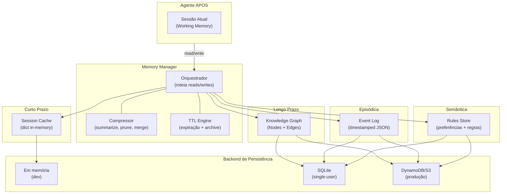
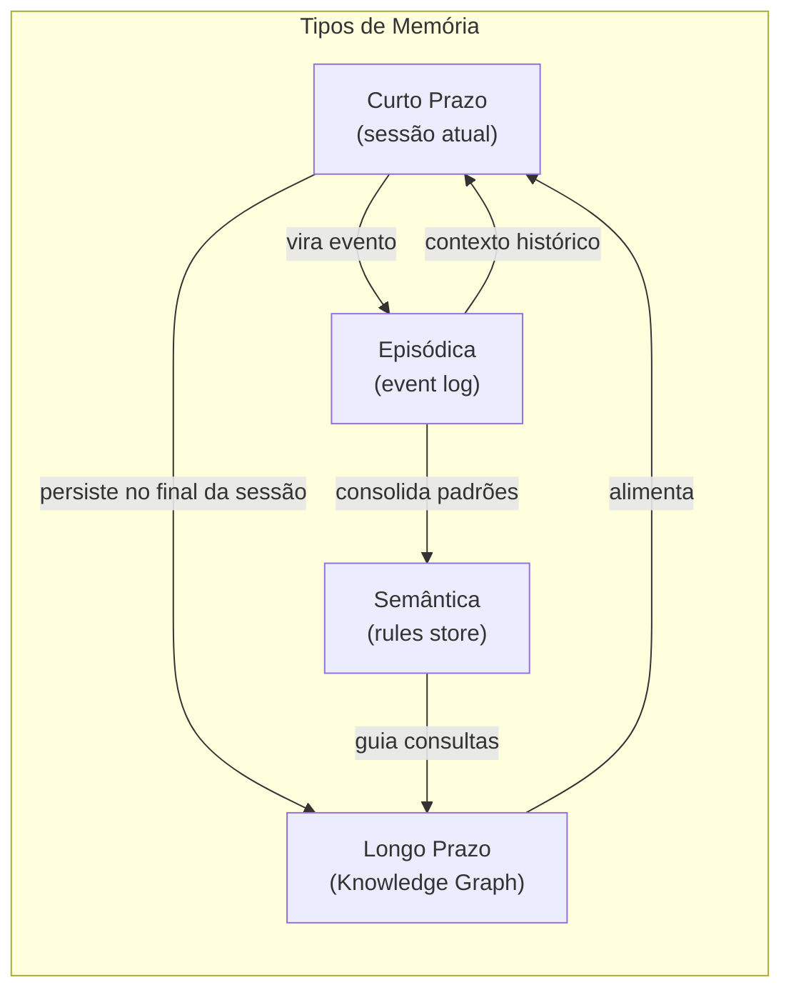
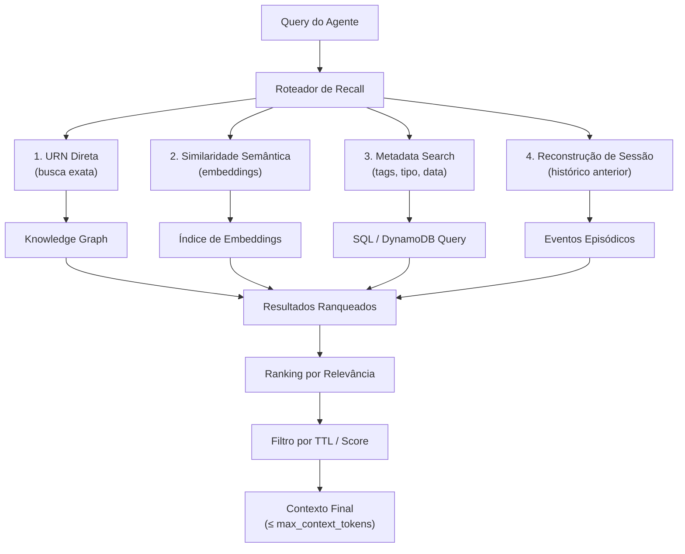
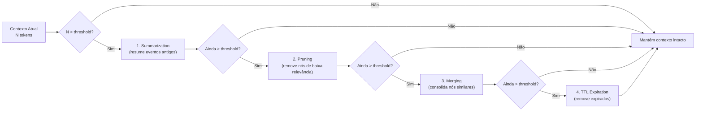
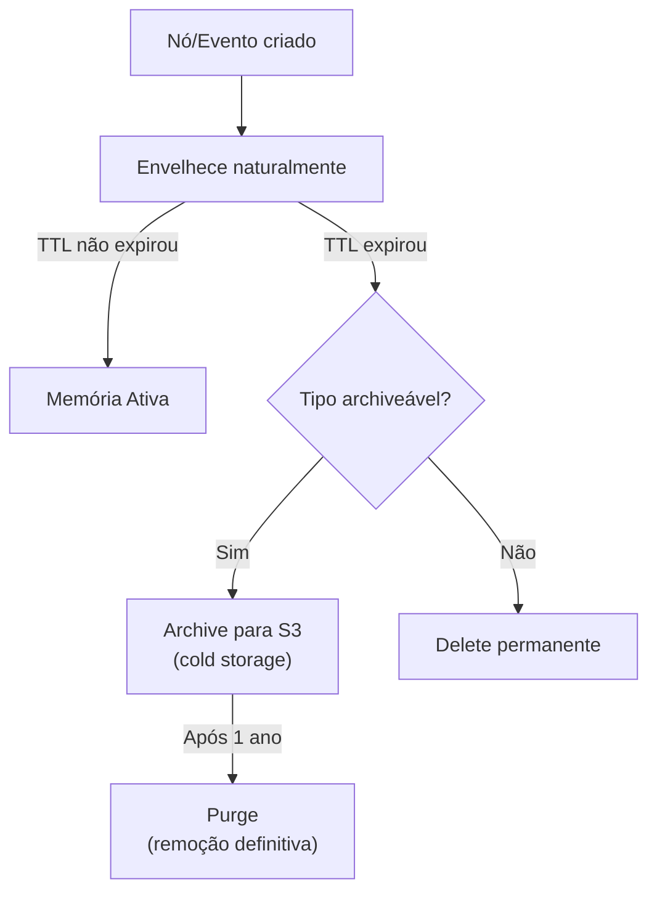
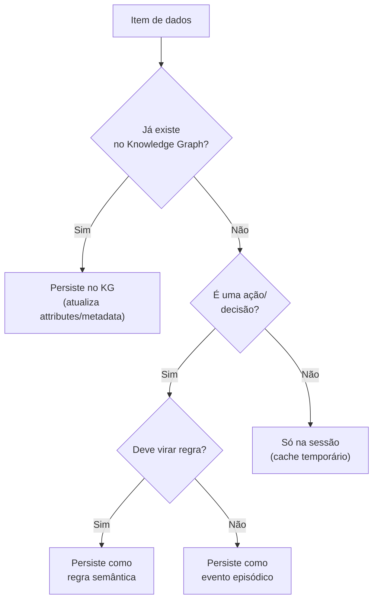
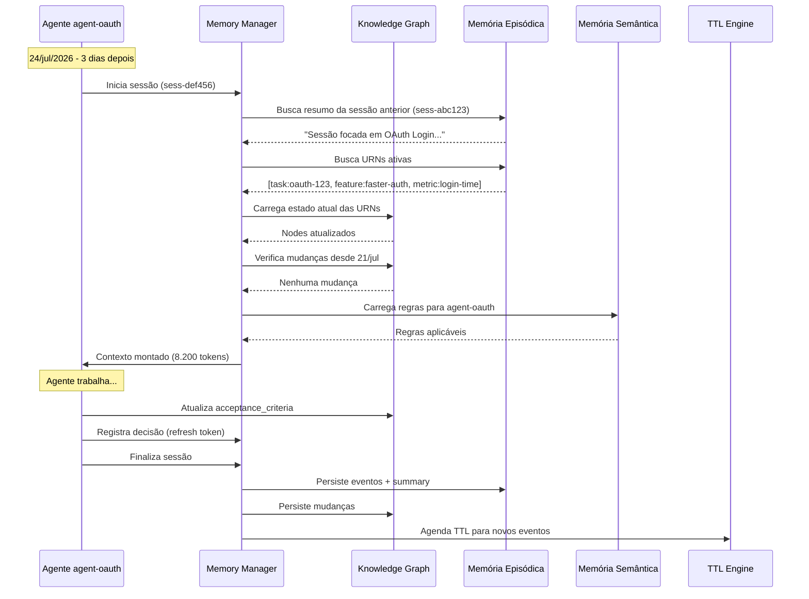

# APOS Memory Model — Sistema de Memória de Agentes

**Documento:** MEMORY_MODEL.md  
**Release:** R0 | **Sprint:** 0.5  
**Tarefa:** T0.5.2 — Modelo de memória: persistência, recall, compressão  
**Dependência:** KNOWLEDGE_GRAPH.md (estrutura do grafo), CONTEXT_MODEL.md (contexto de agentes)  
**Criado em:** 2026-07-21  
**Versão:** v0.1-draft

---

## Índice

1. [Introdução](#1-introdução)
2. [Arquitetura](#2-arquitetura)
3. [Persistência](#3-persistência)
4. [Recall](#4-recall)
5. [Compressão](#5-compressão)
6. [Esquecimento](#6-esquecimento)
7. [Sessão vs Persistente](#7-sessão-vs-persistente)
8. [Exemplo Completo](#8-exemplo-completo)

---

## 1. Introdução

### 1.1 O Que É a Memória do APOS

A **memória do APOS** é o sistema responsável por **persistir, recuperar e comprimir** o contexto entre sessões de agentes. Enquanto o **CONTEXT_MODEL.md** define *o que é o contexto* (como o grafo vira prompt para agentes), o MEMORY_MODEL.md define *como esse contexto sobrevive* entre rodadas de interação.

A memória resolve três perguntas fundamentais:

| Pergunta | Resposta no APOS |
|----------|-----------------|
| **Onde** os dados ficam armazenados? | Backend de persistência (memória, SQLite, DynamoDB) |
| **Como** recuperar o que é relevante? | Algoritmos de recall (URN direta, similaridade, metadata) |
| **Como** evitar que o contexto cresça infinitamente? | Compressão, pruning, TTL, LRU |

### 1.2 Diferença entre Contexto e Memória

| Aspecto | Contexto | Memória |
|---------|----------|---------|
| **Definição** | O que o agente vê na sessão atual | O que persiste entre sessões |
| **Escopo** | Prompt atual (janela de tokens) | Banco de dados (grafos, históricos) |
| **Tempo de vida** | Duração da sessão | Indefinido (até TTL/archive) |
| **Formato** | Texto/texto estruturado (markdown, JSON) | Grafo, embeddings, JSON, SQL |
| **Ferramenta** | `CONTEXT_MODEL.md` (montagem) | `MEMORY_MODEL.md` (armazenamento) |

### 1.3 Os 4 Tipos de Memória

O APOS define **4 tipos de memória**, cada um com função, formato e ciclo de vida distintos:

| Tipo | Função | Formato | Persistência | Exemplo |
|------|--------|---------|-------------|---------|
| **Curto Prazo (Working)** | Contexto ativo da sessão atual | Texto + URNs referenciadas | Volátil (sessão) | "Task oauth-123 está in_progress" |
| **Longo Prazo (Knowledge)** | Conhecimento consolidado e reutilizável | Knowledge Graph (Nodes + Edges) | Persistente (indefinido) | Grafo completo com 11 nós, 16 arestas |
| **Episódica (History)** | Histórico de interações timestamped | Lista de eventos (JSON) | Persistente (TTL 7-90d) | "2026-07-18: Agente moveu task para done" |
| **Semântica (Rules)** | Regras, preferências, conhecimento consolidado | Regras + configurações (JSON) | Persistente (indefinido) | "Sempre usar snake_case em atributos" |

---

## 2. Arquitetura

### 2.1 Visão Geral

A memória do APOS organiza-se em **4 camadas horizontais** que se comunicam através do **Memory Manager** — um orquestrador central que decide qual tipo de memória acessar para cada operação.



### 2.2 Memória de Curto Prazo (Working Memory)

**Função:** Armazenar o contexto ativo da sessão atual — o que o agente está processando agora.

**Características:**

| Propriedade | Valor |
|-------------|-------|
| **Tempo de vida** | Duração da sessão |
| **Capacidade** | Limitada pela janela de tokens do modelo (~8K-128K tokens) |
| **Formato** | Dict Python em memória (SessionCache) |
| **Persistência** | Nenhuma (volátil) |
| **Backend** | RAM do servidor/container |

**Conteúdo típico:**

```json
{
  "session_id": "sess-abc123",
  "active_urns": [
    "urn:apos:task:oauth-123",
    "urn:apos:feature:faster-auth",
    "urn:apos:metric:login-time"
  ],
  "current_focus": "Implementar OAuth login",
  "recent_queries": [
    "Quais tasks bloqueiam oauth-123?",
    "Qual o status da metric login-time?"
  ],
  "temporary_state": {
    "last_search_results": ["urn:apos:task:rate-limit", "urn:apos:task:session-mgmt"],
    "pending_decisions": ["Aprovar arquitetura OAuth"]
  },
  "token_estimate": 3420
}
```

### 2.3 Memória de Longo Prazo (Knowledge Graph)

**Função:** Conhecimento consolidado e reutilizável — o grafo em si.

**Características:**

| Propriedade | Valor |
|-------------|-------|
| **Tempo de vida** | Indefinido (até archive explícito) |
| **Capacidade** | Ilimitada (escala com backend) |
| **Formato** | Nodes + Edges (ver KNOWLEDGE_GRAPH.md) |
| **Persistência** | Completa |
| **Backend** | SQLite (dev), DynamoDB + S3 (produção) |

O Knowledge Graph é a **memória de longo prazo nativa do APOS**. Cada Node e Edge carrega metadados de `created_at`, `updated_at` e `version`, permitindo rastrear a evolução do conhecimento ao longo do tempo.

### 2.4 Memória Episódica (Event Log)

**Função:** Histórico timestamped de interações — *o que aconteceu, quando e com que resultado*.

**Características:**

| Propriedade | Valor |
|-------------|-------|
| **Tempo de vida** | TTL configurável (7-90 dias por tipo) |
| **Capacidade** | Limitada por TTL + archive |
| **Formato** | Lista de eventos JSON com timestamp |
| **Persistência** | Sim (com expiração) |
| **Backend** | SQLite (dev), DynamoDB (produção) |

**Schema de evento:**

```json
{
  "event_id": "evt-001",
  "session_id": "sess-abc123",
  "timestamp": "2026-07-21T10:30:00Z",
  "type": "state_change",
  "actor": "agent-oauth",
  "urns_affected": ["urn:apos:task:oauth-123"],
  "delta": {
    "field": "status",
    "old_value": "open",
    "new_value": "in_progress"
  },
  "reason": "Início da implementação do fluxo OAuth",
  "token_cost": 450
}
```

**Tipos de evento:**

| Tipo | Descrição | TTL padrão |
|------|-----------|-----------|
| `state_change` | Alteração de atributo em Node | 30d |
| `query_executed` | Consulta realizada no grafo | 7d |
| `decision_made` | Decisão registrada pelo agente | 90d |
| `error_occurred` | Erro ou falha | 90d |
| `context_assembled` | Contexto montado para agente | 7d |
| `compression_run` | Execução de compressão de memória | 30d |
| `session_summary` | Resumo gerado ao final da sessão | 90d |

### 2.5 Memória Semântica (Rules Store)

**Função:** Regras, preferências e conhecimento consolidado que independem de uma sessão específica.

**Características:**

| Propriedade | Valor |
|-------------|-------|
| **Tempo de vida** | Indefinido (mudança manual ou por aprendizado) |
| **Capacidade** | Pequena (< 10MB esperado) |
| **Formato** | JSON schema-validated |
| **Persistência** | Completa |
| **Backend** | SQLite (dev), DynamoDB (produção) |

**Conteúdo típico:**

```json
{
  "rules": [
    {
      "id": "rule-naming-001",
      "type": "convention",
      "description": "URNs devem usar lowercase-kebab-case",
      "scope": "all_nodes",
      "priority": 10,
      "source": "KNOWLEDGE_GRAPH.md §4.3",
      "created_at": "2026-07-21"
    },
    {
      "id": "rule-impact-001",
      "type": "inference",
      "description": "Task → Feature → Release → OKR → Metric é a cadeia canônica de impacto",
      "scope": "impact_analysis",
      "priority": 8,
      "source": "QUERY_PATTERNS.md §1.4",
      "created_at": "2026-07-21"
    }
  ],
  "preferences": {
    "default_ttl_tasks": "7d",
    "default_ttl_metrics": "90d",
    "max_episodic_events_per_session": 100,
    "compression_trigger_token_count": 6000,
    "recall_max_results": 20,
    "recall_min_score": 0.3
  },
  "agent_config": {
    "agent-oauth": {
      "focus_areas": ["auth", "security"],
      "preferred_format": "detailed",
      "max_context_tokens": 12000
    },
    "agent-infra": {
      "focus_areas": ["infra", "deploy", "monitoring"],
      "preferred_format": "concise",
      "max_context_tokens": 8000
    }
  }
}
```

### 2.6 Diagrama de Relacionamento entre os 4 Tipos



**Fluxo típico:**

1. Agente trabalha na **memória de curto prazo** (sessão)
2. Ao final da sessão, mudanças de estado são persistidas no **Knowledge Graph**
3. Interações relevantes viram **eventos** na memória episódica
4. Padrões recorrentes detectados viram **regras** na memória semântica
5. Na próxima sessão, o **recall** busca informações nos 3 tipos persistentes para reconstruir o contexto

---

## 3. Persistência

### 3.1 Formatos de Armazenamento

O APOS usa **3 formatos** de armazenamento, cada um adequado a um tipo de operação:

| Formato | Uso | Tipo de Memória | Vantagem |
|---------|-----|-----------------|----------|
| **JSON** | Eventos, regras, preferências | Episódica, Semântica | Legível, schema-flexível |
| **Embeddings** | Similaridade semântica para recall | Longo Prazo (índice) | Busca por significado, não por palavra |
| **Grafo (Nodes/Edges)** | Conhecimento estruturado conectado | Longo Prazo (KG) | Navegação relacional, inferência |

### 3.2 Backends

| Backend | Uso | Quando usar | Vantagens | Limitações |
|---------|-----|-------------|-----------|------------|
| **Em memória (dict)** | Curto prazo | Desenvolvimento local, testes | Velocidade máxima | Volátil, sem persistência |
| **SQLite** | Todos os tipos | Single-user, dev, prototipação | Zero config, ACID, portátil | Concorrência limitada, sem escala |
| **DynamoDB + S3** | Todos os tipos | Produção multi-agente | Escala horizontal, baixa latência, TTL nativo | Custo, complexidade operacional |

### 3.3 Schema de Armazenamento do Contexto

#### Tabela SQLite (dev)

```sql
-- Tabela principal do Knowledge Graph (longo prazo)
CREATE TABLE kg_nodes (
    urn TEXT PRIMARY KEY,
    node_type TEXT NOT NULL,
    attributes TEXT NOT NULL,       -- JSON
    metadata TEXT NOT NULL,         -- JSON
    embedding BLOB,                 -- Vector embedding (F32, 384d)
    created_at TEXT NOT NULL,
    updated_at TEXT NOT NULL,
    version INTEGER NOT NULL DEFAULT 1
);

CREATE TABLE kg_edges (
    source TEXT NOT NULL REFERENCES kg_nodes(urn),
    target TEXT NOT NULL REFERENCES kg_nodes(urn),
    edge_type TEXT NOT NULL,
    weight REAL NOT NULL DEFAULT 1.0 CHECK(weight >= 0.0 AND weight <= 1.0),
    metadata TEXT NOT NULL,         -- JSON
    created_at TEXT NOT NULL,
    updated_at TEXT NOT NULL,
    version INTEGER NOT NULL DEFAULT 1,
    PRIMARY KEY (source, target, edge_type)
);

-- Memória episódica
CREATE TABLE episodic_events (
    event_id TEXT PRIMARY KEY,
    session_id TEXT NOT NULL,
    timestamp TEXT NOT NULL,
    event_type TEXT NOT NULL,
    actor TEXT,
    urns_affected TEXT,             -- JSON array
    delta TEXT,                     -- JSON
    reason TEXT,
    token_cost INTEGER,
    expires_at TEXT NOT NULL        -- ISO 8601 para TTL
);

CREATE INDEX idx_episodic_timestamp ON episodic_events(timestamp);
CREATE INDEX idx_episodic_type ON episodic_events(event_type);
CREATE INDEX idx_episodic_actor ON episodic_events(actor);

-- Memória semântica
CREATE TABLE semantic_rules (
    rule_id TEXT PRIMARY KEY,
    rule_type TEXT NOT NULL,
    description TEXT NOT NULL,
    scope TEXT,
    priority INTEGER DEFAULT 5,
    payload TEXT NOT NULL,          -- JSON (regra completa)
    source TEXT,
    created_at TEXT NOT NULL,
    updated_at TEXT NOT NULL,
    version INTEGER NOT NULL DEFAULT 1
);

CREATE TABLE agent_preferences (
    agent_id TEXT PRIMARY KEY,
    preferences TEXT NOT NULL       -- JSON
);

-- Índice de busca textual (FTS5)
CREATE VIRTUAL TABLE kg_fts USING fts5(
    urn, node_type, attributes, content='kg_nodes'
);
```

#### Schema DynamoDB (produção)

```json
{
  "Tables": {
    "apos-kg-nodes": {
      "PartitionKey": "urn (S)",
      "SortKey": "node_type (S)",
      "GSI": [
        {"name": "type-index", "key": "node_type (S)"},
        {"name": "updated-index", "key": "updated_at (S)"}
      ],
      "TTL": "expires_at (opcional, N)"
    },
    "apos-kg-edges": {
      "PartitionKey": "source (S)",
      "SortKey": "target#edge_type (S)",
      "GSI": [
        {"name": "target-index", "key": "target (S)"}
      ],
      "TTL": "expires_at (opcional, N)"
    },
    "apos-episodic-events": {
      "PartitionKey": "event_type (S)",
      "SortKey": "timestamp (S)",
      "TTL": "expires_at (N, obrigatório)"
    },
    "apos-semantic-store": {
      "PartitionKey": "store_key (S)",
      "SortKey": "rule_id (S)"
    }
  }
}
```

### 3.4 Serialização do Grafo (JSON Export/Import)

O Knowledge Graph completo pode ser serializado para JSON — formato utilizado para backup, migração e sincronização entre backends:

```json
{
  "graph": {
    "version": 1,
    "exported_at": "2026-07-21T12:00:00Z",
    "node_count": 11,
    "edge_count": 16
  },
  "nodes": [
    {
      "id": "urn:apos:task:oauth-123",
      "type": "task",
      "attributes": { "title": "Implement OAuth Login", "status": "in_progress" },
      "metadata": { "created_at": "2026-07-15T10:00:00Z", "version": 3 }
    }
  ],
  "edges": [
    {
      "source": "urn:apos:task:oauth-123",
      "target": "urn:apos:feature:faster-auth",
      "type": "contribui_para",
      "weight": 1.0,
      "metadata": { "created_at": "2026-07-15T10:00:00Z", "version": 1, "confidence": 1.0 }
    }
  ],
  "episodic_events": [
    {
      "event_id": "evt-001",
      "timestamp": "2026-07-21T10:30:00Z",
      "type": "state_change",
      "delta": { "field": "status", "old_value": "open", "new_value": "in_progress" }
    }
  ],
  "semantic_rules": [
    {
      "rule_id": "rule-naming-001",
      "type": "convention",
      "description": "URNs devem usar lowercase-kebab-case",
      "payload": { "scope": "all_nodes", "pattern": "^[a-z0-9\\-]+$" }
    }
  ]
}
```

---

## 4. Recall

### 4.1 Visão Geral

O **recall** é o processo de recuperar informação relevante da memória para montar o contexto de uma sessão. O APOS implementa **4 métodos de recall**, usados em combinação:



### 4.2 Método 1: Query por URN Direta

**Descrição:** Busca exata por URN no Knowledge Graph. É o método mais rápido e preciso.

**Quando usar:** Quando o agente já sabe exatamente o que quer — "me dê a Task oauth-123".

**Pseudocódigo:**

```
FUNCTION recall_by_urn(urn: str) -> Node | None:
  // Busca direta no índice do KG
  node = kg_nodes.get(urn)
  
  IF node is None:
    RETURN null
  END IF
  
  // Enriquece com arestas adjacentes
  outbound = get_outbound(urn)
  inbound = get_inbound(urn)
  
  RETURN {
    "node": node,
    "outbound_edges": outbound,
    "inbound_edges": inbound
  }
```

**Exemplo:**

```
INPUT:  urn = "urn:apos:task:oauth-123"
OUTPUT: {
  "node": { "id": "urn:apos:task:oauth-123", "type": "task", ... },
  "outbound": [
    { "target": "urn:apos:feature:faster-auth", "type": "contribui_para" },
    { "target": "urn:apos:metric:login-time", "type": "impacta" }
  ],
  "inbound": []
}
```

### 4.3 Método 2: Search por Similaridade Semântica

**Descrição:** Usa embeddings para encontrar nós semanticamente similares a uma query em linguagem natural.

**Pipeline:**

1. Query em texto livre → Embedding (modelo: `all-MiniLM-L6-v2`, 384 dimensões)
2. Cosine similarity contra todos os embeddings de nós
3. Retorna top-K com score ≥ `recall_min_score` (default: 0.3)

**Quando usar:** Quando o agente não sabe a URN exata — "encontre tasks relacionadas a performance de login".

**Pseudocódigo:**

```
FUNCTION recall_by_semantic(query: str, top_k: int = 10, min_score: float = 0.3):
  // 1. Gera embedding da query
  query_embedding = embed(query)
  
  // 2. Busca por similaridade (cosine)
  results = vector_search(
    embedding=query_embedding,
    index="kg_nodes",
    top_k=top_k,
    min_score=min_score
  )
  
  // 3. Enriquece resultados
  enriched = []
  FOR result IN results:
    node = kg_nodes[result.urn]
    outbound = get_outbound(result.urn)
    enriched.append({
      "urn": result.urn,
      "type": node.node_type,
      "score": result.score,
      "snippet": extract_snippet(node),
      "outbound_count": len(outbound)
    })
  
  RETURN enriched
```

**Exemplo:**

```
INPUT:  query = "tasks de autenticação e login"
OUTPUT: [
  { "urn": "urn:apos:task:oauth-123", "type": "task",  "score": 0.87, "snippet": "Implement OAuth login..." },
  { "urn": "urn:apos:task:session-mgmt", "type": "task", "score": 0.72, "snippet": "Session Management..." },
  { "urn": "urn:apos:metric:login-time", "type": "metric", "score": 0.65, "snippet": "Login Time < 2s..." }
]
```

### 4.4 Método 3: Search por Metadata

**Descrição:** Filtra nós por metadados estruturados — tipo, tags, status, data.

**Quando usar:** Consultas estruturadas — "todas as tasks com status blocked", "features da release v2-1".

**Parâmetros de filtro:**

| Parâmetro | Tipo | Exemplo |
|-----------|------|---------|
| `node_type` | `str` | `"task"`, `"metric"` |
| `tags` | `list[str]` | `["auth", "security"]` |
| `status` | `str` | `"in_progress"`, `"blocked"` |
| `owner` | `str` | `"agent-oauth"` |
| `created_after` | `str` (ISO 8601) | `"2026-07-01T00:00:00Z"` |
| `updated_before` | `str` (ISO 8601) | `"2026-07-21T00:00:00Z"` |
| `priority` | `str` | `"high"`, `"critical"` |

**Exemplo:**

```
INPUT:  {
  "node_type": "task",
  "status": "blocked",
  "priority": "high"
}
OUTPUT: [
  { "urn": "urn:apos:task:some-blocked-task", "title": "Fix login redirect", ... }
]
```

### 4.5 Método 4: Reconstrução de Contexto de Sessões Anteriores

**Descrição:** Reconstrói o contexto de trabalho de sessões passadas, permitindo que o agente "retome de onde parou".

**Pipeline:**

```
FUNCTION reconstruct_session_context(session_id: str):
  // 1. Busca o summary da sessão anterior
  summary = get_session_summary(session_id)
  
  // 2. Busca últimas N mudanças de estado daquela sessão
  events = get_events(
    session_id=session_id,
    event_types=["state_change", "decision_made"],
    limit=20
  )
  
  // 3. Busca URNs que estavam ativas na sessão
  active_urns = get_active_urns_from_session(session_id)
  
  // 4. Monta contexto compacto
  context = {
    "session_id": session_id,
    "summary": summary,
    "active_urns": active_urns,
    "recent_changes": [
      {
        "urn": e.urns_affected[0],
        "field": e.delta.field,
        "from": e.delta.old_value,
        "to": e.delta.new_value
      }
      FOR e IN events
    ],
    "pending_decisions": get_pending_decisions(session_id)
  }
  
  RETURN context
```

**Exemplo de saída:**

```json
{
  "session_id": "sess-abc123",
  "summary": "Sessão focada em implementação OAuth. Task oauth-123 movida para in_progress. Decisão: usar library google-auth-library v2.0.",
  "active_urns": [
    "urn:apos:task:oauth-123",
    "urn:apos:feature:faster-auth"
  ],
  "recent_changes": [
    {
      "urn": "urn:apos:task:oauth-123",
      "field": "status",
      "from": "open",
      "to": "in_progress"
    }
  ],
  "pending_decisions": [],
  "timestamp": "2026-07-21T10:30:00Z"
}
```

### 4.6 Estratégia de Combinação (Recall Router)

O **Memory Manager** usa uma estratégia de combinação para decidir qual método de recall acionar:

```python
async def recall(context_query: RecallQuery) -> RecallResult:
    """Roteia a consulta para o(s) método(s) de recall apropriado(s)."""
    results = []
    
    # Método 1: Se for URN direta, vai direto ao KG
    if is_urn(context_query.query):
        node = await recall_by_urn(context_query.query)
        if node:
            results.append(node)
        return RecallResult(results, method="direct_urn")
    
    # Método 2: Sempre roda busca semântica em paralelo
    semantic_task = recall_by_semantic(
        context_query.query,
        top_k=context_query.max_results
    )
    
    # Método 3: Se tiver filtros de metadata, roda busca estruturada
    metadata_task = None
    if context_query.filters:
        metadata_task = recall_by_metadata(context_query.filters)
    
    # Método 4: Se for retomada de sessão, reconstrói contexto
    session_task = None
    if context_query.previous_session_id:
        session_task = reconstruct_session_context(
            context_query.previous_session_id
        )
    
    # Executa em paralelo
    tasks = [semantic_task]
    if metadata_task:
        tasks.append(metadata_task)
    if session_task:
        tasks.append(session_task)
    
    completed = await asyncio.gather(*tasks)
    
    # Mescla e ranqueia (fusion)
    for batch in completed:
        results.extend(batch)
    
    # Deduplica por URN, ordena por score
    return rank_and_deduplicate(results, max_tokens=context_query.max_tokens)
```

---

## 5. Compressão

### 5.1 Por Que Comprimir?

Sem compressão, a memória de curto prazo cresce indefinidamente e o contexto do agente excede a janela de tokens do modelo. A compressão garante que:

- O contexto **sempre caiba** na janela de tokens configurada
- Informação **antiga ou redundante** seja resumida ou removida
- O agente **não perca** informação crítica mesmo com contexto reduzido

### 5.2 Estratégia 1: Summarization

**Descrição:** Substituir sequências longas de eventos por um resumo conciso.

**Trigger:** Quando o contexto da sessão excede `compression_trigger_token_count` (default: 6000 tokens).

**Pipeline:**

```
FUNCTION summarize_events(events: list[Event], max_tokens: int):
  // 1. Agrupa eventos por tema/URN
  groups = group_by_urn(events)
  
  // 2. Para cada grupo, gera resumo
  summaries = []
  FOR group IN groups:
    summary = llm_summarize(
      prompt="Resuma as seguintes interações com esta entidade:",
      events=group.events,
      max_tokens=max_tokens // len(groups)
    )
    summaries.append(summary)
  
  // 3. Gera resumo geral
  overall = llm_summarize(
    prompt="Resuma as principais atividades desta sessão:",
    events=events,
    max_tokens=max_tokens - sum(len(s) FOR s IN summaries)
  )
  
  RETURN { "overall": overall, "per_entity": summaries }
```

**Exemplo de resultado:**

```
ANTES (12 eventos, 2400 tokens):
  evt-001: 10:00 - Task oauth-123 mudou de open para in_progress
  evt-002: 10:05 - Task oauth-123: acceptance_criteria atualizado
  evt-003: 10:15 - Query: "quais tasks impactam login-time?"
  evt-004: 10:20 - Task rate-limit: prioridade mudou de medium para high
  evt-005: 10:30 - Decisão: usar google-auth-library v2.0
  ...

DEPOIS (1 resumo, 180 tokens):
  "Sessão focada em task oauth-123 (OAuth Login): movida para in_progress,
   critérios de aceitação definidos, decisão de usar google-auth-library v2.0.
   Task rate-limit teve prioridade elevada para high."
```

### 5.3 Estratégia 2: Pruning

**Descrição:** Remover nós com baixa relevância para o contexto atual.

**Critérios de poda:**

| Critério | Descrição | Remover quando |
|----------|-----------|---------------|
| **Baixo weight** | Arestas com peso baixo | `edge.weight < 0.2` |
| **Sem conexão** | Nós sem arestas nos últimos N dias | `days_since_last_update > 30` |
| **Fora do escopo** | Nós de tipos não relevantes ao foco atual | Tipo não listado em `focus_areas` |
| **Baixa confiança** | Arestas com confidence baixo | `edge.metadata.confidence < 0.3` |

**Trigger:** Executado após summarization, quando ainda há excesso de tokens.

**Pseudocódigo:**

```
FUNCTION prune_context(context: Context, focus_urns: list[str]):
  // 1. Marca URNs no caminho de foco como "keep"
  keep = set(focus_urns)
  
  // 2. BFS a partir das URNs de foco (profundidade 2)
  FOR urn IN focus_urns:
    neighbors = get_neighbors(urn, depth=2, min_weight=0.3)
    keep.add(neighbors)
  
  // 3. Remove nós não mantidos
  pruned = [n FOR n IN context.nodes IF n.urn IN keep]
  
  // 4. Remove arestas cujas pontas foram removidas
  pruned_edges = [e FOR e IN context.edges 
                  IF e.source IN keep AND e.target IN keep]
  
  RETURN Context(nodes=pruned, edges=pruned_edges)
```

### 5.4 Estratégia 3: Merging

**Descrição:** Consolidar nós similares em um único nó com informações agregadas.

**Quando usar:** Quando múltiplos eventos ou nós se referem à mesma entidade lógica ou quando tags/atributos são redundantes.

**Critérios de merge:**

- URNs com mesmo prefixo e variações: `urn:apos:task:oauth-login` + `urn:apos:task:oauth-flow` → investigar se são a mesma task
- Nós com `type` idêntico e `title` similar (cosine > 0.85)
- Eventos episódicos consecutivos do mesmo tipo e actor

**Pseudocódigo:**

```
FUNCTION merge_similar_nodes(context: Context):
  candidates = find_similar_pairs(
    context.nodes,
    threshold=0.85,   // cosine similarity
    same_type=True
  )
  
  FOR pair IN candidates:
    merged = {
      "id": pair[0].id,            // mantém a primeira URN
      "type": pair[0].type,
      "attributes": merge_attributes(pair[0], pair[1]),
      "metadata": {
        "created_at": min(pair[0].created_at, pair[1].created_at),
        "updated_at": max(pair[0].updated_at, pair[1].updated_at),
        "version": max(pair[0].version, pair[1].version),
        "merged_from": [pair[0].id, pair[1].id]
      }
    }
    replace_node(context, pair[0].id, merged)
    remove_node(context, pair[1].id)
    redirect_edges(context, pair[1].id, pair[0].id)
  
  RETURN context
```

### 5.5 Estratégia 4: TTL-based Expiration

**Descrição:** Remover automaticamente nós e eventos cujo TTL expirou.

**Trigger:** Executado a cada início de sessão e/ou em background a cada 1 hora.

**Ver** [Seção 6 — Esquecimento](#6-esquecimento) para detalhes completos de TTL.

### 5.6 Pipeline Completo de Compressão



---

## 6. Esquecimento

### 6.1 Filosofia

No APOS, **esquecer é uma função do sistema**, não um bug. Memória infinita sem custo não existe — o esquecimento garante:

1. **Eficiência**: O contexto cabe na janela de tokens
2. **Relevância**: Informação obsoleta não polui o recall
3. **Custo**: Backends de armazenamento têm custo (DynamoDB, S3)
4. **Privacidade**: Dados antigos são arquivados ou removidos

### 6.2 TTL (Time-To-Live) por Tipo de Nó

TTL define **quanto tempo** um nó ou evento vive na memória ativa antes de ser arquivado ou removido.

| Tipo de Nó | TTL (ativo) | Ação ao expirar |
|------------|-------------|----------------|
| **Task** | 7 dias sem atualização | Archive para S3 (cold) |
| **Feature** | 30 dias sem atualização | Archive para S3 |
| **Release** | 30 dias após shipped | Archive para S3 |
| **OKR** | 90 dias após fim do quarter | Archive para S3 |
| **Métrica** | 90 dias | Archive para S3 |
| **Sprint** | 30 dias após completed | Archive para S3 |
| **Persona** | Indefinido (não expira) | — |
| **Evento episódico** (state_change) | 30 dias | Delete |
| **Evento episódico** (query) | 7 dias | Delete |
| **Evento episódico** (decision) | 90 dias | Archive para S3 |
| **Evento episódico** (error) | 90 dias | Archive para S3 |

**Regra geral:**

```
TTL(task) < TTL(feature) < TTL(release) < TTL(okr) = TTL(metric)
```

Quanto mais alto na cadeia canônica (Task → Feature → Release → OKR → Metric), mais longo o TTL, porque mudanças em níveis superiores são menos frequentes.

### 6.3 LRU (Least Recently Used) para Memória Curta

A memória de curto prazo usa uma política **LRU** com capacidade máxima em tokens.

**Parâmetros:**

| Parâmetro | Default | Descrição |
|-----------|---------|-----------|
| `max_short_term_tokens` | 4096 | Tamanho máximo da working memory |
| `lru_eviction_count` | 512 | Quantidade de tokens removidos por evicção |
| `lru_priority_boost` | 2.0 | Multiplicador de score para URNs ativas |

**Algoritmo:**

```
FUNCTION lru_evict(working_memory, max_tokens):
  WHILE token_count(working_memory) > max_tokens:
    // 1. Ordena entradas por last_access (mais antigo primeiro)
    entries = sort_by_last_access(working_memory.entries)
    
    // 2. Aplica boost para URNs ativas (foco atual)
    FOR entry IN entries:
      IF entry.urn IN working_memory.active_urns:
        entry.priority_score *= lru_priority_boost
    
    // 3. Remove a entrada de menor score
    to_remove = min(entries, key=priority_score)
    remove_entry(working_memory, to_remove.id)
  
  RETURN working_memory
```

### 6.4 Archive vs Delete

O APOS distingue **archive** de **delete**:

| Ação | Ocorre | Dados | Recuperável? |
|------|--------|-------|-------------|
| **Archive** | TTL expirou, dados podem ter valor futuro | Movido para S3 cold storage (JSON) | Sim (reimport manual) |
| **Delete** | TTL expirou, dados são descartáveis | Removido permanentemente | Não |

**Regras de archive vs delete:**

```
Archive: Task, Feature, Release, OKR, Metric, Sprint, Decision events, Error events
Delete:  Query events, State change events (após 30d), Session cache (após 7d)
Keep (indefinido): Persona, Semantic rules, Agent preferences
```

### 6.5 Política de Retenção (Visão Consolidada)



---

## 7. Sessão vs Persistente

### 7.1 O Que Vive Apenas na Sessão

| Item | Motivo | Exemplo |
|------|--------|---------|
| **Resultados de search** | Descartáveis, recalculáveis | "Top-5 tasks by priority" |
| **Estados temporários** | Só importam durante a interação | "Usuário está revisando a task X" |
| **Cache de queries** | Evita recalcular na mesma sessão | "Resultado da query Q01 para task Y" |
| **Rascunhos de decisão** | Não confirmados | "Considerei usar lib Z, mas ainda não decidi" |
| **Log de debug** | Relevante apenas para troubleshooting | "Tentativa de conexão falhou 3x" |
| **Contexto montado** | Reconstruído a cada sessão | "Prompt final do agente" |

### 7.2 O Que Persiste Entre Sessões

| Item | Onde | Exemplo |
|------|------|---------|
| **Knowledge Graph** | Longo prazo (DB) | Todos os Nodes + Edges |
| **Eventos episódicos** | Episódica (DB, com TTL) | "Task X mudou de status" |
| **Regras semânticas** | Semântica (DB) | "URNs devem ser lowercase-kebab-case" |
| **Preferências de agente** | Semântica (DB) | "Agente-oauth prefere formato detailed" |
| **Resumos de sessão** | Episódica (DB, 90d TTL) | "Sessão focada em OAuth Login" |

### 7.3 Mapa Decisão: O Que Persiste?



### 7.4 Fluxo de Vida: Sessão → Persistência

```
1. INÍCIO DA SESSÃO
   ├── Memory Manager carrega:
   │   ├── Knowledge Graph (full ou subgrafo relevante)
   │   ├── Últimos N eventos episódicos (do TTL ativo)
   │   └── Regras semânticas aplicáveis
   │
2. DURANTE A SESSÃO
   ├── Agente lê e escreve na working memory
   ├── Mudanças são bufferizadas (não persistem imediatamente)
   └── Checkpoints opcionais a cada N interações
   
3. FINAL DA SESSÃO
   ├── Mudanças no KG são persistidas (batched write)
   ├── Eventos episódicos são gerados
   ├── Resumo da sessão é gerado e armazenado
   ├── Compressão é executada se necessário
   └── Working memory é descartada

4. ENTRE SESSÕES
   ├── TTL Engine verifica expirações
   ├── Archive jobs movem dados para S3
   └── Compactação de índices (periódica)
```

---

## 8. Exemplo Completo

### 8.1 Cenário: "Agente Volta Após 3 Dias"

**Contexto:** O agente `agent-oauth` trabalhou na sprint 0.4 (21/jul), implementando OAuth Login. Agora, após 3 dias (24/jul), ele retoma o trabalho.

#### Passo 1: Inicialização da Sessão

```json
{
  "session_id": "sess-def456",
  "agent": "agent-oauth",
  "previous_session_id": "sess-abc123",
  "timestamp": "2026-07-24T09:00:00Z",
  "max_context_tokens": 12000,
  "focus_areas": ["auth", "security"]
}
```

#### Passo 2: Memory Manager Reconstrói Contexto

```python
# Pseudocódigo da reconstrução
context = {}

# 1. Carrega Summary da sessão anterior (memória episódica)
session_summary = recall_episodic(
    session_id="sess-abc123",
    event_type="session_summary"
)
# → "Sessão focada em OAuth Login. Task oauth-123 movida para in_progress.
#    Decisão: google-auth-library v2.0. A definir: arquitetura de refresh token."

# 2. Carrega URNs ativas (memória episódica)
active_urns = get_active_urns("sess-abc123")
# → ["urn:apos:task:oauth-123", "urn:apos:feature:faster-auth",
#    "urn:apos:metric:login-time"]

# 3. Carrega estado atual do KG (memória longa)
for urn in active_urns:
    node = recall_by_urn(urn)
    context[urn] = node

# 4. Carrega mudanças desde a última sessão (3 dias)
recent_events = recall_by_metadata({
    "updated_after": "2026-07-21T10:30:00Z",  # fim da última sessão
    "node_types": ["task", "feature", "metric"]
})
# Pode ser que tasks relacionadas tenham sido movidas por outros agentes

# 5. Carrega regras semânticas aplicáveis ao agente
rules = get_rules_for_agent("agent-oauth")
```

#### Passo 3: Contexto Montado para o Agente

```markdown
## Contexto da Sessão (24/jul/2026)

### Retomando de sessão anterior (21/jul)
**Foco:** OAuth Login
**Resumo:** Task oauth-123 está in_progress. Decisão tomada: usar google-auth-library v2.0.
**Pendente:** Definir arquitetura de refresh token.

### Estado Atual do Knowledge Graph (24/jul)

**Tasks ativas:**
- `urn:apos:task:oauth-123` — Implement OAuth Login | status: in_progress | owner: agent-oauth
- `urn:apos:task:rate-limit` — Add API Rate Limiting | status: open | owner: agent-infra
- `urn:apos:task:session-mgmt` — Session Management | status: done

**Feature:**
- `urn:apos:feature:faster-auth` — Faster Authentication | completeness: 75%

**Métrica de impacto:**
- `urn:apos:metric:login-time` — Login Time: 2.5s (target: 2.0s) ⚠️ at_risk

### Mudanças desde sua última sessão (3 dias)
*Nenhuma mudança detectada em tasks ou features desde 21/jul.*

### Regras Ativas
1. URNs: lowercase-kebab-case
2. Naming: snake_case em atributos
3. Cadeia de impacto: Task → Feature → Release → OKR → Metric
```

#### Passo 4: Compressão (Se Necessário)

```
Token count: 8,200 / 12,000 → OK (dentro do limite)
Compressão: NÃO acionada
```

#### Passo 5: Agente Trabalha

O agente continua de onde parou: define a arquitetura de refresh token, atualiza acceptance_criteria, e move a task adiante.

#### Passo 6: Final da Sessão

```python
# Gera eventos episódicos
events = [
    {
        "event_id": "evt-010",
        "type": "state_change",
        "actor": "agent-oauth",
        "urns_affected": ["urn:apos:task:oauth-123"],
        "delta": {"field": "acceptance_criteria", "new_value": ["...", "..."]}
    },
    {
        "event_id": "evt-011",
        "type": "decision_made",
        "actor": "agent-oauth",
        "delta": {"decision": "Arquitetura de refresh token: usar rotating tokens com 7d expiry"}
    }
]

# Gera resumo da sessão
session_summary = llm_summarize(events)
# → "Sessão definiu arquitetura de refresh token (rotating, 7d expiry),
#    acceptance_criteria da task oauth-123 finalizados."

# Persiste mudanças no KG
kg.batch_update([
    {"urn": "urn:apos:task:oauth-123", 
     "attributes.acceptance_criteria": ["Login com Google OK", "Login com GitHub OK", "Refresh token funcional"]}
])

# Persiste eventos
episodic_store.batch_insert(events)

# Persiste resumo
episodic_store.insert({
    "event_type": "session_summary",
    "session_id": "sess-def456",
    "summary": session_summary,
    "active_urns": active_urns,
    "timestamp": "2026-07-24T11:30:00Z",
    "ttl": "2026-10-22T11:30:00Z"  # 90 dias
})
```

### 8.2 Visualização do Fluxo Completo



---

## Apêndice A — Glossário

| Termo | Definição |
|-------|-----------|
| **Archive** | Movimentação de dados para cold storage (S3) após TTL |
| **Compressão** | Redução do tamanho do contexto via summarization, pruning, merging |
| **Embedding** | Vetor numérico que representa o significado semântico de um texto |
| **Evento episódico** | Registro timestamped de uma interação ou mudança de estado |
| **LRU** | Least Recently Used — política de evicção de cache |
| **Memory Manager** | Orquestrador central que gerencia leitura/escrita nos 4 tipos de memória |
| **Recall** | Processo de recuperar informação relevante da memória |
| **TTL** | Time-To-Live — tempo máximo que um dado permanece na memória ativa |
| **Working Memory** | Memória de curto prazo da sessão atual |

## Apêndice B — Referências

- **KNOWLEDGE_GRAPH.md** — Estrutura de nós, arestas e URNs (Sprint 0.4)
- **QUERY_PATTERNS.md** — Padrões de navegação Q01-Q16 (Sprint 0.4)
- **CONTEXT_MODEL.md** — Como o grafo vira contexto para agentes (Sprint 0.5, T0.5.1)
- **RETRIEVAL_STRATEGY.md** — Estratégia de recuperação detalhada (Sprint 0.5, T0.5.4)
- **CONTEXT_BOUNDARIES.md** — Fronteiras de contexto (Sprint 0.5, T0.5.3)
