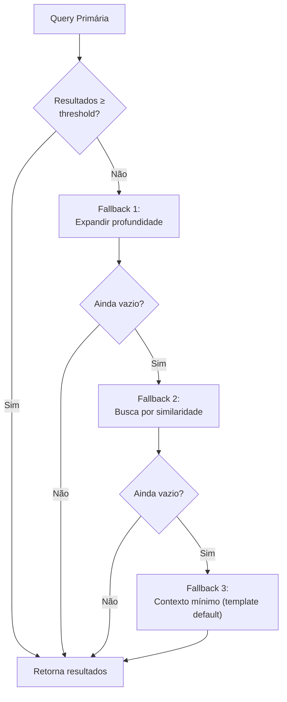
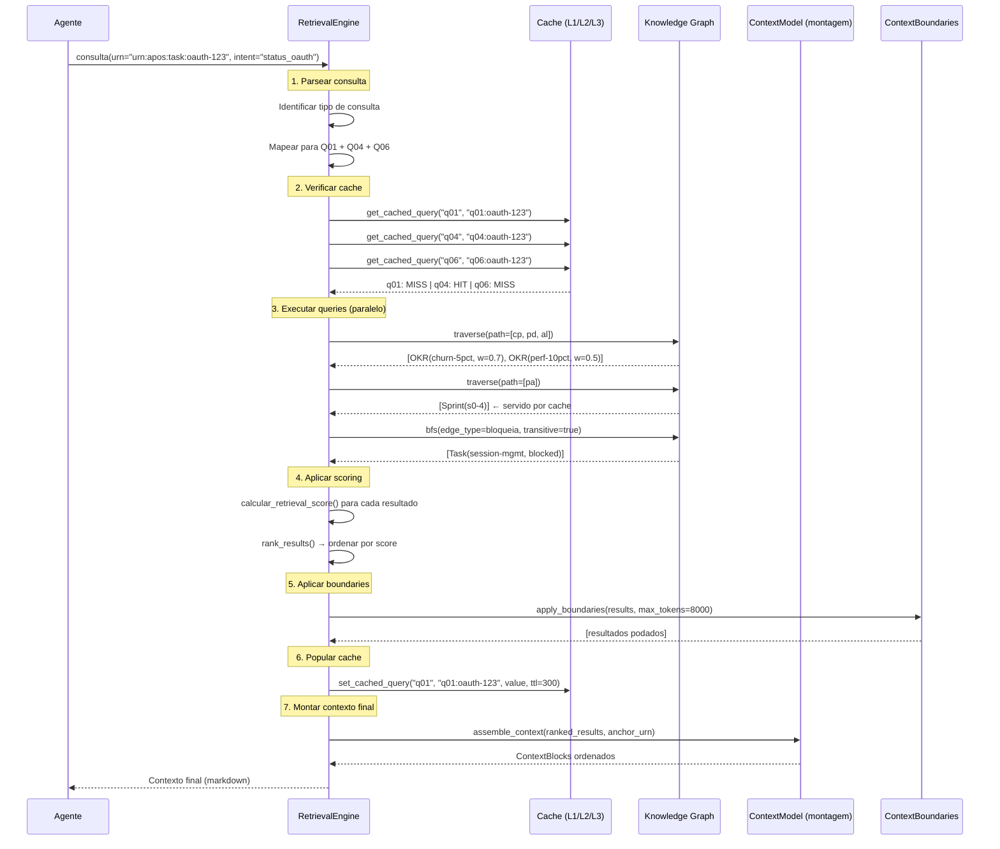

# APOS Retrieval Strategy — Estratégia de Recuperação de Contexto (Camada 3.5)

**Documento:** RETRIEVAL_STRATEGY.md  
**Release:** R0 | **Sprint:** 0.5  
**Tarefa:** T0.5.4 — Estratégia de recuperação de contexto  
**Dependência:** QUERY_PATTERNS.md (Q01–Q16), CONTEXT_MODEL.md, MEMORY_MODEL.md, CONTEXT_BOUNDARIES.md  
**Criado em:** 2026-07-21  
**Versão:** v0.1-draft

---

## Índice

1. [Introdução](#1-introdução)
2. [Queries Padrão](#2-queries-padrão)
3. [Caching](#3-caching)
4. [Relevância e Scoring](#4-relevância-e-scoring)
5. [Fallback](#5-fallback)
6. [Pipeline de Retrieval](#6-pipeline-de-retrieval)
7. [Exemplo Completo](#7-exemplo-completo)
8. [Referências](#8-referências)

---

## 1. Introdução

### 1.1 O Que É a Estratégia de Retrieval

A **Retrieval Strategy** define **como** o sistema consulta o Knowledge Graph para montar o contexto que os agentes de IA recebem. Enquanto:

- **CONTEXT_MODEL.md** define *o que é contexto* e *como ele é formatado* (blocos, pipeline, TTL)
- **MEMORY_MODEL.md** define *como o contexto persiste* entre sessões (armazenamento, recall, compressão)
- **KNOWLEDGE_GRAPH.md** define *o que está conectado a quê* (nós, arestas, URNs)

A **RETRIEVAL_STRATEGY.md** define **qual query executar, quando, com que cache, e o que fazer quando não há resultados**.

### 1.2 Posição na Arquitetura

```
  Pergunta do Agente
       ↓
  ┌──────────────────────────────────┐
  │  1. RECEPÇÃO                     │  ← RETRIEVAL_STRATEGY.md
  │     - Parsear consulta           │     (roteamento + queries)
  │     - Identificar URNs alvo      │
  └──────────┬───────────────────────┘
             ↓
  ┌──────────────────────────────────┐
  │  2. RETRIEVAL                    │  ← QUERY_PATTERNS.md (Q01-Q16)
  │     - Executar queries no KG     │     RETRIEVAL_STRATEGY.md (cache)
  │     - Aplicar cache              │
  └──────────┬───────────────────────┘
             ↓
  ┌──────────────────────────────────┐
  │  3. SCORING & RANKING            │  ← RETRIEVAL_STRATEGY.md
  │     - Calcular relevância        │     (scoring composto)
  │     - Ordenar resultados         │
  └──────────┬───────────────────────┘
             ↓
  ┌──────────────────────────────────┐
  │  4. BOUNDARIES                   │  ← CONTEXT_BOUNDARIES.md
  │     - Aplicar limites            │
  │     - Podar por token window     │
  └──────────┬───────────────────────┘
             ↓
  ┌──────────────────────────────────┐
  │  5. MONTAGEM                     │  ← CONTEXT_MODEL.md
  │     - Transformar em ContextBlock│     (templates + formatação)
  │     - Injetar no prompt          │
  └──────────────────────────────────┘
             ↓
      Contexto para o Agente
```

### 1.3 Princípios de Design

1. **Precisão sobre Cobertura** — É melhor retornar 3 nós altamente relevantes que 10 nós com relevância marginal.
2. **Cache Agressivo** — Queries frequentes (Task → OKR, Task → Sprint) têm cache de 5–10 minutos.
3. **Fallback Progressivo** — Quando a query primária falha, o sistema tenta estratégias progressivamente mais caras (expansão de profundidade → similaridade → contexto mínimo).
4. **Tracing Obrigatório** — Toda execução de query produz metadados de tracing (tempo de execução, cache hit/miss, nº de resultados) para depuração e otimização.

---

## 2. Queries Padrão

### 2.1 Mapa de Queries vs. Contexto

O sistema mapeia cada consulta do agente a um padrão Q01–Q16 do `QUERY_PATTERNS.md`. A escolha da query depende do **tipo de nó âncora** e da **intenção do agente**.

| Intenção do Agente | Query Primária | Descrição | Cache TTL |
|:------------------:|:--------------:|-----------|:---------:|
| "Qual o impacto da Task X?" | Q01 — Task → OKR | Navegação completa T→F→R→O | 5 min |
| "Quais métricas a Feature X impacta?" | Q02 — Feature → Métricas | Feature → Release → OKR → Metric | 10 min |
| "Qual o status da Release X?" | Q03 — Release Dashboard | Visão consolidada da Release | 10 min |
| "Em qual Sprint está a Task X?" | Q04 — Task → Sprint | Pertence_a → Sprint | 5 min |
| "Quem é impactado pela Feature X?" | Q05 — Persona → Features | Personas envolvidas | 30 min |
| "Task X está bloqueada — qual o risco?" | Q06 — Bloqueio → Métricas | Propagação de bloqueio até métricas | 5 min |
| "O que muda se a Task X for concluída?" | Q07 — Mudança de Task | Impacto com propagação ponderada | 5 min |
| "E se a Feature X for removida?" | Q08 — Feature Removida | Impacto de perda de escopo | 5 min |
| "Qual a cascata de bloqueio?" | Q09 — Propagação de Bloqueio | BFS transitivo | 5 min |
| "Há tasks sem feature?" | Q10 — Tasks Órfãs | Scan de nós soltos | 1 h |
| "Há features sem release?" | Q11 — Features Órfãs | Scan de nós soltos | 1 h |
| "Há métricas sem OKR?" | Q12 — Métricas Órfãs | Scan de nós soltos | 1 h |
| "Há OKRs sem release?" | Q13 — OKRs Órfãos | Scan de nós soltos | 1 h |
| "Qual a saúde do grafo?" | Q14–Q16 — Trust Score | Coverage, Quality, Consistency | 1 h |

### 2.2 Queries de Navegação (Q01–Q04)

#### Q01: Task → OKR (Navegação Completa)

**Uso típico:** Agente pergunta "qual o impacto estratégico desta Task?"

```
EXECUTAR:
  1. traverse(start=task_urn, path=[contribui_para, parte_de, alcanca])
  2. Para cada OKR encontrado, incluir: objective, status, alcanca_weight

CACHE KEY:  "q01:{task_urn}"
TTL:        5 min
MAX RESULTS: 10 OKRs por task
THRESHOLD:   alcanca_weight >= 0.2
```

**Exemplo de cache hit:**
```
CACHE KEY: "q01:urn:apos:task:oauth-123"
→ Hit! Retorna 2 OKRs (churn-5pct w=0.7, perf-10pct w=0.5)
→ Tempo: 0.3ms (vs. 4.2ms sem cache)
```

#### Q02: Feature → Métricas

**Uso típico:** Agente pergunta "quais métricas esta Feature impacta?"

```
EXECUTAR:
  1. traverse(start=feature_urn, path=[parte_de, alcanca, medido_por])
  2. Para cada métrica: name, current_value, target, status

CACHE KEY:  "q02:{feature_urn}"
TTL:        10 min
MAX RESULTS: 20 métricas por feature
```

#### Q03: Release → OKRs

**Uso típico:** Agente pergunta "qual o status da Release?"

```
EXECUTAR:
  1. traverse(start=release_urn, path=[alcanca, medido_por])
  2. traverse(target=release_urn, path=[parte_de])  (reverse para features)
  3. Para features: traverse(target=feature.id, path=[contribui_para]) (reverse para tasks)
  4. Agregar em dashboard

CACHE KEY:  "q03:{release_urn}"
TTL:        10 min
```

#### Q04: Task → Sprint

**Uso típico:** Agente pergunta "em qual Sprint está esta Task?"

```
EXECUTAR:
  1. traverse(start=task_urn, path=[pertence_a])

CACHE KEY:  "q04:{task_urn}"
TTL:        5 min
MAX RESULTS: 1 sprint (cardinalidade N:1)
```

### 2.3 Queries de Impacto (Q06–Q09)

#### Q06: Task Bloqueada → Métricas em Risco

```
EXECUTAR:
  1. Verificar status == "blocked" ou aresta bloqueia outgoing
  2. BFS transitivo por bloqueia (profundidade máxima: 5)
  3. Para cada task bloqueada: traverse(path=[cp, pd, al, mp])
  4. Classificar severidade por profundidade e peso

CACHE KEY:  "q06:{task_urn}"
TTL:        5 min
MAX RESULTS: 20 cadeias de bloqueio
```

#### Q07: Impacto de Mudança de Task

```
EXECUTAR:
  1. find_okrs_for_task(task_urn) (Q01)
  2. traverse(source=task_urn, edge_type="impacta", direction=OUT)
  3. Calcular impact_score = edge_weight * delta_metric

CACHE KEY:  "q07:{task_urn}:{change_type}:{new_value}"
TTL:        5 min (não armazenar em cache se change_type for imprevisível)
```

### 2.4 Queries de Detecção de Órfãos (Q10–Q13)

Estas queries são executadas **periodicamente** (a cada 1h) ou **sob demanda** quando o agente solicita uma verificação de saúde do grafo.

#### Q10: Tasks Órfãs

```
EXECUTAR:
  1. Scan de todos os nós type=task
  2. Filtrar: sem aresta contribui_para outgoing

CACHE KEY:  "q10"
TTL:        1 h
```

#### Q11: Features Órfãs

```
EXECUTAR:
  1. Scan de todos os nós type=feature
  2. Filtrar: sem aresta parte_de outgoing

CACHE KEY:  "q11"
TTL:        1 h
```

#### Q12: Métricas Órfãs

```
EXECUTAR:
  1. Scan de todos os nós type=metric
  2. Filtrar: sem aresta medido_por incoming

CACHE KEY:  "q12"
TTL:        1 h
```

#### Q13: OKRs Órfãos

```
EXECUTAR:
  1. Scan de todos os nós type=okr
  2. Filtrar: sem aresta alcanca incoming

CACHE KEY:  "q13"
TTL:        1 h
```

### 2.5 Queries de Trust Score (Q14–Q16)

#### Q14: Coverage

```
EXECUTAR:
  1. Para cada tipo de nó (task, feature, release, okr, metric, sprint, persona):
     - total = count(type)
     - linked = count(type WITH aresta obrigatória)
     - coverage = linked / total * 100
  2. Média ponderada

CACHE KEY:  "q14"
TTL:        1 h
```

#### Q15: Quality

```
EXECUTAR:
  1. Verificar KG-006: todas as sources de arestas existem como nós
  2. Verificar KG-007: todos os targets de arestas existem como nós
  3. quality = (valid_source + valid_target) / (2 * total_edges) * 100

CACHE KEY:  "q15"
TTL:        30 min
```

#### Q16: Consistency

```
EXECUTAR:
  1. Verificar KG-011: Feature shipped → Release shipped
  2. Verificar task done → dependente não blocked
  3. Detectar ciclos de bloqueio
  4. Verificar métrica status × current_value vs target

CACHE KEY:  "q16"
TTL:        30 min
```

---

## 3. Caching

### 3.1 TTL por Tipo de Query

O cache é essencial para evitar consultas repetidas ao Knowledge Graph, especialmente em sessões multi-turn onde o agente faz múltiplas perguntas sobre o mesmo contexto.

| Query | TTL | Justificativa | Frequência Esperada |
|:-----:|:---:|---------------|:-------------------:|
| Q01 — Task → OKR | 5 min | Tasks mudam frequentemente; 5 min equilibra frescor e desempenho | Alta (toda task) |
| Q02 — Feature → Métricas | 10 min | Features mudam menos que tasks | Média |
| Q03 — Release Dashboard | 10 min | Releases mudam com sprints | Média |
| Q04 — Task → Sprint | 5 min | Sprints ativos mudam diariamente | Alta |
| Q05 — Persona → Features | 30 min | Personas raramente mudam | Baixa |
| Q06 — Bloqueio → Métricas | 5 min | Bloqueios mudam rápido | Média |
| Q07 — Mudança de Task | 5 min* | *Cache apenas se change_type é idempotente | Baixa |
| Q08 — Feature Removida | 5 min | Cenário de mudança de escopo | Baixa |
| Q09 — Propagação de Bloqueio | 5 min | Cadeias de bloqueio mudam rápido | Média |
| Q10 — Tasks Órfãs | 1 h | Scan caro; só muda com add/remove de nós | Baixa (periódica) |
| Q11 — Features Órfãs | 1 h | Scan caro | Baixa (periódica) |
| Q12 — Métricas Órfãs | 1 h | Scan caro | Baixa (periódica) |
| Q13 — OKRs Órfãos | 1 h | Scan caro | Baixa (periódica) |
| Q14 – Coverage | 1 h | Trust Score muda lentamente | Baixa (periódica) |
| Q15 – Quality | 30 min | Integridade referencial | Baixa (periódica) |
| Q16 – Consistency | 30 min | Inconsistências | Baixa (periódica) |

### 3.2 Arquitetura de Cache

```
┌──────────────────────────────┐
│      Camada de Cache         │
├──────────────────────────────┤
│  L1: Local (memória)         │  ← dict em processo, µs
│  L2: Distribuído (Redis)     │  ← ms, compartilhado entre agentes
│  L3: Persistente (DynamoDB)  │  ← fallback, para queries de scan (Q10-Q16)
└──────────────────────────────┘
```

#### L1 — Cache Local (Memória)

**Formato:** `dict[str, CacheEntry]` em memória no processo do agente.

```python
@dataclass
class CacheEntry:
    key: str
    value: Any
    ttl_seconds: int
    created_at: datetime
    hit_count: int = 0

    @property
    def is_expired(self) -> bool:
        return (datetime.now(timezone.utc) - self.created_at).total_seconds() > self.ttl_seconds
```

**Características:**
- Latência: < 1 µs
- Capacidade: 10.000 entradas (LRU eviction)
- Escopo: Sessão do agente
- Evicção: LRU quando > 10.000 entradas

#### L2 — Cache Distribuído (Redis)

**Quando usar:** Quando múltiplos agentes compartilham o mesmo contexto (ex: dois agentes perguntam o status da mesma Release).

```python
REDIS_CACHE_CONFIG = {
    "host": "localhost",
    "port": 6379,
    "db": 0,
    "default_ttl": 300,  # 5 min
    "key_prefix": "apos:retrieval:",
    "max_memory": "512mb",
    "eviction_policy": "allkeys-lru",
}
```

**Características:**
- Latência: 1–5 ms
- Capacidade: 512 MB
- Escopo: Global (todos os agentes)
- Evicção: LRU com política `allkeys-lru`

#### L3 — Cache Persistente (DynamoDB)

**Quando usar:** Queries de scan (Q10–Q16) que são caras e cujos resultados mudam lentamente.

```json
{
  "TableName": "apos-retrieval-cache",
  "PartitionKey": "query_type (S)",
  "SortKey": "query_key (S)",
  "TTL": "expires_at (N)",
  "GSI": [
    {"name": "type-index", "key": "query_type (S)"}
  ]
}
```

**Características:**
- Latência: 10–50 ms
- Capacidade: Ilimitada (escala horizontal)
- Escopo: Global, persistente entre reinicializações

### 3.3 Política de Cache

#### Leitura

```python
async def get_cached_query(query_type: str, query_key: str) -> Optional[Any]:
    """Busca resultado do cache (L1 → L2 → L3)."""

    full_key = f"{query_type}:{query_key}"

    # L1: Memória local
    entry = local_cache.get(full_key)
    if entry and not entry.is_expired:
        entry.hit_count += 1
        return entry.value

    # L2: Redis
    try:
        redis_value = await redis.get(f"{REDIS_PREFIX}{full_key}")
        if redis_value:
            # Popula L1
            value = json.loads(redis_value)
            local_cache[full_key] = CacheEntry(
                key=full_key, value=value,
                ttl_seconds=QUERY_TTLS.get(query_type, 300),
                created_at=datetime.now(timezone.utc),
            )
            return value
    except ConnectionError:
        pass  # Redis indisponível, tenta L3

    # L3: DynamoDB (apenas queries de scan)
    if query_type in ("q10", "q11", "q12", "q13", "q14", "q15", "q16"):
        ddb_value = await dynamodb_get(retrieval_cache_table, query_type, full_key)
        if ddb_value:
            return ddb_value

    return None
```

#### Escrita

```python
async def set_cached_query(query_type: str, query_key: str, value: Any, ttl: int = None):
    """Armazena resultado no cache (L1 + L2, e L3 para queries de scan)."""

    full_key = f"{query_type}:{query_key}"
    ttl = ttl or QUERY_TTLS.get(query_type, 300)

    # L1: Sempre
    local_cache[full_key] = CacheEntry(
        key=full_key, value=value,
        ttl_seconds=ttl,
        created_at=datetime.now(timezone.utc),
    )

    # L2: Redis (best-effort)
    try:
        await redis.setex(
            f"{REDIS_PREFIX}{full_key}",
            ttl,
            json.dumps(value, default=str),
        )
    except ConnectionError:
        pass

    # L3: DynamoDB (apenas queries de scan)
    if query_type in ("q10", "q11", "q12", "q13", "q14", "q15", "q16"):
        await dynamodb_put(retrieval_cache_table, {
            "query_type": query_type,
            "query_key": full_key,
            "value": value,
            "expires_at": int(time.time()) + ttl,
        })
```

#### Invalidação

O cache é invalidado quando o Knowledge Graph sofre mutações que afetam o resultado de uma query:

| Mutação no KG | Queries Invalidadas | Ação |
|---------------|:-------------------:|------|
| Nó adicionado/removido | Q10–Q16 (scans) | Remove entrada de scan do cache |
| Aresta `contribui_para` alterada | Q01, Q06, Q07, Q10 | Remove por URN da task |
| Aresta `parte_de` alterada | Q02, Q03, Q08, Q11 | Remove por URN da feature/release |
| Aresta `alcanca` alterada | Q01, Q02, Q03, Q13 | Remove por URN da release/okr |
| Aresta `medido_por` alterada | Q02, Q03, Q12 | Remove por URN do okr/metric |
| Aresta `bloqueia` alterada | Q06, Q09 | Remove por URN da task |
| Aresta `pertence_a` alterada | Q04 | Remove por URN da task |
| Aresta `envolve` alterada | Q05 | Remove por URN da persona |
| Atributo de nó alterado (status, priority) | Q01–Q09 (resultados dependem de status) | Remove todas as queries envolvendo a URN |
| Qualquer mutação | Q14–Q16 (trust score) | Remove todos os trust scores |

```python
async def invalidate_cache_for_urn(urn: str, mutation_type: str):
    """Invalida entradas de cache afetadas por uma mutação no KG."""

    # Mapa: tipo de mutação → lista de chaves de query a invalidar
    INVALIDATION_MAP = {
        "node_added":      ["q10", "q11", "q12", "q13", "q14", "q15", "q16"],
        "node_removed":    ["q10", "q11", "q12", "q13", "q14", "q15", "q16"],
        "edge_contribui":  [f"q01:{urn}", f"q06:{urn}", f"q07:{urn}", "q10", "q14"],
        "edge_parte_de":   [f"q02:{urn}", f"q03:{urn}", f"q08:{urn}", "q11", "q14"],
        "edge_alcanca":    [f"q01:*", f"q02:*", f"q03:*", "q13", "q14"],
        "edge_medido_por": [f"q02:*", f"q03:*", "q12", "q14"],
        "edge_bloqueia":   [f"q06:{urn}", f"q09:{urn}"],
        "edge_pertence_a": [f"q04:{urn}"],
        "edge_envolve":    [f"q05:{urn}"],
        "attr_changed":    [f"q01:{urn}", f"q04:{urn}", f"q06:{urn}", f"q07:{urn}"],
        "any":             ["q14", "q15", "q16"],
    }

    keys_to_invalidate = INVALIDATION_MAP.get(mutation_type, [])

    for key in keys_to_invalidate:
        # L1: Remove da memória local
        if key in local_cache:
            del local_cache[key]

        # L2: Remove do Redis (wildcard: scan + delete)
        if "*" in key:
            pattern = f"{REDIS_PREFIX}{key.replace('*', '*')}"
            cursor = 0
            while True:
                cursor, found = await redis.scan(cursor=cursor, match=pattern, count=100)
                if found:
                    await redis.delete(*found)
                if cursor == 0:
                    break
        else:
            await redis.delete(f"{REDIS_PREFIX}{key}")
```

### 3.4 Métricas de Cache

| Métrica | Descrição | Alerta |
|---------|-----------|--------|
| `cache_hit_rate` | % de queries servidas por cache | < 60% → revisar TTLs |
| `cache_stale_rate` | % de hits em cache expirado (dados retornados mas com stale=true) | > 5% → reduzir TTL |
| `cache_eviction_rate` | % de entradas removidas por LRU | > 10%/min → aumentar capacidade |
| `cache_invalidation_rate` | Nº de invalidações por minuto | Picos > 100/min → revisar política |
| `l1_hit_rate` | % servida por cache local | < 40% → aumentar L1 capacity |
| `l2_latency_p99` | P99 de latência do Redis | > 50ms → verificar Redis |

---

## 4. Relevância e Scoring

### 4.1 Score Composto

Cada resultado de query recebe um **score composto** que determina sua posição na resposta final. O score é calculado como uma combinação ponderada de três fatores, **diferente do relevance score do CONTEXT_MODEL.md** (que é usado para priorizar blocos dentro do prompt). Este scoring é usado para **ranquear resultados de retrieval entre queries diferentes**.

```python
def calculate_retrieval_score(
    node_type: str,
    edge_weight: float,
    updated_at: str,
    query_recency: float = 0.5,
    weight_relevance: float = 0.5,
    weight_freshness: float = 0.3,
    weight_recency: float = 0.2,
) -> float:
    """
    Calcula o score composto para ranqueamento de resultados de retrieval.

    Args:
        node_type: Tipo do nó (task, feature, release, okr, metric, sprint, persona).
        edge_weight: Peso da aresta que conecta ao nó âncora [0.0, 1.0].
        updated_at: ISO 8601 da última atualização.
        query_recency: Frequência com que este tipo de query é executada [0.0, 1.0].
        weight_*: Pesos de cada fator (devem somar 1.0).

    Returns:
        Float entre 0.0 e 1.0.
    """
    from datetime import datetime, timezone

    now = datetime.now(timezone.utc)

    # 1. Relevance — Peso da aresta (quão forte é a conexão)
    relevance_score = edge_weight

    # 2. Freshness — Quão recente é a atualização
    try:
        updated = datetime.fromisoformat(updated_at)
        age_hours = (now - updated).total_seconds() / 3600
    except (ValueError, TypeError):
        age_hours = 999

    if age_hours <= 1:
        freshness_score = 1.0
    elif age_hours <= 6:
        freshness_score = 0.9
    elif age_hours <= 24:
        freshness_score = 0.7
    elif age_hours <= 72:
        freshness_score = 0.4
    elif age_hours <= 168:  # 7 dias
        freshness_score = 0.2
    else:
        freshness_score = 0.1

    # 3. Recency — Frequência de consulta (boost para queries frequentes)
    recency_score = min(query_recency, 1.0)

    # Score composto
    score = (
        weight_relevance * relevance_score
        + weight_freshness * freshness_score
        + weight_recency * recency_score
    )

    return round(min(max(score, 0.0), 1.0), 4)
```

### 4.2 Fatores do Score

| Fator | Peso | Descrição | Fórmula |
|-------|:----:|-----------|---------|
| **Relevance** | 0.5 | Peso da aresta que conecta ao nó âncora | `edge_weight` (0.0–1.0) |
| **Freshness** | 0.3 | Tempo desde a última atualização | 1.0 (<1h) → 0.1 (>7d) |
| **Recency** | 0.2 | Frequência de consulta deste tipo de query | Configurável por query type |

### 4.3 Threshold Mínimo

Resultados com score abaixo do **threshold mínimo** são excluídos do resultado final para evitar ruído no contexto do agente.

| Tipo de Query | Threshold Mínimo | Comportamento |
|:-------------:|:----------------:|---------------|
| Q01–Q04 (Navegação) | 0.3 | Resultados com score < 0.3 são omitidos |
| Q06–Q09 (Impacto) | 0.4 | Threshold mais alto porque impacto requer confiança |
| Q10–Q13 (Órfãos) | 0.0 | Todos os órfãos são reportados (não há threshold) |
| Q14–Q16 (Trust) | 0.0 | Scores completos são sempre retornados |

```python
RETRIEVAL_THRESHOLDS = {
    "navigation": 0.3,   # Q01-Q04
    "impact": 0.4,       # Q06-Q09
    "orphan": 0.0,       # Q10-Q13
    "trust": 0.0,        # Q14-Q16
}
```

### 4.4 Limite Máximo de Resultados

Cada query tem um limite máximo de resultados para proteger a janela de contexto do agente e evitar sobrecarga.

| Query | Max Results | Justificativa |
|:-----:|:-----------:|---------------|
| Q01 — Task → OKR | 10 | Uma task não impacta mais que 10 OKRs |
| Q02 — Feature → Métricas | 20 | Feature pode ter múltiplas métricas |
| Q03 — Release Dashboard | 50 | Dashboard consolidado (features + tasks + personas) |
| Q04 — Task → Sprint | 1 | Cardinalidade N:1 |
| Q05 — Persona → Features | 20 | Persona pode estar em várias features |
| Q06 — Bloqueio → Métricas | 20 | Cadeias de bloqueio |
| Q07 — Mudança de Task | 10 | Impacto direto + indireto |
| Q08 — Feature Removida | 10 | OKRs + Personas afetados |
| Q09 — Propagação de Bloqueio | 50 | Cadeia transitiva (profundidade 5) |
| Q10–Q13 (Órfãos) | 100 | Scans podem ter muitos resultados |
| Q14–Q16 (Trust) | 1 | Score único consolidado |

### 4.5 Algoritmo de Ranking

O ranking combina resultados de múltiplas queries em uma lista ordenada única:

```python
async def rank_results(query_results: dict[str, list[dict]]) -> list[RankedResult]:
    """
    Combina e ranqueia resultados de múltiplas queries.

    Args:
        query_results: Dict {query_type: [resultados]}

    Returns:
        Lista de RankedResult ordenada por retrieval_score (decrescente).
    """
    ranked: list[RankedResult] = []

    for query_type, results in query_results.items():
        threshold = RETRIEVAL_THRESHOLDS.get(
            _classify_query_type(query_type), 0.3
        )
        max_results = QUERY_MAX_RESULTS.get(query_type, 50)

        for result in results[:max_results]:
            score = calculate_retrieval_score(
                node_type=result.get("type", "unknown"),
                edge_weight=result.get("weight", 0.5),
                updated_at=result.get("updated_at", ""),
                query_recency=_get_query_recency(query_type),
            )

            if score >= threshold:
                ranked.append(RankedResult(
                    urn=result["urn"],
                    type=result["type"],
                    query_type=query_type,
                    retrieval_score=score,
                    data=result,
                ))

    # Ordena por score decrescente
    ranked.sort(key=lambda r: r.retrieval_score, reverse=True)

    # Deduplica por URN (mantém o de maior score)
    seen: dict[str, RankedResult] = {}
    for r in ranked:
        if r.urn not in seen or r.retrieval_score > seen[r.urn].retrieval_score:
            seen[r.urn] = r

    return list(seen.values())


def _classify_query_type(query_type: str) -> str:
    """Classifica o tipo de query para aplicar threshold adequado."""
    if query_type in ("q01", "q02", "q03", "q04", "q05"):
        return "navigation"
    elif query_type in ("q06", "q07", "q08", "q09"):
        return "impact"
    elif query_type in ("q10", "q11", "q12", "q13"):
        return "orphan"
    elif query_type in ("q14", "q15", "q16"):
        return "trust"
    return "navigation"
```

---

## 5. Fallback

### 5.1 Estratégias de Fallback

Quando uma query não retorna resultados suficientes, o sistema tenta estratégias progressivamente mais caras:



### 5.2 Fallback 1 — Expandir Profundidade

**Gatilho:** Query primária retornou 0 resultados.

**Ação:** Aumenta a profundidade de navegação em +1 salto e tenta novamente.

```
Q01 sem resultados:
  depth=3 → T→F→R→O→M (4 saltos)
  Se ainda vazio: tenta Q10 (task órfã) — task pode não ter feature

Q04 sem resultados:
  depth=1 (já é o máximo para pertence_a)
  → Fallback direto para F2 (busca por similaridade na sprint)
```

```python
async def fallback_expand_depth(
    query_type: str,
    anchor_urn: str,
    kg: KnowledgeGraph,
) -> list[dict]:
    """Fallback 1: Expande profundidade da navegação."""

    DEPTH_EXPANSION = {
        "q01": {"path": [cp, pd, al, mp], "description": "Task → Feature → Release → OKR → Metric (4 saltos)"},
        "q02": {"path": [pd, al, mp, at], "description": "Feature → Release → OKR → Metric → Metric.descendente (4 saltos)"},
        "q06": {"transitive_depth": 6, "description": "Task bloqueada → 6 saltos de propagação"},
    }

    if query_type not in DEPTH_EXPANSION:
        return []

    config = DEPTH_EXPANSION[query_type]
    results = []

    if "path" in config:
        results = kg.traverse(start_urn=anchor_urn, path=config["path"])
    elif "transitive_depth" in config:
        results = _bfs_transitive(
            start_urn=anchor_urn,
            edge_type=bloqueia,
            max_depth=config["transitive_depth"],
            kg=kg,
        )

    return [
        {"urn": urn, "edges": edges, "fallback": "depth_expanded"}
        for urn, edges in results
    ]
```

### 5.3 Fallback 2 — Busca por Similaridade de Atributos

**Gatilho:** Fallback 1 ainda não retornou resultados. O nó âncora não foi encontrado no grafo ou não tem conexões.

**Ação:** Busca nós similares por correspondência de atributos (título, nome, descrição).

```python
async def fallback_similarity(
    anchor_urn: str,
    node_type: Optional[str] = None,
    kg: KnowledgeGraph = None,
) -> list[dict]:
    """Fallback 2: Busca por similaridade textual nos atributos."""

    # Tenta parsear a URN para extrair hints
    parsed = parse_urn(anchor_urn)
    name_hint = parsed["name"] if parsed else anchor_urn.split(":")[-1]

    # Divide o hint em palavras-chave
    keywords = re.split(r"[-_]", name_hint)

    candidates = []

    for node in kg._nodes.values():
        if node_type and node.type.value != node_type:
            continue

        attrs_text = json.dumps(node.attributes).lower()

        # Conta quantas keywords aparecem nos atributos
        match_count = sum(1 for kw in keywords if kw.lower() in attrs_text)

        if match_count > 0:
            candidates.append({
                "urn": node.id,
                "type": node.type.value,
                "match_score": match_count / len(keywords),
                "attributes": node.attributes,
                "fallback": "attribute_similarity",
            })

    # Ordena por match score
    candidates.sort(key=lambda c: c["match_score"], reverse=True)

    return candidates[:5]  # Máximo 5 candidatos similares
```

### 5.4 Fallback 3 — Contexto Mínimo (Template Default)

**Gatilho:** Grafo vazio ou todos os fallbacks anteriores falharam.

**Ação:** Retorna um contexto mínimo informando que o grafo está vazio ou não contém informações sobre a consulta.

```python
DEFAULT_CONTEXT_TEMPLATE = {
    "status": "empty_graph",
    "anchor_urn": None,
    "message": (
        "O Knowledge Graph não contém informações sobre esta consulta. "
        "Isso pode ocorrer se:\n"
        "1. A URN não existe no grafo — verifique se o nó foi criado.\n"
        "2. O nó existe mas não tem conexões — é um nó órfão.\n"
        "3. O grafo está vazio — nenhum nó foi carregado.\n\n"
        "Ação recomendada: Criar o nó ou verificar a base de conhecimento."
    ),
    "blocks": [],
    "trust": None,
    "fallback": "template_default",
}


def fallback_default_context(anchor_urn: Optional[str] = None) -> dict:
    """Fallback 3: Retorna contexto mínimo quando o grafo está vazio."""
    ctx = copy.deepcopy(DEFAULT_CONTEXT_TEMPLATE)
    if anchor_urn:
        ctx["anchor_urn"] = anchor_urn
        ctx["message"] = (
            f"A URN '{anchor_urn}' não foi encontrada no Knowledge Graph "
            "ou não possui conexões suficientes para montar contexto."
        )
    return ctx
```

### 5.5 Matriz de Decisão de Fallback

| Cenário | Query | Fallback 1 | Fallback 2 | Fallback 3 |
|---------|:-----:|------------|------------|------------|
| Task sem Feature | Q01 | Expandir depth (Q01→Q10: task órfã) | Similaridade por título | Template default |
| Feature sem Release | Q02 | Expandir depth (Q02→Q11: feature órfã) | Similaridade por nome | Template default |
| URN não existe | Qualquer | N/A (URN inválida) | Busca por similaridade | Template default com hint |
| Grafo vazio | Qualquer | N/A | N/A | Template default |
| Query de scan sem resultados | Q10–Q13 | N/A (já é scan completo) | N/A | "Nenhum órfão encontrado" |
| Trust Score indisponível | Q14–Q16 | N/A | N/A | Trust Score: "UNKNOWN (grafo pequeno ou vazio)" |

---

## 6. Pipeline de Retrieval

### 6.1 Fluxo Completo



### 6.2 Implementação do Pipeline

```python
class RetrievalEngine:
    """Motor de recuperação de contexto do APOS."""

    def __init__(
        self,
        kg: KnowledgeGraph,
        cache: CacheManager,
        boundaries: ContextBoundaries,
    ):
        self.kg = kg
        self.cache = cache
        self.boundaries = boundaries

    async def retrieve(
        self,
        query: RetrievalQuery,
    ) -> RetrievalResult:
        """
        Pipeline completo de retrieval.

        Args:
            query: Consulta do agente (URN âncora + intenção).

        Returns:
            RetrievalResult com contexto montado + metadados de tracing.
        """
        start_time = time.time()
        tracing = {"queries_executed": [], "cache_hits": [], "fallback_used": None}

        # ── 1. Parsear consulta ──────────────────────────
        query_plan = self._parse_query(query)

        # ── 2. Executar queries ──────────────────────────
        all_results = []
        for q in query_plan.queries:
            # 2a. Tentar cache
            cached = await self.cache.get_cached_query(q.type, q.cache_key)
            if cached:
                tracing["cache_hits"].append(q.type)
                all_results.extend(cached)
                continue

            # 2b. Executar query no KG
            results = await self._execute_query(q, query.anchor_urn)

            # 2c. Fallback se necessário
            if not results:
                results = await self._fallback_chain(q, query.anchor_urn)
                if results:
                    tracing["fallback_used"] = q.type

            # 2d. Popular cache
            if results:
                await self.cache.set_cached_query(q.type, q.cache_key, results)

            tracing["queries_executed"].append({
                "type": q.type,
                "count": len(results),
                "cached": False,
            })
            all_results.extend(results)

        # ── 3. Scoring e Ranking ──────────────────────────
        ranked = await rank_results({"composite": all_results})

        # ── 4. Aplicar Boundaries ─────────────────────────
        bounded = self.boundaries.apply(
            results=ranked,
            max_tokens=query.max_context_tokens or 8000,
        )

        # ── 5. Montar contexto final ──────────────────────
        context = assemble_context(
            raw_nodes=[r.data for r in bounded],
            anchor_urn=query.anchor_urn,
        )

        elapsed = time.time() - start_time

        return RetrievalResult(
            context=context,
            tracing={
                "elapsed_ms": round(elapsed * 1000, 2),
                **tracing,
                "total_results": len(all_results),
                "ranked_results": len(ranked),
                "bounded_results": len(bounded),
            },
        )

    def _parse_query(self, query: RetrievalQuery) -> QueryPlan:
        """Mapeia a consulta do agente para queries Q01-Q16."""
        intent = query.intent or "default"
        anchor_type = self._get_node_type(query.anchor_urn)

        return QUERY_INTENT_MAP.get(intent, {}).get(anchor_type, DEFAULT_QUERY_PLAN)

    async def _execute_query(
        self,
        q: QuerySpec,
        anchor_urn: str,
    ) -> list[dict]:
        """Executa uma query específica no Knowledge Graph."""
        if q.type == "q01":
            return await self._q01_task_to_okr(anchor_urn)
        elif q.type == "q04":
            return await self._q04_task_to_sprint(anchor_urn)
        elif q.type == "q06":
            return await self._q06_blocked_to_metrics(anchor_urn)
        # ... outros tipos de query
        return []

    async def _fallback_chain(
        self,
        q: QuerySpec,
        anchor_urn: str,
    ) -> list[dict]:
        """Tenta fallbacks progressivamente."""
        # F1: Expandir profundidade
        results = await fallback_expand_depth(q.type, anchor_urn, self.kg)
        if results:
            return results

        # F2: Similaridade de atributos
        results = await fallback_similarity(anchor_urn, kg=self.kg)
        if results:
            return results

        # F3: Template default
        return [fallback_default_context(anchor_urn)]
```

### 6.3 Mapa de Intenções → Queries

O `QUERY_INTENT_MAP` define quais queries executar para cada combinação de intenção do agente e tipo de nó âncora.

```python
QUERY_INTENT_MAP = {
    "status": {
        NodeType.TASK:     QueryPlan(queries=[Q04, Q01, Q06]),  # Sprint + OKRs + Bloqueios
        NodeType.FEATURE:  QueryPlan(queries=[Q02, Q05]),       # Métricas + Personas
        NodeType.RELEASE:  QueryPlan(queries=[Q03, Q05]),       # Dashboard + Personas
        NodeType.OKR:      QueryPlan(queries=[Q13, Q02]),       # Órfão + Métricas
        NodeType.METRIC:   QueryPlan(queries=[Q12, Q07]),       # Órfã + Tasks impactantes
        NodeType.SPRINT:   QueryPlan(queries=[Q04_reverse]),    # Tasks na Sprint
        NodeType.PERSONA:  QueryPlan(queries=[Q05]),            # Features da Persona
    },
    "impact": {
        NodeType.TASK:     QueryPlan(queries=[Q07, Q06, Q01]),  # Mudança + Bloqueio + OKRs
        NodeType.FEATURE:  QueryPlan(queries=[Q08, Q02]),       # Remoção + Métricas
        NodeType.RELEASE:  QueryPlan(queries=[Q03, Q08]),       # Dashboard + Impacto remoção
    },
    "blockers": {
        NodeType.TASK:     QueryPlan(queries=[Q09, Q06]),       # Propagação + Métricas em risco
    },
    "orphans": {
        None:              QueryPlan(queries=[Q10, Q11, Q12, Q13]),  # Scan completo
    },
    "health": {
        None:              QueryPlan(queries=[Q14, Q15, Q16]),   # Trust Score completo
    },
    "default": {
        None:              QueryPlan(queries=[Q01, Q04]),        # Navegação básica
    },
}

DEFAULT_QUERY_PLAN = QueryPlan(queries=[Q01, Q04])
```

### 6.4 Métricas de Tracing

Cada execução do pipeline produz metadados de tracing para depuração e otimização:

```json
{
  "trace_id": "trc-abc123",
  "anchor_urn": "urn:apos:task:oauth-123",
  "intent": "status",
  "elapsed_ms": 12.4,
  "cache_hits": ["q04"],
  "queries_executed": [
    {"type": "q01", "count": 2, "cached": false, "elapsed_ms": 4.2},
    {"type": "q04", "count": 1, "cached": true, "elapsed_ms": 0.3},
    {"type": "q06", "count": 1, "cached": false, "elapsed_ms": 3.1}
  ],
  "fallback_used": null,
  "total_results": 4,
  "ranked_results": 4,
  "bounded_results": 4,
  "cache_write_count": 2,
  "kg_node_accesses": 8,
  "kg_edge_accesses": 14
}
```

---

## 7. Exemplo Completo

### Cenário: "Agente pergunta 'qual o status do login OAuth?'"

**Contexto:** Um agente de IA precisa saber o status da Task de OAuth Login. O sistema executa o pipeline completo de retrieval.

### 7.1 Entrada

```python
query = RetrievalQuery(
    agent_id="agent-oauth",
    anchor_urn="urn:apos:task:oauth-123",
    intent="status",
    max_context_tokens=8000,
    session_id="sess-def456",
)
```

### 7.2 Passo 1: Parsear Consulta

O `RetrievalEngine._parse_query()` identifica:

- **URN âncora:** `urn:apos:task:oauth-123` → tipo: `TASK`
- **Intenção:** `"status"` → mapeia para queries Q04 + Q01 + Q06
- **Plano de queries:**

| # | Query | Cache Key | TTL | Prioridade |
|:-:|:-----:|-----------|:---:|:----------:|
| 1 | Q04 — Task → Sprint | `q04:urn:apos:task:oauth-123` | 5 min | Alta |
| 2 | Q01 — Task → OKR | `q01:urn:apos:task:oauth-123` | 5 min | Alta |
| 3 | Q06 — Bloqueio → Métricas | `q06:urn:apos:task:oauth-123` | 5 min | Alta |

### 7.3 Passo 2: Verificar Cache

```python
# L1: Memória local
cache.get("q04:urn:apos:task:oauth-123")  → MISS
cache.get("q01:urn:apos:task:oauth-123")  → MISS
cache.get("q06:urn:apos:task:oauth-123")  → MISS

# L2: Redis
redis.get("apos:retrieval:q04:urn:apos:task:oauth-123") → MISS
redis.get("apos:retrieval:q01:urn:apos:task:oauth-123") → HIT (2 OKRs)
redis.get("apos:retrieval:q06:urn:apos:task:oauth-123") → MISS
```

**Cache hit para Q01!** Os OKRs já estão em cache (inseridos por uma consulta anterior do agente-oauth).

**Cache miss para Q04 e Q06** — precisam ser executados no KG.

### 7.4 Passo 3: Executar Queries em Paralelo

#### Q04 — Task → Sprint

```
traverse(start="urn:apos:task:oauth-123", path=[pertence_a])

Resultado:
[
  {
    "urn": "urn:apos:sprint:s0-4",
    "type": "sprint",
    "attributes": {
      "name": "Sprint 0.4",
      "status": "active",
      "start_date": "2026-07-21",
      "end_date": "2026-07-25",
      "goal": "Finalizar design do Knowledge Graph"
    },
    "weight": 1.0
  }
]
```

#### Q06 — Task Bloqueada → Métricas em Risco

```
Verificar status: "in_progress" (NÃO bloqueada)

Resultado: [] (task não está bloqueada, sem métricas em risco)
```

### 7.5 Passo 4: Aplicar Scoring

| Query | Resultado | Edge Weight | Freshness | Score Composto | Threshold (0.3) |
|:-----:|-----------|:-----------:|:---------:|:--------------:|:---------------:|
| Q01 | OKR(churn-5pct) | 0.7 | 29h atrás | 0.55 | ✅ | |
| Q01 | OKR(perf-10pct) | 0.5 | 29h atrás | 0.43 | ✅ | |
| Q04 | Sprint(s0-4) | 1.0 | 6h atrás | 0.78 | ✅ | |
| Q06 | (vazio) | — | — | — | ❌ | |

**Resultados ranqueados:**

1. `urn:apos:sprint:s0-4` — Sprint — **0.78**
2. `urn:apos:okr:churn-5pct` — OKR — **0.55**
3. `urn:apos:okr:perf-10pct` — OKR — **0.43**

### 7.6 Passo 5: Aplicar Boundaries

```python
# CONTEXT_BOUNDARIES.md aplica:
# - Max 8000 tokens de contexto
# - Blocos > 1500 tokens são comprimidos
# - TTL verificado (todos dentro do prazo)

bounded = boundaries.apply(ranked, max_tokens=8000)
# Resultados dentro do limite — todos mantidos sem compressão
```

### 7.7 Passo 6: Popular Cache

```python
# L1 + L2: Q04 e Q01 já estão no cache (Q01 veio do cache, Q04 adicionado agora)
cache.set("q04:urn:apos:task:oauth-123", sprint_result, ttl=300)
# Q06 não é populado (resultado vazio — evitar cache de vazio prolongado)
```

### 7.8 Passo 7: Montar Contexto Final

```python
context_blocks = assemble_context(
    raw_nodes=[
        # Âncora (sempre primeiro)
        {"urn": "urn:apos:task:oauth-123", "type": "task",
         "attributes": {"title": "Implement OAuth Login",
                        "status": "in_progress", "priority": "high",
                        "story_points": 5, "owner": "agent-oauth"},
         "metadata": {"depth": 0, "freshness": "2026-07-21T14:30:00Z"}},
        # Relação direta
        {"urn": "urn:apos:sprint:s0-4", "type": "sprint",
         "attributes": {"name": "Sprint 0.4", "status": "active",
                        "goal": "Finalizar design do Knowledge Graph"},
         "metadata": {"depth": 1, "freshness": "2026-07-21T08:00:00Z",
                      "edge_type": "pertence_a", "edge_weight": 1.0}},
        # Relações indiretas
        {"urn": "urn:apos:okr:churn-5pct", "type": "okr",
         "attributes": {"objective": "Reduce customer churn by 5%",
                        "status": "on_track", "current_value": 3.2,
                        "target_value": 5.0},
         "metadata": {"depth": 3, "freshness": "2026-07-20T09:00:00Z",
                      "edge_type": "alcanca", "edge_weight": 0.7}},
        {"urn": "urn:apos:okr:perf-10pct", "type": "okr",
         "attributes": {"objective": "Improve system performance by 10%",
                        "status": "at_risk"},
         "metadata": {"depth": 3, "freshness": "2026-07-20T09:00:00Z",
                      "edge_type": "alcanca", "edge_weight": 0.5}},
    ],
    anchor_urn="urn:apos:task:oauth-123",
)
```

### 7.9 Contexto Final (Markdown)

```markdown
## Contexto APOS — Task: urn:apos:task:oauth-123

### 🎯 Informações Centrais
- **Tipo:** TASK
- **Título:** Implement OAuth Login
- **Status:** in_progress
- **Prioridade:** high
- **Story Points:** 5
- **Responsável:** agent-oauth
- **Última atualização:** 2026-07-21T14:30:00Z

### 🔗 Conexões
| Tipo | URN | Status | Peso | Cache |
|------|-----|--------|:----:|:-----:|
| Sprint | urn:apos:sprint:s0-4 | active | 1.0 | ❌ (fresh) |
| OKR | urn:apos:okr:churn-5pct | on_track | 0.7 | ✅ (cache hit) |
| OKR | urn:apos:okr:perf-10pct | at_risk | 0.5 | ✅ (cache hit) |

### ⚠️ Alertas
- ✅ Task não está bloqueada — nenhuma métrica em risco
- 📊 2 OKRs impactados: churn-5pct (on_track) e perf-10pct (at_risk)
- 🏃 Sprint ativa: s0-4 (21/jul → 25/jul)

### 📈 Métricas de Retrieval
- Queries executadas: 3 (Q04 + Q01 + Q06)
- Cache hits: 1 (Q01 — OKRs)
- Cache misses: 2 (Q04, Q06)
- Tempo total: 12.4ms
- Fallback: Não acionado
```

### 7.10 Resumo do Tracing

```json
{
  "trace_id": "trc-oauth-status-001",
  "anchor_urn": "urn:apos:task:oauth-123",
  "intent": "status",
  "elapsed_ms": 12.4,
  "cache_hits": ["q01"],
  "queries_executed": [
    {"type": "q04", "count": 1, "cached": false, "elapsed_ms": 2.1},
    {"type": "q01", "count": 2, "cached": true, "elapsed_ms": 1.8},
    {"type": "q06", "count": 0, "cached": false, "elapsed_ms": 5.3}
  ],
  "fallback_used": null,
  "total_results": 3,
  "ranked_results": 3,
  "bounded_results": 3,
  "cache_write_count": 1,
  "kg_node_accesses": 5,
  "kg_edge_accesses": 3
}
```

---

## 8. Referências

| Documento | Conteúdo |
|-----------|----------|
| **QUERY_PATTERNS.md** | 16 padrões de navegação Q01–Q16 (traversal, impacto, órfãos, trust score) |
| **CONTEXT_MODEL.md** | Modelo de contexto para agentes — pipeline extração → montagem → injeção → cleanup |
| **MEMORY_MODEL.md** | Sistema de memória — persistência, recall, compressão, TTL |
| **CONTEXT_BOUNDARIES.md** | Limites de contexto — token window, compressão, fallback |
| **KNOWLEDGE_GRAPH.md** | Estrutura do grafo — nós, arestas, URNs, KG-001 a KG-012 |
| **graph.py** | Implementação de `KnowledgeGraph` com `traverse()`, `infer_impact()`, `detect_orphans()` |
| **NODE_TYPES.md** | Catálogo dos 7 tipos de nó |
| **EDGE_TYPES.md** | Catálogo dos 10 tipos de aresta |

---

## Apêndice A — Parâmetros de Configuração

| Parâmetro | Default | Descrição |
|-----------|:-------:|-----------|
| `cache_l1_max_entries` | 10.000 | Máximo de entradas no cache L1 (memória local) |
| `cache_l1_eviction_policy` | LRU | Política de evicção do cache L1 |
| `cache_l2_ttl_default` | 300s (5 min) | TTL padrão para cache Redis |
| `cache_l2_max_memory` | 512 MB | Máximo de memória para cache Redis |
| `cache_l3_table_name` | `apos-retrieval-cache` | Nome da tabela DynamoDB para cache L3 |
| `retrieval_threshold_navigation` | 0.3 | Threshold mínimo para queries de navegação |
| `retrieval_threshold_impact` | 0.4 | Threshold mínimo para queries de impacto |
| `retrieval_max_parallel_queries` | 5 | Máximo de queries executadas em paralelo |
| `fallback_expand_depth` | True | Habilitar fallback de expansão de profundidade |
| `fallback_similarity` | True | Habilitar fallback por similaridade |
| `fallback_minimal_context` | True | Habilitar fallback de contexto mínimo |
| `tracing_enabled` | True | Habilitar tracing de execução |
| `tracing_slow_query_ms` | 100 | Queries acima deste limite geram alerta |

## Apêndice B — Glossário

| Termo | Definição |
|-------|-----------|
| **Cache Hit** | Resultado servido do cache sem consultar o KG |
| **Cache Miss** | Resultado NÃO encontrado no cache — consulta o KG |
| **Cache TTL** | Tempo de vida de uma entrada de cache em segundos |
| **Cache Invalidation** | Remoção de entradas de cache quando o KG muda |
| **L1 Cache** | Cache em memória local (dict no processo) |
| **L2 Cache** | Cache distribuído (Redis) |
| **L3 Cache** | Cache persistente (DynamoDB) |
| **Fallback** | Estratégia alternativa quando a query primária falha |
| **Retrieval Score** | Score composto [0.0, 1.0] para ranqueamento de resultados |
| **Threshold** | Score mínimo para um resultado ser incluído na resposta |
| **Tracing** | Metadados de execução para depuração |
| **Query Plan** | Conjunto de queries a executar para uma dada intenção |
| **F1** | Fallback 1 — Expandir profundidade de navegação |
| **F2** | Fallback 2 — Busca por similaridade de atributos |
| **F3** | Fallback 3 — Contexto mínimo (template default) |
