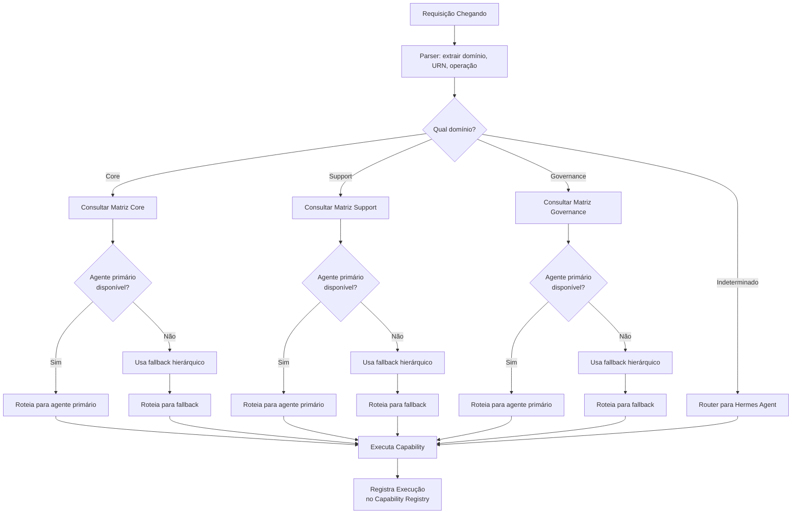

# APOS Agent Map — Mapa de Agentes e Capabilities

**Documento:** AGENT_MAP.md  
**Release:** R0 | **Sprint:** 0.6  
**Tarefa:** T0.6.3 — Mapa de agentes × capabilities  
**Dependência:** CAPABILITY_MODEL.md (modelo de capabilities), CAPABILITY_TAXONOMY.md (taxonomia hierárquica)  
**Criado em:** 2026-07-21  
**Versão:** v0.1-draft

---

## Índice

1. [Introdução](#1-introdução)
2. [Catálogo de Agentes](#2-catálogo-de-agentes)
3. [Matriz Agente × Capability](#3-matriz-agente--capability)
4. [Regras de Roteamento](#4-regras-de-roteamento)
5. [Exemplos de Resolução](#5-exemplos-de-resolução)
6. [Referências](#6-referências)

---

## 1. Introdução

### 1.1 O Que É o Agent Map

O **Agent Map** é o catálogo oficial dos agentes do ecossistema APOS. Ele define:

- **Quem são os agentes** — identidade, propósito e URN de cada agente
- **O que cada agente sabe fazer** — mapeamento de capabilities para agentes
- **Como as requisições são roteadas** — regras que determinam qual agente executa qual capability baseado no contexto da requisição

### 1.2 Relação com os Demais Documentos

```
CAPABILITY_MODEL.md      → O que é uma capability (estrutura, atributos, ciclo de vida)
CAPABILITY_TAXONOMY.md   → Como as capabilities se organizam (hierarquia, categorias)
AGENT_MAP.md             → Quem executa a capability ← ESTE DOCUMENTO
CAPABILITY_ROUTING.md    → Como a capability é roteada (regras de encaminhamento)
```

### 1.3 Convenção de URNs

Todos os agentes APOS seguem o padrão de nomenclatura:

```
urn:apos:agent:{agent_name}
```

Onde `{agent_name}` é um identificador em kebab-case (ex.: `hermes`, `knowledge-graph`, `context-agent`).

---

## 2. Catálogo de Agentes

### 2.1 Visão Geral

O ecossistema APOS na Sprint 0.6 contempla **6 agentes** que cobrem os domínios **core**, **support** e **governance** definidos no CAPABILITY_MODEL.md:

| # | Agente | URN | Domínio Primário | Maturidade R0 |
|:-:|--------|:---:|:----------------:|:-------------:|
| 1 | **Hermes Agent** | `urn:apos:agent:hermes` | Core (Agentes) | L2 — Implementado |
| 2 | **Knowledge Graph Agent** | `urn:apos:agent:knowledge-graph` | Core (Grafo) | L2 — Implementado |
| 3 | **Context Agent** | `urn:apos:agent:context-agent` | Core (Contexto) | L1 — Estruturado |
| 4 | **Trust Score Agent** | `urn:apos:agent:trust-score` | Governance | L0 — Conceitual |
| 5 | **Governance Agent** | `urn:apos:agent:governance` | Governance | L0 — Conceitual |
| 6 | **Capability Router Agent** | `urn:apos:agent:capability-router` | Core (Agentes) | L0 — Conceitual |

---

### 2.2 Hermes Agent

| Atributo | Valor |
|----------|-------|
| **URN** | `urn:apos:agent:hermes` |
| **Nome** | Hermes Agent |
| **Descrição** | Agente principal de desenvolvimento e execução de tarefas. Interface primária entre o usuário e o ecossistema APOS. Orquestra solicitações, delega para outros agentes e executa tarefas de desenvolvimento diretamente. |
| **Domínio** | Agentes (Core) |
| **Categoria** | Core |
| **Maturidade R0** | L2 — Implementado |
| **Habilidades** | Desenvolvimento de código, execução de tarefas, orquestração de workflows, delegação para subagentes |
| **Capabilities que implementa** | `graph.traverse`, `context.assemble`, `query.execute`, `task-to-okr`, `feature-metrics`, `impact.analyze` |
| **Limitações** | Não possui capabilities de governança dedicadas; delega `trust-score.calculate`, `integrity.validate` e `coverage.report` para agentes especializados |

**Capabilities Detalhadas:**

| Capability | Domínio | Descrição |
|------------|:-------:|-----------|
| `graph.traverse` | core | Navega no Knowledge Graph a partir de uma URN âncora |
| `context.assemble` | core | Monta contexto para si ou para outros agentes |
| `query.execute` | core | Executa queries Q01–Q16 no Knowledge Graph |
| `task-to-okr` | core | Mapeia tasks para OKRs impactados |
| `feature-metrics` | core | Relaciona features a métricas vinculadas |
| `impact.analyze` | support | Analisa impacto de mudanças em tasks/features |

---

### 2.3 Knowledge Graph Agent

| Atributo | Valor |
|----------|-------|
| **URN** | `urn:apos:agent:knowledge-graph` |
| **Nome** | Knowledge Graph Agent |
| **Descrição** | Agente especializado em operações sobre o Knowledge Graph. Executa consultas, travessias, análise de impacto e detecção de problemas estruturais (órfãos, ciclos) no grafo. |
| **Domínio** | Grafo (Core) |
| **Categoria** | Core |
| **Maturidade R0** | L2 — Implementado |
| **Habilidades** | Navegação do grafo, Query Patterns (Q01–Q16), Gestão de nós e arestas, Detecção de problemas estruturais |
| **Capabilities que implementa** | `graph.traverse`, `query.execute`, `task-to-okr`, `feature-metrics`, `impact.analyze`, `orphans.detect`, `cycles.detect` |
| **Limitações** | Não monta contexto para agentes; não calcula trust score; somente leitura no KG (Sprint 0.6) |

**Capabilities Detalhadas:**

| Capability | Domínio | Descrição |
|------------|:-------:|-----------|
| `graph.traverse` | core | Navega no KG a partir de uma URN âncora (Q01–Q16) |
| `query.execute` | core | Executa queries Q01–Q16 no KG |
| `task-to-okr` | core | Executa Q01 — mapeia Task → OKR |
| `feature-metrics` | core | Executa Q02 — mapeia Feature → Métricas |
| `impact.analyze` | support | Executa Q07, Q08, Q09 — análise de impacto |
| `orphans.detect` | support | Executa Q10, Q11, Q12, Q13 — detecção de nós órfãos |
| `cycles.detect` | support | Executa Q06, Q09 — detecção de ciclos de bloqueio |

---

### 2.4 Context Agent

| Atributo | Valor |
|----------|-------|
| **URN** | `urn:apos:agent:context-agent` |
| **Nome** | Context Agent |
| **Descrição** | Agente especializado na montagem, gestão e entrega de contexto semântico para outros agentes. Extrai nós do Knowledge Graph, monta blocos de contexto, calcula relevância e otimiza o uso de tokens dentro dos limites de cada agente. |
| **Domínio** | Contexto (Core) |
| **Categoria** | Core |
| **Maturidade R0** | L1 — Estruturado |
| **Habilidades** | Extração de contexto do KG, Montagem de blocos, Cálculo de relevância, Compactação e poda, Cache de contexto |
| **Capabilities que implementa** | `context.assemble` (primária), `graph.traverse` (suporte à montagem), `query.execute` (suporte) |
| **Limitações** | Não executa queries de negócio (task-to-okr, feature-metrics); não realiza análise de impacto; não modifica o KG |

**Capabilities Detalhadas:**

| Capability | Domínio | Descrição |
|------------|:-------:|-----------|
| `context.assemble` | core | Monta contexto para agentes: extrai KG, monta blocos, ordena por relevância e poda por max_tokens |
| `graph.traverse` | core | Navega no KG como etapa da montagem de contexto |
| `query.execute` | core | Executa queries para coletar dados durante montagem |

---

### 2.5 Trust Score Agent

| Atributo | Valor |
|----------|-------|
| **URN** | `urn:apos:agent:trust-score` |
| **Nome** | Trust Score Agent |
| **Descrição** | Agente especializado no cálculo de Trust Score de nós do Knowledge Graph. Utiliza as queries Q14 (cobertura), Q15 (qualidade referencial) e Q16 (consistência) para produzir um score [0.0, 1.0] que reflete a confiabilidade de cada nó. |
| **Domínio** | Governança |
| **Categoria** | Governance |
| **Maturidade R0** | L0 — Conceitual |
| **Habilidades** | Cálculo de trust score, Análise de cobertura, Avaliação de qualidade referencial, Verificação de consistência |
| **Capabilities que implementa** | `trust-score.calculate` (primária), `coverage.report` (consulta cobertura), `integrity.validate` (valida integridade) |
| **Limitações** | Apenas leitura no KG (Sprint 0.6); não modifica atributos de nós; não executa queries de navegação |

**Capabilities Detalhadas:**

| Capability | Domínio | Descrição |
|------------|:-------:|-----------|
| `trust-score.calculate` | governance | Calcula trust score composto (coverage 40%, quality 35%, consistency 25%) |
| `coverage.report` | governance | Gera relatório de cobertura por tipo de nó (Q14) |
| `integrity.validate` | governance | Valida integridade referencial do grafo (Q14, Q15, Q16) |

---

### 2.6 Governance Agent

| Atributo | Valor |
|----------|-------|
| **URN** | `urn:apos:agent:governance` |
| **Nome** | Governance Agent |
| **Descrição** | Agente de auditoria, validação e governança do ecossistema APOS. Responsável por relatórios de cobertura, validação de integridade, detecção de problemas estruturais e garantia de conformidade com as regras da ontologia. Atua em caráter preventivo e corretivo. |
| **Domínio** | Governança |
| **Categoria** | Governance |
| **Maturidade R0** | L0 — Conceitual |
| **Habilidades** | Auditoria de ações, Validação de integridade, Relatórios de cobertura, Detecção de órfãos, Semantic gates |
| **Capabilities que implementa** | `integrity.validate`, `coverage.report`, `orphans.detect`, `cycles.detect`, `impact.analyze` |
| **Limitações** | Não calcula trust score (delega para Trust Score Agent); somente leitura no KG (Sprint 0.6); execução assíncrona/batch |

**Capabilities Detalhadas:**

| Capability | Domínio | Descrição |
|------------|:-------:|-----------|
| `integrity.validate` | governance | Valida integridade referencial (Q14, Q15, Q16) |
| `coverage.report` | governance | Relatório de cobertura do grafo (Q14) |
| `orphans.detect` | support | Detecta nós órfãos (Q10–Q13) |
| `cycles.detect` | support | Detecta ciclos de bloqueio (Q06, Q09) |
| `impact.analyze` | support | Analisa impacto de mudanças (Q07, Q08, Q09) |

---

### 2.7 Capability Router Agent

| Atributo | Valor |
|----------|-------|
| **URN** | `urn:apos:agent:capability-router` |
| **Nome** | Capability Router Agent |
| **Descrição** | Agente responsável pelo roteamento inteligente de requisições para a capability e o agente mais adequados. Analisa o contexto da requisição (domínio, URN alvo, tipo de operação), consulta o Capability Registry e decide qual agente deve executar a capability. |
| **Domínio** | Agentes (Core) |
| **Categoria** | Core |
| **Maturidade R0** | L0 — Conceitual |
| **Habilidades** | Análise de contexto de requisição, Consulta ao Capability Registry, Decisão de roteamento por domínio, Balanceamento de carga entre agentes, Fallback e tolerância a falhas |
| **Capabilities que implementa** | Nenhuma capability de negócio diretamente. **Capability interna:** `routing.resolve` (resolução de rota) |
| **Limitações** | Não executa capabilities de negócio; atua exclusivamente como orquestrador de roteamento; depende do Capability Registry para decisões |

**Mecanismo de Roteamento:**

```python
class RoutingDecision:
    agent_id: str              # URN do agente selecionado
    capability_id: str         # URN da capability a executar
    confidence: float          # Confiança na decisão [0.0, 1.0]
    reason: str                # Justificativa da decisão
    fallback_agents: list[str] # Alternativas se o primário falhar
```

---

## 3. Matriz Agente × Capability

### 3.1 Matriz Completa

A matriz abaixo consolida **todas as capabilities da Sprint 0.6** e **quais agentes as implementam**.

| Capability | Domínio | Hermes | KG Agent | Context Agent | Trust Score Agent | Governance Agent | Capability Router |
|------------|:-------:|:------:|:--------:|:-------------:|:-----------------:|:----------------:|:-----------------:|
| `graph.traverse` | core | ✅ | ✅ | ✅ | — | — | — |
| `context.assemble` | core | ✅ | — | ✅ | — | — | — |
| `query.execute` | core | ✅ | ✅ | ✅ | — | — | — |
| `task-to-okr` | core | ✅ | ✅ | — | — | — | — |
| `feature-metrics` | core | ✅ | ✅ | — | — | — | — |
| `trust-score.calculate` | governance | — | — | — | ✅ | — | — |
| `integrity.validate` | governance | — | — | — | ✅ | ✅ | — |
| `coverage.report` | governance | — | — | — | ✅ | ✅ | — |
| `orphans.detect` | support | — | ✅ | — | — | ✅ | — |
| `cycles.detect` | support | — | ✅ | — | — | ✅ | — |
| `impact.analyze` | support | ✅ | ✅ | — | — | ✅ | — |
| `metrics.refresh` | support | — | — | — | — | — | — |
| `routing.resolve` | core* | — | — | — | — | — | ✅ |

> `*` `routing.resolve` é uma capability interna do Capability Router, não exposta para execução direta por outros agentes.
> `metrics.refresh` não possui agente designado na Sprint 0.6 (reservado para sprint futura).

### 3.2 Matriz por Domínio Funcional

#### Domínio Core

| Capability | Hermes | KG Agent | Context Agent | Capability Router |
|------------|:------:|:--------:|:-------------:|:-----------------:|
| `graph.traverse` | ✅ | ✅ | ✅ | — |
| `context.assemble` | ✅ | — | ✅ | — |
| `query.execute` | ✅ | ✅ | ✅ | — |
| `task-to-okr` | ✅ | ✅ | — | — |
| `feature-metrics` | ✅ | ✅ | — | — |

#### Domínio Support

| Capability | Hermes | KG Agent | Governance Agent |
|------------|:------:|:--------:|:----------------:|
| `orphans.detect` | — | ✅ | ✅ |
| `cycles.detect` | — | ✅ | ✅ |
| `impact.analyze` | ✅ | ✅ | ✅ |

#### Domínio Governance

| Capability | Trust Score Agent | Governance Agent |
|------------|:-----------------:|:----------------:|
| `trust-score.calculate` | ✅ | — |
| `integrity.validate` | ✅ | ✅ |
| `coverage.report` | ✅ | ✅ |

### 3.3 Cobertura por Agente

| Agente | Capabilities Core | Capabilities Support | Capabilities Governance | **Total** |
|--------|:-----------------:|:--------------------:|:----------------------:|:---------:|
| Hermes Agent | 5 | 1 | 0 | **6** |
| KG Agent | 4 | 3 | 0 | **7** |
| Context Agent | 3 | 0 | 0 | **3** |
| Trust Score Agent | 0 | 0 | 3 | **3** |
| Governance Agent | 0 | 3 | 2 | **5** |
| Capability Router | 0 | 0 | 0 | **1** (interna) |

---

## 4. Regras de Roteamento

### 4.1 Princípios Gerais

| # | Princípio | Descrição |
|:-:|-----------|-----------|
| R01 | **Agente Especialista Primeiro** | Prefira o agente especializado na capability sobre o agente genérico |
| R02 | **Mínimo Salto** | Prefira o agente que já possui o contexto necessário |
| R03 | **Fallback Hierárquico** | Se o agente primário falhar, use o fallback definido na matriz |
| R04 | **Domínio Determina Rota** | Requisições no domínio Governance sempre roteiam para Trust Score ou Governance Agent |
| R05 | **Hermes como Default** | Requisições sem domínio claro são roteadas para Hermes Agent |
| R06 | **Composição explícita** | Workflows multi-capability declaram a sequência; o Router respeita a ordem |

### 4.2 Regras por Domínio

#### Core — Navegação e Consulta

| Contexto da Requisição | Agente Primário | Agente Fallback | Critério |
|------------------------|:---------------:|:---------------:|----------|
| Travessia simples no KG (`graph.traverse`) | KG Agent | Hermes Agent | KG Agent é especialista em operações de grafo |
| Montagem de contexto para agente (`context.assemble`) | Context Agent | Hermes Agent | Context Agent possui pipeline de montagem dedicado |
| Execução de query isolada (`query.execute`) | KG Agent | Hermes Agent | KG Agent otimizado para queries Q01–Q16 |
| Mapeamento Task → OKR (`task-to-okr`) | KG Agent | Hermes Agent | KG Agent executa Q01 diretamente |
| Mapeamento Feature → Métricas (`feature-metrics`) | KG Agent | Hermes Agent | KG Agent executa Q02 diretamente |
| Requisição mista (múltiplas capabilities core) | Hermes Agent | — | Hermes orquestra chamadas aos especialistas |

#### Support — Detecção e Análise

| Contexto da Requisição | Agente Primário | Agente Fallback | Critério |
|------------------------|:---------------:|:---------------:|----------|
| Detecção de nós órfãos (`orphans.detect`) | KG Agent | Governance Agent | KG Agent tem acesso completo ao grafo |
| Detecção de ciclos (`cycles.detect`) | KG Agent | Governance Agent | Requer travessia no grafo |
| Análise de impacto (`impact.analyze`) | KG Agent | Hermes Agent / Governance Agent | Requer travessia + contexto de negócio |
| Varredura completa de saúde do grafo | Governance Agent | KG Agent | Governance Agent consolida relatórios |

#### Governance — Auditoria e Qualidade

| Contexto da Requisição | Agente Primário | Agente Fallback | Critério |
|------------------------|:---------------:|:---------------:|----------|
| Cálculo de Trust Score (`trust-score.calculate`) | Trust Score Agent | Governance Agent | Trust Score Agent é especialista no cálculo |
| Validação de integridade (`integrity.validate`) | Governance Agent | Trust Score Agent | Governance Agent coordena auditoria |
| Relatório de cobertura (`coverage.report`) | Governance Agent | Trust Score Agent | Governance Agent gera relatórios consolidados |
| Auditoria completa de governança | Governance Agent | Trust Score Agent | Escopo amplo, requer coordenação |

### 4.3 Fluxo de Decisão do Capability Router



### 4.4 Tabela de Decisão Rápida

| Se a requisição pede... | E o contexto é... | Então roteie para... |
|--------------------------|-------------------|----------------------|
| Navegar no grafo | Apenas travessia | **KG Agent** |
| Montar contexto para um agente | Preparação de sessão | **Context Agent** |
| Calcular confiabilidade de um nó | Auditoria | **Trust Score Agent** |
| Validar integridade do grafo | Manutenção | **Governance Agent** |
| Detectar nós órfãos | Varredura estrutural | **KG Agent** |
| Analisar impacto de mudança | Planejamento | **Hermes Agent** |
| Executar tarefa de desenvolvimento | Código | **Hermes Agent** |
| Decidir para quem rotear | Roteamento | **Capability Router** |

---

## 5. Exemplos de Resolução

### Exemplo 1: "Qual o trust score da task de OAuth?"

**Requisição:** `calcular trust score de urn:apos:task:oauth-123`

**Passos de Resolução:**

```
1. Capability Router analisa a requisição
   - Domínio identificado: governança
   - Operação: cálculo de pontuação
   - URN alvo: urn:apos:task:oauth-123

2. Router consulta matriz Governance:
   - trust-score.calculate → primário: Trust Score Agent
   - Fallback: Governance Agent

3. Router verifica disponibilidade:
   - Trust Score Agent: disponível ✅
   - Decisão: rotear para Trust Score Agent

4. Trust Score Agent recebe a requisição:
   - Executa capability trust-score.calculate
   - Lê Q14 (coverage): 0.92
   - Lê Q15 (quality): 0.85
   - Lê Q16 (consistency): 0.83
   - Calcula: 0.4×0.92 + 0.35×0.85 + 0.25×0.83 = 0.87

5. Retorna: { "urn": "...", "trust_score": 0.87, "factors": {...} }
```

**Resultado:** Requisição roteada para **Trust Score Agent** porque a capability `trust-score.calculate` é de domínio **governance** e o Trust Score Agent é o especialista primário.

---

### Exemplo 2: "Quais tarefas estão órfãs no sprint atual?"

**Requisição:** `detectar orphans do tipo task no sprint atual`

**Passos de Resolução:**

```
1. Capability Router analisa a requisição
   - Domínio identificado: suporte
   - Operação: detecção de órfãos
   - Contexto: sprint atual

2. Router consulta matriz Support:
   - orphans.detect → primário: KG Agent
   - Fallback: Governance Agent

3. Router verifica disponibilidade:
   - KG Agent: disponível ✅
   - Decisão: rotear para KG Agent

4. KG Agent recebe a requisição:
   - Executa capability orphans.detect
   - Lê Q10 (tasks órfãs): tasks sem "contribui_para" ou "pertence_a"
   - Lê Q14 (coverage) para contagem total de nodes
   - Retorna lista de tarefas órfãs com arestas faltantes

5. Retorna: { "orphans": { "task": [...] }, "total_orphans": 3 }
```

**Resultado:** Requisição roteada para **Knowledge Graph Agent** porque `orphans.detect` requer travessia do grafo (Q10–Q13) e o KG Agent é o especialista em operações de grafo. Fallback seria Governance Agent.

---

### Exemplo 3: "Monte contexto para o agente task-worker sobre a feature de autenticação"

**Requisição:** `montar contexto para urn:apos:agent:task-worker sobre urn:apos:feature:faster-auth`

**Passos de Resolução:**

```
1. Capability Router analisa a requisição
   - Domínio identificado: core
   - Operação: montagem de contexto
   - URN alvo: urn:apos:feature:faster-auth
   - Agente destino: urn:apos:agent:task-worker

2. Router consulta matriz Core:
   - context.assemble → primário: Context Agent
   - Fallback: Hermes Agent

3. Router verifica disponibilidade:
   - Context Agent: disponível ✅
   - Decisão: rotear para Context Agent

4. Context Agent recebe a requisição:
   - Executa capability context.assemble
   - Extrai nós do KG via graph.traverse a partir de faster-auth
   - Monta blocos de contexto
   - Calcula relevância de cada bloco
   - Aplica poda para max_tokens=4000
   - Registra evento episódico

5. Retorna: { "context_blocks": [...], "stats": { "total_blocks": 7, "total_tokens": 3890 } }
```

**Resultado:** Requisição roteada para **Context Agent** porque `context.assemble` é a capability core de montagem de contexto e o Context Agent possui o pipeline dedicado (extração → montagem → relevância → poda). Fallback seria Hermes Agent.

---

### Exemplo 4: "Essa task está bloqueando alguma métrica?"

**Requisição:** `analisar impacto de bloqueio de urn:apos:task:oauth-123`

**Passos de Resolução:**

```
1. Capability Router analisa a requisição
   - Domínio identificado: suporte
   - Operação: análise de impacto
   - URN alvo: urn:apos:task:oauth-123
   - Tipo de mudança: bloqueio

2. Router consulta matriz Support:
   - impact.analyze → primário: KG Agent
   - Fallback: Hermes Agent ou Governance Agent

3. Router verifica disponibilidade:
   - KG Agent: indisponível (em manutenção) ❌
   - Fallback: Hermes Agent disponível ✅
   - Decisão: rotear para Hermes Agent (fallback)

4. Hermes Agent recebe a requisição:
   - Executa capability impact.analyze
   - Lê Q07 (impacto de mudança de task): feature faster-auth impactada
   - Lê Q09 (propagação de bloqueio): tasks downstream bloqueadas
   - Calcula impacto em métricas e OKRs

5. Retorna: { "direct_impact": {...}, "propagated_impact": {...} }
```

**Resultado:** Requisição roteada para **Hermes Agent** (fallback) porque o KG Agent (primário) estava indisponível. O Hermes Agent tem a capability `impact.analyze` e conseguiu executar a análise completa.

---

### Exemplo 5: "O grafo está íntegro? Gere um relatório de cobertura"

**Requisição:** `validar integridade e gerar relatório de cobertura do grafo`

**Passos de Resolução:**

```
1. Capability Router analisa a requisição
   - Domínio identificado: governança (requisição composta)
   - Operações: integrity.validate + coverage.report

2. Router identifica workflow composto:
   - Passo 1: integrity.validate → Governance Agent (primário)
   - Passo 2: coverage.report → Governance Agent (primário)

3. Router verifica disponibilidade:
   - Governance Agent: disponível ✅
   - Decisão: rotear workflow completo para Governance Agent

4. Governance Agent executa o workflow:
   - Passo 1: integrity.validate
     - Lê Q14 (coverage), Q15 (quality), Q16 (consistency)
     - Valida integridade referencial
   - Passo 2: coverage.report
     - Lê Q14 (coverage) agrupado por node_type
     - Gera relatório consolidado

5. Retorna: relatório completo de integridade + cobertura
```

**Resultado:** Workflow composto roteado inteiramente para **Governance Agent** porque ambas as capabilities (`integrity.validate` e `coverage.report`) são do domínio **governance** e o Governance Agent é o especialista em auditoria e relatórios consolidados.

---

## 6. Referências

| Documento | Relação |
|-----------|---------|
| [CAPABILITY_MODEL.md](CAPABILITY_MODEL.md) | Modelo de capabilities que os agentes implementam |
| [CAPABILITY_TAXONOMY.md](CAPABILITY_TAXONOMY.md) | Taxonomia hierárquica que classifica as capabilities dos agentes |
| [KNOWLEDGE_GRAPH.md](../sprint-0.4/KNOWLEDGE_GRAPH.md) | Estrutura do grafo que os agentes consultam |
| [QUERY_PATTERNS.md](../sprint-0.4/QUERY_PATTERNS.md) | Padrões de navegação Q01–Q16 usados pelos agentes |
| [CONTEXT_MODEL.md](../sprint-0.5/CONTEXT_MODEL.md) | Modelo de contexto que o Context Agent monta |
| [MEMORY_MODEL.md](../sprint-0.5/MEMORY_MODEL.md) | Sistema de memória onde efeitos de capabilities são registrados |
| [ONTOLOGY_FOUNDATIONS.md](../ONTOLOGY_FOUNDATIONS.md) | Fundação ontológica que os agentes realizam |

---

**Última atualização:** 2026-07-21  
**Versão:** v0.1-draft  
**Próximo documento:** [CAPABILITY_ROUTING.md](CAPABILITY_ROUTING.md) — Regras de roteamento de requisições para capabilities
