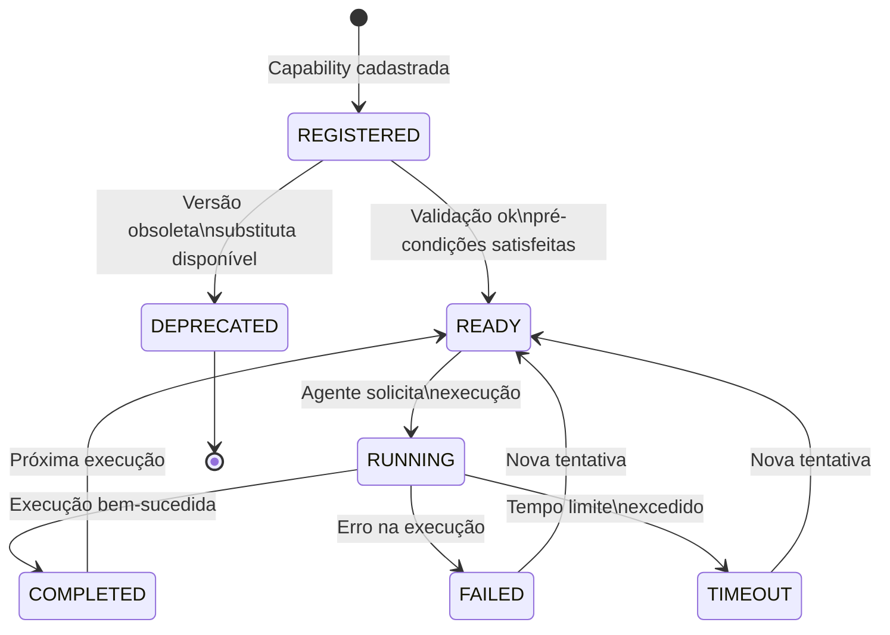
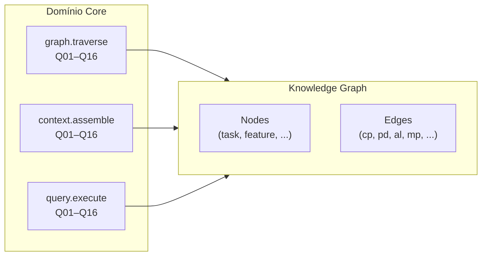
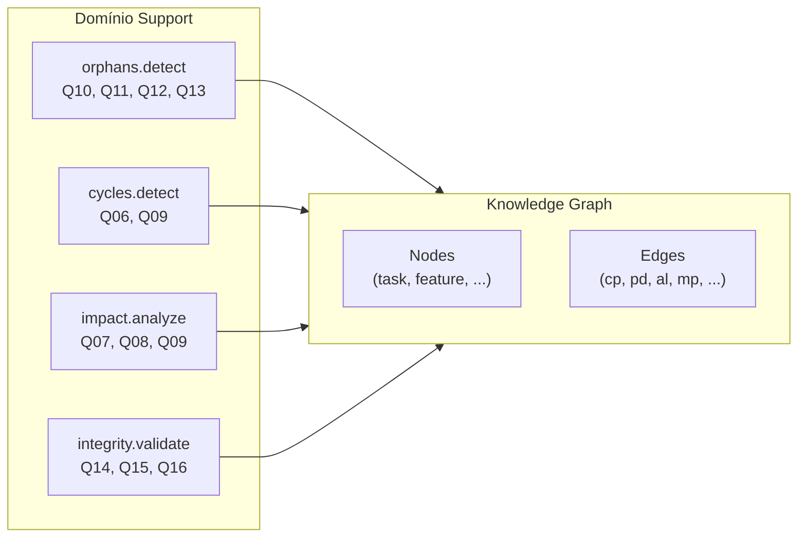
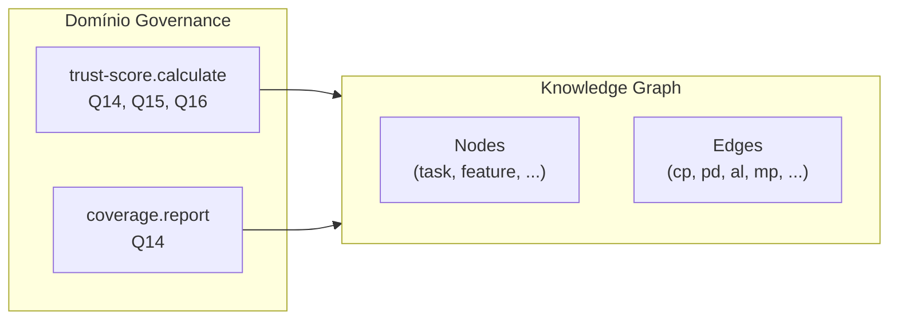
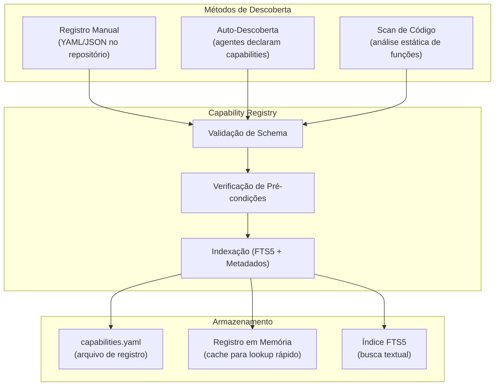
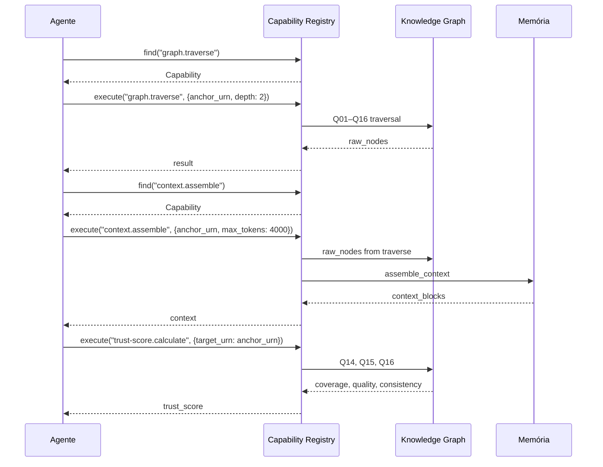

# APOS Capability Model — Modelo de Capacidades de Agentes

**Documento:** CAPABILITY_MODEL.md  
**Release:** R0 | **Sprint:** 0.6  
**Tarefa:** T0.6.1 — Modelo formal de capabilities  
**Dependência:** KNOWLEDGE_GRAPH.md (estrutura do grafo), QUERY_PATTERNS.md (Q01–Q16), CONTEXT_MODEL.md (contexto de agentes), MEMORY_MODEL.md (sistema de memória)  
**Criado em:** 2026-07-21  
**Versão:** v0.1-draft

---

## Índice

1. [Introdução](#1-introdução)
2. [Estrutura de uma Capability](#2-estrutura-de-uma-capability)
3. [Ciclo de Vida](#3-ciclo-de-vida)
4. [Relação com Knowledge Graph](#4-relação-com-knowledge-graph)
5. [Exemplos de Capabilities](#5-exemplos-de-capabilities)
6. [Registro de Capabilities](#6-registro-de-capabilities)
7. [Composição e Orquestração](#7-composição-e-orquestração)
8. [Referências](#8-referências)

---

## 1. Introdução

### 1.1 O Que É uma Capability no APOS

Uma **Capability** é a **unidade atômica de competência** que um agente APOS possui. Ela descreve **o que o sistema sabe fazer** — não *como* (detalhe de implementação), mas *o quê* (contrato semântico).

No contexto do APOS, uma capability:

- É **declarativa**: define *o que* faz, *com que* entradas, *que* saídas produz e *que* efeitos causa no Knowledge Graph
- É **rastreável**: toda execução deixa vestígios no grafo (eventos, mudanças de estado)
- É **componível**: capabilities podem ser encadeadas para formar workflows maiores
- É **roteável**: o sistema decide qual agente executa qual capability com base no domínio e nas precondições

### 1.2 Por Que Modelar Capabilities

| Motivo | Descrição |
|--------|-----------|
| **Descoberta** | O sistema sabe quais capacidades estão disponíveis em cada agente |
| **Roteamento** | Pedidos são roteados para o agente com a capability certa |
| **Verificação** | Pré-condições garantem que a capability só executa quando faz sentido |
| **Rastreabilidade** | Toda execução de capability deixa metadados no grafo (quem, quando, resultado) |
| **Governança** | O domínio da capability (core, suporte, governança) define prioridade e ownership |
| **Composição** | Capabilities podem ser orquestradas em pipelines sem acoplamento |

### 1.3 Posição nas Camadas

```
Camada 1: Ontologia             (conceitos + relações + restrições)
Camada 2: Semantic Layer        (regras de negócio + normalização)
Camada 3: Knowledge Graph       (dados conectados — nós + arestas)
Camada 3.5: Context Model      (ponte grafo → agente)
Camada 3.6: Capability Model  ← ESTE DOCUMENTO (o que os agentes sabem fazer)
Camada 4: Catálogo de Dados     (linhagem + proveniência)
Camada 5: MCP                   (transporte)
```

A Camada 3.6 é uma **camada conceitual** — um conjunto de **esquemas, contratos e registros** que operam sobre o Knowledge Graph (Camada 3) e o Context Model (Camada 3.5) para definir as competências dos agentes.

### 1.4 Diferença entre Capability e Conceitos Correlatos

| Conceito | Definição | Exemplo |
|----------|-----------|---------|
| **Capability** | O que um agente sabe fazer (contrato) | `trust_score.calculate` |
| **Tarefa (Task)** | Uma unidade de trabalho no grafo | `urn:apos:task:oauth-123` |
| **Query Pattern** | Um padrão de navegação no KG | `Q01: Task → OKR` |
| **Ação** | Execução concreta de uma capability | `calcular trust score do nó X` |
| **Habilidade** | Subunidade de capability (detalhe técnico) | `parse_urn`, `weight_aggregate` |

---

## 2. Estrutura de uma Capability

### 2.1 Schema Formal

```python
@dataclass
class Capability:
    id: str                            # URN única da capability
    name: str                          # Nome legível
    description: str                   # Descrição do que faz
    domain: CapabilityDomain           # Domínio funcional
    version: str                       # Semver da capability
    input_schema: dict                 # Schema JSON de parâmetros de entrada
    output_schema: dict                # Schema JSON do retorno
    pre_conditions: list[PreCondition] # Condições que devem ser verdade antes
    effects: list[Effect]              # O que muda no KG após execução
    enabled_agents: list[str]          # URNs dos agentes que podem executar
    kg_read: list[KGPattern]           # Queries/nós que a capability LÊ
    kg_write: list[KGPattern]          # Nós/arestas que a capability ESCREVE
    metadata: CapabilityMetadata       # Metadados de registro
```

### 2.2 Campos Detalhados

#### `id` — Identificador Único

```
urn:apos:cap:{domain}:{name}
```

| Componente | Descrição | Exemplo |
|------------|-----------|---------|
| `urn:apos:cap` | Prefixo fixo do namespace de capabilities | — |
| `{domain}` | Domínio funcional (ver seção 2.3) | `core`, `support`, `governance` |
| `{name}` | Nome da capability em dot-notation | `trust-score.calculate` |

**Exemplos:**
- `urn:apos:cap:core:context.assemble`
- `urn:apos:cap:support:orphans.detect`
- `urn:apos:cap:governance:trust-score.calculate`

#### `domain` — Domínios Funcionais

```python
class CapabilityDomain(Enum):
    CORE        = "core"        # Núcleo do APOS — operações fundamentais do grafo
    SUPPORT     = "support"     # Suporte — operações auxiliares (detecção, manutenção)
    GOVERNANCE  = "governance"  # Governança — auditoria, qualidade, trust score
```

| Domínio | Propósito | Exemplos | Prioridade |
|---------|-----------|----------|:----------:|
| **core** | Operações essenciais de navegação, montagem de contexto e consulta | `graph.traverse`, `context.assemble`, `query.execute` | Alta |
| **support** | Detecção de problemas e manutenção da saúde do grafo | `orphans.detect`, `cycles.detect`, `metrics.refresh` | Média |
| **governance** | Qualidade, auditoria e confiança dos dados no grafo | `trust-score.calculate`, `integrity.validate`, `coverage.report` | Média |

#### `input_schema` e `output_schema`

Definidos como schema JSON (compatível com JSON Schema Draft 2020-12) para validação automática.

```python
input_schema = {
    "type": "object",
    "properties": {
        "target_urn": {
            "type": "string",
            "pattern": "^urn:apos:[a-z]+:[a-z0-9-]+$"
        },
        "depth": {
            "type": "integer",
            "minimum": 1,
            "maximum": 5,
            "default": 2
        }
    },
    "required": ["target_urn"]
}
```

#### `pre_conditions` — Pré-Condições

Cada pré-condição é uma **sentença lógica** que deve ser avaliada como verdadeira antes da execução.

```python
@dataclass
class PreCondition:
    description: str         # Descrição legível
    check_type: CheckType    # Tipo de verificação
    params: dict             # Parâmetros da verificação

class CheckType(Enum):
    NODE_EXISTS          = "node_exists"           # Nó com URN existe no KG
    EDGE_EXISTS          = "edge_exists"           # Aresta existe entre dois nós
    NODE_HAS_ATTRIBUTE   = "node_has_attribute"    # Nó tem atributo específico
    NODE_IN_DOMAIN       = "node_in_domain"        # Nó pertence a um domínio
    KG_NOT_EMPTY         = "kg_not_empty"          # Grafo não está vazio
    AGENT_AUTHORIZED     = "agent_authorized"      # Agente tem permissão
    QUERY_HAS_RESULTS    = "query_has_results"     # Query retorna resultados
    CUSTOM               = "custom"                # Função customizada
```

**Exemplos:**

```json
[
    {
        "description": "O nó alvo deve existir no grafo",
        "check_type": "node_exists",
        "params": {"urn": "{target_urn}"}
    },
    {
        "description": "O agente deve estar habilitado para esta capability",
        "check_type": "agent_authorized",
        "params": {"capability_id": "urn:apos:cap:core:graph.traverse"}
    }
]
```

#### `effects` — Efeitos no Knowledge Graph

Efeitos descrevem **mutações esperadas** no grafo após a execução bem-sucedida.

```python
@dataclass
class Effect:
    description: str          # Descrição legível
    effect_type: EffectType   # Tipo de efeito
    target: str               # URN ou padrão de URN afetado
    delta: dict | None        # Mudanças específicas (opcional)

class EffectType(Enum):
    NODE_CREATED     = "node_created"      # Novo nó adicionado ao grafo
    NODE_UPDATED     = "node_updated"      # Atributos de nó alterados
    NODE_DELETED     = "node_deleted"      # Nó removido do grafo
    EDGE_CREATED     = "edge_created"      # Nova aresta adicionada
    EDGE_UPDATED     = "edge_updated"      # Peso/metadados de aresta alterados
    EVENT_LOGGED     = "event_logged"      # Evento registrado na memória episódica
    TRUST_UPDATED    = "trust_updated"     # Trust Score de nó recalculado
    CONTEXT_INJECTED = "context_injected"  # Contexto injetado na sessão do agente
```

#### `enabled_agents` — Agentes Habilitados

Lista de URNs de agentes que podem executar esta capability. Usa o padrão `urn:apos:agent:{agent_name}`.

```python
enabled_agents = [
    "urn:apos:agent:orchestrator",
    "urn:apos:agent:kg-maintainer",
]
```

#### `metadata` — Metadados da Capability

```python
@dataclass
class CapabilityMetadata:
    created_at: str          # ISO 8601 — data de registro
    updated_at: str          # ISO 8601 — última modificação
    version: str             # Semver da capability
    status: CapabilityStatus # Estado atual (ver seção 3)
    tags: list[str]          # Tags para descoberta
    author: str              # Quem criou/registrou
    ttl_hours: int           # Horas até a capability expirar se não usada
```

### 2.3 Exemplo Completo em JSON

```json
{
    "id": "urn:apos:cap:core:graph.traverse",
    "name": "graph.traverse",
    "description": "Navega no Knowledge Graph a partir de uma URN âncora, seguindo arestas até uma profundidade configurável, e retorna os nós encontrados com suas conexões.",
    "domain": "core",
    "version": "1.0.0",
    "input_schema": {
        "type": "object",
        "properties": {
            "anchor_urn": {
                "type": "string",
                "pattern": "^urn:apos:[a-z]+:[a-z0-9-]+$",
                "description": "URN do nó de partida"
            },
            "depth": {
                "type": "integer",
                "minimum": 1,
                "maximum": 5,
                "default": 2,
                "description": "Profundidade máxima de navegação"
            },
            "edge_filters": {
                "type": "array",
                "items": {"type": "string"},
                "description": "Filtrar por tipos de aresta (opcional)"
            }
        },
        "required": ["anchor_urn"]
    },
    "output_schema": {
        "type": "object",
        "properties": {
            "nodes": {
                "type": "array",
                "items": {
                    "type": "object",
                    "properties": {
                        "urn": {"type": "string"},
                        "type": {"type": "string"},
                        "attributes": {"type": "object"},
                        "out_edges": {"type": "array"},
                        "in_edges": {"type": "array"}
                    }
                }
            },
            "traversal_stats": {
                "type": "object",
                "properties": {
                    "nodes_visited": {"type": "integer"},
                    "max_depth_reached": {"type": "integer"},
                    "edges_traversed": {"type": "integer"}
                }
            }
        }
    },
    "pre_conditions": [
        {
            "description": "O nó âncora deve existir no grafo",
            "check_type": "node_exists",
            "params": {"urn": "{input.anchor_urn}"}
        },
        {
            "description": "O agente solicitante deve estar habilitado",
            "check_type": "agent_authorized",
            "params": {"capability_id": "urn:apos:cap:core:graph.traverse"}
        }
    ],
    "effects": [
        {
            "description": "Evento de navegação registrado na memória episódica",
            "effect_type": "event_logged",
            "target": "urn:apos:event:traversal:*",
            "delta": {"event_type": "query_executed", "ttl_days": 7}
        }
    ],
    "enabled_agents": [
        "urn:apos:agent:orchestrator",
        "urn:apos:agent:kg-query"
    ],
    "kg_read": [
        {"pattern": "Q01–Q16", "description": "Qualquer query de navegação que use Q01–Q16"},
        {"nodes": ["task", "feature", "release", "okr", "metric", "sprint", "persona"], "description": "Todos os tipos de nó"},
        {"edges": ["contribui_para", "parte_de", "alcanca", "medido_por", "impacta", "bloqueia", "depende_de", "pertence_a", "envolve", "atinge"], "description": "Todos os tipos de aresta"}
    ],
    "kg_write": [],
    "metadata": {
        "created_at": "2026-07-21T10:00:00Z",
        "updated_at": "2026-07-21T10:00:00Z",
        "version": "1.0.0",
        "status": "ready",
        "tags": ["navigation", "core", "traversal"],
        "author": "jader",
        "ttl_hours": 0
    }
}
```

---

## 3. Ciclo de Vida

### 3.1 Estados de uma Capability



### 3.2 Descrição dos Estados

| Estado | Descrição | Ações Possíveis |
|--------|-----------|-----------------|
| **REGISTERED** | Capability cadastrada no registro, mas ainda não validada | Validar, Atualizar, Deprecar |
| **READY** | Capability validada e pronta para execução | Executar, Atualizar, Desabilitar |
| **RUNNING** | Capability em execução por um agente | Monitorar, Cancelar |
| **COMPLETED** | Execução bem-sucedida; saída disponível | Reexecutar, Inspecionar Logs |
| **FAILED** | Execução com erro; causa registrada no evento | Reexecutar, Diagnosticar |
| **TIMEOUT** | Execução excedeu tempo limite configurado | Reexecutar com mais tempo, Otimizar |
| **DEPRECATED** | Capability substituída; ainda pode ser consultada | Remover (após migração) |

### 3.3 Máquina de Estados — Detalhamento

#### Transição REGISTERED → READY

Ocorre automaticamente quando o **Capability Registry** valida:

1. Schema JSON de entrada/saída é válido
2. Pré-condições referenciam nós ou arestas que existem no grafo (validação estática)
3. Agentes referenciados em `enabled_agents` existem no registro de agentes
4. URN da capability não conflita com outra já registrada

#### Transição READY → RUNNING

Disparada por:

- Chamada direta: agente invoca a capability explicitamente
- Roteamento: **Capability Router** decide que esta capability atende a uma requisição
- Orquestração: um workflow composto chama esta capability como etapa

#### Transição RUNNING → COMPLETED / FAILED / TIMEOUT

| Resultado | Gatilho | Ação no Grafo |
|-----------|---------|---------------|
| **COMPLETED** | Retorno bem-sucedido | Evento `capability_completed` logado; efeitos aplicados |
| **FAILED** | Exceção não tratada | Evento `error_occurred` logado; rollback de efeitos parciais |
| **TIMEOUT** | Tempo > `max_execution_seconds` | Evento `capability_timeout` logado; rollback |

### 3.4 Parâmetros de Ciclo de Vida

```python
@dataclass
class LifecycleConfig:
    max_retries: int = 3                       # Tentativas antes de falhar definitivamente
    retry_delay_seconds: int = 5               # Intervalo entre retentativas
    max_execution_seconds: int = 30            # Timeout por execução
    ttl_days_unused: int = 90                  # Dias sem uso até deprecação automática
    version_compatibility: str = "^1.0"        # Range semver aceito
```

---

## 4. Relação com Knowledge Graph

### 4.1 Mapa Completo: Capabilities × Queries × Nós × Arestas

Cada capability declara formalmente:

- **KG Reads**: Queries (Q01–Q16) que utiliza, tipos de nó que consulta, tipos de aresta que navega
- **KG Writes**: Tipos de nó que cria/altera, tipos de aresta que adiciona/modifica

### 4.2 Capacidades Core

| Capability | Queries (READ) | Nós (READ) | Arestas (READ) | Nós (WRITE) | Arestas (WRITE) |
|------------|:------------:|:----------:|:--------------:|:-----------:|:--------------:|
| `graph.traverse` | Q01–Q16 | Todos | Todas | — | — |
| `context.assemble` | Q01–Q16 | Todos | Todas | — | — |
| `query.execute` | Q01–Q16 | task, feature, release, okr, metric | Todas | — | — |
| `trust-score.calculate` | Q14, Q15, Q16 | Todos | Todas | task, feature, release, okr, metric | — (atualiza metadata.confidence) |
| `task-to-okr` | Q01 | task, feature, release, okr | cp, pd, al | — | — |
| `feature-metrics` | Q02 | feature, release, okr, metric | pd, al, mp | — | — |

### 4.3 Capacidades de Suporte

| Capability | Queries (READ) | Nós (READ) | Arestas (READ) | Nós (WRITE) | Arestas (WRITE) |
|------------|:------------:|:----------:|:--------------:|:-----------:|:--------------:|
| `orphans.detect` | Q10, Q11, Q12, Q13 | Todos | Todas | — | — |
| `cycles.detect` | Q06, Q09 | task | bl, dd | — | — |
| `impact.analyze` | Q07, Q08, Q09 | Todos | Todas | — | — |
| `integrity.validate` | Q14, Q15, Q16 | Todos | Todas | — | — |
| `coverage.report` | Q14 | Todos | cp, pd, al, mp | — | — |
| `metrics.refresh` | — | metric | — | metric | — |

### 4.4 Matriz de Leitura e Escrita

A matriz abaixo consolida **todos os tipos de nó** lidos e escritos por capabilities em cada domínio:

| Tipo de Nó | Core Read | Core Write | Support Read | Support Write | Governance Read | Governance Write |
|------------|:---------:|:----------:|:-----------:|:-------------:|:--------------:|:----------------:|
| Task | ✅ | ❌ | ✅ | ❌ | ✅ | ❌ |
| Feature | ✅ | ❌ | ✅ | ❌ | ✅ | ❌ |
| Release | ✅ | ❌ | ✅ | ❌ | ✅ | ❌ |
| OKR | ✅ | ❌ | ✅ | ❌ | ✅ | ❌ |
| Metric | ✅ | ❌ | ✅ | ✅ | ✅ | ❌ |
| Sprint | ✅ | ❌ | ❌ | ❌ | ❌ | ❌ |
| Persona | ✅ | ❌ | ❌ | ❌ | ❌ | ❌ |

> **Nota:** Na Sprint 0.6, todas as capabilities são **read-only** no KG. Capabilities com efeitos de escrita (NODE_CREATED, EDGE_CREATED) serão introduzidas em sprints futuras (R1).

### 4.5 Queries Utilizadas por Capacidade (Detalhado)

#### Core



#### Support



#### Governance



### 4.6 Diagrama de Dependência entre Capacidades e Queries

| Query Pattern | Nome | Capabilities que a utilizam |
|:------------:|------|---------------------------|
| **Q01** | Task → OKR | `task-to-okr`, `impact.analyze` |
| **Q02** | Feature → Métricas | `feature-metrics`, `impact.analyze` |
| **Q03** | Release → OKRs → Métricas | `impact.analyze` |
| **Q04** | Task → Sprint | `graph.traverse`, `context.assemble` |
| **Q05** | Persona → Features | `graph.traverse`, `impact.analyze` |
| **Q06** | Task Bloqueada → Métricas em Risco | `cycles.detect`, `impact.analyze` |
| **Q07** | Impacto de Mudança de Task | `impact.analyze` |
| **Q08** | Impacto de Feature Removida | `impact.analyze` |
| **Q09** | Propagação de Bloqueio | `cycles.detect`, `impact.analyze` |
| **Q10** | Tasks Órfãs | `orphans.detect` |
| **Q11** | Features Órfãs | `orphans.detect` |
| **Q12** | Métricas Órfãs | `orphans.detect` |
| **Q13** | OKRs Órfãos | `orphans.detect` |
| **Q14** | Coverage (Cobertura) | `coverage.report`, `trust-score.calculate`, `integrity.validate` |
| **Q15** | Quality (Qualidade Referencial) | `trust-score.calculate`, `integrity.validate` |
| **Q16** | Consistency (Consistência) | `trust-score.calculate`, `integrity.validate` |

---

## 5. Exemplos de Capabilities

### 5.1 `trust-score.calculate`

**Domínio:** governança  
**Descrição:** Calcula o Trust Score de um nó no Knowledge Graph com base em cobertura (Q14), qualidade referencial (Q15) e consistência (Q16). O Trust Score é um valor [0.0, 1.0] que reflete o quão confiável é a informação daquele nó.

**Input:**
```json
{
    "target_urn": "urn:apos:task:oauth-123",
    "include_factors": true
}
```

**Output:**
```json
{
    "urn": "urn:apos:task:oauth-123",
    "trust_score": 0.87,
    "factors": {
        "coverage": 0.92,
        "quality": 0.85,
        "consistency": 0.83
    },
    "evaluated_at": "2026-07-21T10:00:00Z"
}
```

**Pré-condições:**
- Nó alvo existe no grafo (`node_exists`)
- Nó tem arestas de entrada/saída (`edge_exists`)

**Efeitos:**
- `Evento` de trust score calculado registrado na memória episódica
- Atributo `trust_score` atualizado nos metadados do nó

**KG Reads:**
| Query | Propósito |
|:-----:|-----------|
| Q14 | Coverage — mede quantas arestas obrigatórias o nó tem |
| Q15 | Quality — mede a qualidade referencial do nó |
| Q16 | Consistency — mede a consistência dos atributos |

**Pseudocódigo:**

```python
def trust_score_calculate(target_urn: str, include_factors: bool = False) -> dict:
    # 1. Valida pré-condições
    assert kg.has_node(target_urn), f"Nó {target_urn} não existe"

    # 2. Coleta métricas via queries do KG
    coverage = execute_query("Q14", {"target_urn": target_urn})  # 0.0–1.0
    quality = execute_query("Q15", {"target_urn": target_urn})   # 0.0–1.0
    consistency = execute_query("Q16", {"target_urn": target_urn})  # 0.0–1.0

    # 3. Calcula score composto (média ponderada)
    score = 0.4 * coverage + 0.35 * quality + 0.25 * consistency

    # 4. Atualiza metadata do nó
    kg.update_node_metadata(target_urn, {"trust_score": round(score, 2)})

    # 5. Registra evento
    memory.log_event(
        type="trust_score_calculated",
        urns_affected=[target_urn],
        delta={"trust_score": round(score, 2)}
    )

    # 6. Retorna
    result = {"urn": target_urn, "trust_score": round(score, 2)}
    if include_factors:
        result["factors"] = {
            "coverage": round(coverage, 2),
            "quality": round(quality, 2),
            "consistency": round(consistency, 2)
        }
    result["evaluated_at"] = datetime.now(timezone.utc).isoformat()
    return result
```

---

### 5.2 `orphans.detect`

**Domínio:** support  
**Descrição:** Detecta nós órfãos no Knowledge Graph — nós que deveriam estar conectados a outros por arestas obrigatórias mas não estão. Utiliza Q10 (tasks órfãs), Q11 (features órfãs), Q12 (métricas órfãs) e Q13 (OKRs órfãos).

**Input:**
```json
{
    "node_types": ["task", "feature", "metric"],
    "min_confidence": 0.5
}
```

**Output:**
```json
{
    "orphans": {
        "task": [
            {"urn": "urn:apos:task:unconnected-1", "missing_edges": ["contribui_para"]},
            {"urn": "urn:apos:task:unconnected-2", "missing_edges": ["pertence_a"]}
        ],
        "feature": [
            {"urn": "urn:apos:feature:no-release", "missing_edges": ["parte_de"]}
        ],
        "metric": []
    },
    "total_orphans": 3,
    "checked_nodes": 47,
    "executed_at": "2026-07-21T10:00:00Z"
}
```

**Pré-condições:**
- Grafo não está vazio (`kg_not_empty`)

**Efeitos:**
- Evento `orphans_detected` registrado com contagem por tipo

**KG Reads:**
| Query | Propósito |
|:-----:|-----------|
| Q10 | Tasks sem `contribui_para` ou `pertence_a` |
| Q11 | Features sem `parte_de` |
| Q12 | Métricas sem `medido_por` (inbound) |
| Q13 | OKRs sem `alcanca` (inbound) |

**Pseudocódigo:**

```python
def orphans_detect(node_types: list[str], min_confidence: float = 0.5) -> dict:
    results = {}
    total_orphans = 0
    total_checked = 0

    query_map = {
        "task": "Q10",
        "feature": "Q11",
        "metric": "Q12",
        "okr": "Q13"
    }

    for ntype in node_types:
        q = query_map.get(ntype)
        if not q:
            continue
        orphans = execute_query(q, {"min_confidence": min_confidence})
        results[ntype] = orphans
        total_orphans += len(orphans)
        # Para contagem de checked, usamos Q14 (coverage)
        coverage = execute_query("Q14", {"node_type": ntype})
        total_checked += coverage.get("total_nodes", 0)

    memory.log_event(
        type="orphans_detected",
        urns_affected=[],
        delta={
            "total_orphans": total_orphans,
            "by_type": {k: len(v) for k, v in results.items()}
        }
    )

    return {
        "orphans": results,
        "total_orphans": total_orphans,
        "checked_nodes": total_checked,
        "executed_at": datetime.now(timezone.utc).isoformat()
    }
```

---

### 5.3 `context.assemble`

**Domínio:** core  
**Descrição:** Monta contexto para um agente a partir de uma URN âncora. Utiliza queries Q01–Q16 para extrair nós, calcula relevância, ordena e formata blocos de contexto dentro dos limites de tokens do agente.

**Input:**
```json
{
    "anchor_urn": "urn:apos:task:oauth-123",
    "agent_id": "urn:apos:agent:task-worker",
    "max_tokens": 4000,
    "depth": 2
}
```

**Output:**
```json
{
    "context_blocks": [
        {"source": "urn:apos:task:oauth-123", "type": "task", "relevance": 1.0},
        {"source": "urn:apos:feature:faster-auth", "type": "feature", "relevance": 0.85},
        {"source": "urn:apos:sprint:s0-4", "type": "sprint", "relevance": 0.72}
    ],
    "stats": {
        "total_blocks": 7,
        "total_tokens": 3890,
        "max_depth_reached": 2
    }
}
```

**Pré-condições:**
- Nó âncora existe no grafo (`node_exists`)
- Agente destino existe no registro (`agent_authorized`)

**Efeitos:**
- Contexto montado registrado como evento episódico
- Cache de contexto armazenado na memória de curto prazo (se aplicável)

**KG Reads:**
| Query | Propósito |
|:-----:|-----------|
| Q01–Q16 | Todas as queries, dependendo do tipo de nó âncora e profundidade |

**Pseudocódigo:**

```python
def context_assemble(anchor_urn: str, agent_id: str,
                     max_tokens: int = 4000, depth: int = 2) -> dict:
    # 1. Extrai nós do KG (algoritmo BFS, mesmo do CONTEXT_MODEL.md)
    raw_nodes = extract_context(anchor_urn, depth=depth)

    # 2. Monta blocos de contexto
    blocks = assemble_context(raw_nodes, anchor_urn)

    # 3. Cleanup (podagem, compressão, expurgo)
    cleaned = cleanup_context(blocks, max_tokens=max_tokens)

    # 4. Log do evento
    memory.log_event(
        type="context_assembled",
        urns_affected=[anchor_urn] + [b.source for b in cleaned],
        delta={
            "agent": agent_id,
            "total_blocks": len(cleaned),
            "total_tokens": sum(b.estimate_tokens() for b in cleaned)
        }
    )

    return {
        "context_blocks": [b.to_dict() for b in cleaned],
        "stats": {
            "total_blocks": len(cleaned),
            "total_tokens": sum(b.estimate_tokens() for b in cleaned),
            "max_depth_reached": depth
        }
    }
```

---

### 5.4 `graph.traverse`

**Domínio:** core  
**Descrição:** Navega no Knowledge Graph a partir de uma URN âncora, seguindo arestas até uma profundidade configurável. É a capability fundamental de navegação — base para todas as demais.

**Input:**
```json
{
    "anchor_urn": "urn:apos:feature:faster-auth",
    "depth": 3,
    "direction": "outbound"
}
```

**Output:**
```json
{
    "anchor": {
        "urn": "urn:apos:feature:faster-auth",
        "type": "feature",
        "attributes": {"name": "Faster Authentication", "status": "in_progress"}
    },
    "nodes": [
        {"urn": "urn:apos:release:v2-1", "type": "release", "distance": 1},
        {"urn": "urn:apos:task:oauth-123", "type": "task", "distance": 1},
        {"urn": "urn:apos:okr:churn-5pct", "type": "okr", "distance": 2}
    ],
    "stats": {
        "nodes_visited": 6,
        "edges_traversed": 8,
        "max_depth": 3
    }
}
```

**Pré-condições:**
- Nó âncora existe no grafo (`node_exists`)

**Efeitos:**
- Evento de navegação registrado na memória episódica

---

### 5.5 `impact.analyze`

**Domínio:** support  
**Descrição:** Analisa o impacto de uma mudança em um nó (task, feature) através das cadeias de navegação. Utiliza Q07 (impacto de mudança de task), Q08 (impacto de feature removida) e Q09 (propagação de bloqueio).

**Input:**
```json
{
    "target_urn": "urn:apos:task:oauth-123",
    "change_type": "status_change",
    "new_value": "blocked",
    "propagate": true
}
```

**Output:**
```json
{
    "direct_impact": {
        "feature": {"urn": "urn:apos:feature:faster-auth", "impact": "delayed"},
        "metrics_at_risk": [
            {"urn": "urn:apos:metric:login-time", "risk": "high"}
        ]
    },
    "propagated_impact": {
        "blocked_downstream_tasks": [
            {"urn": "urn:apos:task:session-mgmt", "via": "bloqueia"}
        ],
        "okrs_affected": [
            {"urn": "urn:apos:okr:churn-5pct", "impact_score": 0.35}
        ]
    },
    "analyzed_at": "2026-07-21T10:00:00Z"
}
```

**Pré-condições:**
- Nó alvo existe no grafo (`node_exists`)
- Nó tipo é Task ou Feature (`node_in_domain`)

**KG Reads:**
| Query | Propósito |
|:-----:|-----------|
| Q07 | Impacto de mudança de Task |
| Q08 | Impacto de Feature removida |
| Q09 | Propagação de bloqueio |

---

### 5.6 `coverage.report`

**Domínio:** governance  
**Descrição:** Gera um relatório de cobertura do grafo — quantos nós de cada tipo estão conectados conforme as regras de integridade. Utiliza Q14.

**Input:**
```json
{
    "group_by": "node_type"
}
```

**Output:**
```json
{
    "coverage": {
        "task": {"total": 12, "connected": 10, "coverage_pct": 83.3},
        "feature": {"total": 4, "connected": 4, "coverage_pct": 100.0},
        "release": {"total": 2, "connected": 2, "coverage_pct": 100.0},
        "okr": {"total": 3, "connected": 2, "coverage_pct": 66.7},
        "metric": {"total": 5, "connected": 4, "coverage_pct": 80.0}
    },
    "overall_coverage_pct": 84.6,
    "generated_at": "2026-07-21T10:00:00Z"
}
```

**Pré-condições:**
- Grafo não está vazio (`kg_not_empty`)

**KG Reads:**
| Query | Propósito |
|:-----:|-----------|
| Q14 | Coverage — contagem de nós conectados vs. totais |

---

### 5.7 Matriz-Resumo de Capabilities (Sprint 0.6)

| Capability | Domain | Input Principal | Output Principal | Pré-condições | Efeitos |
|------------|:------:|-----------------|------------------|---------------|---------|
| `graph.traverse` | core | anchor_urn, depth | Nós + arestas visitadas | node_exists | event_logged |
| `context.assemble` | core | anchor_urn, max_tokens | Blocos de contexto | node_exists, agent_authorized | event_logged, context_injected |
| `query.execute` | core | query_id, params | Resultado da query | query_has_results | event_logged |
| `trust-score.calculate` | governança | target_urn | Trust score + fatores | node_exists, edge_exists | event_logged, trust_updated |
| `orphans.detect` | support | node_types | Lista de órfãos | kg_not_empty | event_logged |
| `cycles.detect` | support | scope | Lista de ciclos | kg_not_empty | event_logged |
| `impact.analyze` | support | target_urn, change_type | Impacto direto + propagado | node_exists, node_in_domain | event_logged |
| `integrity.validate` | governança | scope | Relatório de integridade | kg_not_empty | event_logged |
| `coverage.report` | governança | group_by | Cobertura por tipo | kg_not_empty | event_logged |
| `task-to-okr` | core | task_urn | OKRs impactados | node_exists | event_logged |
| `feature-metrics` | core | feature_urn | Métricas vinculadas | node_exists | event_logged |
| `metrics.refresh` | support | metric_urn | Métrica atualizada | node_exists | node_updated |
| `integrity.validate` | governança | scope | Relatório de integridade | kg_not_empty | event_logged |

---

## 6. Registro de Capabilities

### 6.1 Como Capabilities São Descobertas e Registradas

O **Capability Registry** é o mecanismo central de descoberta. Capabilities podem ser registradas de três formas:



#### a) Registro Manual (YAML)

Capabilities são declaradas em um arquivo YAML no repositório. Ideal para capabilities estáveis e fundamentais.

```yaml
# capabilities.yaml
capabilities:
  - id: "urn:apos:cap:core:graph.traverse"
    name: "graph.traverse"
    description: "Navega no Knowledge Graph a partir de uma URN âncora"
    domain: core
    version: "1.0.0"
    enabled_agents:
      - "urn:apos:agent:orchestrator"
      - "urn:apos:agent:kg-query"
    file: "capabilities/graph/traverse.py"
    tags: ["navigation", "core"]

  - id: "urn:apos:cap:support:orphans.detect"
    name: "orphans.detect"
    description: "Detecta nós órfãos no Knowledge Graph"
    domain: support
    version: "1.0.0"
    enabled_agents:
      - "urn:apos:agent:kg-maintainer"
    file: "capabilities/support/orphans.py"
    tags: ["detection", "maintenance"]
```

#### b) Auto-Descoberta por Agentes

Agentes podem declarar suas capabilities programaticamente através de um **contrato de capability**. Útil para agentes dinâmicos que adquirem novas capacidades.

```python
# Um agente declara sua capability
agent.register_capability(
    Capability(
        id="urn:apos:cap:core:query.execute",
        name="query.execute",
        description="Executa uma query Q01–Q16 no Knowledge Graph",
        domain=CapabilityDomain.CORE,
        version="1.0.0",
        input_schema={
            "type": "object",
            "properties": {
                "query_id": {
                    "type": "string",
                    "enum": ["Q01", "Q02", "Q03", "Q04", "Q05", "Q06",
                             "Q07", "Q08", "Q09", "Q10", "Q11", "Q12",
                             "Q13", "Q14", "Q15", "Q16"]
                },
                "params": {"type": "object"}
            },
            "required": ["query_id"]
        },
        output_schema={...},
        pre_conditions=[
            PreCondition(
                description="Query deve ter resultados disponíveis",
                check_type=CheckType.QUERY_HAS_RESULTS,
                params={"query_id": "{input.query_id}"}
            )
        ],
        effects=[],
        enabled_agents=["urn:apos:agent:self"],
        kg_read=[...],
        kg_write=[],
        metadata=CapabilityMetadata(...)
    )
)
```

#### c) Scan de Código (Análise Estática)

O sistema pode escanear o código-fonte em busca de decorators ou funções anotadas que implementam capabilities.

```python
# Exemplo conceitual de decorator para capabilities
@capability(
    id="urn:apos:cap:support:cycles.detect",
    domain="support",
    version="1.0.0",
    input_schema={...},
    output_schema={...},
    pre_conditions=[...],
    effects=[...],
    kg_read=[...],
    kg_write=[]
)
def detect_cycles(scope: str = "all") -> dict:
    """Detecta ciclos de bloqueio entre tasks."""
    # Implementação...
    pass
```

### 6.2 Schema do Capability Registry (SQLite)

```sql
-- Tabela principal de capabilities
CREATE TABLE capabilities (
    id TEXT PRIMARY KEY,                    -- urn:apos:cap:{domain}:{name}
    name TEXT NOT NULL,
    description TEXT NOT NULL,
    domain TEXT NOT NULL CHECK(domain IN ('core', 'support', 'governance')),
    version TEXT NOT NULL,
    status TEXT NOT NULL DEFAULT 'registered'
        CHECK(status IN ('registered', 'ready', 'deprecated')),
    input_schema TEXT NOT NULL,              -- JSON
    output_schema TEXT NOT NULL,             -- JSON
    pre_conditions TEXT NOT NULL,            -- JSON array
    effects TEXT NOT NULL,                   -- JSON array
    enabled_agents TEXT NOT NULL,            -- JSON array of URNs
    kg_read TEXT NOT NULL,                   -- JSON array
    kg_write TEXT NOT NULL,                  -- JSON array
    metadata TEXT NOT NULL,                  -- JSON
    created_at TEXT NOT NULL,
    updated_at TEXT NOT NULL
);

CREATE TABLE capability_executions (
    execution_id TEXT PRIMARY KEY,           -- uuid
    capability_id TEXT NOT NULL REFERENCES capabilities(id),
    agent_id TEXT NOT NULL,
    input_snapshot TEXT NOT NULL,            -- JSON
    output_snapshot TEXT,                    -- JSON (se completed)
    status TEXT NOT NULL
        CHECK(status IN ('running', 'completed', 'failed', 'timeout')),
    started_at TEXT NOT NULL,
    completed_at TEXT,
    error_message TEXT,
    token_cost INTEGER,
    urns_affected TEXT                       -- JSON array
);

CREATE INDEX idx_cap_domain ON capabilities(domain);
CREATE INDEX idx_cap_status ON capabilities(status);
CREATE INDEX idx_cap_exec_capability ON capability_executions(capability_id);
CREATE INDEX idx_cap_exec_agent ON capability_executions(agent_id);
CREATE INDEX idx_cap_exec_status ON capability_executions(status);
```

### 6.3 Schema do Capability Registry (DynamoDB — Produção)

```json
{
  "Tables": {
    "apos-capabilities": {
      "PartitionKey": "domain (S)",
      "SortKey": "id (S)",
      "GSI": [
        {"name": "status-index", "key": "status (S)"},
        {"name": "name-index", "key": "name (S)"}
      ]
    },
    "apos-capability-executions": {
      "PartitionKey": "capability_id (S)",
      "SortKey": "started_at (S)",
      "TTL": "expires_at (N, obrigatório)"
    }
  }
}
```

### 6.4 API de Registro

```python
class CapabilityRegistry:
    """Registro central de capabilities do APOS."""

    def register(self, capability: Capability) -> bool:
        """Registra uma nova capability. Retorna False se id já existir."""
        pass

    def unregister(self, capability_id: str) -> bool:
        """Remove (depreca) uma capability pelo ID."""
        pass

    def get(self, capability_id: str) -> Capability | None:
        """Recupera uma capability pelo ID."""
        pass

    def find(self, domain: str = None, tags: list[str] = None,
             status: str = "ready") -> list[Capability]:
        """Busca capabilities por domínio, tags, ou status."""
        pass

    def find_by_agent(self, agent_id: str) -> list[Capability]:
        """Retorna todas as capabilities habilitadas para um agente."""
        pass

    def find_by_urn(self, target_urn: str) -> list[Capability]:
        """Retorna capabilities que podem operar sobre uma URN específica."""
        pass

    def execute(self, capability_id: str, input_data: dict,
                agent_id: str) -> dict:
        """Executa uma capability e registra a execução."""
        pass
```

---

## 7. Composição e Orquestração

Capabilities podem ser **compostas** em sequência para formar workflows. A composição respeita o contrato de cada capability (input/output schema).

### 7.1 Exemplo de Workflow Composto



### 7.2 Regras de Composição

| Regra | Descrição |
|-------|-----------|
| **Input/Output Match** | O output de uma capability deve ser compatível com o input da próxima |
| **Idempotência** | Capabilities de leitura (core, suporte) devem ser idempotentes |
| **Ordenação** | Ordem de execução = dependência dos dados |
| **Rollback** | Se uma capability falha, as anteriores podem ser revertidas (se mutantes) |

---

## 8. Referências

| Documento | Relação |
|-----------|---------|
| [KNOWLEDGE_GRAPH.md](../sprint-0.4/KNOWLEDGE_GRAPH.md) | Estrutura de nós e arestas que capabilities consultam/modificam |
| [QUERY_PATTERNS.md](../sprint-0.4/QUERY_PATTERNS.md) | Padrões de navegação Q01–Q16 usados por capabilities |
| [NODE_TYPES.md](../sprint-0.4/NODE_TYPES.md) | Tipos de nó que capabilities operam |
| [EDGE_TYPES.md](../sprint-0.4/EDGE_TYPES.md) | Tipos de aresta que capabilities navegam |
| [CONTEXT_MODEL.md](../sprint-0.5/CONTEXT_MODEL.md) | Contexto que `context.assemble` produz para agentes |
| [MEMORY_MODEL.md](../sprint-0.5/MEMORY_MODEL.md) | Memória onde efeitos de capabilities são registrados |
| [ONTOLOGY_FOUNDATIONS.md](../ONTOLOGY_FOUNDATIONS.md) | Fundação ontológica que capabilities realizam |

---

**Última atualização:** 2026-07-21  
**Versão:** v0.1-draft  
**Próximo documento:** [CAPABILITY_TAXONOMY.md](CAPABILITY_TAXONOMY.md) — Taxonomia hierárquica (Domínio → Capacidade → Habilidade → Ação)
