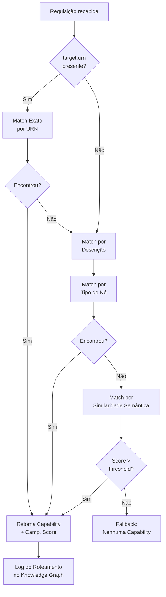
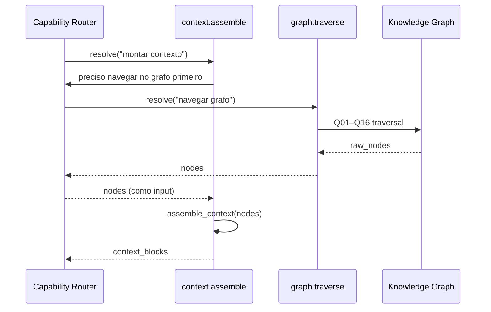
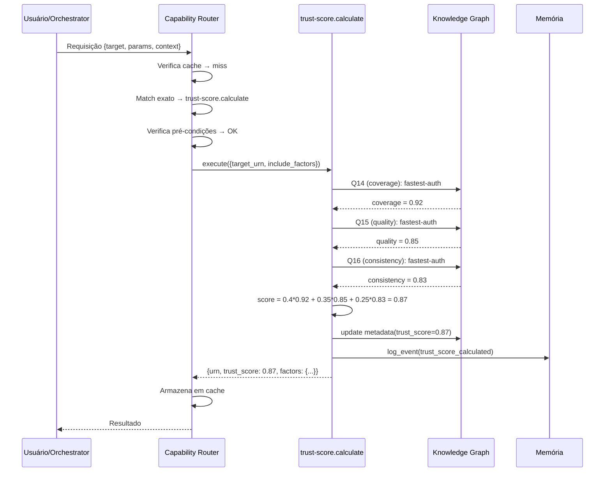

# APOS Capability Routing — Estratégia de Roteamento de Requisições

**Documento:** CAPABILITY_ROUTING.md  
**Release:** R0 | **Sprint:** 0.6  
**Tarefa:** T0.6.4 — Roteamento de requisições para capabilities  
**Dependência:** CAPABILITY_MODEL.md (modelo de capabilities), CAPABILITY_TAXONOMY.md (hierarquia), NODE_TYPES.md (tipos de nó), QUERY_PATTERNS.md (padrões de navegação)  
**Criado em:** 2026-07-21  
**Versão:** v0.1-draft

---

## Índice

1. [Introdução](#1-introdução)
2. [Formato de Requisição](#2-formato-de-requisição)
3. [Algoritmo de Resolução](#3-algoritmo-de-resolução)
4. [Chain de Capabilities](#4-chain-de-capabilities)
5. [Cache de Roteamento](#5-cache-de-roteamento)
6. [Exemplo Completo](#6-exemplo-completo)
7. [Referências](#7-referências)

---

## 1. Introdução

### 1.1 O Que É o Capability Router do APOS

O **Capability Router** é o subsistema que **recebe uma requisição textual ou estruturada** e **decide qual capability deve executá-la**. Ele é o ponto de entrada único para toda operação no APOS — da pergunta do usuário à chamada de função no Knowledge Graph.

```
Requisição do Agente / Usuário
         │
         ▼
┌─────────────────────────┐
│   Capability Router     │  ← ESTE DOCUMENTO
│                         │
│   1. Parse → Resolve    │
│   2. Chain (se houver)  │
│   3. Cache              │
│   4. Executa            │
└─────────────────────────┘
         │
         ▼
   Capability alvo
         │
         ▼
   Knowledge Graph
```

### 1.2 Relação com Outros Documentos

| Documento | Papel | Como se relaciona |
|-----------|-------|-------------------|
| **CAPABILITY_MODEL.md** | Estrutura da capability (substantivo) | Define o que a capability expõe (input, output, pré-condições) |
| **CAPABILITY_TAXONOMY.md** | Classificação da capability (adjetivo) | Fornece a hierarquia para match semântico |
| **AGENT_MAP.md** | Quem executa a capability (sujeito) | Determina os `enabled_agents` no roteamento |
| **CAPABILITY_ROUTING.md** | Funcionamento do roteamento (verbo) | Define algoritmo, cache, chain — ESTE DOCUMENTO |

### 1.3 Princípios de Roteamento

1. **Determinismo Preferencial** — Sempre que possível, o mesmo input roteia para a mesma capability
2. **Fallback Explícito** — Se nenhuma capability atende, a resposta é clara (não um erro genérico)
3. **Rastreabilidade** — Toda decisão de roteamento é logada como evento no KG
4. **Custo Zero** — Cache de roteamento evita re-resolver requisições frequentes
5. **Eficiência** — Match exato é testado antes de match semântico (mais caro por último)

---

## 2. Formato de Requisição

### 2.1 Schema da Requisição

Toda requisição ao Capability Router segue o formato abaixo:

```python
@dataclass
class CapabilityRequest:
    id: str                            # UUID único da requisição (para rastreamento)
    type: Literal["capability"]        # Tipo fixo — identifica que é uma requisição de capability
    target: CapabilityTarget           # Alvo — URN ou descrição textual do que se deseja
    params: dict                       # Parâmetros adicionais (opcionais)
    context: RequestContext            # Contexto da requisição (agente, sessão, rastreabilidade)
    metadata: RequestMetadata          # Metadados de controle (timeout, ttl, prioridade)
```

#### `id` — Identificador Único da Requisição

```python
import uuid
request_id = str(uuid.uuid4())  # Ex: "a1b2c3d4-e5f6-7890-abcd-ef1234567890"
```

#### `type` — Tipo da Requisição

Sempre `"capability"`. Reservado para expansão futura (ex.: `"query"`, `"workflow"`).

#### `target` — Alvo da Requisição

```python
@dataclass
class CapabilityTarget:
    urn: str | None              # URN exata (ex.: "urn:apos:task:oauth-123")
    description: str | None      # Descrição textual do que se deseja (ex.: "calcular trust score")
    expected_type: str | None    # Tipo de resultado esperado (ex.: "trust_score", "orphan_list")
```

Apenas um dos campos é obrigatório. A combinação `urn + description` produz roteamento mais preciso.

#### `params` — Parâmetros da Requisição

```python
params = {
    "depth": 2,
    "include_factors": True,
    "max_tokens": 4000,
    "filters": {"edge_types": ["cp", "pd"]}
}
```

#### `context` — Contexto da Requisição

```python
@dataclass
class RequestContext:
    agent_id: str                # URN do agente solicitante
    session_id: str              # ID da sessão atual
    user_intent: str | None      # Intenção original do usuário (se aplicável)
    priority: RequestPriority    # Prioridade da requisição
    origin: RequestOrigin        # Origem da requisição

class RequestPriority(Enum):
    LOW      = "low"       # Tarefas em segundo plano, relatórios
    NORMAL   = "normal"    # Consultas de agentes (padrão)
    HIGH     = "high"      # Requisições de usuário interativo
    CRITICAL = "critical"  # Alertas, correções urgentes

class RequestOrigin(Enum):
    USER      = "user"       # Requisição direta de usuário
    AGENT     = "agent"      # Requisição de outro agente
    WORKFLOW  = "workflow"   # Requisição de um workflow orquestrado
    SYSTEM    = "system"     # Requisição automática do sistema (cron, watcher)
```

#### `metadata` — Metadados de Controle

```python
@dataclass
class RequestMetadata:
    ttl_seconds: int = 30         # Tempo máximo para resolver e executar
    max_retries: int = 0          # Número de retentativas se falhar
    cache_ttl: int = 300          # Segundos para cache desta resolução
    trace_id: str                 # Trace ID distribuído para observabilidade
    timeout: int = 60             # Timeout em segundos
```

### 2.2 Exemplo Completo de Requisição

```json
{
    "id": "a1b2c3d4-e5f6-7890-abcd-ef1234567890",
    "type": "capability",
    "target": {
        "urn": "urn:apos:task:oauth-123",
        "description": "calcular trust score da Task de autenticação OAuth",
        "expected_type": "trust_score"
    },
    "params": {
        "include_factors": true
    },
    "context": {
        "agent_id": "urn:apos:agent:orchestrator",
        "session_id": "sess-abc-456",
        "user_intent": "Quero saber o quão confiável é a task oauth-123",
        "priority": "normal",
        "origin": "user"
    },
    "metadata": {
        "ttl_seconds": 30,
        "max_retries": 2,
        "cache_ttl": 300,
        "trace_id": "trace-xyz-789",
        "timeout": 60
    }
}
```

---

## 3. Algoritmo de Resolução

O algoritmo de resolução decide **qual capability executar** para uma dada requisição. Ele segue uma sequência de estratégias, da mais barata (match exato) para a mais cara (similaridade semântica).

### 3.1 Pipeline de Resolução



### 3.2 Estratégia 1 — Match Exato por Nome

**Quando usar:** A requisição especifica o nome exato da capability.

**Entrada:** `target.description` contém o nome exato (ex.: `"graph.traverse"`, `"trust-score.calculate"`).

**Algoritmo:**

```python
def match_exact_by_name(request: CapabilityRequest,
                         registry: CapabilityRegistry) -> MatchResult | None:
    """Tenta match exato pelo nome da capability."""

    desc = (request.target.description or "").lower().strip()
    urn = (request.target.urn or "").lower()

    # 1. Tenta match por URN da capability
    if urn and urn.startswith("urn:apos:cap:"):
        cap = registry.get(urn)
        if cap and cap.status == "ready":
            return MatchResult(
                capability=cap,
                method="exact_urn",
                confidence=1.0,
                reasoning=f"URN exata {urn} corresponde à capability"
            )

    # 2. Tenta match por nome exato
    name_variants = [
        desc,
        desc.replace("-", "."),
        desc.replace(" ", "."),
        desc.replace("_", "."),
        desc.replace("-", "_"),
    ]

    candidates = registry.find(status="ready")

    for variant in name_variants:
        for cap in candidates:
            if cap.name.lower() == variant:
                return MatchResult(
                    capability=cap,
                    method="exact_name",
                    confidence=1.0,
                    reasoning=f"Nome exato '{variant}' corresponde à capability {cap.id}"
                )

    return None
```

**Variantes de nome aceitas:**

| Entrada | Capability |
|---------|------------|
| `trust-score.calculate` | `trust-score.calculate` |
| `trust_score.calculate` | `trust-score.calculate` |
| `trust score calculate` | `trust-score.calculate` |
| `context assembly` | `context.assemble` |

### 3.3 Estratégia 2 — Match por Tipo de Nó

**Quando usar:** A requisição especifica uma URN de nó do KG ou um tipo de nó (task, feature, okr, etc.).

**Cada capability declara sobre quais tipos de nó opera.** A matriz abaixo é extraída do CAPABILITY_MODEL.md (§4.4):

| Nó / Tipo | Capabilities que operam sobre ele |
|-----------|----------------------------------|
| **Task** | `graph.traverse`, `context.assemble`, `query.execute`, `trust-score.calculate`, `orphans.detect`, `cycles.detect`, `impact.analyze`, `integrity.validate`, `coverage.report`, `task-to-okr` |
| **Feature** | `graph.traverse`, `context.assemble`, `query.execute`, `trust-score.calculate`, `orphans.detect`, `impact.analyze`, `integrity.validate`, `coverage.report`, `task-to-okr`, `feature-metrics` |
| **Release** | `graph.traverse`, `context.assemble`, `query.execute`, `trust-score.calculate`, `integrity.validate`, `coverage.report` |
| **OKR** | `graph.traverse`, `context.assemble`, `query.execute`, `trust-score.calculate`, `orphans.detect`, `integrity.validate`, `coverage.report`, `task-to-okr` |
| **Metric** | `graph.traverse`, `context.assemble`, `query.execute`, `trust-score.calculate`, `orphans.detect`, `integrity.validate`, `coverage.report`, `feature-metrics`, `metrics.refresh` |
| **Sprint** | `graph.traverse`, `context.assemble` |
| **Persona** | `graph.traverse`, `context.assemble` |

**Algoritmo:**

```python
def match_by_node_type(request: CapabilityRequest,
                        registry: CapabilityRegistry) -> MatchResult | None:
    """Tenta encontrar a capability mais adequada pelo tipo de nó."""

    # 1. Extrai o tipo de nó da URN ou da descrição
    node_type = _extract_node_type(request)

    if not node_type:
        return None

    # 2. Busca capabilities habilitadas para este tipo de nó
    candidates = registry.find(status="ready")

    # 3. Filtra por tipo de nó (via kg_read.node_types)
    matching = []
    for cap in candidates:
        reads = cap.kg_read or []
        node_types_read = set()
        for r in reads:
            if isinstance(r, dict) and "nodes" in r:
                node_types_read.update(r["nodes"])

        if node_type in node_types_read:
            match_score = _score_capability_for_node(cap, node_type, request)
            matching.append((cap, match_score))

    if not matching:
        return None

    # 4. Retorna a melhor
    matching.sort(key=lambda x: x[1], reverse=True)
    best_cap, best_score = matching[0]

    # Se muitas candidatas têm score similar, usa a descrição para desempatar
    if len(matching) > 1 and best_score == matching[1][1]:
        best_cap = _disambiguate_by_description(best_cap, matching, request)

    return MatchResult(
        capability=best_cap,
        method="node_type",
        confidence=_normalize_confidence(best_score),
        reasoning=f"Nó do tipo '{node_type}' encontrado em {len(matching)} capabilities. "
                  f"Melhor: {best_cap.name} (score: {best_score})"
    )
```

**Exemplo:** Requisição com `target.urn = "urn:apos:task:oauth-123"` → extrai tipo `task` → candidates: `graph.traverse`, `context.assemble`, `trust-score.calculate`, `task-to-okr`, etc. → desempatado pelo `expected_type` ou `description`.

### 3.4 Estratégia 3 — Match por Similaridade Semântica

**Quando usar:** Os métodos anteriores não produziram match com confiança suficiente.

**Como funciona:**

```python
def match_by_semantic_similarity(request: CapabilityRequest,
                                   registry: CapabilityRegistry) -> MatchResult | None:
    """Usa embeddings + cosine similarity para encontrar a melhor capability."""

    # 1. Gera embedding da descrição da requisição
    request_embedding = embed_text(
        f"{request.target.description or ''} {request.target.expected_type or ''}"
    )

    # 2. Gera embedding da descrição + tags + nome de cada capability
    candidates = registry.find(status="ready")
    scored = []

    for cap in candidates:
        cap_text = f"{cap.name} {cap.description} {' '.join(cap.metadata.tags)}"
        cap_embedding = embed_text(cap_text)

        similarity = cosine_similarity(request_embedding, cap_embedding)
        scored.append((cap, similarity))

    # 3. Ordena por similaridade
    scored.sort(key=lambda x: x[1], reverse=True)

    if not scored or scored[0][1] < SEMANTIC_THRESHOLD:
        return None

    best_cap, best_score = scored[0]

    return MatchResult(
        capability=best_cap,
        method="semantic",
        confidence=best_score,
        reasoning=f"Similaridade semântica: {best_score:.2f} com capability {best_cap.name}"
    )
```

**Thresholds:**

| Pontuação | Confiança | Ação |
|:---------:|:---------:|------|
| 0.90–1.00 | Alta      | Match aceito automaticamente |
| 0.70–0.89 | Média     | Match aceito, logado como "baixa confiança" |
| 0.50–0.69 | Baixa     | Match aceito apenas se for a única candidata |
| < 0.50    | Muito baixa | Rejeitado → Fallback |

### 3.5 Fallback — Nenhuma Capability Atende

Quando todas as estratégias falham, o Router retorna uma resposta estruturada indicando que não há capability disponível.

```python
class NoCapabilityResult:
    reason: NoCapabilityReason    # Motivo da falha
    suggestions: list[str]        # Sugestões de capabilities próximas
    query_suggestions: list[str]  # Sugestões de como reformular a requisição

class NoCapabilityReason(Enum):
    NO_MATCH            = "no_match"              # Nenhuma capability corresponde
    ALL_DISABLED        = "all_disabled"          # Capabilities existem mas estão desabilitadas
    PRECONDITIONS_FAIL  = "preconditions_fail"    # Nenhuma capability tem pré-condições satisfeitas
    AMBIGUOUS           = "ambiguous"             # Múltiplas capabilities sem critério de desempate
```

**Exemplo de resposta de fallback:**

```json
{
    "status": "no_capability",
    "reason": "no_match",
    "message": "Nenhuma capability atende à requisição 'calcular impacto financeiro'.",
    "suggestions": [
        "impact.analyze — analisa impacto de mudanças em tasks e features",
        "trust-score.calculate — calcula confiabilidade de nós no grafo"
    ],
    "query_suggestions": [
        "Analisar impacto da task X",
        "Calcular trust score da feature Y"
    ]
}
```

### 3.6 Algoritmo Completo

```python
def resolve_capability(request: CapabilityRequest,
                       registry: CapabilityRegistry) -> MatchResult | NoCapabilityResult:
    """Algoritmo completo de resolução de capability."""

    # 0. Verifica cache
    cached = routing_cache.get(request)
    if cached:
        log_route(request, cached, hit=True)
        return cached

    # 1. Match exato (mais barato)
    result = match_exact_by_name(request, registry)
    if result:
        routing_cache.set(request, result)
        log_route(request, result)
        return result

    # 2. Match por tipo de nó
    result = match_by_node_type(request, registry)
    if result and result.confidence >= 0.8:
        routing_cache.set(request, result)
        log_route(request, result)
        return result

    # 3. Match semântico (mais caro)
    result = match_by_semantic_similarity(request, registry)
    if result:
        routing_cache.set(request, result)
        log_route(request, result)
        return result

    # 4. Fallback
    fallback = build_fallback(request, registry)
    log_route(request, fallback)
    return fallback


def log_route(request: CapabilityRequest, result: MatchResult | NoCapabilityResult):
    """Registra a decisão de roteamento como evento no Knowledge Graph."""
    memory.log_event(
        type="routing_decision",
        urns_affected=[request.target.urn] if request.target.urn else [],
        delta={
            "request_id": request.id,
            "agent_id": request.context.agent_id,
            "method": result.method if isinstance(result, MatchResult) else "fallback",
            "confidence": result.confidence if isinstance(result, MatchResult) else 0.0,
            "capability_id": result.capability.id if isinstance(result, MatchResult) else None,
            "reason": result.reasoning if isinstance(result, MatchResult) else result.reason.value,
            "trace_id": request.metadata.trace_id,
        }
    )
```

---

## 4. Chain de Capabilities

Uma requisição pode exigir a execução de **múltiplas capabilities em sequência** — uma **chain**. O Router detecta quando a capability primária depende de outras e orquestra a execução.

### 4.1 Quando Ocorre Chain

Situações comuns:

| Cenário | Chain |
|---------|-------|
| Calcular trust score de um nó | `graph.traverse` → `trust-score.calculate` |
| Montar contexto para agente | `graph.traverse` → `context.assemble` |
| Analisar impacto com dados frescos | `metrics.refresh` → `impact.analyze` |
| Relatório de cobertura com validação | `orphans.detect` → `coverage.report` |

### 4.2 Exemplo: `context.assemble` → `graph.traverse`



### 4.3 Controle de Profundidade Máxima

Chains podem ter profundidade arbitrária. Para evitar recursão infinita, o Router impõe limites:

```python
@dataclass
class ChainConfig:
    max_depth: int = 5                # Profundidade máxima da chain
    max_breadth: int = 10             # Máximo de capabilities paralelas na chain
    default_timeout_per_step: int = 30  # Timeout por step
    loop_detection_enabled: bool = True
```

**Profundidade 0** = execução direta (sem chain).  
**Profundidade 1** = uma capability chama outra (ex.: `context.assemble` → `graph.traverse`).  
**Profundidade N** = cadeia de N capabilities encadeadas.

### 4.4 Detecção de Loops

O Router mantém um **rastro de capabilities já visitadas** para a requisição atual.

```python
class ChainTracker:
    """Rastreia a chain de capabilities para uma requisição."""

    def __init__(self, request_id: str, config: ChainConfig):
        self.request_id = request_id
        self.config = config
        self.visited: set[str] = set()        # Capabilities já visitadas
        self.chain: list[ChainStep] = []       # Histórico da chain
        self.depth = 0

    def push(self, capability_id: str, input_data: dict) -> bool:
        """Adiciona capability à chain. Retorna False se loop detectado."""
        if capability_id in self.visited and self.config.loop_detection_enabled:
            log_event(
                type="chain_loop_detected",
                delta={
                    "request_id": self.request_id,
                    "capability": capability_id,
                    "chain": self.chain,
                }
            )
            return False  # Loop detectado — interrompe

        if self.depth >= self.config.max_depth:
            log_event(
                type="chain_max_depth_reached",
                delta={
                    "request_id": self.request_id,
                    "depth": self.depth,
                    "max_depth": self.config.max_depth,
                }
            )
            return False  # Profundidade máxima atingida

        self.visited.add(capability_id)
        self.chain.append(ChainStep(
            capability_id=capability_id,
            input_data=input_data,
            started_at=datetime.now(timezone.utc),
        ))
        self.depth += 1
        return True

    def pop(self, result: dict | Exception):
        """Finaliza o step atual com resultado."""
        if self.chain:
            step = self.chain[-1]
            step.completed_at = datetime.now(timezone.utc)
            step.result = result
            self.visited.discard(step.capability_id)

    def can_continue(self) -> bool:
        """Verifica se a chain pode continuar."""
        return self.depth < self.config.max_depth
```

### 4.5 Declaração de Dependências entre Capabilities

Capabilities podem declarar dependências de chain no campo `effects` ou em um campo dedicado `chain_dependencies`:

```python
@dataclass
class ChainDependency:
    capability_id: str        # Capability de que depende
    reason: str               # Por que precisa dela
    input_mapping: dict       # Como mapear input desta → input da dependência
    output_mapping: dict      # Como mapear output da dependência → input desta
    optional: bool = False    # Se a chain pode prosseguir sem esta dependência
```

**Exemplo — `context.assemble` depende de `graph.traverse`:**

```json
{
    "chain_dependencies": [
        {
            "capability_id": "urn:apos:cap:core:graph.traverse",
            "reason": "Precisa navegar no grafo para coletar os nós antes de montar o contexto",
            "input_mapping": {
                "anchor_urn": "{input.anchor_urn}",
                "depth": "{input.depth}"
            },
            "output_mapping": {
                "nodes": "{context.nodes}"
            },
            "optional": true
        }
    ]
}
```

### 4.6 Executor da Chain

```python
async def execute_chain(
    root_capability: Capability,
    request: CapabilityRequest,
    registry: CapabilityRegistry,
    tracker: ChainTracker,
) -> dict:
    """Executa uma capability e suas dependências em chain."""

    # 1. Verifica se pode adicionar à chain
    if not tracker.push(root_capability.id, request.params):
        return {"status": "loop_or_depth_exceeded", "chain": tracker.chain}

    try:
        # 2. Executa dependências da chain (se houver)
        deps = getattr(root_capability, 'chain_dependencies', [])
        dep_results = {}

        for dep in deps:
            dep_cap = registry.get(dep.capability_id)
            if not dep_cap:
                if dep.optional:
                    continue
                raise ChainError(f"Dependência obrigatória {dep.capability_id} não encontrada")

            # Mapeia input
            dep_input = _apply_mapping(dep.input_mapping, request.params, dep_results)

            # Cria requisição para a dependência
            dep_request = CapabilityRequest(
                id=request.id,
                type="capability",
                target=CapabilityTarget(
                    urn=dep.capability_id,
                    description=f"chain dep: {dep.capability_id}",
                    expected_type=None,
                ),
                params=dep_input,
                context=request.context,
                metadata=request.metadata,
            )

            # Resolve e executa recursivamente
            dep_result = await execute_chain(dep_cap, dep_request, registry, tracker)

            # Mapeia output
            dep_results[dep.capability_id] = _apply_mapping(
                dep.output_mapping, dep_result, {}
            )

        # 3. Executa a capability raiz com os resultados das dependências
        merged_input = {**request.params, **dep_results}
        result = await registry.execute(root_capability.id, merged_input,
                                         request.context.agent_id)

        tracker.pop(result)

        return result

    except Exception as e:
        tracker.pop(e)
        raise
```

---

## 5. Cache de Roteamento

Para evitar re-resolver requisições frequentes, o Router mantém um cache de decisões de roteamento.

### 5.1 Estrutura do Cache

```python
@dataclass
class RoutingCacheEntry:
    request_signature: str          # Hash da requisição (chave do cache)
    capability_id: str              # Capability resolvida
    method: str                     # Método de resolução usado
    confidence: float               # Confiança da resolução
    cached_at: str                  # ISO 8601
    expires_at: str                 # ISO 8601 (cached_at + ttl)
    hit_count: int = 0              # Quantas vezes foi servido do cache
```

**Chave do cache (signature):**

```
signature = sha256(
    target.urn + "|" +
    target.description + "|" +
    target.expected_type + "|" +
    json.dumps(params, sort_keys=True)
)
```

### 5.2 TTL por Método de Resolução

| Método | TTL Padrão | Justificativa |
|--------|:----------:|---------------|
| Match exato (URN/nome) | 1 hora | Nomes de capability raramente mudam |
| Match por tipo de nó | 30 minutos | Pode mudar se capabilities forem adicionadas/removidas |
| Match semântico | 10 minutos | Depende de embeddings; pode variar com novas capabilities |
| Fallback (no match) | 5 minutos | Tentar novamente em breve (pode ter surgido capability nova) |

### 5.3 Invalidamento

O cache é invalidado quando:

1. **Nova capability registrada** → invalida cache de match semântico e por tipo de nó
2. **Capability removida/deprecada** → invalida todas as entradas que a referenciam
3. **Registro de agente alterado** → invalida entradas cujo agente não está mais habilitado
4. **TTL expirado** → remoção automática na próxima consulta

### 5.4 Implementação

```python
class RoutingCache:
    """Cache de decisões de roteamento."""

    def __init__(self):
        self._store: dict[str, RoutingCacheEntry] = {}

    def _make_signature(self, request: CapabilityRequest) -> str:
        """Gera assinatura única da requisição."""
        import hashlib, json

        raw = (
            str(request.target.urn or "") + "|" +
            str(request.target.description or "") + "|" +
            str(request.target.expected_type or "") + "|" +
            json.dumps(request.params, sort_keys=True)
        )
        return hashlib.sha256(raw.encode()).hexdigest()

    def get(self, request: CapabilityRequest) -> MatchResult | None:
        """Retorna resultado em cache, se disponível."""
        sig = self._make_signature(request)
        entry = self._store.get(sig)

        if not entry:
            return None

        now = datetime.now(timezone.utc).isoformat()
        if now >= entry.expires_at:
            del self._store[sig]
            return None

        entry.hit_count += 1
        return MatchResult(
            capability=registry.get(entry.capability_id),
            method=RoutingMethod[entry.method.upper()],
            confidence=entry.confidence,
            reasoning=f"Cached (método: {entry.method}, hits: {entry.hit_count})"
        )

    def set(self, request: CapabilityRequest, result: MatchResult):
        """Armazena resultado no cache."""
        ttl_map = {
            "exact_urn": 3600,
            "exact_name": 3600,
            "node_type": 1800,
            "semantic": 600,
            "fallback": 300,
        }

        now = datetime.now(timezone.utc)
        ttl = ttl_map.get(result.method, 300)

        sig = self._make_signature(request)
        self._store[sig] = RoutingCacheEntry(
            request_signature=sig,
            capability_id=result.capability.id,
            method=result.method,
            confidence=result.confidence,
            cached_at=now.isoformat(),
            expires_at=(now + timedelta(seconds=ttl)).isoformat(),
        )

    def invalidate(self, capability_id: str | None = None, method: str | None = None):
        """Invalida entradas do cache."""
        if capability_id:
            self._store = {
                k: v for k, v in self._store.items()
                if v.capability_id != capability_id
            }
        elif method:
            self._store = {
                k: v for k, v in self._store.items()
                if v.method != method
            }
        # Se ambos None, limpa tudo
        if not capability_id and not method:
            self._store = {}


# Singleton global
routing_cache = RoutingCache()
```

---

## 6. Exemplo Completo

### 6.1 Requisição: "Calcular trust score da Feature X"

**Entrada (requisição do agente `orchestrator`):**

```json
{
    "id": "req-ts-001",
    "type": "capability",
    "target": {
        "urn": "urn:apos:feature:faster-auth",
        "description": "calcular trust score da Feature de autenticação rápida",
        "expected_type": "trust_score"
    },
    "params": {
        "include_factors": true
    },
    "context": {
        "agent_id": "urn:apos:agent:orchestrator",
        "session_id": "sess-abc-456",
        "user_intent": "Quero saber o quão confiável é a feature faster-auth",
        "priority": "normal",
        "origin": "user"
    },
    "metadata": {
        "ttl_seconds": 30,
        "max_retries": 2,
        "cache_ttl": 300,
        "trace_id": "trace-ts-001",
        "timeout": 60
    }
}
```

### 6.2 Resolução Passo a Passo

```
PASSO 1: Verificar cache
  → Signature: sha256("urn:apos:feature:faster-auth|calcular trust score|trust_score|{\"include_factors\":true}")
  → Cache miss (primeira vez)

PASSO 2: Match exato por nome
  → Descrição: "calcular trust score da Feature de autenticação rápida"
  → Tenta variantes: "calcular", "trust-score.calculate", "trust.score.calculate", ...
  → Nome exato "trust-score.calculate" encontrado!
  → Confiança: 1.0 (exact match)
  → Método: exact_name

PASSO 3: Verificar pré-condições
  ➤ Nó "urn:apos:feature:faster-auth" existe no KG? ✅ Sim
  ➤ Nó tem arestas de entrada/saída? ✅ Sim

PASSO 4: Executar chain (se houver)
  → trust-score.calculate não declara chain_dependencies obrigatórias
  → Chain depth = 0  (execução direta)

PASSO 5: Armazenar em cache
  → TTL: 1 hora (match exato)
  → armazenado com signature hash

PASSO 6: Executar capability
```

### 6.3 Execução da Capability



### 6.4 Resultado

```json
{
    "status": "completed",
    "request_id": "req-ts-001",
    "routing": {
        "method": "exact_name",
        "confidence": 1.0,
        "capability_id": "urn:apos:cap:governance:trust-score.calculate",
        "chain_depth": 0,
        "cached": false,
        "trace_id": "trace-ts-001"
    },
    "result": {
        "urn": "urn:apos:feature:faster-auth",
        "trust_score": 0.87,
        "factors": {
            "coverage": 0.92,
            "quality": 0.85,
            "consistency": 0.83
        },
        "evaluated_at": "2026-07-21T10:00:00Z"
    }
}
```

### 6.5 Exemplos Adicionais

| Requisição | Método de Resolução | Capability | Chain |
|-----------|:-------------------:|------------|:-----:|
| "Navegar no grafo a partir da task X" | exact_name | `graph.traverse` | — |
| "Montar contexto para o agente task-worker sobre a feature Y" | exact_name | `context.assemble` | `graph.traverse` (opcional) |
| "Detectar tasks órfãs no sprint atual" | node_type → task | `orphans.detect` | — |
| "Qual o impacto de bloquear a task de oauth?" | description similarity | `impact.analyze` | — |
| "Atualizar métrica de login-time" | node_type → metric | `metrics.refresh` | — |
| "Relatório de cobertura geral" | exact_name | `coverage.report` | — |
| "Quais OKRs estão sem métricas?" | node_type → okr + semantic | `orphans.detect` | — |
| "Verificar integridade de todos os nós" | description similarity | `integrity.validate` | — |
| "Listar features e suas métricas" | node_type → feature | `feature-metrics` | — |

---

## 7. Referências

| Documento | Relação |
|-----------|---------|
| [CAPABILITY_MODEL.md](CAPABILITY_MODEL.md) | Estrutura de capabilities, pré-condições, efeitos |
| [CAPABILITY_TAXONOMY.md](CAPABILITY_TAXONOMY.md) | Hierarquia de classificação para match semântico |
| [NODE_TYPES.md](../sprint-0.4/NODE_TYPES.md) | Tipos de nó usados no match por tipo |
| [EDGE_TYPES.md](../sprint-0.4/EDGE_TYPES.md) | Tipos de aresta navegados por capabilities |
| [QUERY_PATTERNS.md](../sprint-0.4/QUERY_PATTERNS.md) | Padrões Q01–Q16 que capabilities usam |
| [CONTEXT_MODEL.md](../sprint-0.5/CONTEXT_MODEL.md) | Pipeline que `context.assemble` orquestra |
| [MEMORY_MODEL.md](../sprint-0.5/MEMORY_MODEL.md) | Onde eventos de roteamento são registrados |
| [KNOWLEDGE_GRAPH.md](../sprint-0.4/KNOWLEDGE_GRAPH.md) | Estrutura base do grafo |

---

**Última atualização:** 2026-07-21  
**Versão:** v0.1-draft  
**Próximo documento:** [AGENT_MAP.md](AGENT_MAP.md) — Mapeamento de agentes para capabilities
