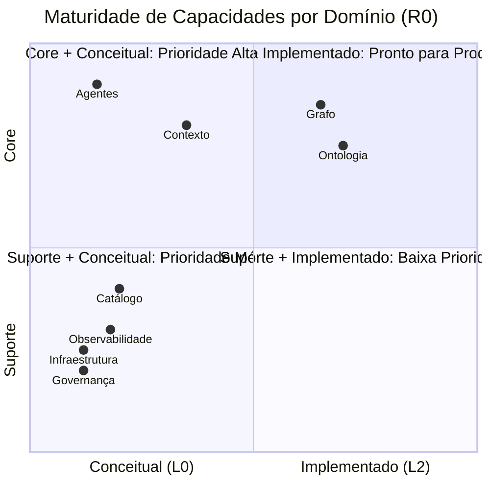

# APOS Capability Taxonomy — Hierarquia de Classificação de Capabilities

**Documento:** CAPABILITY_TAXONOMY.md  
**Release:** R0 | **Sprint:** 0.6  
**Tarefa:** T0.6.2 — Taxonomia de capabilities  
**Dependência:** CAPABILITY_MODEL.md (modelo de capabilities)  
**Criado em:** 2026-07-21  
**Versão:** v0.1-draft

---

## Índice

1. [Introdução](#1-introdução)
2. [Estrutura Hierárquica](#2-estrutura-hierárquica)
3. [Categorias de Capabilities](#3-categorias-de-capabilities)
4. [Matriz de Categorias × Domínios × Maturidade](#4-matriz-de-categorias--domínios--maturidade)
5. [Critérios de Classificação](#5-critérios-de-classificação)
6. [Exemplos Completos](#6-exemplos-completos)
7. [Referências](#7-referências)

---

## 1. Introdução

### 1.1 O Que É a Taxonomia de Capabilities do APOS

A **Capability Taxonomy** é o sistema de classificação hierárquica que organiza todas as **capacidades operacionais** do APOS em uma estrutura consistente, rastreável e extensível.

Ela responde a três perguntas fundamentais:

1. **O que o APOS sabe fazer?** — Inventário completo de capacidades
2. **Como essas capacidades se relacionam?** — Hierarquia de domínios, capacidades, habilidades e ações
3. **Qual o nível de maturidade de cada capacidade?** — Evolução de conceitual a otimizada

### 1.2 Propósito

| Objetivo | Descrição |
|----------|-----------|
| **Classificação** | Organizar capabilities em categorias e níveis hierárquicos consistentes |
| **Rastreabilidade** | Permitir que qualquer requisição seja mapeada até a ação elementar que a executa |
| **Maturidade** | Avaliar o estado evolutivo de cada capacidade (conceitual → otimizada) |
| **Extensibilidade** | Garantir que novas capabilities sejam inseridas sem quebrar a taxonomia existente |
| **Governança** | Fornecer base para auditoria, trust scoring e detecção de órfãos |

### 1.3 Relação com o Capability Model

Enquanto o **CAPABILITY_MODEL.md** define **o que é uma capability** (estrutura, atributos, ciclo de vida), a **CAPABILITY_TAXONOMY.md** define **como as capabilities se organizam** (hierarquia, categorias, critérios de classificação).

```
CAPABILITY_MODEL.md          → Estrutura da capability (substantivo)
CAPABILITY_TAXONOMY.md       → Classificação da capability (adjetivo + hierarquia)
AGENT_MAP.md                 → Quem executa a capability (sujeito)
CAPABILITY_ROUTING.md         → Como a capability é roteada (verbo)
```

### 1.4 Princípios da Taxonomia

1. **Hierarquia Estrita** — Cada nível herda do superior; não há saltos de nível
2. **Mutual Exclusividade** — Uma habilidade pertence a exatamente uma capacidade e um domínio
3. **Granularidade Consistente** — Ações são atômicas; habilidades são compostas; capacidades são agrupamentos
4. **Rastreabilidade Bidirecional** — Do domínio à ação e da ação ao domínio
5. **Evolução Controlada** — Mudanças na taxonomia seguem o ciclo de governança do APOS

---

## 2. Estrutura Hierárquica

A taxonomia do APOS possui **4 níveis hierárquicos**:

```
Domínio (Nível 1)         → Área de negócio
    │
    ├── Capacidade (Nível 2)   → Agrupamento de habilidades afins
    │       │
    │       ├── Habilidade (Nível 3)   → Ação atômica composta
    │       │       │
    │       │       ├── Ação (Nível 4)   → Operação elementar
    │       │       └── Ação (Nível 4)
    │       │
    │       └── Habilidade (Nível 3)
    │
    └── Capacidade (Nível 2)
```

### 2.1 Nível 1 — Domínio

**Definição:** Área de negócio de alto nível que agrupa capacidades relacionadas a um mesmo propósito estratégico.

**Características:**
- Máximo de 8 domínios no APOS R0
- Mutuamente exclusivos (uma capacidade não pode estar em 2 domínios)
- Nome curto (1-2 palavras), em português

**Domínios do APOS R0:**

| ID | Domínio | Descrição | Exemplo de Capacidade |
|:--:|---------|-----------|----------------------|
| DOM-01 | **Contexto** | Montagem, gestão e entrega de contexto semântico para agentes | Montagem de Contexto, Memória de Sessão |
| DOM-02 | **Grafo** | Operações sobre o Knowledge Graph (nós, arestas, queries) | Navegação do Grafo, Query Patterns |
| DOM-03 | **Agentes** | Ciclo de vida, dispatchers e execução de agentes de IA | Dispatching, Ciclo de Vida |
| DOM-04 | **Governança** | Auditoria, trust score, regras e conformidade | Trust Score, Semantic Gates |
| DOM-05 | **Ontologia** | Definição, validação e evolução da ontologia do sistema | Gestão de Ontologia, Restrições |
| DOM-06 | **Catálogo** | Linhagem de dados, proveniência e metadados | Rastreabilidade, Qualidade |
| DOM-07 | **Infraestrutura** | Suporte técnico: logging, cache, transporte MCP | Cache, Transporte, Logging |
| DOM-08 | **Observabilidade** | Métricas, tracing e monitoramento do sistema | Métricas, Alertas |

### 2.2 Nível 2 — Capacidade

**Definição:** Agrupamento coeso de habilidades que realizam um objetivo comum dentro de um domínio.

**Características:**
- Nome no formato `[Substantivo] de/do [Complemento]` (ex.: Montagem de Contexto)
- Agrupa 2 a 8 habilidades
- Tem atributos de maturidade, versão e owner

**Exemplo de estrutura de capacidade:**

```
Capacidade: Montagem de Contexto
  Domínio: Contexto
  Maturidade: ESTRUTURADO (L2)
  Habilidades: [Extrair, Montar, Priorizar, Compactar]
```

### 2.3 Nível 3 — Habilidade

**Definição:** Ação atômica composta que transforma uma entrada em uma saída específica, utilizando uma ou mais ações elementares.

**Características:**
- Nome no infinitivo (ex.: Extrair contexto do KG)
- Executada por um agente ou subsistema
- Tem entrada (parâmetros), saída (resultado) e pré-condições

**Assinatura de uma Habilidade:**

```python
@dataclass
class Habilidade:
    id: str                          # ID único (ex.: "ctx-extract")
    nome: str                        # Nome legível (ex.: "Extrair contexto do KG")
    capacidade_id: str               # Capacidade pai
    entrada: dict[str, type]         # Parâmetros esperados
    saída: type                      # Tipo do retorno
    pré_condições: list[str]         # Condições que devem ser verdade
    ações: list[str]                 # Ações elementares que compõem a habilidade
    version: str                     # Versão semântica
```

### 2.4 Nível 4 — Ação

**Definição:** Operação elementar atômica e indivisível sobre o sistema. É a menor unidade de capability na taxonomia.

**Características:**
- Mapeia 1:1 para uma chamada de API, método de classe ou função do sistema
- Nome no formato `[Subsistema].[ação]()` (ex.: `KnowledgeGraph.traverse()`)
- Sem dependências de outras ações no mesmo nível
- Serve como unidade de rastreamento e auditoria

**Exemplos de Ações:**

| Ação | Chamada Correspondente | Descrição |
|------|------------------------|-----------|
| `KG.traverse()` | `KnowledgeGraph.traverse(urn, depth)` | Navega o grafo a partir de uma URN |
| `CM.build_context()` | `ContextModel.build_context(urn, max_tokens)` | Monta contexto para agente |
| `TS.calculate()` | `TrustScore.calculate(urn)` | Calcula trust score de um nó |
| `CM.compress()` | `ContextBlock.compress()` | Comprime bloco de contexto |

### 2.5 Representação Formal da Hierarquia

```python
@dataclass
class Dominio:
    id: str
    nome: str
    descricao: str
    capacidades: list[str]  # IDs das capacidades

@dataclass
class Capacidade:
    id: str
    nome: str
    dominio_id: str
    categoria: Categoria  # Core | Suporte | Governanca
    maturidade: Maturidade  # Conceitual | Estruturado | Implementado | Otimizado
    habilidades: list[str]  # IDs das habilidades
    version: str

@dataclass
class Habilidade:
    id: str
    nome: str
    capacidade_id: str
    entrada: dict
    saida: type
    pre_condicoes: list[str]
    acoes: list[str]
    version: str

@dataclass
class Acao:
    id: str
    nome: str                     # Ex.: "KnowledgeGraph.traverse()"
    chamada: str                  # Ex.: "KG.traverse(urn, depth)"
    descricao: str
    habilidade_id: str
    params: list[Param]
    retorno: type
```

---

## 3. Categorias de Capabilities

As capabilities são classificadas em **3 categorias** que cortam transversalmente os domínios:

### 3.1 Categoria Core

**Definição:** Capabilities essenciais para o funcionamento do APOS. Sem elas, o sistema não entrega valor.

**Critérios de Inclusão:**
- Sem esta capability, uma funcionalidade principal do APOS não funciona
- Impacta diretamente a experiência do usuário/agente
- Faz parte do caminho crítico de pelo menos uma jornada primária

**Capabilities Core (R0):**

| Capacidade | Domínio | Justificativa Core |
|------------|---------|-------------------|
| Montagem de Contexto | Contexto | Sem contexto, agentes não têm informação para agir |
| Navegação do Grafo | Grafo | Sem grafo, não há conhecimento conectado |
| Dispatching de Agentes | Agentes | Sem dispatching, requisições não chegam aos agentes |
| Gestão de Ontologia | Ontologia | Sem ontologia, não há semântica formal |
| Pipeline de Contexto | Contexto | Pipeline é o coração da transformação KG → agente |

### 3.2 Categoria Suporte

**Definição:** Capabilities auxiliares que viabilizam ou otimizam a operação das capabilities Core.

**Critérios de Inclusão:**
- Não é essencial para o funcionamento mínimo, mas melhora significativamente a operação
- Provê serviços transversais (logging, cache, transporte)
- Pode ser substituída sem impacto direto na semântica do sistema

**Capabilities Suporte (R0):**

| Capacidade | Domínio | Justificativa Suporte |
|------------|---------|----------------------|
| Cache de Contexto | Infraestrutura | Acelera consultas repetidas, mas não essencial |
| Transporte MCP | Infraestrutura | Viabiliza conexão com fontes externas |
| Logging e Tracing | Observabilidade | Auxilia debugging, mas não afeta execução |
| Compressão de Blocos | Contexto | Otimiza uso de tokens, mas não é obrigatória |

### 3.3 Categoria Governança

**Definição:** Capabilities de auditoria, qualidade e conformidade que garantem a integridade do sistema.

**Critérios de Inclusão:**
- Monitora, avalia ou restringe outras capabilities
- Relacionada a trust score, orphans, regras de negócio
- Executa em caráter preventivo ou corretivo (não em tempo real de produção)

**Capabilities Governança (R0):**

| Capacidade | Domínio | Justificativa Governança |
|------------|---------|--------------------------|
| Trust Score | Governança | Avalia confiabilidade de nós e agentes |
| Detecção de Órfãos | Governança | Identifica nós desconectados no grafo |
| Semantic Gates | Governança | Valida alinhamento semântico antes de ações |
| Auditoria de Ações | Governança | Rastreia quem executou o quê e quando |
| Qualidade de Dados | Catálogo | Avalia completude e acurácia dos dados |

### 3.4 Mapa de Categorias × Domínios

```
                    CORE        SUPORTE      GOVERNANÇA
                    ─────       ──────        ──────────
Contexto           █████       ██░░░         ░░░░░
Grafo              █████       ░░░░░         ░░░░░
Agentes            █████       ░░░░░         ░░░░░
Governança         ░░░░░       ░░░░░         █████
Ontologia          █████       ██░░░         ░░░░░
Catálogo           ░░░░░       █████         ██░░░
Infraestrutura     ░░░░░       █████         ░░░░░
Observabilidade    ░░░░░       █████         ██░░░

Legenda: █████ = Aplica | ██░░░ = Aplica Parcial | ░░░░░ = Não Aplica
```

---

## 4. Matriz de Categorias × Domínios × Maturidade

### 4.1 Níveis de Maturidade

A maturidade de cada capacidade evolui em **4 níveis**:

| Nível | Nome | Definição | Critério de Aprovação |
|:-----:|------|-----------|----------------------|
| **L0** | Conceitual | Capacidade documentada como conceito, sem implementação | Documento de especificação aprovado |
| **L1** | Estruturado | Capacidade com estrutura formal (atributos, assinaturas) | Dataclass/interface definida e revisada |
| **L2** | Implementado | Capacidade com implementação funcional em código | Testes passando, PR mergeado |
| **L3** | Otimizado | Capacidade com métricas de performance e melhorias contínuas | Benchmarks, revisão de performance |

### 4.2 Matriz Completa

| Domínio | Capacidade | Categoria | Maturidade R0 | Maturidade Target R1 | Depende de |
|---------|-----------|-----------|:-------------:|:--------------------:|------------|
| **Contexto** | Montagem de Contexto | Core | L1 (Estruturado) | L2 (Implementado) | DOM-02 Grafo |
| **Contexto** | Pipeline de Contexto | Core | L1 (Estruturado) | L2 (Implementado) | Montagem de Contexto |
| **Contexto** | Memória de Sessão | Core | L0 (Conceitual) | L2 (Implementado) | Pipeline de Contexto |
| **Contexto** | Compressão de Blocos | Suporte | L1 (Estruturado) | L2 (Implementado) | Montagem de Contexto |
| **Grafo** | Navegação do Grafo | Core | L2 (Implementado) | L3 (Otimizado) | DOM-05 Ontologia |
| **Grafo** | Query Patterns | Core | L2 (Implementado) | L3 (Otimizado) | Navegação do Grafo |
| **Grafo** | Gestão de Nós | Core | L1 (Estruturado) | L2 (Implementado) | Navegação do Grafo |
| **Grafo** | Gestão de Arestas | Core | L1 (Estruturado) | L2 (Implementado) | Navegação do Grafo |
| **Agentes** | Dispatching | Core | L0 (Conceitual) | L2 (Implementado) | DOM-01 Contexto |
| **Agentes** | Ciclo de Vida | Core | L0 (Conceitual) | L1 (Estruturado) | Dispatching |
| **Agentes** | Roteamento | Core | L0 (Conceitual) | L2 (Implementado) | Dispatching |
| **Governança** | Trust Score | Governança | L0 (Conceitual) | L2 (Implementado) | DOM-02 Grafo |
| **Governança** | Detecção de Órfãos | Governança | L0 (Conceitual) | L1 (Estruturado) | DOM-02 Grafo |
| **Governança** | Semantic Gates | Governança | L0 (Conceitual) | L1 (Estruturado) | DOM-05 Ontologia |
| **Governança** | Auditoria de Ações | Governança | L0 (Conceitual) | L2 (Implementado) | DOM-03 Agentes |
| **Ontologia** | Gestão de Ontologia | Core | L2 (Implementado) | L3 (Otimizado) | — |
| **Ontologia** | Validação de Restrições | Suporte | L1 (Estruturado) | L2 (Implementado) | Gestão de Ontologia |
| **Catálogo** | Rastreabilidade | Suporte | L0 (Conceitual) | L1 (Estruturado) | DOM-02 Grafo |
| **Catálogo** | Qualidade de Dados | Governança | L0 (Conceitual) | L1 (Estruturado) | Rastreabilidade |
| **Infraestrutura** | Cache | Suporte | L0 (Conceitual) | L2 (Implementado) | — |
| **Infraestrutura** | Transporte MCP | Suporte | L0 (Conceitual) | L2 (Implementado) | — |
| **Observabilidade** | Métricas | Suporte | L0 (Conceitual) | L1 (Estruturado) | — |
| **Observabilidade** | Alertas | Suporte | L0 (Conceitual) | L1 (Estruturado) | Métricas |

### 4.3 Maturidade por Domínio (Agregado)



---

## 5. Critérios de Classificação

### 5.1 Critérios para Definição de Domínio

Um agrupamento é classificado como **Domínio** quando atende **todos** os critérios abaixo:

| # | Critério | Descrição | Como Verificar |
|---|----------|-----------|----------------|
| D01 | **Escopo Estratégico** | Representa uma área de negócio com propósito estratégico próprio | O domínio tem um "por quê" que justifica existência independente |
| D02 | **Coesão Semântica** | Todas as capacidades do domínio compartilham vocabulário e regras | Um termo significa a mesma coisa dentro do domínio inteiro |
| D03 | **Fronteira Clara** | Não há ambiguidade sobre o que pertence ou não ao domínio | Um observador externo consegue classificar sem ajuda |
| D04 | **Mínimo de 2 Capacidades** | Domínios com 1 capacidade devem ser reavaliados | Contagem de capacidades filhas |
| D05 | **Máximo de 8 Domínios** | Controla complexidade cognitiva da taxonomia | Contagem total ≤ 8 |

### 5.2 Critérios para Definição de Capacidade

Um agrupamento é classificado como **Capacidade** quando atende **todos** os critérios abaixo:

| # | Critério | Descrição | Como Verificar |
|---|----------|-----------|----------------|
| C01 | **Agrupamento Coeso** | Habilidades dentro da capacidade compartilham objetivo comum | As habilidades resolvem o mesmo "problema" |
| C02 | **Auto-Contida** | A capacidade pode ser descrita em 1-2 frases sem referenciar outras capacidades | Descrição independe de outras capacidades |
| C03 | **Mínimo de 2 Habilidades** | Capacidades com 1 habilidade devem ser fundidas | Contagem de habilidades filhas |
| C04 | **Máximo de 8 Habilidades** | Controla complexidade interna da capacidade | Contagem de habilidades ≤ 8 |
| C05 | **Categoria Definida** | Toda capacidade tem uma categoria (Core, Suporte ou Governança) | Atributo categoria preenchido |
| C06 | **Maturidade Atribuída** | Toda capacidade tem um nível de maturidade (L0-L3) | Atributo maturidade preenchido |

### 5.3 Critérios para Definição de Habilidade

Uma operação é classificada como **Habilidade** quando atende **todos** os critérios abaixo:

| # | Critério | Descrição | Como Verificar |
|---|----------|-----------|----------------|
| H01 | **Atomicidade Composta** | A operação resolve um problema completo, mas pode ser decomposta em ações | Pode ser descrita como uma sequência de ações |
| H02 | **Entrada/Saída Definidos** | Parâmetros de entrada e tipo de retorno são formalmente especificados | Assinatura documentada |
| H03 | **Pré-Condições** | Condições que devem ser verdade antes da execução | Lista de pré-condições não vazia |
| H04 | **Testável Isoladamente** | A habilidade pode ser testada sem depender de outras habilidades | Teste unitário possível |
| H05 | **Nome no Infinitivo** | Segue o padrão de nomenclatura (Extrair, Montar, Validar, etc.) | Verificação de nomenclatura |

### 5.4 Critérios para Definição de Ação

Uma operação é classificada como **Ação** quando atende **todos** os critérios abaixo:

| # | Critério | Descrição | Como Verificar |
|---|----------|-----------|----------------|
| A01 | **Atomicidade Simples** | A operação não pode ser decomposta em sub-operações significativas | Executa em 1 chamada de API/método |
| A02 | **Mapeamento 1:1** | Corresponde exatamente a uma função/método/chamada de sistema | Há código correspondente no repositório |
| A03 | **Sem Efeitos Colaterais Ocultos** | Toda mudança de estado é explícita na assinatura | Documentação de side effects |
| A04 | **Auditável** | A execução da ação pode ser registrada em log com timestamp e identidade | Formato de log definido |

### 5.5 Critérios para Definição de Categoria

| # | Critério | Core | Suporte | Governança |
|---|----------|:----:|:-------:|:----------:|
| K01 | Caminho crítico de jornada primária | ✅ Obrigatório | ❌ Opcional | ❌ Opcional |
| K02 | Impacto direto na experiência do agente | ✅ Alto | ⚡ Médio | 🔍 Indireto |
| K03 | Pode ser desligado sem perda funcional | ❌ Não | ✅ Sim | ✅ Sim (temporário) |
| K04 | Executa em tempo real | ✅ Sim | ✅ Sim | ❌ Assíncrono/Batch |
| K05 | Provê auditoria ou controle | ❌ Não | ❌ Não | ✅ Sim |

### 5.6 Regras de Evolução entre Níveis

```python
def pode_evoluir(capacidade: Capacidade, nivel_alvo: Maturidade) -> bool:
    """
    Verifica se uma capacidade pode evoluir para o nível de maturidade alvo.
    """
    if nivel_alvo == Maturidade.L1_ESTRUTURADO:
        # Requer: especificação formal
        return todas_habilidades_definidas(capacidade)

    if nivel_alvo == Maturidade.L2_IMPLEMENTADO:
        # Requer: estrutura + código + testes
        return (
            capacidade.maturidade >= Maturidade.L1_ESTRUTURADO
            and todas_habilidades_implementadas(capacidade)
            and cobertura_testes(capacidade) >= 0.7
        )

    if nivel_alvo == Maturidade.L3_OTIMIZADO:
        # Requer: implementação + métricas + benchmark
        return (
            capacidade.maturidade >= Maturidade.L2_IMPLEMENTADO
            and benchmark_definido(capacidade)
            and metricas_performance_coletadas(capacidade)
            and revisao_arquitetura_aprovada(capacidade)
        )

    return False
```

---

## 6. Exemplos Completos

### Exemplo 1: Montagem de Contexto (Core)

```
Categoria: Core
Domínio: Contexto
Capacidade: Montagem de Contexto
Maturidade: L1 (Estruturado)
```

**Habilidade:** Extrair contexto do KG  
**Pré-condições:** Grafo populado, URN âncora fornecida  
**Entrada:** `anchor_urn: str, depth: int = 2`  
**Saída:** `list[ContextBlock]`

| Ação | Chamada | Descrição |
|------|---------|-----------|
| `KG.get_node()` | `KnowledgeGraph.get_node(urn)` | Obtém nó do grafo por URN |
| `KG.get_outbound()` | `KnowledgeGraph._get_outbound(urn)` | Lista arestas de saída do nó |
| `KG.get_inbound()` | `KnowledgeGraph._get_inbound(urn)` | Lista arestas de entrada do nó |
| `KG.traverse()` | `KnowledgeGraph.traverse(urn, depth)` | Navega radialmente no grafo |

**Habilidade:** Montar blocos de contexto  
**Pré-condições:** Dados brutos extraídos do KG  
**Entrada:** `raw_nodes: list[dict], anchor_urn: str`  
**Saída:** `list[ContextBlock]`

| Ação | Chamada | Descrição |
|------|---------|-----------|
| `CM.format_node()` | `ContextModel.format_node_content(node_data)` | Formata nó como bloco de contexto |
| `CM.calc_relevance()` | `ContextModel.calculate_relevance(block, anchor)` | Calcula score de relevância |
| `CM.sort_blocks()` | `sorted(blocks, key=lambda b: b.relevance, reverse=True)` | Ordena blocos por relevância |

**Habilidade:** Compactar blocos de contexto  
**Pré-condições:** Blocos montados, limite de tokens excedido  
**Entrada:** `blocks: list[ContextBlock], max_tokens: int`  
**Saída:** `list[ContextBlock]` (compactados)

| Ação | Chamada | Descrição |
|------|---------|-----------|
| `CM.purge_expired()` | `ContextModel.cleanup_context(blocks, max_tokens)` | Remove blocos expirados |
| `CM.deduplicate()` | `deduped = list(seen.values())` | Remove blocos duplicados |
| `CM.prune_low_relevance()` | `pop()` do bloco de menor relevância | Remove até caber em max_tokens |
| `Block.compress()` | `ContextBlock.compress()` | Comprime campos não essenciais |

---

### Exemplo 2: Trust Score (Governança)

```
Categoria: Governança
Domínio: Governança
Capacidade: Trust Score
Maturidade: L0 (Conceitual)
```

**Habilidade:** Calcular trust score de um nó  
**Pré-condições:** Nó existe no grafo  
**Entrada:** `urn: str`  
**Saída:** `TrustScore {score: float, factors: dict}`

| Ação | Chamada | Descrição |
|------|---------|-----------|
| `TS.calculate()` | `TrustScore.calculate(urn)` | Calcula score composto |
| `KG.get_node_metadata()` | `KnowledgeGraph.get_node(urn).metadata` | Obtém metadados do nó |
| `TS.eval_freshness()` | `TrustScore.evaluate_freshness(metadata)` | Avalia frescor dos dados |
| `TS.eval_completeness()` | `TrustScore.evaluate_completeness(node)` | Avalia completude dos atributos |

**Habilidade:** Propagar trust score no grafo  
**Pré-condições:** Trust scores calculados para nós fonte  
**Entrada:** `source_urn: str, propagation_depth: int = 2`  
**Saída:** `dict[urn, TrustScore]`

| Ação | Chamada | Descrição |
|------|---------|-----------|
| `KG.get_edges()` | `KnowledgeGraph._get_outbound(source_urn)` | Obtém arestas |
| `TS.propagate()` | `TrustScore.propagate(source, target, edge_weight)` | Propaga score via aresta |
| `TS.aggregate()` | `TrustScore.aggregate(scores, strategy='weighted')` | Agrega scores múltiplos |

---

### Exemplo 3: Navegação do Grafo (Core)

```
Categoria: Core
Domínio: Grafo
Capacidade: Navegação do Grafo
Maturidade: L2 (Implementado)
```

**Habilidade:** Navegar grafo a partir de nó âncora  
**Pré-condições:** Grafo populado, nó âncora existe  
**Entrada:** `anchor_urn: str, depth: int, edge_types: list[str] = []`  
**Saída:** `list[dict]` (dados brutos dos nós visitados)

| Ação | Chamada | Descrição |
|------|---------|-----------|
| `KG.get_node()` | `KnowledgeGraph.get_node(urn)` | Obtém nó |
| `KG.get_outbound()` | `KnowledgeGraph._get_outbound(urn)` | Arestas de saída |
| `KG.get_inbound()` | `KnowledgeGraph._get_inbound(urn)` | Arestas de entrada |
| `KG.resolve_urn()` | `KnowledgeGraph.resolve(urn)` | Normaliza URN |

**Habilidade:** Filtrar navegação por tipo de aresta  
**Pré-condições:** Navegação base funcionando  
**Entrada:** `nodes: list[dict], filter_edge_types: list[str]`  
**Saída:** `list[dict]` (filtrado)

| Ação | Chamada | Descrição |
|------|---------|-----------|
| `KG.filter_by_edge()` | `filter(lambda n: n['edges']['type'] in types, nodes)` | Filtra por tipo |
| `KG.filter_by_weight()` | `filter(lambda n: n['edges']['weight'] >= min_weight, nodes)` | Filtra por peso mínimo |

---

### Exemplo 4: Detecção de Órfãos (Governança)

```
Categoria: Governança
Domínio: Governança
Capacidade: Detecção de Órfãos
Maturidade: L0 (Conceitual)
```

**Habilidade:** Identificar nós órfãos no grafo  
**Pré-condições:** Grafo populado com nós e arestas  
**Entrada:** `min_connections: int = 0`  
**Saída:** `list[OrphanNode]`

| Ação | Chamada | Descrição |
|------|---------|-----------|
| `KG.list_all_nodes()` | `KnowledgeGraph.list_nodes()` | Lista todos os nós |
| `KG.count_edges()` | `len(get_outbound(urn)) + len(get_inbound(urn))` | Conta arestas por nó |
| `KG.filter_orphans()` | `filter(lambda n: n.edge_count <= min_connections, nodes)` | Filtra nós com poucas conexões |

**Habilidade:** Relatar órfãos com recomendação  
**Pré-condições:** Órfãos identificados  
**Entrada:** `orphans: list[OrphanNode]`  
**Saída:** `OrphanReport`

| Ação | Chamada | Descrição |
|------|---------|-----------|
| `OPS.analyze_orphan()` | `OrphanAnalyzer.analyze(node)` | Analisa causa do órfão |
| `OPS.generate_report()` | `OrphanAnalyzer.generate_report(orphans)` | Gera relatório |
| `OPS.suggest_reconnect()` | `OrphanAnalyzer.suggest_connections(node, kg)` | Sugere reconexão |

---

### Exemplo 5: Pipeline de Contexto (Core)

```
Categoria: Core
Domínio: Contexto
Capacidade: Pipeline de Contexto (Pipeline)
Maturidade: L1 (Estruturado)
```

**Habilidade:** Executar pipeline completo  
**Pré-condições:** KG populado, template de contexto definido  
**Entrada:** `anchor_urn: str, config: PipelineConfig`  
**Saída:** `str` (contexto renderizado)

| Ação | Chamada | Descrição |
|------|---------|-----------|
| `PP.extract()` | `Pipeline.extract_context(anchor_urn, depth, kg)` | Etapa 1: Extração |
| `PP.assemble()` | `Pipeline.assemble_context(raw_nodes, anchor_urn)` | Etapa 2: Montagem |
| `PP.inject()` | `Pipeline.inject_context(blocks, template)` | Etapa 3: Injeção |
| `PP.cleanup()` | `Pipeline.cleanup_context(blocks, max_tokens)` | Etapa 4: Cleanup |

**Habilidade:** Injetar contexto por template  
**Pré-condições:** Blocos montados e ordenados  
**Entrada:** `blocks: list[ContextBlock], template: str`  
**Saída:** `str` (prompt formatado)

| Ação | Chamada | Descrição |
|------|---------|-----------|
| `TP.render_anchor()` | `template.format(anchor_block=...)` | Renderiza nó âncora |
| `TP.render_direct()` | `template.format(direct_blocks=...)` | Renderiza relações diretas |
| `TP.render_indirect()` | `template.format(indirect_blocks=...)` | Renderiza relações indiretas |

---

### Exemplo 6: Qualidade de Dados (Governança)

```
Categoria: Governança
Domínio: Catálogo
Capacidade: Qualidade de Dados
Maturidade: L0 (Conceitual)
```

**Habilidade:** Avaliar completude de dados  
**Pré-condições:** Nó acessível no grafo  
**Entrada:** `urn: str, required_fields: list[str]`  
**Saída:** `CompletenessScore`

| Ação | Chamada | Descrição |
|------|---------|-----------|
| `KG.get_attributes()` | `KnowledgeGraph.get_node(urn).attributes` | Obtém atributos do nó |
| `DQ.check_completeness()` | `DataQuality.completeness(attrs, required)` | Calcula % de campos preenchidos |
| `DQ.score()` | `DataQuality.score(node)` | Gera score de qualidade |

**Habilidade:** Monitorar qualidade em batch  
**Pré-condições:** Lista de URNs fornecida  
**Entrada:** `urns: list[str], config: QualityConfig`  
**Saída:** `QualityReport`

| Ação | Chamada | Descrição |
|------|---------|-----------|
| `KG.list_nodes_by_type()` | `KnowledgeGraph.list_nodes(node_type)` | Lista nós por tipo |
| `DQ.batch_score()` | `DataQuality.batch_evaluate(urns)` | Avalia qualidade em lote |
| `DQ.flag_issues()` | `DataQuality.flag_deficient(threshold=0.6)` | Marca nós deficientes |
| `DQ.generate_report()` | `DataQuality.report(results)` | Gera relatório consolidado |

---

### Exemplo 7: Dispatching de Agentes (Core)

```
Categoria: Core
Domínio: Agentes
Capacidade: Dispatching
Maturidade: L0 (Conceitual)
```

**Habilidade:** Rotear requisição para agente competente  
**Pré-condições:** Agentes registrados, requisição recebida  
**Entrada:** `request: AgentRequest, registry: AgentRegistry`  
**Saída:** `DispatchResult {agent_id, confidence}`

| Ação | Chamada | Descrição |
|------|---------|-----------|
| `AR.parse_request()` | `AgentRouter.parse(request)` | Interpreta requisição |
| `AR.match_capability()` | `AgentRouter.match(request, registry)` | Encontra capability compatível |
| `AR.select_agent()` | `AgentRouter.select(agents, criteria)` | Seleciona melhor agente |
| `AR.dispatch()` | `AgentRouter.dispatch(agent_id, request)` | Dispara execução no agente |

**Habilidade:** Registrar novo agente no dispatcher  
**Pré-condições:** Agente implementado e testado  
**Entrada:** `agent: AgentDescriptor`  
**Saída:** `RegistrationResult`

| Ação | Chamada | Descrição |
|------|---------|-----------|
| `AR.validate_contract()` | `AgentRouter.validate(agent.capabilities)` | Valida contrato de capability |
| `AR.register()` | `AgentRouter.register(agent)` | Registra no registry |
| `AR.test_routing()` | `AgentRouter.test_routing(agent)` | Testa roteamento |

### Exemplo 8: Gestão de Ontologia (Core)

```
Categoria: Core
Domínio: Ontologia
Capacidade: Gestão de Ontologia
Maturidade: L2 (Implementado)
```

**Habilidade:** Validar entidade contra ontologia  
**Pré-condições:** Ontologia carregada  
**Entrada:** `entity: dict, ontology: Ontology`  
**Saída:** `ValidationResult {valid: bool, errors: list}`

| Ação | Chamada | Descrição |
|------|---------|-----------|
| `ONT.validate_type()` | `OntologyValidator.validate_type(entity, ontology)` | Valida tipo da entidade |
| `ONT.validate_relations()` | `OntologyValidator.validate_relations(entity)` | Valida relações obrigatórias |
| `ONT.validate_constraints()` | `OntologyValidator.validate_constraints(entity)` | Valida restrições (NOT NULL, UNIQUE) |

**Habilidade:** Estender ontologia com novos conceitos  
**Pré-condições:** Ontologia base carregada  
**Entrada:** `extension: OntologyExtension`  
**Saída:** `Ontology` (estendida)

| Ação | Chamada | Descrição |
|------|---------|-----------|
| `ONT.extend()` | `Ontology.extend(new_concepts)` | Adiciona novos conceitos |
| `ONT.validate_extension()` | `Ontology.validate(extension)` | Valida extensão não conflita |
| `ONT.merge()` | `Ontology.merge(base, extension)` | Mescla ontologias |

---

## 7. Referências

### Documentos Relacionados

| Documento | Localização | Descrição |
|-----------|-------------|-----------|
| CAPABILITY_MODEL.md | `sprint-0.6/CAPABILITY_MODEL.md` | Modelo de capability (estrutura, atributos, ciclo de vida) |
| AGENT_MAP.md | `sprint-0.6/AGENT_MAP.md` | Mapa de agentes × capabilities |
| CAPABILITY_ROUTING.md | `sprint-0.6/CAPABILITY_ROUTING.md` | Roteamento de requisições para capabilities |
| ONTOLOGY_FOUNDATIONS.md | `docs/releases/R0/ONTOLOGY_FOUNDATIONS.md` | 5 camadas de contexto semântico |
| KNOWLEDGE_GRAPH.md | `docs/releases/R0/sprint-0.4/KNOWLEDGE_GRAPH.md` | Estrutura do Knowledge Graph |
| CONTEXT_MODEL.md | `docs/releases/R0/sprint-0.5/CONTEXT_MODEL.md` | Modelo de contexto para agentes |
| CAPABILITIES.md | `CAPABILITIES.md` (raiz) | Frameworks built-in do APOS |

### Classes e Módulos de Referência

Para implementação futura, os dataclasses e módulos abaixo podem ser criados em `apos/capabilities/`:

```
apos/capabilities/
├── taxonomy.py              # Dataclasses: Dominio, Capacidade, Habilidade, Acao
├── registry.py              # Registro central de capabilities
├── maturidade.py            # Lógica de evolução de maturidade
├── validators/
│   ├── taxonomy_validator.py # Valida conformidade da taxonomia
│   └── classification.py    # Valida critérios de classificação
└── templates/
    └── taxonomy_report.md   # Template para relatório de taxonomia
```

---

**Criado em:** 2026-07-21  
**Versão:** v0.1-draft  
**Próximo Review:** Sprint 0.7 (Harness) ou quando houver sugestão de nova capability  
**Status:** Draft — aguardando alinhamento com CAPABILITY_MODEL.md e AGENT_MAP.md
