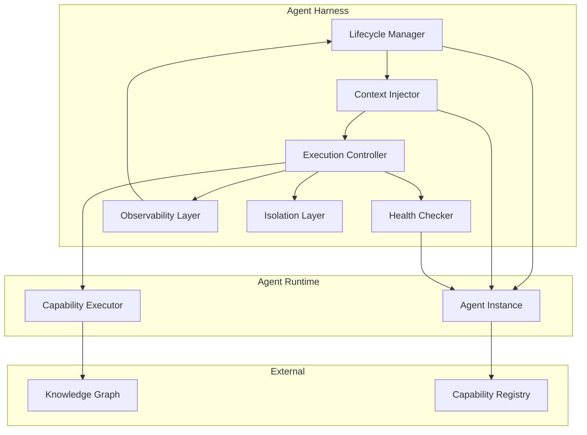
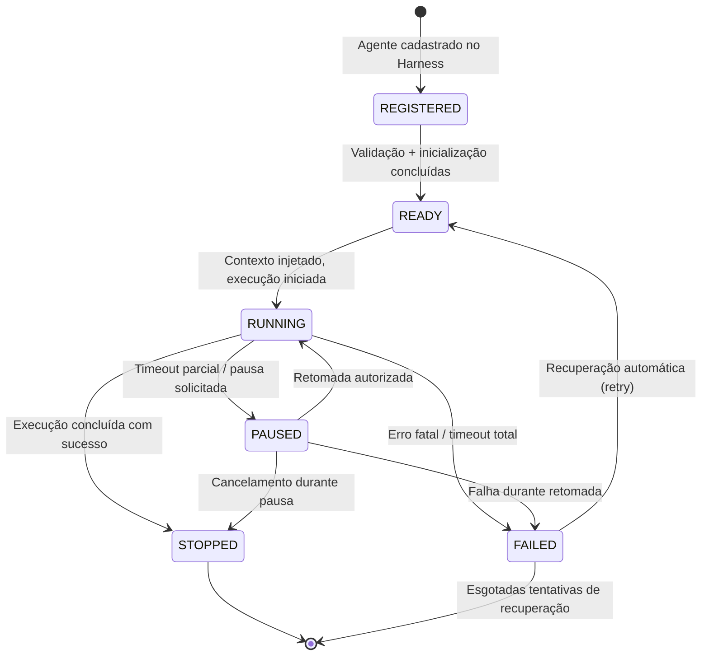
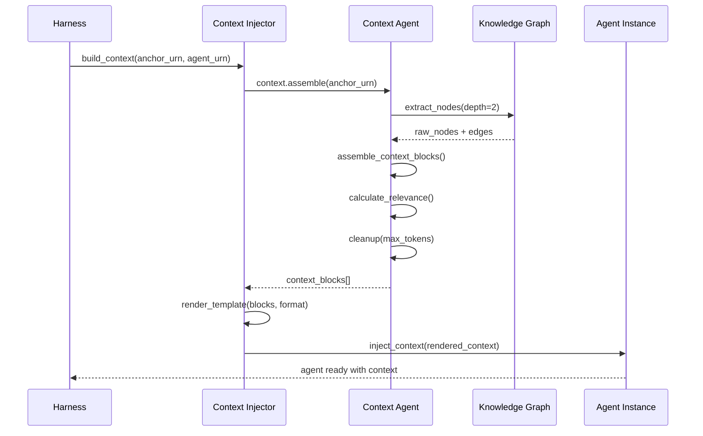
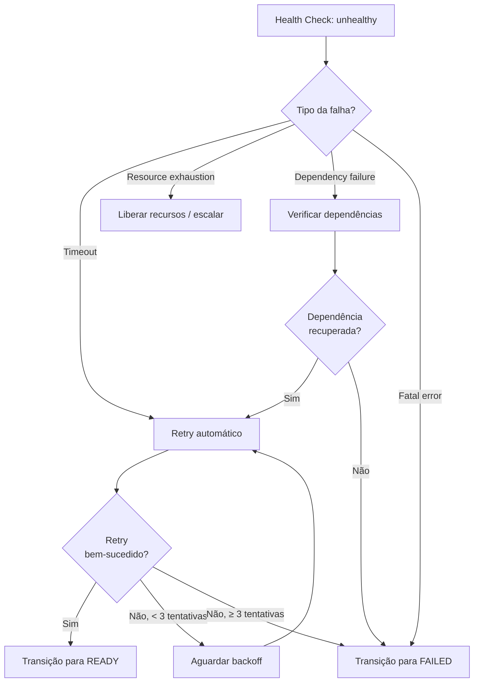

# APOS Agent Harness — Harness de Agentes

**Documento:** AGENT_HARNESS.md  
**Release:** R0 | **Sprint:** 0.7  
**Tarefa:** T0.7.3 — Harness de agentes  
**Dependência:** AGENT_MAP.md (catálogo de agentes), CONTEXT_MODEL.md (modelo de contexto)  
**Criado em:** 2026-07-21  
**Versão:** v0.1-draft

---

## Índice

1. [Introdução](#1-introdução)
2. [Ciclo de Vida do Agente no Harness](#2-ciclo-de-vida-do-agente-no-harness)
3. [Injeção de Contexto](#3-injeção-de-contexto)
4. [Controle de Execução](#4-controle-de-execução)
5. [Health Check](#5-health-check)
6. [Observabilidade](#6-observabilidade)
7. [Isolamento](#7-isolamento)
8. [Referências](#8-referências)

---

## 1. Introdução

### 1.1 O Que É o Agent Harness

O **Agent Harness** é a camada de infraestrutura que envolve, gerencia e orquestra cada agente do ecossistema APOS. Ele é responsável por:

- **Gerenciar o ciclo de vida** de cada agente — desde o registro até a finalização
- **Injetar contexto** no agente antes da execução, usando o CONTEXT_MODEL
- **Controlar a execução** — parâmetros, limites, timeouts
- **Monitorar a saúde** — heartbeats, health checks, recuperação automática
- **Prover observabilidade** — logs, tracing, métricas
- **Isolar a execução** — recursos, estado, erros entre agentes

### 1.2 Relação com os Demais Documentos

```
AGENT_MAP.md           → Quem são os agentes (URN, capabilities, domínios)
CONTEXT_MODEL.md       → Como o contexto é montado e injetado
CAPABILITY_MODEL.md    → Modelo de capabilities que os agentes implementam
AGENT_HARNESS.md       → Como os agentes são executados ← ESTE DOCUMENTO
```

### 1.3 Arquitetura do Harness



---

## 2. Ciclo de Vida do Agente no Harness

### 2.1 Diagrama de Estados



### 2.2 Descrição dos Estados

| Estado | Definição | Ações do Harness |
|--------|-----------|-------------------|
| **REGISTERED** | Agente cadastrado no Capability Registry com URN, capabilities e parâmetros. Ainda não validado. | Registrar URN, validar metadata do agente, alocar slot no lifecycle manager |
| **READY** | Agente validado e inicializado. Aguardando contexto para executar. | Alocar recursos (memória, conexões), validar dependências (KG, contexto), preparar sandbox |
| **RUNNING** | Agente recebeu contexto e está executando uma capability. | Monitorar heartbeat, aplicar execution control, capturar logs e traces |
| **PAUSED** | Execução suspensa temporariamente (timeout parcial, pausa externa). | Preservar estado atual, liberar recursos não-críticos, aguardar retomada ou cancelamento |
| **STOPPED** | Execução concluída com sucesso. Resultado registrado. | Coletar resultado, registrar no Capability Registry, liberar recursos, gerar métricas finais |
| **FAILED** | Execução interrompida por erro fatal ou timeout total. | Capturar erro, registrar causa, tentar recuperação automática, notificar observabilidade |

### 2.3 Transições

| Transição | Gatilho | Condição |
|-----------|---------|----------|
| REGISTERED → READY | `harness.agent.ready(urn)` | Metadata válido, dependências disponíveis |
| READY → RUNNING | `harness.agent.run(urn, context)` | Contexto injetado, execution control configurado |
| RUNNING → PAUSED | `harness.agent.pause(urn)` | Timeout parcial ou requisição externa |
| PAUSED → RUNNING | `harness.agent.resume(urn)` | Retomada autorizada pelo controller |
| RUNNING → STOPPED | `harness.agent.complete(urn, result)` | Capability executada com sucesso |
| RUNNING → FAILED | `harness.agent.fail(urn, error)` | Erro fatal, timeout total, exceção não tratada |
| FAILED → READY | `harness.agent.retry(urn)` | Tentativa de recuperação (máx. 3) |

### 2.4 Política de Retry

| Parâmetro | Valor | Descrição |
|-----------|:-----:|-----------|
| `max_retries` | 3 | Número máximo de tentativas de recuperação |
| `retry_delay_base` | 5s | Delay inicial entre retries (backoff exponencial) |
| `retry_backoff_factor` | 2.0 | Fator de multiplicação do backoff |
| `retry_max_delay` | 120s | Delay máximo entre retries |
| `retry_on` | `timeout`, `connection_error`, `resource_exhausted` | Tipos de erro que disparam retry |

### 2.5 Registro de Agente no Harness

```python
@dataclass
class AgentRegistration:
    urn: str                            # URN do agente (ex: urn:apos:agent:hermes)
    name: str                           # Nome amigável do agente
    capabilities: list[str]             # Lista de capabilities que implementa
    domain: str                         # Domínio funcional (core, support, governance)
    maturity: str                       # Maturidade R0 (L0, L1, L2)
    config: AgentConfig                 # Configuração de execução
    isolation: IsolationConfig           # Configuração de isolamento
    health: HealthConfig                 # Configuração de health check

@dataclass
class AgentConfig:
    default_timeout_s: int = 60          # Timeout padrão em segundos
    max_timeout_s: int = 300             # Timeout máximo permitido
    default_max_tokens: int = 4096       # Tokens máximos padrão
    default_temperature: float = 0.3     # Temperatura padrão
    allowed_model_overrides: list[str]   # Models permitidos para override
```

---

## 3. Injeção de Contexto

### 3.1 Fluxo de Injeção

O harness injeta contexto no agente **antes** da execução, seguindo o pipeline definido no CONTEXT_MODEL.md:



### 3.2 Etapas de Injeção

| Etapa | Responsável | Ação | Saída |
|-------|-------------|------|-------|
| 1 — Extração | Context Agent | Consulta KG a partir da URN âncora (profundidade 2) | Nós + arestas brutos |
| 2 — Montagem | Context Agent | Transforma nós em ContextBlocks, calcula relevância | Blocos ordenados |
| 3 — Renderização | Context Injector | Aplica template ao contexto (Markdown, JSON ou Slots) | Contexto formatado |
| 4 — Injeção | Harness | Insere contexto no prompt do agente (system prompt ou referência) | Agente pronto para execução |

### 3.3 Modos de Injeção

O harness suporta os três modos definidos no CONTEXT_MODEL.md, configuráveis por agente:

| Modo | Formato | Quando Usar |
|------|---------|-------------|
| **Direto (System Prompt)** | Markdown | Agentes que processam contexto inline. Padrão para Hermes Agent e Knowledge Graph Agent |
| **Estruturado (JSON)** | JSON | Agentes que usam function calling. Recomendado para Capability Router e Trust Score Agent |
| **Por Referência** | URNs + `load_context` | Agentes multi-turn que gerenciam própria carga de contexto. Recomendado para Context Agent |

### 3.4 Configuração de Injeção por Agente

Com base no AGENT_MAP.md, cada agente tem sua configuração de injeção:

| Agente | URN | Modo de Injeção | max_tokens | Profundidade |
|--------|:---:|:----------------:|:----------:|:------------:|
| Hermes Agent | `urn:apos:agent:hermes` | Direto (Markdown) | 8000 | 2 |
| Knowledge Graph Agent | `urn:apos:agent:knowledge-graph` | Direto (Markdown) | 6000 | 3 |
| Context Agent | `urn:apos:agent:context-agent` | Por Referência | 4000 | 1 |
| Trust Score Agent | `urn:apos:agent:trust-score` | Estruturado (JSON) | 3000 | 1 |
| Governance Agent | `urn:apos:agent:governance` | Estruturado (JSON) | 5000 | 2 |
| Capability Router | `urn:apos:agent:capability-router` | Estruturado (JSON) | 2000 | 1 |

### 3.5 CONTEXT_MODEL → Harness

O harness recebe o `ContextModelParams` do CONTEXT_MODEL.md e traduz em parâmetros de injeção:

```python
@dataclass
class ContextInjectionParams:
    anchor_urn: str                      # URN do nó âncora
    agent_urn: str                       # URN do agente destino
    mode: str                            # "direct" | "structured" | "reference"
    format: str                          # "markdown" | "json" | "slots"
    max_tokens: int                      # Limite de tokens para o contexto
    extraction_depth: int                # Profundidade de extração no KG
    relevance_threshold: float           # Relevance mínimo para incluir bloco
    include_trust_summary: bool          # Incluir trust score no contexto
    include_alerts: bool                 # Incluir alertas no contexto

    def get_core_context(self) -> list[str]:
        """Retorna as URNs do core context (sempre incluído)."""
        # Core context: nó âncora + bloqueios ativos + status crítico
        return [self.anchor_urn]
```

### 3.6 Exemplo — Injeção para Hermes Agent

```python
params = ContextInjectionParams(
    anchor_urn="urn:apos:task:oauth-123",
    agent_urn="urn:apos:agent:hermes",
    mode="direct",
    format="markdown",
    max_tokens=8000,
    extraction_depth=2,
    relevance_threshold=0.3,
    include_trust_summary=True,
    include_alerts=True,
)

# Harness constrói o contexto e injeta no system prompt
context = harness.build_context(params)
harness.inject_context(agent_urn="urn:apos:agent:hermes", context=context)
# Agora o agente está em estado READY → transição para RUNNING
```

---

## 4. Controle de Execução

### 4.1 Parâmetros de Execução

O harness controla a execução de cada agente através de parâmetros configuráveis:

| Parâmetro | Tipo | Padrão | Descrição |
|-----------|------|:------:|-----------|
| `timeout` | `int` (s) | 60 | Tempo máximo de execução da capability |
| `max_tokens` | `int` | 4096 | Limite máximo de tokens na resposta |
| `temperature` | `float` [0.0, 2.0] | 0.3 | Controla criatividade/determinismo da saída |
| `model_override` | `str` | — | Modelo de linguagem específico (opcional) |
| `max_retries` | `int` | 3 | Tentativas máximas em caso de falha |
| `priority` | `int` [1, 5] | 3 | Prioridade de execução (5 = máxima) |

### 4.2 Defaults por Agente

Baseado no perfil de cada agente (AGENT_MAP.md), os defaults são:

| Agente | timeout (s) | max_tokens | temperature | Prioridade | Modelo Sugerido |
|--------|:-----------:|:----------:|:-----------:|:----------:|:----------------:|
| Hermes Agent | 120 | 8192 | 0.3 | 4 | Claude 4 Sonnet / GPT-4o |
| Knowledge Graph Agent | 60 | 4096 | 0.1 | 3 | Claude 4 Haiku / GPT-4o-mini |
| Context Agent | 30 | 2048 | 0.1 | 2 | Claude 4 Haiku / GPT-4o-mini |
| Trust Score Agent | 30 | 2048 | 0.1 | 2 | Claude 4 Haiku / GPT-4o-mini |
| Governance Agent | 60 | 4096 | 0.2 | 3 | Claude 4 Sonnet / GPT-4o |
| Capability Router | 15 | 1024 | 0.1 | 5 | Claude 4 Haiku / GPT-4o-mini |

### 4.3 Execution Controller

```python
@dataclass
class ExecutionControl:
    timeout_s: int
    max_tokens: int
    temperature: float
    model_override: str | None = None
    priority: int = 3
    max_retries: int = 3
    execution_id: str = ""               # UUID gerado pelo harness

    def validate(self) -> list[str]:
        """Valida os parâmetros de execução. Retorna lista de violações."""
        violations = []
        if self.timeout_s < 1 or self.timeout_s > 300:
            violations.append(f"timeout {self.timeout_s}s fora do intervalo [1, 300]")
        if self.max_tokens < 256 or self.max_tokens > 32768:
            violations.append(f"max_tokens {self.max_tokens} fora do intervalo [256, 32768]")
        if self.temperature < 0.0 or self.temperature > 2.0:
            violations.append(f"temperature {self.temperature} fora do intervalo [0.0, 2.0]")
        return violations
```

### 4.4 Política de Timeout

O harness aplica três níveis de timeout:

| Nível | Gatilho | Ação |
|-------|---------|------|
| **Warning** | 80% do timeout | Log de alerta, extend possível se configurado |
| **Soft Timeout** | 100% do timeout | Tenta cancelamento gracioso, coleta partial result |
| **Hard Timeout** | Soft + 10s | Força kill do agente, transição para FAILED |

### 4.5 Model Override

Agentes podem ser configurados para usar um modelo específico. O harness:

1. Valida se o modelo está na `allowed_model_overrides` do agente
2. Se não especificado, usa o modelo padrão do agente
3. Se especificado e não permitido, rejeita com erro de validação

```python
MODEL_ALLOWLIST: dict[str, list[str]] = {
    "urn:apos:agent:hermes": [
        "claude-sonnet-4-20250514",
        "gpt-4o-2025-05-13",
        "deepseek-v4-flash",
    ],
    "urn:apos:agent:knowledge-graph": [
        "claude-haiku-3-20250307",
        "gpt-4o-mini-2025-07-18",
    ],
    # Demais agentes...
}
```

---

## 5. Health Check

### 5.1 Endpoint de Saúde

Cada agente expõe um endpoint de saúde que o harness consulta periodicamente:

```python
@dataclass
class HealthStatus:
    status: str                          # "healthy" | "degraded" | "unhealthy"
    urn: str                             # URN do agente
    timestamp: str                       # ISO 8601
    uptime_s: int                        # Segundos desde o último READY
    last_heartbeat: str                  # ISO 8601 do último heartbeat
    active_capability: str | None        # Capability em execução (se RUNNING)
    memory_usage_mb: float               # Uso de memória em MB
    error_count: int                     # Erros desde o último reset
    warnings: list[str]                  # Alertas ativos

    def is_healthy(self) -> bool:
        return self.status == "healthy"

    def is_degraded(self) -> bool:
        return self.status == "degraded"
```

### 5.2 Heartbeat

O harness espera heartbeats periódicos de cada agente:

| Parâmetro | Valor | Descrição |
|-----------|:-----:|-----------|
| `heartbeat_interval_s` | 15s | Intervalo esperado entre heartbeats |
| `heartbeat_timeout_s` | 45s | Tempo sem heartbeat antes de marcar como unhealthy |
| `heartbeat_grace_period_s` | 10s | Período de tolerância após timeout |
| `missed_heartbeats_max` | 3 | Máximo de heartbeats perdidos antes de FAILED |

### 5.3 Mecanismo de Recuperação



### 5.4 Health Check por Agente

| Agente | Intervalo | Indicadores Críticos | Ação em Falha |
|--------|:---------:|----------------------|---------------|
| Hermes Agent | 15s | Memória, tempo de resposta, conexão com KG | Retry (3x), depois FAILED |
| Knowledge Graph Agent | 10s | Conexão com KG, latência de queries | Retry (3x), alerta no Capability Router |
| Context Agent | 15s | Cache de contexto, conexão com KG | Retry (2x), fallback para Hermes |
| Trust Score Agent | 30s | Conexão com KG, dados de Q14-Q16 | Retry (2x), alerta de governance |
| Governance Agent | 20s | Conexão com KG, dados de auditoria | Retry (3x), notificação |
| Capability Router | 10s | Capacidade de decisão, registry | Retry imediato, fallback para Hermes |

---

## 6. Observabilidade

### 6.1 Logs Estruturados

Todos os eventos do harness são logados em formato JSON estruturado:

```json
{
  "timestamp": "2026-07-21T14:30:00.000Z",
  "level": "info",
  "service": "agent-harness",
  "agent_urn": "urn:apos:agent:hermes",
  "event": "agent.state.transition",
  "data": {
    "from_state": "READY",
    "to_state": "RUNNING",
    "execution_id": "exec-abc123",
    "capability": "context.assemble",
    "duration_ms": 0
  },
  "trace_id": "trace-xyz-789",
  "span_id": "span-001"
}
```

### 6.2 Categorias de Eventos

| Categoria | Eventos | Level |
|-----------|---------|:-----:|
| **Lifecycle** | `agent.registered`, `agent.ready`, `agent.running`, `agent.paused`, `agent.stopped`, `agent.failed` | info |
| **Context** | `context.extracted`, `context.assembled`, `context.injected`, `context.cleanup` | info |
| **Execution** | `execution.started`, `execution.completed`, `execution.timeout`, `execution.retry` | info / warn |
| **Health** | `health.healthy`, `health.degraded`, `health.unhealthy`, `heartbeat.received`, `heartbeat.missed` | info / warn / error |
| **Error** | `error.fatal`, `error.transient`, `error.dependency` | error |
| **Isolation** | `isolation.sandbox.created`, `isolation.sandbox.destroyed`, `isolation.resource.violation` | info / warn |

### 6.3 Tracing Distribuído

O harness implementa tracing para rastrear requisições através de múltiplos agentes:

```python
@dataclass
class TraceSpan:
    trace_id: str                        # ID do trace (compartilhado entre agentes)
    span_id: str                         # ID do span (único por operação)
    parent_span_id: str | None           # Span pai (se parte de workflow maior)
    agent_urn: str                       # Agente que criou o span
    operation: str                       # Nome da operação (capability)
    start_time: str                      # ISO 8601
    end_time: str | None                 # ISO 8601 (preenchido ao finalizar)
    duration_ms: int | None              # Duração em ms (calculado ao finalizar)
    status: str                          # "ok" | "error" | "timeout"
    metadata: dict                       # Metadados adicionais
```

### 6.4 Métricas de Execução

O harness coleta as seguintes métricas para cada agente:

| Métrica | Tipo | Descrição | Tags |
|---------|------|-----------|------|
| `agent_execution_total` | Counter | Total de execuções iniciadas | `agent_urn`, `capability` |
| `agent_execution_duration_ms` | Histogram | Duração das execuções | `agent_urn`, `capability`, `status` |
| `agent_execution_errors_total` | Counter | Total de erros por agente | `agent_urn`, `error_type` |
| `agent_execution_retries_total` | Counter | Total de retries | `agent_urn` |
| `agent_context_tokens` | Histogram | Tokens de contexto injetados | `agent_urn`, `mode` |
| `agent_memory_usage_mb` | Gauge | Uso de memória do agente | `agent_urn` |
| `agent_heartbeat_missed_total` | Counter | Heartbeats perdidos | `agent_urn` |
| `agent_state` | Gauge | Estado atual (0=registered, 1=ready, 2=running, 3=paused, 4=stopped, 5=failed) | `agent_urn` |
| `harness_health_score` | Gauge | Score de saúde do harness [0.0, 1.0] | — |

### 6.5 Dashboard de Observabilidade

```python
@dataclass
class AgentDashboard:
    """Resumo de observabilidade por agente para visualização."""
    agent_urn: str
    current_state: str
    uptime_s: int
    executions_total: int
    executions_succeeded: int
    executions_failed: int
    avg_duration_ms: float
    p95_duration_ms: float
    error_rate: float                     # failed / total
    retry_rate: float                     # retries / total
    memory_current_mb: float
    memory_peak_mb: float
    context_tokens_avg: float
    health_status: str
    last_error: str | None
```

---

## 7. Isolamento

### 7.1 Princípios de Isolamento

O harness isola a execução de cada agente em três dimensões:

| Dimensão | O Que é Isolado | Mecanismo |
|----------|-----------------|-----------|
| **Recursos** | CPU, memória, I/O, conexões de rede | Sandbox por processo, cgroups (ou equivalente), rate limiting |
| **Estado** | Variáveis de sessão, contexto, cache, histórico de execução | State containers independentes, sem shared mutable state |
| **Erros** | Exceções, timeouts, crashes de um agente não afetam outros | Boundary de processo, circuit breakers, fail-fast |

### 7.2 Configuração de Isolamento por Agente

```python
@dataclass
class IsolationConfig:
    sandbox_type: str                    # "process" | "container" | "thread" | "none"
    max_memory_mb: int                   # Limite máximo de memória
    max_cpu_percent: float               # Limite máximo de CPU (%)
    max_concurrent_requests: int         # Requisições simultâneas máximas
    state_ttl_s: int                     # TTL do estado do agente
    network_access: bool                 # Acesso à rede externa
    filesystem_access: bool              # Acesso ao filesystem
    allowed_dependencies: list[str]      # Dependências externas permitidas
```

### 7.3 Configuração por Agente

| Agente | Sandbox | Max Memory | Max CPU | Max Concurrent | State TTL | Network |
|--------|:-------:|:----------:|:-------:|:--------------:|:---------:|:-------:|
| Hermes Agent | process | 1024 MB | 80% | 1 | 300s | ✅ |
| Knowledge Graph Agent | process | 512 MB | 60% | 2 | 120s | ❌ (apenas KG local) |
| Context Agent | process | 512 MB | 40% | 2 | 60s | ❌ (apenas KG local) |
| Trust Score Agent | process | 256 MB | 30% | 3 | 120s | ❌ |
| Governance Agent | process | 512 MB | 50% | 1 | 300s | ❌ |
| Capability Router | thread | 128 MB | 20% | 10 | 30s | ❌ |

### 7.4 Sandbox de Processo

```python
class AgentSandbox:
    """
    Sandbox que isola a execução de um agente.

    - Cria um processo filho dedicado
    - Aplica limites de recursos via resource module (RLIMIT)
    - Mantém state container independente
    - Garante que falhas não vazem entre agentes
    """

    def __init__(self, config: IsolationConfig, agent_urn: str):
        self.config = config
        self.agent_urn = agent_urn
        self.process: subprocess.Popen | None = None
        self.state: dict = {}

    def create(self) -> bool:
        """Cria o sandbox com limites de recursos."""
        import resource

        self.process = subprocess.Popen(
            ["python", "-m", f"apos.agents.{self.agent_urn}"],
            stdin=subprocess.PIPE,
            stdout=subprocess.PIPE,
            stderr=subprocess.PIPE,
        )

        # Aplica limites de recursos
        memory_bytes = self.config.max_memory_mb * 1024 * 1024
        resource.setrlimit(resource.RLIMIT_AS, (memory_bytes, memory_bytes))
        resource.setrlimit(
            resource.RLIMIT_CPU,
            (self.config.max_cpu_percent, self.config.max_cpu_percent),
        )

        # Inicializa state container vazio
        self.state = {
            "agent_urn": self.agent_urn,
            "created_at": datetime.now(timezone.utc).isoformat(),
            "executions": [],
            "context_cache": {},
        }
        return True

    def destroy(self) -> None:
        """Destroi o sandbox e libera recursos."""
        if self.process and self.process.poll() is None:
            self.process.terminate()
            try:
                self.process.wait(timeout=5)
            except subprocess.TimeoutExpired:
                self.process.kill()
        self.state = {}
```

### 7.5 Circuit Breaker

O harness implementa circuit breaker para prevenir que falhas em um agente se propaguem:

| Estado | Comportamento | Transição para |
|--------|---------------|----------------|
| **CLOSED** | Execução normal, chamadas passam | OPEN após N falhas consecutivas |
| **OPEN** | Chamadas rejeitadas imediatamente, sem executar | HALF_OPEN após timeout de recuperação |
| **HALF_OPEN** | Uma chamada de teste é permitida | CLOSED se bem-sucedida, OPEN se falhar |

```python
@dataclass
class CircuitBreakerConfig:
    failure_threshold: int = 5           # Falhas consecutivas para abrir
    recovery_timeout_s: int = 30         # Tempo antes de half-open
    half_open_max_retries: int = 3       # Tentativas em half-open
```

### 7.6 Política de Erros

| Tipo de Erro | Origem | Ação do Harness | Isolamento |
|-------------|--------|-----------------|------------|
| **Timeout** | Agente não respondeu no prazo | Soft → Hard timeout, transição para FAILED | Apenas o agente afetado |
| **Resource Exhaustion** | Agente excedeu memória/CPU | Kill do sandbox, retry com backoff | Sandbox isolado |
| **Dependency Failure** | KG, Registry ou dependência externa | Circuit breaker, alerta, retry | Propagação controlada |
| **Capability Error** | Erro na lógica da capability | Log + métrica, transição para FAILED | Apenas o agente afetado |
| **Fatal Exception** | Crash não recuperável | Kill imediato, dump de estado, FAILED | Sandbox isolado |
| **Context Error** | Falha na injeção de contexto | Retry de injeção, fallback para core context | Apenas o agente afetado |

---

## 8. Referências

| Documento | Conteúdo |
|-----------|----------|
| [AGENT_MAP.md](../sprint-0.6/AGENT_MAP.md) | Catálogo de agentes APOS (URNs, capabilities, domínios, maturidade) |
| [CONTEXT_MODEL.md](../sprint-0.5/CONTEXT_MODEL.md) | Modelo de contexto: pipeline, ContextBlock, relevância, cleanup, injeção |
| [CAPABILITY_MODEL.md](../sprint-0.6/CAPABILITY_MODEL.md) | Modelo de capabilities que os agentes implementam |
| [CAPABILITY_TAXONOMY.md](../sprint-0.6/CAPABILITY_TAXONOMY.md) | Taxonomia hierárquica de capabilities |
| [CAPABILITY_ROUTING.md](../sprint-0.6/CAPABILITY_ROUTING.md) | Regras de roteamento entre agentes |
| [MEMORY_MODEL.md](../sprint-0.5/MEMORY_MODEL.md) | Sistema de memória onde efeitos de capabilities são registrados |
| [KNOWLEDGE_GRAPH.md](../sprint-0.4/KNOWLEDGE_GRAPH.md) | Estrutura do grafo que os agentes consultam |
| [QUERY_PATTERNS.md](../sprint-0.4/QUERY_PATTERNS.md) | Padrões de navegação Q01–Q16 usados pelos agentes |

---

## Apêndice A — Resumo de Parâmetros do Harness

| Parâmetro | Padrão | Descrição |
|-----------|:------:|-----------|
| `heartbeat_interval_s` | 15 | Intervalo entre heartbeats (s) |
| `heartbeat_timeout_s` | 45 | Timeout sem heartbeat (s) |
| `max_retries` | 3 | Máximo de tentativas de retry |
| `retry_delay_base_s` | 5 | Delay base entre retries (s) |
| `retry_backoff_factor` | 2.0 | Fator de backoff exponencial |
| `circuit_breaker_failure_threshold` | 5 | Falhas consecutivas para abrir circuit breaker |
| `circuit_breaker_recovery_timeout_s` | 30 | Timeout de recuperação do circuit breaker (s) |
| `context_max_tokens_default` | 8000 | Limite padrão de tokens de contexto |
| `context_extraction_depth_default` | 2 | Profundidade padrão de extração no KG |
| `context_relevance_threshold` | 0.3 | Relevance mínimo para incluir bloco |
| `sandbox_default_memory_mb` | 512 | Memória máxima padrão do sandbox (MB) |
| `sandbox_default_cpu_percent` | 50 | CPU máxima padrão do sandbox (%) |

## Apêndice B — Glossário

| Termo | Definição |
|-------|-----------|
| **Harness** | Camada de infraestrutura que envolve, gerencia e orquestra agentes |
| **Lifecycle Manager** | Componente do harness que gerencia as transições de estado do agente |
| **Context Injector** | Componente que recebe contexto do CONTEXT_MODEL e injeta no agente |
| **Execution Controller** | Componente que controla parâmetros e limites de execução |
| **Health Checker** | Componente que monitora a saúde do agente via heartbeats e endpoints |
| **Sandbox** | Ambiente isolado de execução (processo, recursos, estado) |
| **Circuit Breaker** | Padrão de resiliência que previne propagação de falhas |
| **Core Context** | Conjunto mínimo de blocos que sempre deve ser injetado no agente |
| **Execution ID** | UUID único gerado pelo harness para cada execução de capability |
| **Span / Trace** | Estruturas de tracing distribuído para rastrear requisições multi-agente |

---

**Última atualização:** 2026-07-21  
**Versão:** v0.1-draft  
**Próximo documento:** [CAPABILITY_ROUTING.md](../sprint-0.6/CAPABILITY_ROUTING.md) — Regras de roteamento de requisições para capabilities
