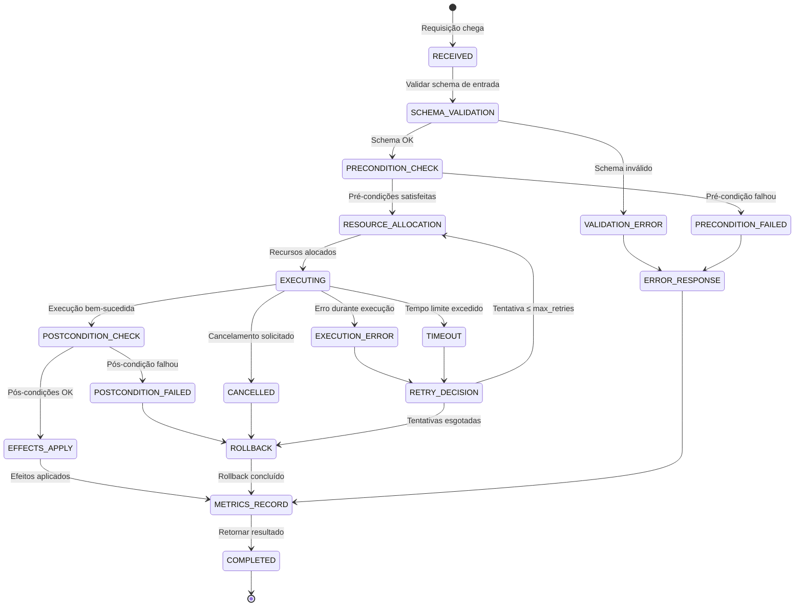
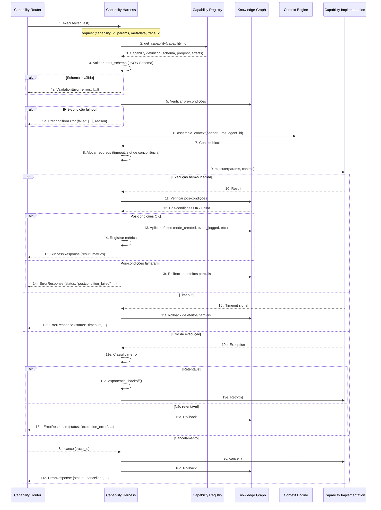
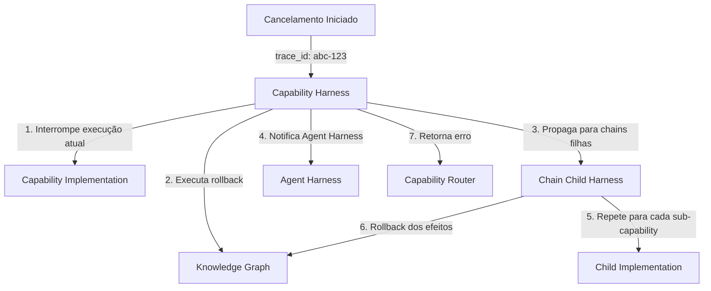
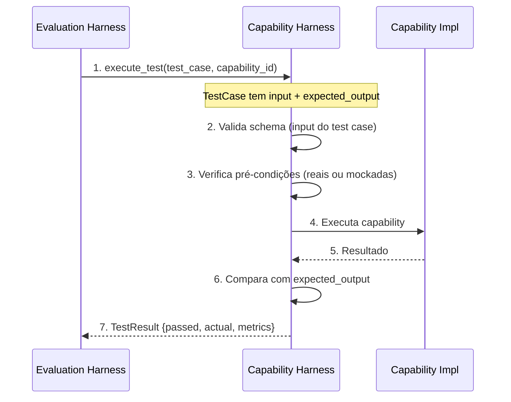

# APOS Capability Harness — Execução, Erros e Encadeamento de Capabilities

**Documento:** CAPABILITY_HARNESS.md  
**Release:** R0 | **Sprint:** 0.7  
**Tarefa:** T0.7.2 — Detalhamento do Capability Harness  
**Dependência:** HARNESS.md (estrutura geral), CAPABILITY_MODEL.md (modelo de capabilities), CAPABILITY_ROUTING.md (roteamento), AGENT_MAP.md (agentes)  
**Criado em:** 2026-07-21  
**Versão:** v0.1-draft

---

## Índice

1. [Introdução](#1-introdução)
2. [Fluxo de Execução](#2-fluxo-de-execução)
3. [Passagem de Parâmetros](#3-passagem-de-parâmetros)
4. [Tratamento de Erros](#4-tratamento-de-erros)
5. [Timeout e Cancelamento](#5-timeout-e-cancelamento)
6. [Chain de Harnesses](#6-chain-de-harnesses)
7. [Telemetria e Observabilidade](#7-telemetria-e-observabilidade)
8. [Configuração Específica do Capability Harness](#8-configuração-específica-do-capability-harness)
9. [Referências](#9-referências)

---

## 1. Introdução

### 1.1 O Que É o Capability Harness

O **Capability Harness** é o invólucro de execução que envolve **cada capability individual** do APOS. Ele implementa o ciclo completo de: receber uma requisição roteada → validar entradas → verificar pré-condições → executar a capability dentro de limites operacionais → verificar pós-condições → aplicar efeitos → retornar o resultado.

Diferentemente do **Agent Harness** (que gerencia o ciclo de vida do agente), o Capability Harness é **focado na unidade atômica de competência**: a capability. Cada execução de capability passa pelo harness, independentemente de qual agente a está invocando.

### 1.2 Princípios

1. **Fail Fast** — erros de validação e pré-condição são detectados antes de qualquer execução
2. **Execução Confiável** — timeouts, retries e rollback são aplicados automaticamente
3. **Rastreabilidade Total** — toda execução deixa métricas, eventos e registros no KG
4. **Contrato Forte** — input/output schema são validados em tempo real
5. **Composição Transparente** — chains de harness seguem o mesmo padrão de invocação

### 1.3 Posição na Arquitetura

```
                    ┌──────────────────────────┐
                    │    Capability Router      │
                    │  (resolução de rota)      │
                    └──────────┬───────────────┘
                               │
                    ┌──────────▼───────────────┐
                    │   CAPABILITY HARNESS      │
                    │  ★ Este documento         │
                    │  Validação | Execução     │
                    │  Erros | Rollback         │
                    └──────────┬───────────────┘
                               │
          ┌────────────────────┼────────────────────┐
          ▼                    ▼                    ▼
   ┌────────────┐     ┌──────────────┐     ┌──────────────┐
   │ Knowledge  │     │Capability    │     │ Agent        │
   │ Graph (KG) │     │ Implementação│     │ Harness      │
   └────────────┘     └──────────────┘     └──────────────┘
```

---

## 2. Fluxo de Execução

### 2.1 Diagrama de Estados



### 2.2 Sequência Detalhada



### 2.3 Etapas Detalhadas

#### Etapa 1 — Recepção da Requisição

O **Capability Router** invoca o harness com uma requisição estruturada:

```python
@dataclass
class CapabilityRequest:
    capability_id: str               # URN da capability (ex: urn:apos:cap:core:graph.traverse)
    params: dict                     # Parâmetros de entrada da capability
    metadata: RequestMetadata        # Metadados de roteamento e rastreamento
    agent_id: str                    # URN do agente solicitante
```

#### Etapa 2 — Obter Definição da Capability

O harness consulta o **Capability Registry** para obter o schema completo da capability, incluindo `input_schema`, `output_schema`, `pre_conditions`, `effects`, `kg_read`, `kg_write` e `metadata`.

```python
capability = await self.registry.get(request.capability_id)
if not capability:
    return ExecutionResult(
        status="capability_not_found",
        error=f"Capability {request.capability_id} não encontrada"
    )
```

#### Etapa 3 — Validação de Schema

O harness valida os parâmetros de entrada contra o `input_schema` (JSON Schema). Erros de schema são **sempre não retentáveis** — a requisição deve ser corrigida antes de reenviar.

```python
errors = validate_schema(capability.input_schema, request.params)
if errors:
    return ExecutionResult(
        status="invalid_input",
        error="Schema de entrada inválido",
        details={"validation_errors": errors}
    )
```

#### Etapa 4 — Verificação de Pré-Condições

Cada pré-condição declarada na capability é avaliada contra o estado atual do Knowledge Graph. O harness usa a ponte `KGHarnessBridge` para executar as verificações.

```python
for condition in capability.pre_conditions:
    result = await self.kg_bridge.check(condition, request.params)
    if not result.passed:
        return ExecutionResult(
            status="precondition_fail",
            error=f"Pré-condição não satisfeita: {condition.description}",
            details={"condition": condition.check_type, "reason": result.reason}
        )
```

**Tipos de verificação suportados:**

| Tipo de Verificação | Descrição | Exemplo | Custos |
|---------------------|-----------|---------|:------:|
| `node_exists` | Nó com URN existe no KG | `urn:apos:task:oauth-123` existe? | 1 query KG |
| `edge_exists` | Aresta existe entre dois nós | Task → Feature | 1 query KG |
| `node_has_attribute` | Nó tem atributo específico | task.status == "in_progress" | 1 query KG |
| `node_in_domain` | Nó pertence a um domínio | task é do tipo Task | 1 query KG |
| `kg_not_empty` | Grafo possui pelo menos 1 nó | count(*) > 0 | 1 query KG |
| `agent_authorized` | Agente pode executar a capability | hermes ∈ enabled_agents | lookup local |
| `query_has_results` | Query Qnn retorna resultados | Q10 retorna > 0 órfãos | 1 query KG |
| `custom` | Função customizada | Verificação específica do domínio | definido pela função |
| `capability_ready` | Capability está ativa | status == "ready" | lookup local |

**Otimização — Pré-condições paralelas:**

Pré-condições independentes (sem dependência de dados entre si) são executadas em paralelo:

```python
results = await asyncio.gather(*[
    self.kg_bridge.check(c, request.params)
    for c in capability.pre_conditions
], return_exceptions=True)
```

#### Etapa 5 — Montagem de Contexto

Se a capability declara `kg_read`, o harness solicita contexto ao **Context Engine** com base nas URNs âncora fornecidas nos parâmetros. O contexto montado é passado para a implementação da capability junto com os parâmetros.

#### Etapa 6 — Execução da Capability

A implementação real da capability é executada com:

- **Parâmetros validados** (já passaram pelo schema check)
- **Contexto** (blocos montados pelo Context Engine)
- **Timeout** (monitorado por um task wrapper)

```python
try:
    result = await asyncio.wait_for(
        capability_impl.execute(params=resolved_params, context=context),
        timeout=effective_timeout
    )
except asyncio.TimeoutError:
    # Handler de timeout (seção 5)
    ...
except Exception as e:
    # Handler de erro (seção 4)
    ...
```

#### Etapa 7 — Verificação de Pós-Condições

Após a execução bem-sucedida, o harness verifica as pós-condições declaradas. Isso garante que os efeitos esperados realmente ocorreram no Knowledge Graph.

| Tipo de Pós-Condição | Descrição | Verificação |
|----------------------|-----------|-------------|
| `output_valid` | Saída respeita o schema | Validação JSON Schema contra `output_schema` |
| `effects_applied` | Efeitos declarados foram aplicados | Consulta ao KG para confirmar mudanças |
| `kg_integrity` | Grafo permanece íntegro | Regras de integridade KG-001 a KG-012 |
| `no_side_effects` | Nenhum dado não declarado foi alterado | Diff do grafo (nós afetados vs. declarados em kg_write) |

#### Etapa 8 — Aplicação de Efeitos

Com pós-condições verificadas, o harness aplica os efeitos no Knowledge Graph:

```python
for effect in capability.effects:
    await self.kg_bridge.apply_effect(
        effect_type=effect.effect_type,
        target=resolve_urn_template(effect.target, request.params, result),
        delta=resolve_delta_template(effect.delta, request.params, result)
    )
```

#### Etapa 9 — Registro de Métricas

O harness registra métricas de execução no sistema de telemetria (ver seção 7).

#### Etapa 10 — Retorno do Resultado

```python
return ExecutionResult(
    status="success",
    result={
        "capability_id": request.capability_id,
        "output": result,
        "metrics": execution_metrics
    }
)
```

---

## 3. Passagem de Parâmetros

### 3.1 Origem dos Parâmetros

Os parâmetros chegam ao Capability Harness por três origens distintas:

| Origem | Exemplo | Etapa |
|--------|---------|-------|
| **Requisição direta** | `{"target_urn": "urn:apos:task:oauth-123"}` | Parâmetros explícitos do usuário/agente |
| **Resolução do Router** | `{"depth": 3}` (valor default do schema) | Parâmetros adicionados pelo roteador com defaults |
| **Contexto montado** | `{"context_blocks": [...], "stats": {...}}` | Parâmetros injetados pelo Context Engine |

### 3.2 Resolução de Templates

Parâmetros podem conter **templates** que são resolvidos antes da execução:

| Template | Origem | Resolução |
|----------|--------|-----------|
| `{input.target_urn}` | Parâmetro da requisição | Substituído pelo valor do campo `target_urn` |
| `{context.max_tokens}` | Bloco de contexto | Substituído pelo limite de tokens do contexto |
| `{agent.id}` | Metadados do agente | Substituído pela URN do agente solicitante |
| `{env.APOS_ENV}` | Variável de ambiente | Substituído pelo valor da variável |

**Exemplo de resolução em pré-condição:**

```json
{
    "description": "O nó alvo deve existir no grafo",
    "check_type": "node_exists",
    "params": {"urn": "{input.target_urn}"}
}
```

O harness faz a interpolação antes de executar a verificação.

### 3.3 Resolvedor de Parâmetros

```python
class ParameterResolver:
    """Resolve templates nos parâmetros antes da execução."""

    def __init__(self, request: CapabilityRequest, context: dict | None):
        self.bindings = {
            "input": request.params,
            "agent": {"id": request.agent_id},
            "trace": {"id": request.metadata.trace_id},
            "context": context or {},
        }

    def resolve(self, value: Any) -> Any:
        """Resolve templates recursivamente em dicts, lists e strings."""
        if isinstance(value, str):
            return self._resolve_template(value)
        if isinstance(value, dict):
            return {k: self.resolve(v) for k, v in value.items()}
        if isinstance(value, list):
            return [self.resolve(v) for v in value]
        return value

    def _resolve_template(self, template: str) -> str:
        pattern = re.compile(r"\{([a-z_][a-z0-9_.]*)\}")

        def replacer(match):
            key_path = match.group(1).split(".")
            current = self.bindings
            for key in key_path:
                if isinstance(current, dict):
                    current = current.get(key)
                else:
                    return match.group(0)  # mantém template se não resolver
            return str(current) if current is not None else match.group(0)

        return pattern.sub(replacer, template)
```

### 3.4 Merge de Parâmetros

O merge segue a hierarquia de precedência (maior vence):

1. **Parâmetros da requisição** (maior precedência)
2. **Parâmetros do contexto** (do Context Engine)
3. **Defaults do schema** (menor precedência)

```python
resolved_params = deep_merge(
    capability.input_schema.get("properties", {}),  # defaults
    context_params,                                   # contexto
    request.params                                    # requisição (vence)
)
```

---

## 4. Tratamento de Erros

### 4.1 Taxonomia de Erros

| Categoria | Tipo | Exemplo | Retentável? |
|-----------|------|---------|:-----------:|
| **Validação** | `invalid_input` | Schema inválido, campo obrigatório faltando | ❌ |
| **Validação** | `precondition_fail` | Pré-condição não satisfeita | ❌ (dados mudam?) |
| **Validação** | `unauthorized` | Agente não autorizado para a capability | ❌ |
| **Validação** | `capability_not_found` | Capability não existe no registro | ❌ |
| **Execução** | `execution_error` | Exceção na implementação da capability | ✅ (se transitório) |
| **Execução** | `kg_contention` | Concorrência no Knowledge Graph | ✅ |
| **Execução** | `context_stale` | Contexto expirou entre preparação e execução | ✅ |
| **Execução** | `service_unavailable` | Serviço dependente temporariamente indisponível | ✅ |
| **Execução** | `rate_limited` | Rate limit do KG ou Context Engine atingido | ✅ |
| **Timeout** | `timeout` | Excedeu `max_execution_seconds` | ✅ (com mais tempo) |
| **Cancelamento** | `cancelled` | Cancelamento solicitado pelo solicitante | ❌ |
| **Pós-condição** | `postcondition_fail` | Pós-condição não satisfeita após execução | ❌ (rollback) |
| **Recursos** | `payload_too_large` | Payload excede `max_payload_size_bytes` | ❌ |
| **Recursos** | `kg_ops_exceeded` | Operações no KG excedem `max_kg_ops_per_execution` | ❌ |
| **Chain** | `circular_dependency` | Dependência circular detectada em chain | ❌ |
| **Chain** | `chain_broken` | Elo da chain falhou (erro não retentável) | ❌ (propaga) |

### 4.2 Estrutura de Erro Retornada

Todo erro do Capability Harness segue uma estrutura padronizada:

```python
@dataclass
class ErrorResponse:
    status: str                         # Código do erro (ex: "invalid_input")
    error: str                          # Mensagem legível
    details: dict | None = None         # Detalhes específicos do erro
    trace_id: str | None = None         # ID de rastreamento
    capability_id: str | None = None    # Capability que falhou
    executed_at: str | None = None      # Timestamp ISO 8601
    duration_ms: float | None = None    # Tempo decorrido até a falha
    effects_rolled_back: bool = False   # Se rollback foi executado

    # Para erros de validação de schema
    validation_errors: list[dict] | None = None

    # Para erros de pré-condição
    precondition_errors: list[dict] | None = None

    # Para sugestões de fallback (seção 4.5)
    fallback_suggestions: list[dict] | None = None
```

### 4.3 Política de Retry com Backoff

```python
@dataclass
class RetryPolicy:
    max_retries: int = 3                      # Máximo de tentativas
    base_delay_seconds: float = 1.0           # Delay base
    max_delay_seconds: float = 30.0           # Delay máximo
    jitter: bool = True                       # Jitter para evitar thundering herd
    multiplier: float = 2.0                   # Fator de backoff exponencial
    retry_on_timeout: bool = True             # Se timeout também retenta
    max_total_retry_seconds: float = 120.0    # Tempo máximo total gasto em retries

    # Erros SEMPRE retentáveis
    RETRYABLE_ERRORS = frozenset({
        "timeout",
        "rate_limited",
        "service_unavailable",
        "kg_contention",
        "context_stale",
        "execution_error",     # apenas se transient=True
    })

    # Erros NUNCA retentáveis
    NON_RETRYABLE_ERRORS = frozenset({
        "invalid_input",
        "unauthorized",
        "precondition_fail",
        "capability_not_found",
        "postcondition_fail",
        "circular_dependency",
        "payload_too_large",
        "kg_ops_exceeded",
        "chain_broken",
        "cancelled",
    })
```

**Algoritmo de backoff com jitter:**

```python
class BackoffCalculator:
    """Calcula delay entre retries com exponential backoff + jitter."""

    def __init__(self, policy: RetryPolicy):
        self.policy = policy

    def delay(self, attempt: int) -> float:
        """Calcula o delay para a tentativa `attempt` (1-based)."""
        delay = self.policy.base_delay_seconds * (self.policy.multiplier ** (attempt - 1))
        delay = min(delay, self.policy.max_delay_seconds)

        if self.policy.jitter:
            # Jitter decorrelacionado: 50-100% do delay calculado
            delay = delay * (0.5 + random.random() * 0.5)

        return delay

    def should_retry(self, attempt: int, error_type: str, total_elapsed: float) -> bool:
        """Determina se deve retentar com base no tipo de erro e tentativas."""
        if error_type in self.policy.NON_RETRYABLE_ERRORS:
            return False
        if error_type not in self.policy.RETRYABLE_ERRORS:
            return False
        if attempt >= self.policy.max_retries:
            return False
        if total_elapsed >= self.policy.max_total_retry_seconds:
            return False
        return True
```

### 4.4 Mecanismo de Fallback

Quando a capability primária falha após esgotar os retries, o Capability Harness pode acionar um **fallback**:

#### Tipos de Fallback

| Tipo | Descrição | Exemplo |
|------|-----------|---------|
| **Capability Alternativa** | Outra capability que produz resultado equivalente | `trust-score.calculate.v1` → `trust-score.calculate.v2` (legacy) |
| **Agente Alternativo** | Mesma capability executada por outro agente | trust-score agente → governance agente |
| **Dados Reduzidos** | Execução com parâmetros menos exigentes | depth=5 → depth=2 |
| **Resultado Parcial** | Retornar o que foi calculado até a falha | trust-score parcial com apenas 2 dos 3 fatores |
| **Cache Stale** | Usar resultado anterior em cache se disponível | Último trust_score conhecido |

**Configuração de fallback:**

```yaml
# Declarado no registro da capability ou na configuração do harness
capability_fallback:
  trust-score.calculate:
    alternatives:
      - capability_id: "urn:apos:cap:governance:trust-score.calculate.v1"
        condition: "version_mismatch"
      - agent_id: "urn:apos:agent:governance"
        condition: "primary_unavailable"
    degraded_mode:
      enabled: true
      reduced_params:
        include_factors: false
```

**Implementação:**

```python
class FallbackHandler:
    """Gerencia fallback de capabilities."""

    def __init__(self, registry: CapabilityRegistry, agent_map: AgentMap):
        self.registry = registry
        self.agent_map = agent_map

    async def resolve_fallback(
        self,
        capability: Capability,
        original_request: CapabilityRequest,
        error: ErrorResponse
    ) -> CapabilityRequest | None:
        """Resolve uma alternativa de fallback para a capability falha."""
        fb_config = capability.metadata.get("fallback", {})

        # 1. Tentar capability alternativa
        for alt in fb_config.get("alternatives", []):
            match = await self._match_condition(alt, capability, error)
            if match:
                return self._build_request(alt, original_request)

        # 2. Tentar agente alternativo
        for alt in fb_config.get("agent_fallback", []):
            match = await self._match_condition(alt, capability, error)
            if match:
                return self._build_request(alt, original_request)

        # 3. Modo degradado (parâmetros reduzidos)
        if fb_config.get("degraded_mode", {}).get("enabled", False):
            reduced = fb_config["degraded_mode"].get("reduced_params", {})
            new_params = {**original_request.params, **reduced}
            return CapabilityRequest(
                capability_id=original_request.capability_id,
                params=new_params,
                metadata=original_request.metadata,
                agent_id=original_request.agent_id
            )

        return None
```

### 4.5 Rollback de Efeitos

Se a execução falha **após** já ter aplicado efeitos parciais no Knowledge Graph, o harness executa rollback automático.

**Matriz de Rollback:**

| Efeito Aplicado | Ação de Rollback | Idempotente? |
|-----------------|------------------|:------------:|
| `node_created` | `DELETE node` (ou marcar como `rolled_back`) | ✅ |
| `node_updated` | `SET attributes = previous_state` | ✅ |
| `node_deleted` | `CREATE node` com estado anterior (se disponível) | ✅ |
| `edge_created` | `DELETE edge` | ✅ |
| `edge_updated` | `SET edge.weight = previous_weight` | ✅ |
| `event_logged` | `CREATE rollback_event` (não remove o original) | ✅ |
| `trust_updated` | `SET metadata.confidence = previous_value` | ✅ |
| `context_injected` | (não há rollback — contexto é efêmero) | N/A |

**Snapshot de estado antes da execução:**

Antes de executar, o harness captura um **snapshot** do estado dos nós que serão afetados (baseado em `kg_write`):

```python
async def _capture_snapshot(self, capability: Capability, params: dict) -> dict:
    """Captura estado atual dos nós que serão afetados, para rollback."""
    snapshot = {}
    for write_pattern in capability.kg_write:
        urns = await self._resolve_urns(write_pattern, params)
        for urn in urns:
            snapshot[urn] = await self.kg_bridge.get_node_state(urn)
    return snapshot
```

**Execução do rollback:**

```python
async def _rollback(self, snapshot: dict, applied_effects: list[Effect]):
    """Executa rollback dos efeitos aplicados em ordem reversa."""
    for effect in reversed(applied_effects):
        try:
            if effect.effect_type == EffectType.NODE_CREATED:
                await self.kg_bridge.delete_node(effect.target)
            elif effect.effect_type == EffectType.NODE_UPDATED:
                previous = snapshot.get(effect.target, {})
                await self.kg_bridge.restore_node(effect.target, previous)
            elif effect.effect_type == EffectType.EDGE_CREATED:
                await self.kg_bridge.delete_edge(effect.target)
            # ... demais tipos
        except Exception as rollback_error:
            # Rollback é sempre tentado, mesmo que parcial
            await self._log_rollback_failure(effect, rollback_error)
```

**Regras de rollback:**
1. Rollback executa em **ordem reversa** à aplicação dos efeitos
2. Cada operação de rollback é **individualmente idempotente**
3. Falha em uma operação de rollback **não impede** as demais
4. Um evento `rollback_executed` é sempre registrado no KG

---

## 5. Timeout e Cancelamento

### 5.1 Timeout por Capability

Cada capability pode declarar seu próprio timeout no campo `max_execution_seconds` dos metadados. Se não declarado, o valor global do harness é usado.

```python
@dataclass
class TimeoutConfig:
    default_timeout_seconds: int = 30         # Padrão global do harness
    per_capability_overrides: dict[str, int]  # Override por capability_id
    context_timeout_seconds: int = 10         # Timeout para montagem de contexto
    kg_query_timeout_seconds: int = 5         # Timeout para queries individuais no KG
    grace_period_seconds: int = 2             # Período de graça após timeout para cleanup
    max_total_time_seconds: int = 300         # Tempo máximo total (incluindo retries)
```

**Cálculo do timeout efetivo:**

```python
effective_timeout = (
    TimeoutConfig.per_capability_overrides.get(capability.id)
    or capability.metadata.get("max_execution_seconds")
    or TimeoutConfig.default_timeout_seconds
)
```

### 5.2 Hierarquia de Timeouts

O Capability Harness gerencia múltiplos níveis de timeout:

```
REQUISIÇÃO COMPLETA (max_total_time_seconds = 300s)
 ├── Context Assembly (context_timeout_seconds = 10s)
 ├── Pré-condições (kg_query_timeout_seconds = 5s)
 ├── EXECUÇÃO DA CAPABILITY (effective_timeout = 30s)
 │   ├── Query KG #1 (kg_query_timeout_seconds = 5s)
 │   ├── Query KG #2 (kg_query_timeout_seconds = 5s)
 │   └── Processamento local (sem timeout adicional)
 ├── Pós-condições (kg_query_timeout_seconds = 5s)
 ├── Aplicação de efeitos (kg_query_timeout_seconds = 5s)
 └── Grace period para cleanup (grace_period_seconds = 2s)
```

### 5.3 Mecanismo de Timeout

```python
async def execute_with_timeout(
    self,
    capability_impl: CapabilityImplementation,
    params: dict,
    context: dict,
    timeout: int,
    trace_id: str,
    cancel_event: asyncio.Event
) -> ExecutionResult:
    """Executa a capability com monitoramento de timeout e cancelamento."""

    # Envolve a execução em uma task com timeout
    try:
        result = await asyncio.wait_for(
            self._execute_with_cancellation(
                capability_impl, params, context, cancel_event
            ),
            timeout=timeout
        )
        return ExecutionResult(status="success", result=result)

    except asyncio.TimeoutError:
        # Timeout atingido
        return await self._handle_timeout(trace_id, capability_impl)

    except asyncio.CancelledError:
        # Cancelamento externo
        return await self._handle_cancellation(trace_id, capability_impl)


async def _execute_with_cancellation(
    self,
    capability_impl: CapabilityImplementation,
    params: dict,
    context: dict,
    cancel_event: asyncio.Event
) -> Any:
    """Executa polling do cancel_event durante a execução."""
    # Cria uma task para a execução real
    exec_task = asyncio.create_task(
        capability_impl.execute(params=params, context=context)
    )

    # Polling de cancelamento
    while not exec_task.done():
        if cancel_event.is_set():
            exec_task.cancel()
            raise asyncio.CancelledError()
        await asyncio.sleep(0.1)  # 100ms polling interval

    return exec_task.result()
```

### 5.4 Propagação de Cancelamento

O cancelamento pode ser iniciado por:

| Origem | Mecanismo | Comportamento |
|--------|-----------|---------------|
| **Solicitante** | Chamada `POST /cancel/{trace_id}` | Harness interrompe execução, executa rollback |
| **Orquestrador** | Timeout de workflow superior | Propaga cancelamento para todas as capabilities da chain |
| **Agent Harness** | Agente entrou em estado FAILED | Capabilities em execução no agente são canceladas |
| **Simulation Harness** | Simulação interrompida | Todas as capabilities da simulação são canceladas |

**CancellationToken — padrão unificado:**

```python
@dataclass
class CancellationToken:
    """Token de cancelamento propagado entre harnesses."""
    trace_id: str
    reason: str | None = None
    initiated_by: str | None = None       # URN do solicitante
    initiated_at: str | None = None       # ISO 8601
    propagated_to: list[str] | None = None # Lista de sub-executions canceladas
    propagate_downstream: bool = True     # Propagar para chains filhas

    _event: asyncio.Event = field(default_factory=asyncio.Event)

    def cancel(self, reason: str = ""):
        self.reason = reason
        self._event.set()

    @property
    def is_cancelled(self) -> bool:
        return self._event.is_set()

    async def wait_for_cancellation(self):
        await self._event.wait()
```

**Cadeia de propagação:**



---

## 6. Chain de Harnesses

### 6.1 Conceito

Uma **Chain de Harnesses** é uma sequência encadeada de execuções de capabilities onde o harness de uma capability pode invocar outro harness (Capability, Agent ou Evaluation) para completar seu trabalho. Isso permite composição tanto **horizontal** (capabilities em sequência) quanto **vertical** (capability harness invoca agent harness).

### 6.2 Tipos de Chain

| Tipo | Descrição | Exemplo |
|------|-----------|---------|
| **Capability → Capability** | Uma capability chama outra | `trust-score.calculate` → `query.execute` (para Q14–Q16) |
| **Capability → Agent** | Capability delega para um agente inteiro | `context.assemble` → Agent Harness (para executar `graph.traverse`) |
| **Evaluation → Capability** | Evaluation Harness testa via Capability Harness | Evaluation executa suite de testes chamando CH repetidamente |
| **Simulation → Capability** | Simulation Harness gera carga via Capability Harness | Load generator invoca CH com parâmetros variados |

### 6.3 Chain de Capability → Capability

Quando uma capability precisa do resultado de outra, ela pode declarar **dependências** em seus metadados:

```python
@dataclass
class ChainLink:
    capability_id: str                     # URN da capability dependente
    params_template: dict                  # Template para os parâmetros da dependente
    result_mapping: dict[str, str]         # Mapeamento: {campo_retorno: campo_input}
    required: bool = True                  # Se a dependência é obrigatória
    timeout_seconds: int | None = None     # Timeout específico para este elo
```

**Exemplo — `trust-score.calculate` com chain:**

```json
{
    "id": "urn:apos:cap:governance:trust-score.calculate",
    "chain": [
        {
            "capability_id": "urn:apos:cap:core:query.execute",
            "params_template": {
                "query_id": "Q14",
                "params": {"target_urn": "{input.target_urn}"}
            },
            "result_mapping": {"result.coverage": "coverage"},
            "required": true
        },
        {
            "capability_id": "urn:apos:cap:core:query.execute",
            "params_template": {
                "query_id": "Q15",
                "params": {"target_urn": "{input.target_urn}"}
            },
            "result_mapping": {"result.quality": "quality"},
            "required": true
        },
        {
            "capability_id": "urn:apos:cap:core:query.execute",
            "params_template": {
                "query_id": "Q16",
                "params": {"target_urn": "{input.target_urn}"}
            },
            "result_mapping": {"result.consistency": "consistency"},
            "required": true
        }
    ]
}
```

### 6.4 Chain de Capability → Agent Harness

Uma capability pode delegar parte de sua execução para um agente gerenciado pelo Agent Harness. Isso é útil quando a capability precisa de:

- **Processamento externo** que não está disponível localmente
- **Contexto especializado** que apenas um agente específico possui
- **Isolamento de falha** — o agente executa em seu próprio sandbox

```python
class AgentHarnessBridge:
    """Ponte entre Capability Harness e Agent Harness para chain vertical."""

    def __init__(self, agent_harness: AgentHarness):
        self.agent_harness = agent_harness

    async def delegate_to_agent(
        self,
        agent_id: str,
        capability_id: str,
        params: dict,
        parent_trace_id: str,
        cancel_token: CancellationToken | None = None
    ) -> ExecutionResult:
        """Delega execução de uma capability para um agente específico."""
        return await self.agent_harness.execute(
            agent_id=agent_id,
            capability_id=capability_id,
            params=params,
            metadata=RequestMetadata(
                trace_id=f"{parent_trace_id}/{agent_id}",
                parent_trace_id=parent_trace_id,
                priority="normal"
            ),
            cancel_token=cancel_token
        )
```

### 6.5 Chain → Evaluation → Capability

O Evaluation Harness usa o Capability Harness como mecanismo de execução para testes:



### 6.6 Propagação de Contexto em Chains

Quando uma chain é executada, o contexto é **acumulado** — cada elo pode adicionar blocos ao contexto que são passados para o próximo elo:

```python
@dataclass
class ChainContext:
    """Contexto acumulado durante a execução de uma chain."""
    parent_trace_id: str
    blocks: list[ContextBlock]           # Blocos acumulados
    accumulated_tokens: int = 0          # Total de tokens acumulados
    max_tokens: int = 0                  # Limite máximo de tokens
    previous_results: dict[str, Any]     # Resultados de elos anteriores

    def merge_result(self, capability_id: str, result: dict):
        """Adiciona resultado de um elo ao contexto acumulado."""
        self.previous_results[capability_id] = result
```

### 6.7 Cancelamento em Chains

O cancelamento se propaga **em cascata**:

1. Cancelamento atinge o **Capability Harness pai**
2. Pai interrompe a execução atual
3. Pai cancela o **CancellationToken** da chain
4. Cada elo filho (sub-capability) recebe o token e interrompe
5. Rollback é executado **em ordem reversa** — filhos primeiro, depois pai

```python
async def execute_chain(
    self,
    chain: list[ChainLink],
    cancel_token: CancellationToken,
    parent_trace_id: str
) -> list[ExecutionResult]:
    """Executa uma chain de capabilities com propagação de cancelamento."""
    results = []
    applied_effects = []

    for i, link in enumerate(chain):
        if cancel_token.is_cancelled:
            break

        child_token = CancellationToken(
            trace_id=f"{parent_trace_id}/link-{i}",
            propagate_downstream=True
        )

        # Conecta o token pai ao filho (propagação)
        if cancel_token.propagate_downstream:
            self._link_cancellation(cancel_token, child_token)

        try:
            result = await self.execute(
                capability_id=link.capability_id,
                params=self._resolve_params(link.params_template, results),
                metadata=RequestMetadata(
                    trace_id=child_token.trace_id,
                    parent_trace_id=parent_trace_id,
                ),
                cancel_token=child_token
            )

            if result.status == "success":
                results.append(result)
                applied_effects.extend(result.effects_applied or [])
            elif link.required:
                # Chain quebrada — rollback de tudo
                await self._rollback_chain(applied_effects)
                return self._chain_error_result(link, result)

        except asyncio.CancelledError:
            await self._rollback_chain(applied_effects)
            raise

    return results
```

---

## 7. Telemetria e Observabilidade

### 7.1 Métricas de Execução

Cada execução de capability gera automaticamente:

| Métrica | Descrição | Tags |
|---------|-----------|------|
| `capability.execution.count` | Contagem de execuções | capability_id, domain, status |
| `capability.execution.duration_ms` | Duração da execução | capability_id, domain, status |
| `capability.execution.kg_ops` | Operações no KG realizadas | capability_id |
| `capability.execution.retries` | Número de retries necessários | capability_id |
| `capability.execution.timeout_rate` | Proporção de timeouts | domain |
| `capability.execution.error_rate` | Proporção de erros | domain, error_type |
| `capability.chain.length` | Tamanho da chain | root_capability_id |
| `capability.chain.failures` | Elos da chain que falharam | root_capability_id, link_index |

### 7.2 Eventos Registrados no KG

| Evento | Disparado Em | Conteúdo |
|--------|-------------|----------|
| `capability_execution_started` | Início da execução | trace_id, capability_id, params (sanitized), agent_id |
| `capability_execution_completed` | Execução bem-sucedida | trace_id, result_summary, duration_ms |
| `capability_execution_failed` | Execução com erro | trace_id, error_type, error_message |
| `capability_execution_timeout` | Timeout | trace_id, timeout_seconds, elapsed_ms |
| `capability_rollback_executed` | Rollback executado | trace_id, effects_reverted, success |
| `capability_chain_completed` | Chain completa | trace_id, links_count, failures_count |

### 7.3 Estrutura de Telemetria

```python
@dataclass
class ExecutionTelemetry:
    """Telemetria completa de uma execução de capability."""
    trace_id: str
    capability_id: str
    agent_id: str
    domain: str
    status: str                          # success | error | timeout | cancelled

    # Tempos (ms)
    total_duration_ms: float
    validation_ms: float
    precondition_ms: float
    context_assembly_ms: float
    execution_ms: float
    postcondition_ms: float
    effect_application_ms: float
    rollback_ms: float | None

    # Recursos
    kg_operations: int
    kg_query_time_ms: float
    retry_count: int
    chain_link_index: int | None

    # Contexto
    context_tokens_used: int
    context_blocks_count: int

    # Chain
    parent_trace_id: str | None
    chain_depth: int = 0

    # Erro (se aplicável)
    error_type: str | None = None
    error_message: str | None = None

    # Timestamps
    started_at: str
    completed_at: str
```

---

## 8. Configuração Específica do Capability Harness

### 8.1 Parâmetros de Configuração

O Capability Harness sobrescreve parâmetros específicos da configuração global:

```yaml
# config/harness.yaml
capability_harness:
  # Timeouts
  default_timeout_seconds: 30
  context_timeout_seconds: 10
  kg_query_timeout_seconds: 5
  grace_period_seconds: 2

  # Retry
  max_retries: 3
  retry_base_delay_seconds: 1.0
  retry_max_delay_seconds: 30.0
  retry_jitter: true
  retry_on_timeout: true
  max_total_retry_seconds: 120

  # Concorrência
  max_concurrent_executions: 10
  max_concurrent_per_capability: 3
  max_queued_requests: 100
  request_queue_timeout_seconds: 10

  # Recursos
  max_kg_ops_per_execution: 100
  max_context_tokens: 8000
  max_payload_size_bytes: 1048576

  # Rollback
  rollback_enabled: true
  capture_snapshot_before_execution: true
  max_rollback_retries: 2

  # Fallback
  fallback_enabled: true
  fallback_cache_ttl_seconds: 60

  # Chain
  max_chain_depth: 5
  max_chain_links: 20
  propogate_cancellation_downstream: true

  # Telemetria
  metrics_enabled: true
  event_logging: true
  trace_enabled: true
  log_payloads: false                # Não logar payloads completos por segurança
  log_level: "INFO"

  # Cache
  context_cache_ttl_seconds: 300
  routing_cache_ttl_seconds: 300
  precondition_cache_ttl_seconds: 30
```

### 8.2 Override por Capability

Capabilities individuais podem sobrescrever parâmetros do harness:

```yaml
capability_overrides:
  urn:apos:cap:core:context.assemble:
    default_timeout_seconds: 60        # Montagem de contexto pode ser mais lenta
    max_kg_ops_per_execution: 500      # Pode consultar muitos nós

  urn:apos:cap:support:orphans.detect:
    default_timeout_seconds: 120       # Varredura completa pode levar tempo
    max_retries: 0                     # Não retentar — dado pode ter mudado

  urn:apos:cap:governance:trust-score.calculate:
    default_timeout_seconds: 15        # Cálculo rápido
    max_retries: 2                     # Retentar em caso de contenção
```

### 8.3 Interface Pública do Capability Harness

```python
class CapabilityHarness:
    """Harness de execução de capabilities do APOS."""

    async def execute(
        self,
        request: CapabilityRequest,
        cancel_token: CancellationToken | None = None
    ) -> ExecutionResult:
        """Executa uma capability com todas as garantias do harness."""
        ...

    async def execute_chain(
        self,
        capability_id: str,
        params: dict,
        metadata: RequestMetadata,
        chain: list[ChainLink],
        cancel_token: CancellationToken | None = None
    ) -> list[ExecutionResult]:
        """Executa uma capability com chain de dependências."""
        ...

    async def cancel(self, trace_id: str, reason: str = "") -> bool:
        """Cancela uma execução em andamento pelo trace_id."""
        ...

    def get_telemetry(self, trace_id: str) -> ExecutionTelemetry | None:
        """Recupera telemetria de uma execução."""
        ...

    def get_metrics(
        self,
        capability_id: str | None = None,
        domain: str | None = None,
        since: str | None = None
    ) -> dict:
        """Recupera métricas agregadas de execução."""
        ...
```

---

## 9. Referências

### Documentos Internos do APOS (Sprint 0.7)

| Documento | Descrição |
|-----------|-----------|
| [HARNESS.md](HARNESS.md) | Especificação geral do Harness — arquitetura, integrações, configuração global |
| [AGENT_HARNESS.md](AGENT_HARNESS.md) | Detalhamento do Agent Harness — ciclo de vida, health check |
| [EVALUATION_HARNESS.md](EVALUATION_HARNESS.md) | Detalhamento do Evaluation Harness |
| [SIMULATION_HARNESS.md](SIMULATION_HARNESS.md) | Detalhamento do Simulation Harness |

### Dependências Ascendentes (Sprints Anteriores)

| Documento | Sprint | Conteúdo Relevante |
|-----------|:------:|--------------------|
| [CAPABILITY_MODEL.md](../sprint-0.6/CAPABILITY_MODEL.md) | 0.6 | Estrutura, ciclo de vida, pré-condições e efeitos de capabilities |
| [CAPABILITY_TAXONOMY.md](../sprint-0.6/CAPABILITY_TAXONOMY.md) | 0.6 | Hierarquia e categorias de capabilities |
| [CAPABILITY_ROUTING.md](../sprint-0.6/CAPABILITY_ROUTING.md) | 0.6 | Algoritmo de resolução de rota |
| [AGENT_MAP.md](../sprint-0.6/AGENT_MAP.md) | 0.6 | Catálogo de agentes |
| [KNOWLEDGE_GRAPH.md](../sprint-0.4/KNOWLEDGE_GRAPH.md) | 0.4 | Estrutura de nós e arestas do KG |
| [QUERY_PATTERNS.md](../sprint-0.4/QUERY_PATTERNS.md) | 0.4 | Padrões de navegação Q01–Q16 |
| [CONTEXT_MODEL.md](../sprint-0.5/CONTEXT_MODEL.md) | 0.5 | Montagem de contexto para execução |
| [MEMORY_MODEL.md](../sprint-0.5/MEMORY_MODEL.md) | 0.5 | Sistema de memória episódica |

---

**Criado em:** 2026-07-21  
**Versão:** v0.1-draft  
**Próximo passo:** Detalhamento dos demais harnesses (AGENT_HARNESS.md, EVALUATION_HARNESS.md, SIMULATION_HARNESS.md)
