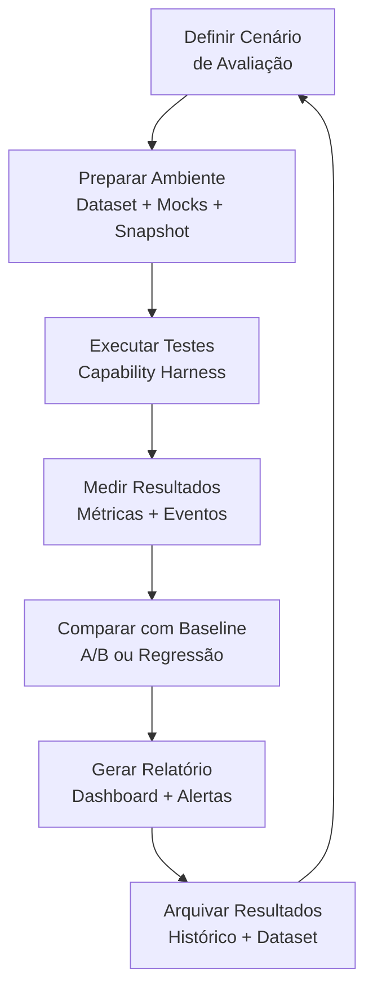
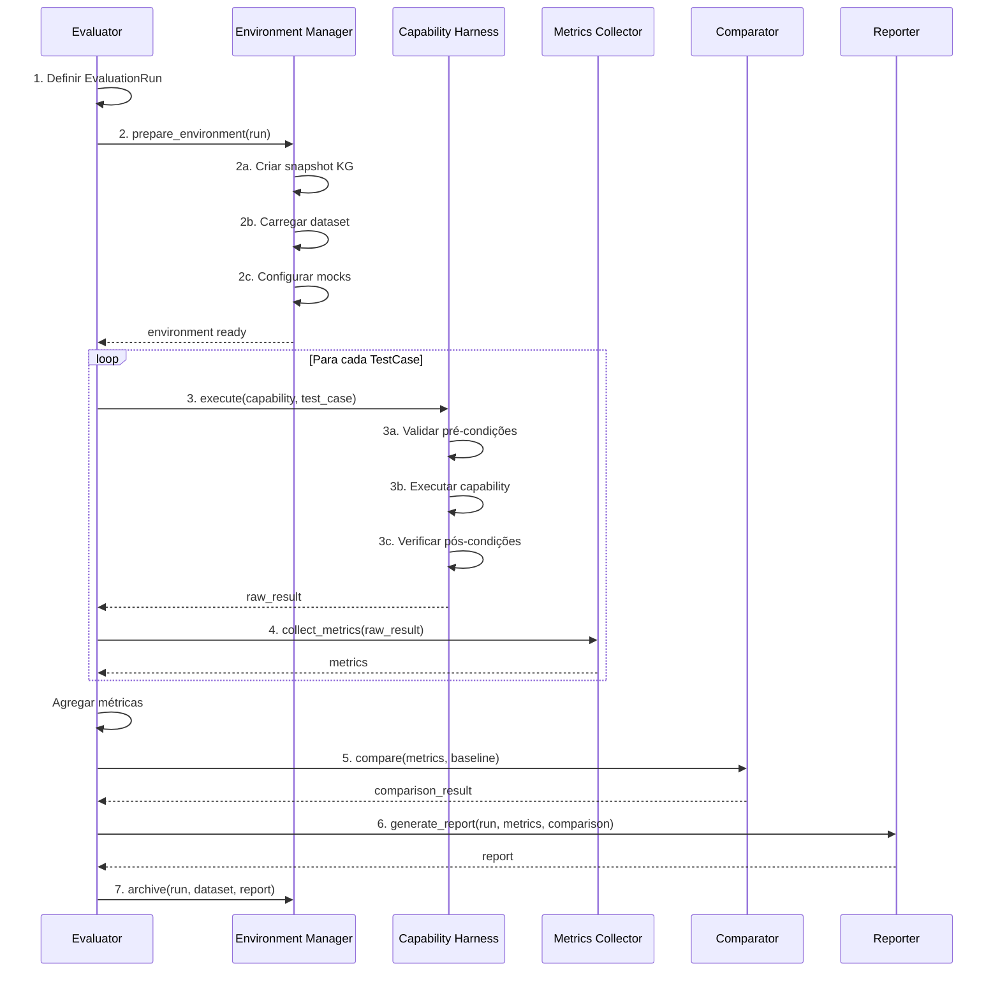
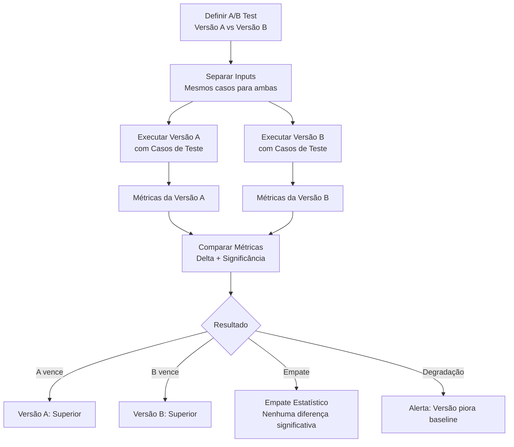
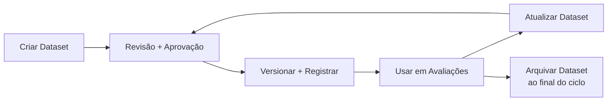

# APOS Evaluation Harness — Harness de Avaliação

**Documento:** EVALUATION_HARNESS.md  
**Release:** R0 | **Sprint:** 0.7  
**Tarefa:** T0.7.4 — Harness de avaliação  
**Dependência:** HARNESS.md (arquitetura geral), CAPABILITY_HARNESS.md (execução), CAPABILITY_MODEL.md (modelo de capabilities), CAPABILITY_ROUTING.md (roteamento), KNOWLEDGE_GRAPH.md (dados), AGENT_MAP.md (agentes)  
**Criado em:** 2026-07-21  
**Versão:** v0.1-draft

---

## Índice

1. [Introdução](#1-introdução)
2. [Tipos de Avaliação](#2-tipos-de-avaliação)
3. [Ciclo de Avaliação](#3-ciclo-de-avaliação)
4. [Métricas](#4-métricas)
5. [A/B Testing](#5-ab-testing)
6. [Report e Dashboard](#6-report-e-dashboard)
7. [Dataset e Casos de Teste](#7-dataset-e-casos-de-teste)
8. [Configuração](#8-configuração)
9. [Integrações](#9-integrações)
10. [Referências](#10-referências)

---

## 1. Introdução

### 1.1 O Que É o Evaluation Harness

O **Evaluation Harness** é a camada do APOS responsável por testar, avaliar e comparar capabilities, agentes e chains de forma sistemática e reprodutível. Ele fornece a infraestrutura para:

- **Executar testes automatizados** — unitários, integração, regressão, A/B e qualidade
- **Coletar métricas quantitativas** — accuracy, latência, error rate, coverage, consistency
- **Comparar versões** — avaliar duas versões da mesma capability lado a lado (A/B)
- **Gerar relatórios** — dashboards consolidados com histórico e tendências
- **Validar regressão** — garantir que mudanças não introduzem degradação
- **Medir qualidade** — confiabilidade, precisão e performance das capabilities

### 1.2 Posição nas Camadas do APOS

```
 ┌───────────────────────────────────────────────────┐
 │              Agentes APOS (Camada 6)               │
 └───────────────────────┬───────────────────────────┘
                         │
 ┌───────────────────────▼───────────────────────────┐
 │                HARNESS LAYER                       │
 │  Agent Harness | Capability Harness               │
 │  Evaluation Harness ★ | Simulation Harness        │
 └───────────────────────┬───────────────────────────┘
                         │
 ┌───────────────────────▼───────────────────────────┐
 │           Capability Harness (execução real)       │
 │  O Evaluation Harness delega execução para cá      │
 └───────────────────────┬───────────────────────────┘
                         │
 ┌───────────────────────▼───────────────────────────┐
 │              Context Engine (Camada 3.5)            │
 └───────────────────────┬───────────────────────────┘
                         │
 ┌───────────────────────▼───────────────────────────┐
 │              Knowledge Graph (Camada 3)             │
 └───────────────────────────────────────────────────┘
```

### 1.3 Relação com os Demais Documentos do Sprint 0.7

| Documento | Propósito | Relação |
|-----------|-----------|---------|
| **HARNESS.md** | Visão sistêmica dos 4 harnesses | Estrutura geral; este documento detalha a seção 5 |
| **AGENT_HARNESS.md** | Ciclo de vida de agentes | Evaluation Harness pode testar agentes via Agent Harness |
| **CAPABILITY_HARNESS.md** | Execução de capabilities | Evaluation Harness delega execução para cá |
| **SIMULATION_HARNESS.md** | Carga e estresse | Avaliação de qualidade usa resultados de simulação |
| **CAPABILITY_MODEL.md** | Estrutura de capabilities | Define o que é testável |
| **KNOWLEDGE_GRAPH.md** | Dados e queries | Métricas de coverage e consistency vêm do KG (Q14–Q16) |

### 1.4 Princípios de Design

1. **Reprodutibilidade** — toda avaliação deve ser executável novamente com os mesmos parâmetros e produzir os mesmos resultados
2. **Automação** — o ciclo completo (preparar → executar → medir → comparar → reportar) é 100% automatizado
3. **Não intrusivo** — a avaliação não altera o comportamento de produção; opera em cópia ou snapshot
4. **Granularidade flexível** — avalia desde uma capability isolada até chains completas multi-agente
5. **Comparabilidade** — toda execução produz métricas padronizadas que permitem comparação direta entre versões

---

## 2. Tipos de Avaliação

### 2.1 Visão Geral

| Tipo | Propósito | Escopo | Frequência | Execução |
|------|-----------|--------|:----------:|----------|
| **Unitário** | Testar uma capability isoladamente | Capability única, dependências mockadas | A cada commit | Capability Harness + Mock |
| **Integração** | Testar chain de capabilities com dependências reais | Chain completa, dependências reais | A cada PR | Capability Harness (real) |
| **Regressão** | Garantir que mudanças não quebram comportamento existente | Conjunto completo de testes salvos | A cada release | Evaluation Harness + Dataset |
| **A/B** | Comparar duas versões da mesma capability | Duas versões, mesmos inputs | Por demanda / release | Evaluation Harness (paralelo) |
| **Qualidade** | Medir confiabilidade, precisão e performance | Série de execuções com análise estatística | Periódico (semanal) | Evaluation Harness + Métricas |

### 2.2 Avaliação Unitária

Testa uma capability isoladamente, com todas as dependências externas (KG, Context Engine) substituídas por mocks.

```python
@dataclass
class UnitEvaluation:
    id: str                                # UUID da avaliação
    capability_id: str                     # Capability alvo
    test_cases: list[TestCase]             # Casos de teste unitários
    mock_kg: bool = True                   # Mockar Knowledge Graph
    mock_context: bool = True              # Mockar Context Engine
    expected_output: dict | None = None    # Saída esperada
    expected_effects: list[Effect] | None = None  # Efeitos esperados
```

**Regras:**

| Regra | Descrição |
|-------|-----------|
| **U-001** | Cada capability deve ter ao menos 1 caso de teste unitário por modo de operação |
| **U-002** | Mocks devem ser registrados no Mock Registry antes da execução |
| **U-003** | O teste falha se a capability chamar dependência não mockada |
| **U-004** | O teste unitário não persiste efeitos no KG real |

**Exemplo:**

```python
# Teste unitário para trust-score.calculate
unit = UnitEvaluation(
    id="eval-unit-001",
    capability_id="urn:apos:cap:governance:trust-score.calculate",
    test_cases=[
        TestCase(
            id="tc-001",
            name="Cálculo com coverage alta",
            input={"task_urn": "urn:apos:task:mock-001"},
            expected_output={"trust_score": 0.87, "factors": {...}},
        ),
    ],
    mock_kg=True,
    mock_context=True,
)
result = await evaluation_harness.run_unit(unit)
```

### 2.3 Avaliação de Integração

Testa uma chain de capabilities com dependências reais, validando o comportamento do sistema como um todo.

```python
@dataclass
class IntegrationEvaluation:
    id: str                                # UUID da avaliação
    chain_id: str                          # Chain de capabilities a testar
    test_cases: list[TestCase]             # Casos com dados reais
    use_real_kg: bool = True               # KG real (snapshot isolado)
    use_real_context: bool = True          # Context Engine real
    validate_effects: bool = True          # Verificar efeitos no KG
    teardown_cleanup: bool = True          # Limpar dados de teste após execução
```

**Regras:**

| Regra | Descrição |
|-------|-----------|
| **I-001** | A integração deve operar sobre um snapshot isolado do KG, nunca sobre produção |
| **I-002** | Toda execução de integração deve limpar seus dados ao final |
| **I-003** | O dataset de integração deve ser versionado junto com o código |
| **I-004** | A chain completa deve ser testada — do input do usuário ao efeito no KG |

### 2.4 Avaliação de Regressão

Garante que mudanças recentes não introduzem degradação em capabilities ou chains existentes.

```python
@dataclass
class RegressionEvaluation:
    id: str                                # UUID da avaliação
    baseline_id: str                       # ID da execução baseline de referência
    test_suite: list[TestCase]             # Suite completa de testes
    metrics_threshold: dict[str, float]    # Tolerância por métrica (ex: accuracy ≥ 0.95)
    compare_to_baseline: bool = True       # Comparar com baseline
    auto_fail_on_regression: bool = True   # Falhar se métrica degradar além do threshold
```

**Regras:**

| Regra | Descrição |
|-------|-----------|
| **R-001** | A suite de regressão deve conter todos os casos de teste já aprovados |
| **R-002** | Cada release deve executar a suite completa de regressão |
| **R-003** | Degradação > 5% em qualquer métrica bloqueia o release |
| **R-004** | O baseline é atualizado apenas após aprovação do release |

**Thresholds de regressão por tipo de métrica:**

| Métrica | Threshold de Degradação | Ação |
|---------|:-----------------------:|------|
| `accuracy` | ≤ -0.05 (5%) | Bloqueia release |
| `latency_p95` | ≥ +20% | Alerta de performance |
| `error_rate` | ≥ +0.02 (2pp) | Bloqueia release |
| `coverage` | ≤ -0.05 (5%) | Alerta de qualidade |
| `consistency` | ≤ -0.03 (3pp) | Alerta de qualidade |

### 2.5 Avaliação A/B

Compara duas versões da mesma capability lado a lado com os mesmos inputs. Detalhado na [seção 5](#5-ab-testing).

### 2.6 Avaliação de Qualidade

Mede a confiabilidade, precisão e performance de uma capability através de múltiplas execuções com análise estatística.

```python
@dataclass
class QualityEvaluation:
    id: str                                # UUID da avaliação
    capability_id: str                     # Capability alvo
    num_runs: int = 100                    # Número de execuções para análise
    test_cases: list[TestCase]             # Conjunto variado de inputs
    metrics_to_collect: list[str]          # Métricas para análise
    confidence_level: float = 0.95         # Nível de confiança estatística
    include_outliers: bool = False         # Incluir ou excluir outliers
```

**Dimensões da Qualidade:**

| Dimensão | Descrição | Métrica Principal | Frequência |
|----------|-----------|:-----------------:|:----------:|
| **Confiabilidade** | A capability funciona consistentemente sem erros | `error_rate`, `timeout_rate` | Semanal |
| **Precisão** | A saída corresponde ao esperado | `accuracy`, `precision`, `recall` | Semanal |
| **Performance** | A capability responde dentro dos limites aceitáveis | `latency_p50`, `latency_p95`, `latency_p99` | Contínuo |
| **Cobertura** | A capability opera corretamente em diferentes cenários | `coverage` | Semanal |
| **Consistência** | A capability produz resultados consistentes para o mesmo input | `consistency` | Semanal |

---

## 3. Ciclo de Avaliação

### 3.1 Diagrama do Ciclo



### 3.2 Etapas Detalhadas

| Etapa | Nome | Componente | Ação | Saída |
|-------|------|-----------|------|-------|
| **1** | **Definir** | Evaluator | Selecionar tipo, capability, casos de teste e parâmetros | `EvaluationRun` configurado |
| **2** | **Preparar** | Environment Manager | Criar snapshot do KG, carregar dataset, configurar mocks | Ambiente pronto e isolado |
| **3** | **Executar** | Capability Harness | Executar cada caso de teste via Capability Harness | Resultados brutos por teste |
| **4** | **Medir** | Metrics Collector | Coletar métricas de cada execução (latência, acurácia, erros) | Métricas agregadas |
| **5** | **Comparar** | Comparator | Comparar resultados com baseline ou versão concorrente (A/B) | Delta de métricas |
| **6** | **Reportar** | Reporter | Gerar relatório estruturado + dashboard | Relatório + atualização de dashboard |
| **7** | **Arquivar** | Archive Manager | Persistir resultados, métricas e dataset para consulta futura | Histórico no repositório |

### 3.3 Contrato de Execução

```python
@dataclass
class EvaluationRun:
    """Definição completa de uma execução de avaliação."""
    id: str                               # UUID gerado pelo sistema
    type: EvaluationType                  # unit | integration | regression | ab | quality
    capability_id: str                    # Capability ou chain alvo
    version_a: str                        # Versão A (geralmente a nova)
    version_b: str | None                 # Versão B (baseline, para A/B)
    test_cases: list[TestCase]            # Casos de teste
    config: EvaluationConfig              # Configuração da avaliação
    created_at: str                       # ISO 8601
    status: EvaluationStatus = "pending"  # pending | running | completed | failed

@dataclass
class EvaluationResult:
    """Resultado consolidado de uma avaliação."""
    run_id: str                           # Referência ao EvaluationRun
    status: str                           # passed | failed | degraded | inconclusive
    summary: MetricsSummary               # Resumo de métricas
    details: list[TestCaseResult]         # Resultados por caso de teste
    comparison: ComparisonResult | None   # Comparação com baseline (se aplicável)
    report_url: str                       # Link para o relatório completo
    duration_seconds: float               # Duração total da avaliação
    completed_at: str                     # ISO 8601

class EvaluationType(Enum):
    UNIT        = "unit"
    INTEGRATION = "integration"
    REGRESSION  = "regression"
    AB_TEST     = "ab"
    QUALITY     = "quality"

class EvaluationStatus(Enum):
    PENDING   = "pending"
    RUNNING   = "running"
    COMPLETED = "completed"
    FAILED    = "failed"
```

### 3.4 Ciclo de Execução (Sequência)



---

## 4. Métricas

### 4.1 Catálogo de Métricas

| Métrica | Descrição | Unidade | Tipo | Fonte | Coleta |
|---------|-----------|:-------:|:----:|-------|:------:|
| `accuracy` | Proporção de execuções com saída correta | % (0–1) | Ratio | Comparação com expected_output | Por execução |
| `precision` | Proporção de acertos entre os positivos retornados | % (0–1) | Ratio | Matriz de confusão | Por suite |
| `recall` | Proporção de positivos identificados corretamente | % (0–1) | Ratio | Matriz de confusão | Por suite |
| `f1_score` | Média harmônica entre precision e recall | % (0–1) | Ratio | Cálculo sobre precision + recall | Por suite |
| `latency_p50` | Mediana do tempo de execução | ms | Histogram | Timing da capability | Contínuo |
| `latency_p95` | Percentil 95 do tempo de execução | ms | Histogram | Timing da capability | Contínuo |
| `latency_p99` | Percentil 99 do tempo de execução | ms | Histogram | Timing da capability | Contínuo |
| `error_rate` | Proporção de execuções com erro | % (0–1) | Ratio | Contagem de erros | Por execução |
| `timeout_rate` | Proporção de execuções com timeout | % (0–1) | Ratio | Contagem de timeouts | Por execução |
| `retry_rate` | Proporção de execuções que exigiram retry | % (0–1) | Ratio | Contagem de retries | Por execução |
| `coverage` | Cobertura de dados no KG para a capability (Q14) | % (0–1) | Ratio | Knowledge Graph Q14 | Por execução |
| `consistency` | Consistência das relações no KG (Q16) | % (0–1) | Ratio | Knowledge Graph Q16 | Por execução |
| `quality_score` | Score composto de qualidade do KG (Q15) | % (0–1) | Ratio | Knowledge Graph Q15 | Por execução |
| `kg_ops` | Operações no KG por execução | count | Counter | Log de queries | Por execução |
| `context_tokens` | Tokens de contexto consumidos | count | Histogram | Context Engine | Por execução |
| `success_rate` | Proporção de execuções bem-sucedidas (1 - error_rate) | % (0–1) | Ratio | Contagem total | Por execução |

### 4.2 Definições e Estruturas

```python
@dataclass
class MetricsSummary:
    """Resumo agregado de métricas de uma avaliação."""
    run_id: str
    capability_id: str
    num_tests: int
    num_passed: int
    num_failed: int
    num_timeout: int

    # Acurácia e qualidade
    accuracy: float                       # 0.0 a 1.0
    precision: float | None               # 0.0 a 1.0 (se aplicável)
    recall: float | None                  # 0.0 a 1.0 (se aplicável)
    f1_score: float | None                # 0.0 a 1.0 (se aplicável)

    # Performance
    latency_p50_ms: float
    latency_p95_ms: float
    latency_p99_ms: float
    latency_mean_ms: float
    latency_min_ms: float
    latency_max_ms: float
    latency_stddev_ms: float

    # Erros
    error_rate: float                     # 0.0 a 1.0
    timeout_rate: float                   # 0.0 a 1.0
    retry_rate: float                     # 0.0 a 1.0
    error_distribution: dict[str, int]    # error_type -> count

    # KG e contexto
    coverage: float | None                # 0.0 a 1.0 (Q14)
    consistency: float | None             # 0.0 a 1.0 (Q16)
    quality_score: float | None           # 0.0 a 1.0 (Q15)
    kg_ops_total: int
    context_tokens_avg: float

    # Estado da avaliação
    status: str                           # "passed" | "failed" | "degraded"
    completed_at: str                     # ISO 8601
    duration_seconds: float

@dataclass
class TestCaseResult:
    """Resultado de um caso de teste individual."""
    test_case_id: str
    name: str
    status: str                           # passed | failed | error | timeout
    input: dict
    output: dict | None
    expected_output: dict | None
    match: bool | None                    # True se output == expected_output
    error: str | None
    latency_ms: float
    kg_ops: int
    context_tokens: int
    details: dict
```

### 4.3 Matriz de Confusão

Para métricas de avaliação que envolvem classificação (precision, recall, f1), o Evaluation Harness constrói uma matriz de confusão:

```python
@dataclass
class ConfusionMatrix:
    """Matriz de confusão para avaliação de classificação."""
    true_positives: int     # Acertou que era positivo
    true_negatives: int     # Acertou que era negativo
    false_positives: int    # Disse que era positivo, mas era negativo
    false_negatives: int    # Disse que era negativo, mas era positivo

    @property
    def precision(self) -> float:
        """TP / (TP + FP)"""
        denominator = self.true_positives + self.false_positives
        return self.true_positives / denominator if denominator > 0 else 0.0

    @property
    def recall(self) -> float:
        """TP / (TP + FN)"""
        denominator = self.true_positives + self.false_negatives
        return self.true_positives / denominator if denominator > 0 else 0.0

    @property
    def f1(self) -> float:
        """2 * (precision * recall) / (precision + recall)"""
        p = self.precision
        r = self.recall
        return 2 * (p * r) / (p + r) if (p + r) > 0 else 0.0

    @property
    def accuracy(self) -> float:
        """(TP + TN) / (TP + TN + FP + FN)"""
        total = self.true_positives + self.true_negatives + self.false_positives + self.false_negatives
        return (self.true_positives + self.true_negatives) / total if total > 0 else 0.0
```

### 4.4 Histograma de Latência

O Evaluation Harness mantém histogramas para análise de distribuição de latência:

```python
@dataclass
class LatencyHistogram:
    """Histograma de latência para análise de performance."""
    buckets: dict[str, int]               # bucket_label -> count
    # Buckets padrão (ms): 0-50, 50-100, 100-200, 200-500, 500-1000, 1000-2000, 2000-5000, 5000+
    p50_ms: float
    p95_ms: float
    p99_ms: float
    mean_ms: float
    stddev_ms: float
    min_ms: float
    max_ms: float
    sample_count: int
```

### 4.5 Métricas Compostas

O Evaluation Harness suporta métricas compostas que combinam múltiplas métricas base:

```python
class CompositeMetrics:
    @staticmethod
    def overall_quality(summary: MetricsSummary) -> float:
        """Score composto de qualidade (0.0 a 1.0)."""
        w_accuracy = 0.30
        w_latency  = 0.20
        w_errors   = 0.25
        w_coverage = 0.15
        w_consist  = 0.10

        accuracy_score = summary.accuracy
        latency_score  = 1.0 - (summary.latency_p95_ms / 10000.0)  # 10s = pior caso
        error_score    = 1.0 - summary.error_rate
        coverage_score = summary.coverage if summary.coverage else 0.5
        consist_score  = summary.consistency if summary.consistency else 0.5

        return (
            w_accuracy * accuracy_score +
            w_latency  * max(0.0, min(1.0, latency_score)) +
            w_errors   * error_score +
            w_coverage * coverage_score +
            w_consist  * consist_score
        )

    @staticmethod
    def performance_index(summary: MetricsSummary) -> float:
        """Índice de performance (0.0 a 1.0)."""
        return 1.0 - (
            0.4 * (summary.latency_p95_ms / 10000.0) +
            0.3 * summary.error_rate +
            0.3 * summary.timeout_rate
        )
```

---

## 5. A/B Testing

### 5.1 Visão Geral

O **A/B Testing** no APOS compara duas versões da mesma capability executando-as com os mesmos inputs e medindo as diferenças nas métricas.

```python
@dataclass
class ABTestEvaluation:
    id: str                                # UUID da avaliação
    capability_id: str                     # Capability alvo
    version_a_label: str                   # Rótulo da versão A (ex: "v2.1.0")
    version_b_label: str                   # Rótulo da versão B (ex: "v2.0.0")
    test_cases: list[TestCase]             # Mesmos casos para ambas as versões
    parallel: bool = True                  # Executar em paralelo (vs. sequencial)
    num_iterations: int = 1                # Número de iterações por caso
    metrics: list[str]                     # Métricas a comparar
    significance_level: float = 0.05       # Nível de significância estatística
    auto_promote: bool = False             # Promover automaticamente a vencedora
```

### 5.2 Ciclo do A/B



### 5.3 Estrutura de Comparação

```python
@dataclass
class ComparisonResult:
    """Resultado da comparação entre duas versões."""
    version_a: str                         # Rótulo da versão A
    version_b: str                         # Rótulo da versão B
    summary_a: MetricsSummary              # Métricas da versão A
    summary_b: MetricsSummary              # Métricas da versão B

    deltas: dict[str, float]               # Métrica -> delta (A - B)
    # Ex: { "accuracy": +0.03, "latency_p95_ms": -150.0 }

    verdict: str                           # "a_wins" | "b_wins" | "draw" | "degradation"
    significance: dict[str, float]         # Métrica -> p-value (teste estatístico)
    recommended: str                       # Versão recomendada (A ou B)
    reasons: list[str]                     # Razões para a recomendação
```

### 5.4 Regras de Decisão

| Condição | Verdict | Ação |
|----------|:-------:|------|
| A accuracy ≥ B accuracy + 0.02 E A latency ≤ B latency | `a_wins` | Promover A |
| B accuracy ≥ A accuracy + 0.02 E B latency ≤ A latency | `b_wins` | Manter ou promover B |
| Nenhuma diferença significativa (p > 0.05) | `draw` | Nenhuma ação |
| A accuracy < B accuracy - 0.05 | `degradation` | Bloquear promoção de A |
| A latency > B latency + 30% E mesma accuracy | `degradation` | Alerta de performance |

### 5.5 Exemplo de A/B Test

```python
ab_test = ABTestEvaluation(
    id="eval-ab-042",
    capability_id="urn:apos:cap:governance:trust-score.calculate",
    version_a_label="trust-score-v2 (nova ponderação)",
    version_b_label="trust-score-v1 (pesos originais)",
    test_cases=[
        TestCase(id="tc-001", name="Task com alta cobertura",
                 input={"task_urn": "urn:apos:task:oauth-123"}),
        TestCase(id="tc-002", name="Task sem features",
                 input={"task_urn": "urn:apos:task:new-task-999"}),
        TestCase(id="tc-003", name="Task com bloqueio ativo",
                 input={"task_urn": "urn:apos:task:blocked-456"}),
    ],
    parallel=True,
    num_iterations=3,
    metrics=["accuracy", "latency_p95", "error_rate", "coverage"],
)

result = await evaluation_harness.run_ab_test(ab_test)
# result.verdict = "a_wins" (trust-score-v2 3% mais preciso, mesma latência)
```

### 5.6 Teste Estatístico

Para determinar significância, o Evaluation Harness utiliza o **teste t pareado** (quando os mesmos inputs são usados) ou **teste de Welch** (quando os grupos têm variâncias diferentes):

```python
@dataclass
class StatisticalTest:
    """Resultado de teste estatístico para comparação A/B."""
    test_type: str                         # "paired_t" | "welch_t" | "mann_whitney"
    statistic: float                       # Estatística do teste
    p_value: float                         # p-value (significância)
    significant: bool                      # p_value < significance_level
    effect_size: float                     # Tamanho do efeito (Cohen's d)
    confidence_interval: tuple[float, float]  # Intervalo de confiança 95%
```

---

## 6. Report e Dashboard

### 6.1 Estrutura do Relatório de Avaliação

Cada avaliação gera um relatório estruturado em formato JSON, com versão Markdown para visualização:

```python
@dataclass
class EvaluationReport:
    """Relatório completo de uma avaliação."""
    run_id: str
    type: EvaluationType
    capability_id: str
    title: str                             # Título descritivo
    created_at: str                        # ISO 8601

    # Configuração
    config: EvaluationConfig

    # Sumário executivo
    summary: MetricsSummary
    verdict: str                           # passed | failed | degraded | inconclusive
    verdict_reason: str                    # Explicação do veredito

    # Detalhes
    test_results: list[TestCaseResult]     # Resultados por caso
    comparison: ComparisonResult | None    # Comparação com baseline

    # Métricas avulsas
    metrics_over_time: list[MetricsPoint] | None  # Histórico (se disponível)

    # Metadata
    duration_seconds: float
    dataset_version: str
    environment: str                       # staging | ci | local
    executed_by: str                       # Quem solicitou

    # Links
    report_url: str                        # Link para o dashboard
    raw_data_url: str                      # Link para dados brutos
    log_url: str                           # Link para logs

@dataclass
class MetricsPoint:
    """Um ponto no histórico de métricas."""
    timestamp: str                         # ISO 8601
    accuracy: float
    latency_p95_ms: float
    error_rate: float
    coverage: float | None
```

### 6.2 Template de Relatório Markdown

```markdown
# Relatório de Avaliação: {capability_id}

**Run ID:** {run_id}  
**Tipo:** {type}  
**Data:** {created_at}  
**Veredito:** {verdict}

---

## Sumário Executivo

| Métrica | Valor | Baseline | Delta | Status |
|---------|:-----:|:--------:|:-----:|:------:|
| Accuracy | {accuracy} | {baseline} | {delta} | ✅/❌ |
| Latency P95 | {latency}ms | {baseline}ms | {delta}ms | ✅/❌ |
| Error Rate | {error_rate} | {baseline} | {delta} | ✅/❌ |
| Coverage | {coverage} | {baseline} | {delta} | ✅/❌ |

## Comparação A/B (se aplicável)

| Métrica | Versão A | Versão B | Delta | Significância |
|---------|:--------:|:--------:|:-----:|:-------------:|
| Accuracy | {acc_a} | {acc_b} | {delta} | p={p_value} |
| Latency P95 | {lat_a}ms | {lat_b}ms | {delta}ms | p={p_value} |

## Distribuição de Erros

| Tipo de Erro | Quantidade | % |
|-------------|:----------:|:-:|
| timeout | {n} | {p}% |
| invalid_input | {n} | {p}% |
| rate_limited | {n} | {p}% |

## Casos de Teste

| # | Nome | Status | Latência | Erro |
|:-:|------|:-----:|:--------:|:----:|
| 1 | {name} | ✅/❌ | {lat}ms | — |
| 2 | {name} | ✅/❌ | {lat}ms | {error} |

## Conclusão

{verdict_reason}
```

### 6.3 Dashboard de Avaliação

O dashboard fornece visão consolidada de todas as avaliações para monitoramento contínuo:

```python
@dataclass
class EvaluationDashboard:
    """Dashboard consolidado de avaliações."""
    # Métricas agregadas do período
    total_runs: int
    passed_runs: int
    failed_runs: int
    degraded_runs: int
    pass_rate: float                       # passed / total

    # Tendências
    accuracy_trend: list[MetricsPoint]     # Últimos 30 dias
    latency_trend: list[MetricsPoint]      # Últimos 30 dias
    error_trend: list[MetricsPoint]        # Últimos 30 dias

    # Por capability
    by_capability: dict[str, CapabilityHealth]

    # Alertas ativos
    active_alerts: list[EvaluationAlert]

    # Últimas execuções
    recent_runs: list[EvaluationReport]

@dataclass
class CapabilityHealth:
    """Saúde consolidada de uma capability."""
    capability_id: str
    last_run_status: str                    # passed | failed | degraded
    last_run_at: str                        # ISO 8601
    running_average_accuracy: float         # Média móvel dos últimos N runs
    running_average_latency_p95: float
    current_accuracy: float
    accuracy_trend: str                     # improving | stable | degrading
    alert_count: int
```

### 6.4 Alertas

O dashboard gera alertas quando métricas cruzam thresholds:

| Alerta | Condição | Severidade | Ação |
|--------|----------|:----------:|------|
| **Acurácia Baixa** | accuracy < 0.80 | `high` | Notificar equipe da capability |
| **Latência Alta** | latency_p95 > 5000ms | `medium` | Revisar performance |
| **Erro Elevado** | error_rate > 0.10 | `high` | Pausar capability se > 0.20 |
| **Regressão** | accuracy drop > 0.05 vs baseline | `critical` | Bloquear release |
| **Cobertura Baixa** | coverage < 0.50 | `low` | Revisar dataset de teste |
| **Degradação A/B** | nova versão pior que baseline | `critical` | Bloquear promoção |

```python
@dataclass
class EvaluationAlert:
    """Alerta gerado por condição de avaliação."""
    id: str
    severity: str                          # low | medium | high | critical
    metric: str                            # Métrica que disparou
    current_value: float
    threshold: float
    message: str                           # Mensagem descritiva
    capability_id: str
    created_at: str                        # ISO 8601
    acknowledged: bool = False             # Reconhecido por operador
    resolved_at: str | None = None
```

### 6.5 Exemplo de Relatório Gerado

```json
{
  "run_id": "eval-run-20260721-001",
  "type": "regression",
  "capability_id": "urn:apos:cap:governance:trust-score.calculate",
  "title": "Regressão Trust Score v2.1.0",
  "verdict": "passed",
  "verdict_reason": "Todas as métricas dentro dos thresholds de regressão. Accuracy: 0.94 (baseline: 0.92).",
  "summary": {
    "accuracy": 0.94,
    "latency_p95_ms": 420.0,
    "latency_p99_ms": 890.0,
    "error_rate": 0.02,
    "coverage": 0.91,
    "consistency": 0.88
  },
  "comparison": {
    "version_a": "v2.1.0",
    "version_b": "v2.0.0 (baseline)",
    "deltas": {
      "accuracy": 0.02,
      "latency_p95_ms": -30.0,
      "error_rate": -0.01
    },
    "verdict": "a_wins"
  },
  "duration_seconds": 45.3,
  "test_results": [
    {"test_case_id": "tc-001", "status": "passed", "latency_ms": 320},
    {"test_case_id": "tc-002", "status": "passed", "latency_ms": 410},
    {"test_case_id": "tc-003", "status": "passed", "latency_ms": 380}
  ]
}
```

---

## 7. Dataset e Casos de Teste

### 7.1 Estrutura do Dataset

O Evaluation Harness gerencia datasets versionados de casos de teste:

```python
@dataclass
class TestDataset:
    """Dataset versionado de casos de teste."""
    id: str                                # ID do dataset
    version: str                           # SemVer (ex: "1.2.0")
    capability_id: str                     # Capability alvo
    description: str                       # Descrição do dataset
    test_cases: list[TestCase]             # Casos de teste
    tags: list[str]                        # Tags para categorização
    created_at: str                        # ISO 8601
    author: str                            # Quem criou

@dataclass
class TestCase:
    """Caso de teste individual."""
    id: str                                # ID único (ex: "tc-042")
    name: str                              # Nome descritivo
    description: str                       # Descrição do cenário
    input: dict                            # Parâmetros de entrada
    expected_output: dict | None           # Saída esperada (se conhecida)
    expected_effects: list[Effect] | None  # Efeitos esperados no KG
    tags: list[str]                        # Tags (ex: ["regression", "critical"])
    priority: int = 3                      # Prioridade (1 = crítica, 5 = baixa)
    category: str = "general"              # Categoria do teste
```

### 7.2 Ciclo de Vida do Dataset



### 7.3 Exemplo de Dataset

```python
dataset = TestDataset(
    id="ds-trust-score-001",
    version="1.0.0",
    capability_id="urn:apos:cap:governance:trust-score.calculate",
    description="Dataset principal para trust-score.calculate",
    test_cases=[
        TestCase(
            id="ts-001",
            name="Task normal com todos os dados",
            description="Task completa com coverage, quality e consistency disponíveis",
            input={"task_urn": "urn:apos:task:oauth-123"},
            expected_output={"trust_score": 0.87},
            tags=["regression", "critical", "smoke"],
            priority=1,
        ),
        TestCase(
            id="ts-002",
            name="Task sem features associadas",
            description="Task recém-criada, sem features ou métricas",
            input={"task_urn": "urn:apos:task:new-task-999"},
            expected_output={"trust_score": 0.40},
            tags=["regression", "edge-case"],
            priority=3,
        ),
        TestCase(
            id="ts-003",
            name="Task com bloqueio ativo",
            description="Task bloqueada por dependência, trust score deve ser baixo",
            input={"task_urn": "urn:apos:task:blocked-456"},
            expected_output={"trust_score": 0.25},
            tags=["regression", "blocker"],
            priority=2,
        ),
    ],
    tags=["governance", "trust-score", "regression"],
)
```

### 7.4 Mock Registry

Para avaliações unitárias, o Evaluation Harness mantém um registro de mocks:

```python
@dataclass
class MockDefinition:
    """Definição de um mock para substituir dependência real."""
    dependency_id: str                     # ID da dependência (ex: kg.query)
    method: str                            # Método a mockar
    input_matcher: dict                    # Critério para selecionar este mock
    output: dict                           # Resposta mockada
    latency_ms: int = 0                    # Latência simulada (0 = instantâneo)
    error: str | None = None               # Erro simulado (None = sucesso)

class MockRegistry:
    """Registro central de mocks para testes."""
    def __init__(self):
        self._mocks: dict[str, list[MockDefinition]] = {}

    def register(self, mock: MockDefinition) -> None:
        """Registra um novo mock."""
        if mock.dependency_id not in self._mocks:
            self._mocks[mock.dependency_id] = []
        self._mocks[mock.dependency_id].append(mock)

    def resolve(self, dependency_id: str, input: dict) -> MockDefinition | None:
        """Resolve o mock mais específico para o input fornecido."""
        candidates = self._mocks.get(dependency_id, [])
        for mock in candidates:
            if all(input.get(k) == v for k, v in mock.input_matcher.items()):
                return mock
        return None
```

---

## 8. Configuração

### 8.1 EvaluationConfig

```python
@dataclass
class EvaluationConfig:
    """Configuração específica do Evaluation Harness."""

    # Timeouts
    test_timeout_seconds: int = 120        # Timeout por caso de teste
    ab_test_timeout_seconds: int = 300     # Timeout para A/B completo
    quality_timeout_seconds: int = 600     # Timeout para avaliação de qualidade

    # Concorrência
    max_concurrent_tests: int = 3          # Testes simultâneos
    parallel_ab_execution: bool = True     # Executar A/B em paralelo

    # Métricas
    collect_detailed_metrics: bool = True  # Coletar métricas detalhadas
    track_kg_operations: bool = True       # Rastrear operações no KG
    track_context_tokens: bool = True      # Rastrear consumo de tokens
    latency_histogram_buckets: list[int] = field(
        default_factory=lambda: [50, 100, 200, 500, 1000, 2000, 5000]
    )

    # Report
    auto_generate_report: bool = True      # Gerar relatório automaticamente
    report_format: str = "markdown"        # Formato do relatório
    archive_results: bool = True           # Arquivar resultados

    # Thresholds
    default_accuracy_threshold: float = 0.80
    default_latency_p95_threshold_ms: float = 5000.0
    default_error_rate_threshold: float = 0.10
    regression_max_degradation: float = 0.05  # 5% máximo de degradação

    # A/B
    ab_significance_level: float = 0.05
    ab_min_effect_size: float = 0.01       # Efeito mínimo para considerar relevante
    ab_num_iterations_default: int = 3

    # Dataset
    dataset_version: str = "latest"
    auto_load_dataset: bool = True
    mock_registry_enabled: bool = True
```

### 8.2 Configuração via YAML (Exemplo)

```yaml
# config/evaluation-harness.yaml
evaluation_harness:
  timeouts:
    test_timeout_seconds: 120
    ab_test_timeout_seconds: 300
    quality_timeout_seconds: 600

  concurrency:
    max_concurrent_tests: 3
    parallel_ab_execution: true

  metrics:
    collect_detailed: true
    track_kg_operations: true
    track_context_tokens: true
    latency_buckets_ms: [50, 100, 200, 500, 1000, 2000, 5000]

  reporting:
    auto_generate: true
    format: "markdown"
    archive_results: true

  thresholds:
    accuracy: 0.80
    latency_p95_ms: 5000
    error_rate: 0.10
    regression_max_degradation: 0.05

  ab_testing:
    significance_level: 0.05
    min_effect_size: 0.01
    default_iterations: 3
```

### 8.3 Parâmetros por Tipo de Avaliação

| Parâmetro | Unitário | Integração | Regressão | A/B | Qualidade |
|-----------|:--------:|:----------:|:---------:|:---:|:---------:|
| `test_timeout_seconds` | 30 | 120 | 120 | 300 | 600 |
| `max_concurrent_tests` | 5 | 2 | 3 | 3 | 2 |
| `collect_detailed_metrics` | true | true | true | true | true |
| `track_kg_operations` | false (mock) | true | true | true | true |
| `auto_generate_report` | true | true | true | true | true |
| `mock_registry_enabled` | true | false | false | false | false |
| `archive_results` | true | true | true | true | true |

---

## 9. Integrações

### 9.1 Integração com Capability Harness

O Evaluation Harness delega toda execução de capabilities para o **Capability Harness**:

| Operação do Evaluation | Uso do Capability Harness |
|------------------------|--------------------------|
| Execução de caso de teste unitário | Capability Harness + Mock Registry |
| Execução de caso de teste de integração | Capability Harness (KG real) |
| Execução A/B paralela | Duas instâncias do Capability Harness |
| Coleta de métricas de execução | Métricas expostas pelo Capability Harness |

### 9.2 Integração com Knowledge Graph (KG)

| Operação do Evaluation | Uso do KG |
|------------------------|-----------|
| Snapshot para teste de integração | Cópia isolada do grafo |
| Verificação de pós-condições | Consulta de efeitos no KG |
| Métrica de coverage | Query Q14 |
| Métrica de consistency | Query Q16 |
| Métrica de quality_score | Query Q15 |

### 9.3 Integração com CI/CD Pipeline

| Estágio CI/CD | Ação do Evaluation Harness |
|:-------------:|---------------------------|
| **Commit** | Executar testes unitários das capabilities modificadas |
| **Pull Request** | Executar testes de integração da chain afetada |
| **Release Candidate** | Executar regressão completa + A/B (se aplicável) |
| **Release** | Executar avaliação de qualidade, gerar relatório final |
| **Periódico** | Executar avaliação de qualidade semanal |

### 9.4 Integração com Sistema de Alertas

O Evaluation Harness notifica o sistema de alertas do APOS quando:

- Uma avaliação de regressão falha (bloqueia release)
- Uma avaliação A/B detecta degradação significativa
- Uma métrica de qualidade cruza threshold crítico
- Um dataset de teste fica desatualizado

---

## 10. Referências

### Documentos Internos do APOS (Sprint 0.7)

| Documento | Descrição |
|-----------|-----------|
| [HARNESS.md](HARNESS.md) | Visão sistêmica dos 4 harnesses (seção 5: Evaluation Harness) |
| [AGENT_HARNESS.md](AGENT_HARNESS.md) | Harness de agente (ciclo de vida, health check) |
| [CAPABILITY_HARNESS.md](CAPABILITY_HARNESS.md) | Harness de capability (execução, erros, rollback) |
| [SIMULATION_HARNESS.md](SIMULATION_HARNESS.md) | Harness de simulação (carga, estresse, cenários) |

### Dependências Ascendentes

| Documento | Sprint | Conteúdo Relevante |
|-----------|:------:|--------------------|
| [CAPABILITY_MODEL.md](../sprint-0.6/CAPABILITY_MODEL.md) | 0.6 | Estrutura, ciclo de vida e registro de capabilities |
| [CAPABILITY_TAXONOMY.md](../sprint-0.6/CAPABILITY_TAXONOMY.md) | 0.6 | Hierarquia e categorias de capabilities |
| [CAPABILITY_ROUTING.md](../sprint-0.6/CAPABILITY_ROUTING.md) | 0.6 | Algoritmo de resolução de rota, cache, chain |
| [AGENT_MAP.md](../sprint-0.6/AGENT_MAP.md) | 0.6 | Catálogo de agentes e matriz agente × capability |
| [KNOWLEDGE_GRAPH.md](../sprint-0.4/KNOWLEDGE_GRAPH.md) | 0.4 | Estrutura de nós, arestas, URNs (Q14–Q16) |
| [QUERY_PATTERNS.md](../sprint-0.4/QUERY_PATTERNS.md) | 0.4 | Padrões de navegação Q01–Q16 |
| [CONTEXT_MODEL.md](../sprint-0.5/CONTEXT_MODEL.md) | 0.5 | Pipeline de montagem de contexto |

---

## Apêndice A — Resumo de Comandos do Evaluation Harness

| Comando | Descrição | Parâmetros |
|---------|-----------|------------|
| `evaluation.run_unit(config)` | Executa avaliação unitária | capability_id, test_cases, mocks |
| `evaluation.run_integration(config)` | Executa avaliação de integração | chain_id, test_cases, snapshot |
| `evaluation.run_regression(config)` | Executa avaliação de regressão | suite_id, baseline_id, thresholds |
| `evaluation.run_ab_test(config)` | Executa avaliação A/B | capability_id, version_a, version_b, test_cases |
| `evaluation.run_quality(config)` | Executa avaliação de qualidade | capability_id, num_runs, test_cases |
| `evaluation.compare(run_a, run_b)` | Compara duas execuções | run_id_a, run_id_b |
| `evaluation.report(run_id)` | Gera relatório de uma execução | run_id, format |
| `evaluation.dashboard()` | Obtém dashboard consolidado | — |
| `evaluation.dataset.load(ds_id)` | Carrega um dataset | dataset_id, version |
| `evaluation.dataset.register(ds)` | Registra um novo dataset | dataset |
| `evaluation.alerts.list()` | Lista alertas ativos | severity, capability_id |

## Apêndice B — Glossário

| Termo | Definição |
|-------|-----------|
| **Avaliação Unitária** | Teste de capability isolada com dependências mockadas |
| **Avaliação de Integração** | Teste de chain de capabilities com dependências reais |
| **Avaliação de Regressão** | Teste que compara métricas atuais contra baseline histórico |
| **Avaliação A/B** | Comparação lado a lado de duas versões da mesma capability |
| **Avaliação de Qualidade** | Análise estatística de confiabilidade, precisão e performance |
| **Baseline** | Conjunto de métricas de referência para comparação |
| **Dataset** | Conjunto versionado de casos de teste |
| **Mock Registry** | Registro de dependências simuladas para testes unitários |
| **Matriz de Confusão** | Tabela TP/TN/FP/FN para cálculo de precision, recall, f1 |
| **Snapshot** | Cópia isolada do KG para execução de testes de integração |
| **Threshold** | Limiar que determina aprovação/falha de uma métrica |
| **Delta** | Diferença entre duas medições (ex: accuracy v2 - accuracy v1) |
| **Verdict** | Resultado consolidado: passed, failed, degraded, inconclusive |
| **Test Case** | Cenário de teste com input, expected_output e tags |
| **Histograma de Latência** | Distribuição de tempos de resposta em buckets |

---

**Última atualização:** 2026-07-21  
**Versão:** v0.1-draft  
**Próximo passo:** [SIMULATION_HARNESS.md](SIMULATION_HARNESS.md) — Harness de simulação (carga, estresse, cenários)
