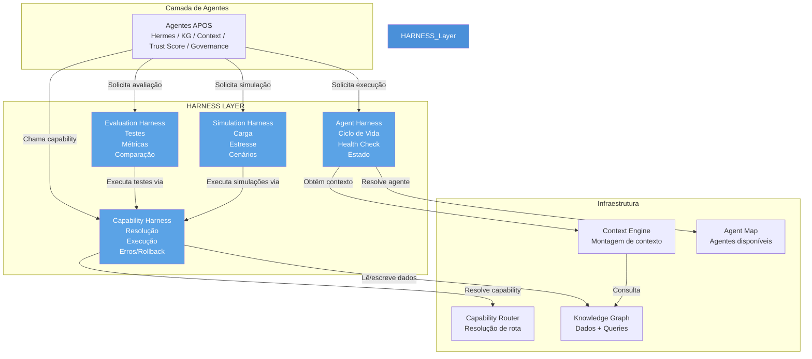
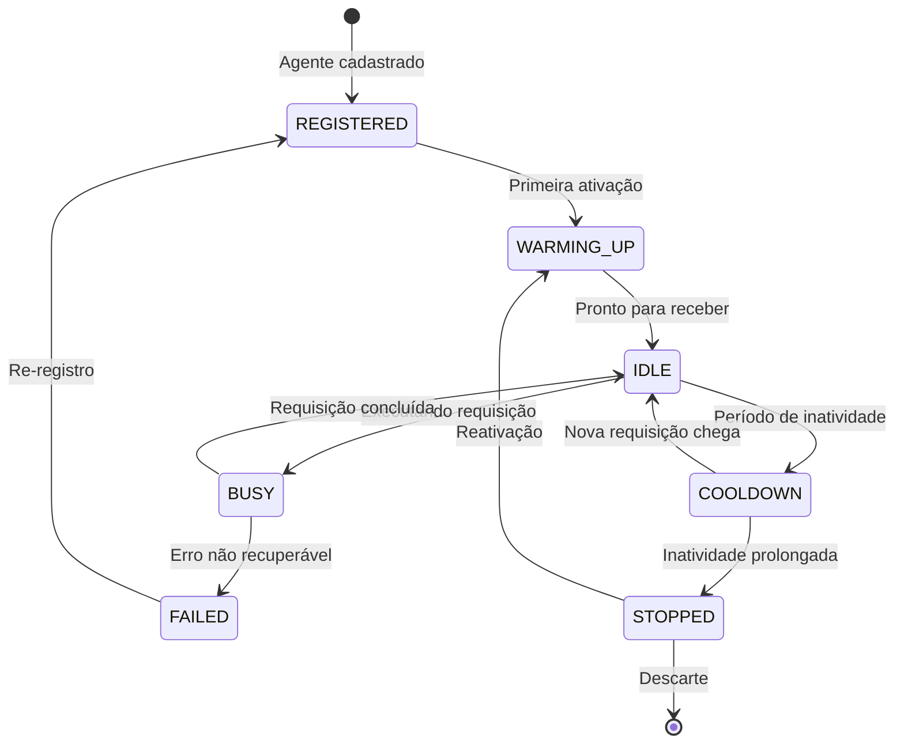
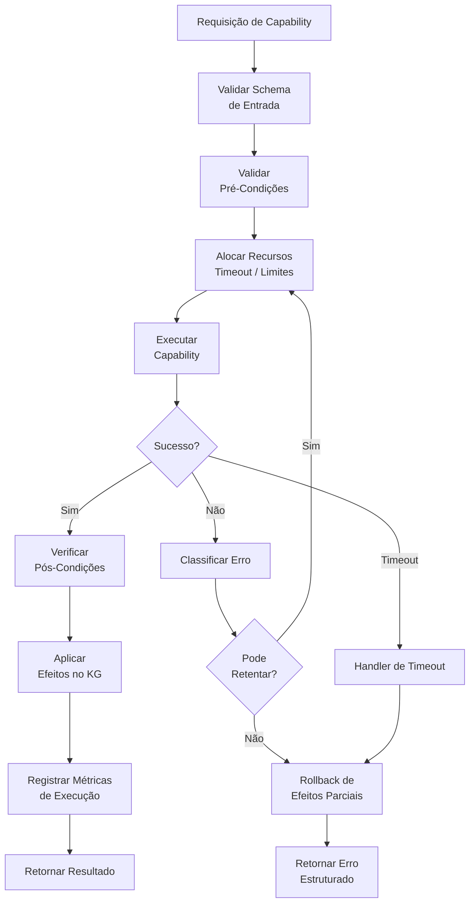
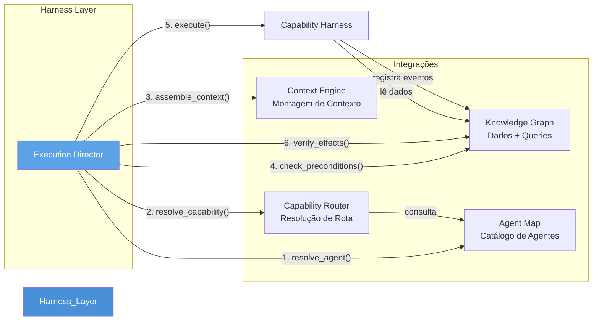
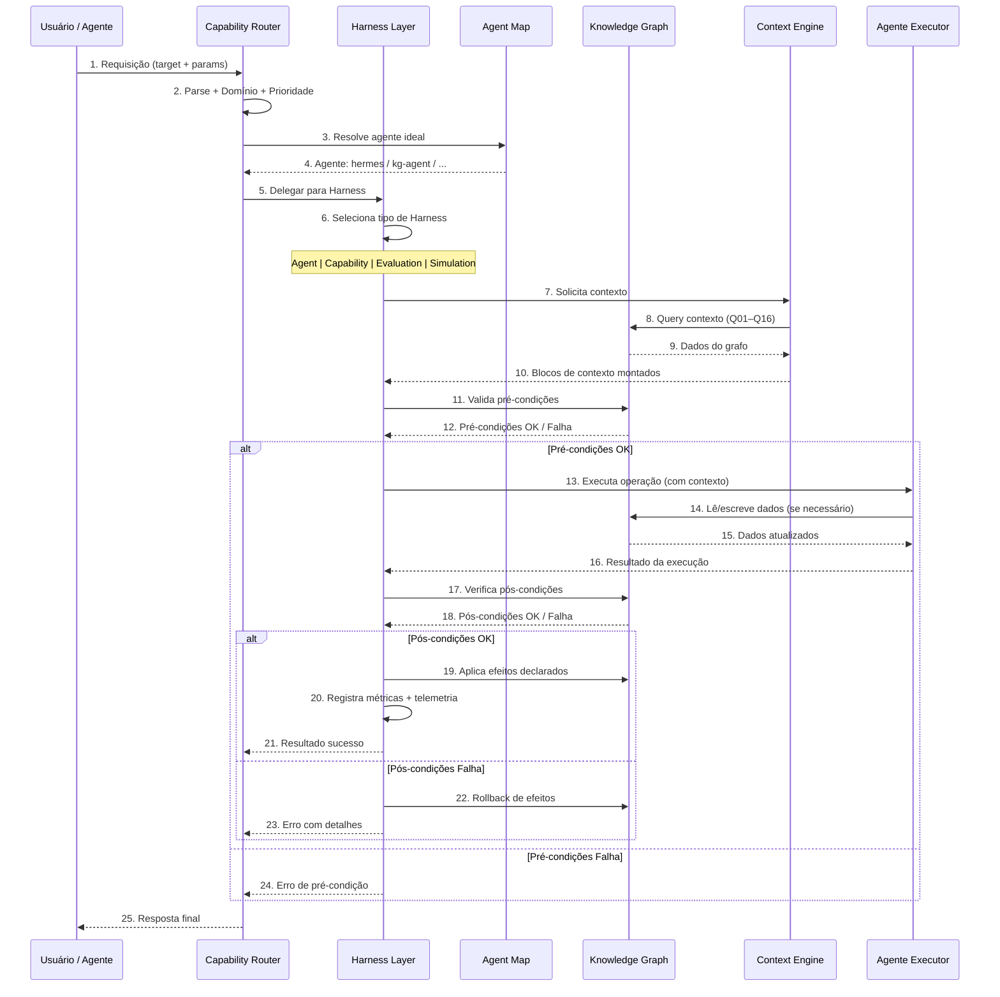

# APOS Harness — Camada de Execução e Gerenciamento de Agentes

**Documento:** HARNESS.md  
**Release:** R0 | **Sprint:** 0.7  
**Tarefa:** T0.7.1 — Especificação geral do Harness  
**Dependência:** CAPABILITY_MODEL.md (modelo de capabilities), CAPABILITY_ROUTING.md (roteamento), AGENT_MAP.md (agentes disponíveis), CONTEXT_MODEL.md (contexto), KNOWLEDGE_GRAPH.md (dados)  
**Criado em:** 2026-07-21  
**Versão:** v0.1-draft

---

## Índice

1. [Introdução](#1-introdução)
2. [Arquitetura Geral](#2-arquitetura-geral)
3. [Harness de Agente](#3-harness-de-agente)
4. [Harness de Capability](#4-harness-de-capability)
5. [Harness de Avaliação](#5-harness-de-avaliação)
6. [Harness de Simulação](#6-harness-de-simulação)
7. [Integrações](#7-integrações)
8. [Fluxo de Execução](#8-fluxo-de-execução)
9. [Configuração Global](#9-configuração-global)
10. [Referências](#10-referências)

---

## 1. Introdução

### 1.1 O Que É o Harness no APOS

O **Harness** é a **camada de execução** do APOS — o invólucro que envolve, gerencia, monitora e controla agentes, capabilities, avaliações e simulações. Ele é a infraestrutura operacional que garante que cada execução ocorra dentro de limites previsíveis, com rastreabilidade completa e tratamento consistente de erros.

Assim como um **harness de teste** envolve um sistema para instrumentá-lo e controlá-lo, o Harness do APOS envolve cada agente e cada capability para:

- **Isolar execuções** — cada chamada roda em seu próprio contexto controlado
- **Aplicar políticas** — timeouts, retries, limites de concorrência são impostos pelo harness, não pelo agente
- **Coletar telemetria** — toda execução gera métricas de duração, sucesso, erro
- **Garantir integridade** — pré-condições são validadas, pós-condições são verificadas
- **Facilitar testes** — o harness permite substituir dependências reais por simulações

### 1.2 Posição nas Camadas do APOS

O Harness ocupa uma posição intermediária crítica na arquitetura:

```
 ┌──────────────────────────────────────────────┐
 │            Agentes APOS (Camada 6)            │
 │  Hermes | KG Agent | Context | Trust Score   │
 └──────────────────────┬───────────────────────┘
                        │
 ┌──────────────────────▼───────────────────────┐
 │          HARNESS LAYER ★ ESTE DOCUMENTO       │
 │  Agent Harness | Capability Harness          │
 │  Evaluation Harness | Simulation Harness     │
 └──────────────────────┬───────────────────────┘
                        │
 ┌──────────────────────▼───────────────────────┐
 │         Context Engine (Camada 3.5)           │
 │  Montagem | Relevância | Poda | Injeção      │
 └──────────────────────┬───────────────────────┘
                        │
 ┌──────────────────────▼───────────────────────┐
 │         Knowledge Graph (Camada 3)            │
 │  Nós | Arestas | URNs | Queries Q01–Q16     │
 └──────────────────────────────────────────────┘
```

O Harness é a camada que **recebe requisições dos Agentes**, **solicita contexto do Context Engine**, **resolve capabilities via Capability Router**, **valida pré-condições contra o Knowledge Graph**, e **executa com garantias operacionais**.

### 1.3 Relação com os Demais Documentos do Sprint 0.7

| Documento | Propósito | Escopo |
|-----------|-----------|--------|
| **HARNESS.md** (este) | Especificação geral, arquitetura, integrações, fluxo e configuração | Visão sistêmica |
| AGENT_HARNESS.md | Ciclo de vida de agentes, health check, estado, warm-up, cool-down | Agente individual |
| CAPABILITY_HARNESS.md | Resolução, execução, erros, rollback, pré/pós-condições | Capability individual |
| EVALUATION_HARNESS.md | Testes de capabilities, métricas de qualidade, comparação A/B | Avaliação |
| SIMULATION_HARNESS.md | Carga simulada, estresse, cenários, geradores sintéticos | Simulação |

### 1.4 Princípios de Design

1. **Separation of Concerns** — Agentes focam em lógica de negócio; o Harness gerencia aspectos operacionais (timeout, retry, telemetria)
2. **Policy-Driven** — Todo comportamento operacional é configurado por política, não codificado
3. **Observabilidade por Default** — Toda execução gera métricas e eventos sem ação explícita do agente
4. **Fail Fast, Fail Safe** — Erros são detectados cedo; estado inconsistente é evitado com rollback
5. **Substituível** — Dependências reais (KG, Context Engine) podem ser mockadas para teste

---

## 2. Arquitetura Geral

### 2.1 Diagrama de Componentes



### 2.2 Responsabilidades de Cada Harness

| Harness | Responsabilidade Primária | Responsabilidades Secundárias |
|---------|--------------------------|-------------------------------|
| **Agent Harness** | Gerenciar ciclo de vida do agente | Health check, warm-up, cool-down, persistência de estado, cache de contexto |
| **Capability Harness** | Executar capability com garantias | Validação de pré-condições, timeouts, retries, rollback, logging de efeitos |
| **Evaluation Harness** | Testar capabilities e agentes | Métricas de qualidade, testes A/B, regressão, geração de relatórios |
| **Simulation Harness** | Simular carga e cenários | Geração de dados sintéticos, estresse, cenários hipotéticos, replay |

### 2.3 Padrão de Invocação

Todos os harnesses compartilham o mesmo padrão de invocação:

```
1. RECEBER → requisição com payload e metadados
2. VALIDAR → schema, pré-condições, permissões
3. PREPARAR → contexto, recursos, dependências
4. EXECUTAR → operação alvo com monitoramento
5. VERIFICAR → pós-condições, saída esperada
6. REGISTRAR → métricas, eventos, telemetria
7. RETORNAR → resultado ou erro estruturado
```

---

## 3. Harness de Agente

> **Nota:** Detalhes completos em [AGENT_HARNESS.md](AGENT_HARNESS.md).

O **Agent Harness** gerencia o ciclo de vida de cada agente APOS. Ele é responsável por iniciar, manter, health-checkar e finalizar agentes de forma controlada.

### 3.1 Ciclo de Vida do Agente (Gerenciado pelo Harness)



### 3.2 Estados do Agente

| Estado | Descrição | Ações do Harness |
|--------|-----------|------------------|
| **REGISTERED** | Agente conhecido do sistema, mas não ativo | Carregar metadados do Agent Map |
| **WARMING_UP** | Agente sendo preparado para uso | Alocar recursos, carregar contexto inicial, executar bootstrap |
| **IDLE** | Agente pronto, aguardando requisições | Manter heartbeat, cache de contexto aquecido |
| **BUSY** | Agente executando uma requisição | Monitorar timeout, coletar métricas de CPU/memória/tempo |
| **COOLDOWN** | Agente ocioso, recursos sendo liberados | Reduzir cache, liberar conexões não utilizadas |
| **FAILED** | Agente em estado de erro | Registrar causa, notificar orquestrador, executar política de recuperação |
| **STOPPED** | Agente desligado | Liberar todos os recursos, persistir estado pendente |

### 3.3 Health Check

O Agent Harness executa health checks periódicos em cada agente:

```python
@dataclass
class HealthCheckResult:
    agent_id: str                        # URN do agente verificado
    status: HealthStatus                 # healthy | degraded | unhealthy
    last_heartbeat: str                  # ISO 8601 do último sinal
    response_time_ms: float              # Tempo de resposta do health check
    memory_usage_mb: float               # Uso de memória estimado
    active_requests: int                 # Requisições em andamento
    consecutive_failures: int            # Falhas consecutivas
    details: dict                        # Detalhes específicos do agente

class HealthStatus(Enum):
    HEALTHY    = "healthy"    # Operando normalmente
    DEGRADED   = "degraded"   # Funcionando com recursos limitados
    UNHEALTHY  = "unhealthy"  # Fora de serviço
```

**Estratégia de Health Check:**
- Agentes **core** (Hermes, KG Agent): health check a cada 15s, threshold de 3 falhas
- Agentes **support** (Governance): health check a cada 30s, threshold de 5 falhas
- Agentes **governance** (Trust Score): health check a cada 60s, threshold de 3 falhas

### 3.4 Warm-Up e Cool-Down

**Warm-Up** (transição REGISTERED → IDLE):

```python
@dataclass
class WarmUpConfig:
    enabled: bool = True                 # Ativar warm-up automático
    preload_context: bool = True         # Carregar contexto do KG antecipadamente
    cache_warm_nodes: list[str]          # URNs de nós para pré-carregar
    max_warmup_seconds: int = 30         # Tempo máximo de warm-up
    verify_after_warmup: bool = True     # Executar health check pós warm-up
```

**Cool-Down** (transição IDLE → COOLDOWN → STOPPED):

O cool-down ocorre após `max_idle_seconds` sem requisições. Ele reduz gradualmente o consumo de recursos, mantendo o agente capaz de retornar a IDLE rapidamente se uma nova requisição chegar.

---

## 4. Harness de Capability

> **Nota:** Detalhes completos em [CAPABILITY_HARNESS.md](CAPABILITY_HARNESS.md).

O **Capability Harness** envolve a execução de cada capability, garantindo que pré-condições sejam validadas, timepoints sejam respeitados, erros sejam tratados e efeitos sejam registrados.

### 4.1 Ciclo de Execução de uma Capability



### 4.2 Contrato de Pré-Condições e Pós-Condições

Pré-condições e pós-condições são avaliadas pelo harness, não pela capability.

**Pré-Condições (antes da execução):**

| Tipo | Descrição | Exemplo | Onde Verificar |
|------|-----------|---------|----------------|
| `node_exists` | Nó alvo existe no KG | task:oauth-123 existe | Knowledge Graph |
| `edge_exists` | Aresta existe entre nós | task → feature | Knowledge Graph |
| `agent_authorized` | Agente tem permissão | Hermes pode executar | Agent Map |
| `kg_not_empty` | Grafo não está vazio | Pelo menos 1 nó | Knowledge Graph |
| `input_valid` | Parâmetros válidos | depth entre 1-5 | Schema JSON |
| `capability_ready` | Capability está ativa | status == "ready" | Capability Registry |

**Pós-Condições (após a execução):**

| Tipo | Descrição | Verificação |
|------|-----------|-------------|
| `output_valid` | Schema de saída respeita o contrato | Validação JSON Schema |
| `effects_applied` | Efeitos declarados foram aplicados | Consulta ao KG |
| `kg_integrity` | Grafo permanece íntegro | Regras KG-001 a KG-012 |
| `no_side_effects` | Nenhum dado não declarado foi alterado | Diff do grafo |

### 4.3 Tratamento de Erros e Retry

```python
@dataclass
class RetryPolicy:
    max_retries: int = 3                 # Máximo de tentativas
    base_delay_seconds: float = 1.0      # Delay base (exponential backoff)
    max_delay_seconds: float = 30.0      # Delay máximo
    retryable_errors: list[str]          # Erros que podem ser retentados
    jitter: bool = True                  # Adicionar variação aleatória

    # Erros SEMPRE retentáveis
    DEFAULT_RETRYABLE = [
        "timeout",           # Timeout de execução
        "rate_limited",      # Rate limit atingido
        "service_unavailable", # Serviço temporariamente indisponível
        "kg_contention",     # Concorrência no KG
        "context_stale",     # Contexto expirado (pode ser remontado)
    ]

    # Erros NUNCA retentáveis
    NON_RETRYABLE = [
        "invalid_input",     # Schema de entrada inválido
        "unauthorized",      # Agente não autorizado
        "precondition_fail", # Pré-condição não satisfeita
        "capability_not_found", # Capability não existe
        "circular_dependency", # Dependência circular detectada
    ]
```

### 4.4 Rollback de Efeitos

Se uma capability falha após já ter aplicado alguns efeitos no Knowledge Graph, o Harness executa o rollback:

| Efeito Aplicado | Ação de Rollback |
|-----------------|------------------|
| `node_created` | Remover nó criado |
| `node_updated` | Restaurar atributos anteriores |
| `edge_created` | Remover aresta criada |
| `edge_updated` | Restaurar peso/metadados anteriores |
| `event_logged` | Registrar evento de rollback (não remove o original) |

O rollback é **sempre executado**, mesmo que a falha ocorra durante o próprio rollback (rollback idempotente).

---

## 5. Harness de Avaliação

> **Nota:** Detalhes completos em [EVALUATION_HARNESS.md](EVALUATION_HARNESS.md).

O **Evaluation Harness** fornece infraestrutura para testar, avaliar e comparar capabilities e agentes de forma sistemática.

### 5.1 Tipos de Avaliação

| Tipo | Propósito | Executa |
|------|-----------|---------|
| **Unitário** | Testar uma capability isoladamente | Capability Harness (mock de dependências) |
| **Integração** | Testar chain de capabilities | Capability Harness (dependências reais) |
| **Regressão** | Garantir que mudanças não quebram comportamento existente | Conjunto completo de testes salvos |
| **A/B** | Comparar duas versões da mesma capability | Duas execuções paralelas com coleta de métricas |
| **Qualidade** | Medir confiabilidade, precisão e performance | Série de execuções com análise estatística |

### 5.2 Ciclo de Avaliação

```python
@dataclass
class EvaluationRun:
    id: str                              # UUID da avaliação
    type: EvaluationType                 # unit | integration | regression | ab | quality
    capability_id: str                   # Capability alvo
    test_cases: list[TestCase]           # Casos de teste
    metrics: list[str]                   # Métricas a coletar
    baseline_id: str | None              # ID da execução baseline (para A/B)
    config: EvaluationConfig             # Configuração específica

@dataclass
class TestCase:
    id: str                              # ID do caso
    name: str                            # Nome descritivo
    input: dict                          # Parâmetros de entrada
    expected_output: dict | None         # Saída esperada (se conhecida)
    expected_effects: list[Effect] | None # Efeitos esperados no KG
    tags: list[str]                      # Tags para categorização
```

### 5.3 Métricas de Avaliação

| Métrica | Descrição | Unidade | Coleta |
|---------|-----------|---------|--------|
| `accuracy` | Proporção de execuções com saída correta | % | Comparação com expected_output |
| `precision` | Proporção de acertos entre os positivos | % | Matriz de confusão |
| `recall` | Proporção de positivos identificados | % | Matriz de confusão |
| `latency_p50` | Mediana do tempo de execução | ms | Histograma |
| `latency_p95` | Percentil 95 do tempo de execução | ms | Histograma |
| `latency_p99` | Percentil 99 do tempo de execução | ms | Histograma |
| `error_rate` | Proporção de execuções com erro | % | Contagem |
| `timeout_rate` | Proporção de execuções com timeout | % | Contagem |
| `retry_rate` | Proporção que exigiu retry | % | Contagem |
| `kg_ops` | Operações no KG por execução | count | Log de queries |

---

## 6. Harness de Simulação

> **Nota:** Detalhes completos em [SIMULATION_HARNESS.md](SIMULATION_HARNESS.md).

O **Simulation Harness** permite simular cenários de carga, estresse e situações hipotéticas para validar o comportamento do sistema sob condições controladas.

### 6.1 Tipos de Simulação

| Tipo | Objetivo | Estratégia |
|------|----------|------------|
| **Carga** | Verificar comportamento sob volume esperado | Gerar N requisições simultâneas dentro dos limites normais |
| **Estresse** | Encontrar pontos de ruptura | Aumentar gradualmente a carga até falha |
| **Cenário** | Validar fluxos complexos | Executar sequências predefinidas de requisições |
| **Hipotético** | Explorar "e se" | Modificar dados do KG sinteticamente e observar impacto |
| **Replay** | Reproduzir situações reais | Reexecutar logs de requisições anteriores |

### 6.2 Geradores de Dados Sintéticos

O Simulation Harness inclui geradores que populam o Knowledge Graph com dados de teste:

```python
@dataclass
class SyntheticDataConfig:
    enabled: bool = False                # Habilitar geração sintética
    num_tasks: int = 100                 # Quantidade de tasks
    num_features: int = 10               # Quantidade de features
    num_releases: int = 3                # Quantidade de releases
    num_okrs: int = 5                    # Quantidade de OKRs
    num_metrics: int = 15                # Quantidade de métricas
    orphan_ratio: float = 0.1            # Proporção de nós órfãos (0.0 a 1.0)
    cycle_probability: float = 0.05      # Probabilidade de ciclo de bloqueio
    edge_density: float = 0.7            # Densidade de conexões (0.0 a 1.0)
    random_seed: int | None = None       # Semente para reprodutibilidade
```

### 6.3 Carga e Estresse

```python
@dataclass
class LoadProfile:
    type: Literal["constant", "ramp", "spike", "step"]
    target_rps: int                      # Requisições por segundo alvo
    duration_seconds: int                # Duração total da simulação
    concurrency: int                     # Nível de concorrência
    capability_ids: list[str]            # Capabilities a executar
    input_generator: str                 # Nome do gerador de inputs

    # Parâmetros específicos por tipo
    ramp_seconds: int | None = None      # Tempo para atingir target_rps (ramp)
    spike_interval: int | None = None    # Intervalo entre spikes (spike)
    spike_multiplier: float | None = None # Multiplicador do pico (spike)
```

| Perfil | Gráfico Conceitual | Uso |
|--------|-------------------|-----|
| **constant** | `──────` | Carga estável, simulando operação normal |
| **ramp** | `╱────` | Aumento gradual até o pico |
| **spike** | `╱╲╱╲` | Picos periódicos de carga |
| **step** | `⬆⬆⬆` | Incrementos discretos de carga |

---

## 7. Integrações

O Harness não opera isoladamente. Ele se conecta com quatro subsistemas fundamentais do APOS.

### 7.1 Integração com Knowledge Graph (KG)

| Operação do Harness | Uso do KG |
|---------------------|-----------|
| Validação de pré-condições | `node_exists`, `edge_exists`, `kg_not_empty` |
| Leitura de dados para execução | Queries Q01–Q16 via Capability |
| Verificação de pós-condições | Consulta de estado pós-execução |
| Rollback de efeitos | Restauração de estado anterior |
| Coleta de métricas | Q14 (coverage), Q15 (quality), Q16 (consistency) |
| Geração de dados sintéticos | Criação de nós e arestas de teste |

**Exemplo — Validação de pré-condição via KG:**

```python
class KGHarnessBridge:
    """Ponte entre Harness e Knowledge Graph."""
    
    async def check_node_exists(self, urn: str) -> bool:
        """Verifica se um nó existe no grafo."""
        result = await self.kg.query("EXISTS (n {urn: $urn})", {"urn": urn})
        return result["exists"]
    
    async def check_edge_exists(self, source: str, target: str, 
                                  edge_type: str) -> bool:
        """Verifica se uma aresta existe entre dois nós."""
        result = await self.kg.query(
            "MATCH (s {urn: $src})-[e:{edge_type}]->(t {urn: $tgt}) "
            "RETURN count(e) > 0 AS exists",
            {"src": source, "tgt": target, "edge_type": edge_type}
        )
        return result["exists"]
    
    async def get_node_state(self, urn: str) -> dict:
        """Obtém estado atual de um nó (para rollback)."""
        result = await self.kg.query(
            "MATCH (n {urn: $urn}) RETURN n.attributes AS attrs",
            {"urn": urn}
        )
        return result["attrs"]
```

### 7.2 Integração com Context Engine

| Operação do Harness | Uso do Context Engine |
|---------------------|----------------------|
| Montagem de contexto para execução | `context.assemble` capability |
| Preparação de warm-up | Pré-carregamento de contexto de agentes |
| Cache de contexto | Reutilização de contexto entre execuções similares |
| Poda por max_tokens | Otimização da janela de contexto |

**Contrato de integração:**

```python
@dataclass
class ContextRequest:
    agent_id: str                        # Agente destinatário do contexto
    anchor_urns: list[str]               # URNs âncora para montagem
    max_tokens: int                      # Limite de tokens
    depth: int = 2                       # Profundidade de navegação no KG
    priority: RequestPriority = "normal" # Prioridade da montagem

@dataclass
class ContextResponse:
    blocks: list[ContextBlock]           # Blocos de contexto montados
    total_tokens: int                    # Total de tokens gastos
    stats: ContextStats                  # Estatísticas da montagem
```

### 7.3 Integração com Capability Router

| Operação do Harness | Uso do Capability Router |
|---------------------|-------------------------|
| Resolução de capability para execução | `resolve_capability(request)` |
| Resolução de chain | `resolve_chain(request)` — múltiplas capabilities em sequência |
| Cache de roteamento | Evitar re-resolução de requisições frequentes |
| Fallback | Obter capability alternativa se a primária falhar |

**Exemplo de integração no Capability Harness:**

```python
class CapabilityHarness:
    async def execute(self, request: CapabilityRequest) -> ExecutionResult:
        # 1. Resolve a capability via Router
        resolution = await self.router.resolve_capability(request)
        
        if isinstance(resolution, NoCapabilityResult):
            return ExecutionResult(
                status="no_capability",
                reason=resolution.reason.value,
                suggestions=resolution.suggestions
            )
        
        # 2. Prepara execução com as configurações do harness
        capability = resolution.capability
        config = self.get_config(capability.id)
        
        # 3. Executa dentro do harness
        return await self._execute_with_harness(
            capability=capability,
            params=request.params,
            config=config,
            trace_id=request.metadata.trace_id
        )
```

### 7.4 Integração com Agent Map

| Operação do Harness | Uso do Agent Map |
|---------------------|------------------|
| Descoberta de agente para health check | Listar agentes registrados |
| Verificação de permissão | `agent_authorized` para capability |
| Roteamento de requisição para agente | Determinar agente executor |
| Fallback de agente | Obter agente alternativo |

**Contrato de integração:**

```python
@dataclass
class AgentInfo:
    id: str                              # URN do agente
    name: str                            # Nome legível
    domain: str                          # Domínio funcional
    status: AgentStatus                  # Estado atual (do Agent Harness)
    capabilities: list[str]              # Capabilities que implementa
    health: HealthCheckResult | None     # Último health check
    metadata: dict                       # Metadados adicionais
```

### 7.5 Diagrama de Integrações



---

## 8. Fluxo de Execução

Esta seção descreve a sequência completa desde a recepção de uma requisição até o retorno do resultado, passando por roteamento, acionamento do harness, execução e retorno.

### 8.1 Sequência Completa



### 8.2 Etapas Detalhadas

| Etapa | Componente | Ação | Saída |
|-------|-----------|------|-------|
| **1–4** | Capability Router | Parse da requisição → resolve agente via Agent Map | Rota definida: agente + capability |
| **5** | Router → Harness | Delega execução ao Harness | Request encapsulada com metadados de rota |
| **6** | Harness | Seleciona o tipo de harness com base na operação | AgentHarness, CapabilityHarness, etc. |
| **7–10** | Harness → Context Engine | Monta contexto para o agente executor | Blocos de contexto prontos |
| **11–12** | Harness → KG | Valida pré-condições contra o estado atual do grafo | Booleano: pode ou não executar |
| **13–16** | Harness → Agente | Executa a operação com contexto + parâmetros | Resultado bruto |
| **17–18** | Harness → KG | Verifica se os efeitos esperados ocorreram | Booleano: efeitos OK |
| **19–20** | Harness → KG | Aplica oficialmente os efeitos; registra métricas | Grafo atualizado, métricas persistidas |
| **21–25** | Harness → Router → Usuário | Retorna resultado ou erro estruturado | Resposta final |

### 8.3 Exemplo de Fluxo Completo

**Requisição:** `"Calcular trust score da task oauth-123"`

```
1. Capability Router recebe requisição
   → Domínio: governance
   → Alvo: urn:apos:task:oauth-123
   → Operação: trust-score.calculate

2. Router resolve agente:
   → Matriz governance → Trust Score Agent (primário)
   → Fallback: Governance Agent

3. Router delega para Capability Harness:
   → Capability: urn:apos:cap:governance:trust-score.calculate
   → Agente: urn:apos:agent:trust-score

4. Capability Harness inicia execução:
   a. Solicita contexto ao Context Engine:
      → Âncora: urn:apos:task:oauth-123
      → Blocos: metadados da task, features relacionadas, histórico
   b. Valida pré-condições no KG:
      → node_exists(oauth-123)? ✓
      → agent_authorized(trust-score, trust-score.calculate)? ✓
   c. Executa capability:
      → Lê Q14 (coverage): 0.92
      → Lê Q15 (quality): 0.85
      → Lê Q16 (consistency): 0.83
      → Calcula: 0.4×0.92 + 0.35×0.85 + 0.25×0.83 = 0.87
   d. Verifica pós-condições:
      → output_valid? ✓ (schema trust_score)
   e. Aplica efeitos:
      → event_logged: execução registrada na memória episódica
   f. Registra métricas:
      → latency: 340ms, kg_ops: 4

5. Retorna ao usuário:
   {
     "status": "success",
     "result": { "trust_score": 0.87, "factors": {...} },
     "metrics": { "latency_ms": 340, "kg_ops": 4 }
   }
```

---

## 9. Configuração Global

O Harness expõe parâmetros de configuração global que se aplicam a todos os tipos de harness (com possibilidade de override por tipo/harness específico).

### 9.1 Estrutura de Configuração

```python
@dataclass
class HarnessGlobalConfig:
    """Configuração global do Harness APOS."""

    # ── Timeouts ──────────────────────────────────────
    default_timeout_seconds: int = 30          # Timeout padrão para execução
    max_timeout_seconds: int = 300             # Timeout máximo permitido
    context_timeout_seconds: int = 10          # Timeout para montagem de contexto
    kg_query_timeout_seconds: int = 5          # Timeout para queries no KG
    health_check_timeout_seconds: int = 3      # Timeout para health check

    # ── Retries ───────────────────────────────────────
    max_retries: int = 3                       # Tentativas padrão
    retry_base_delay_seconds: float = 1.0      # Delay base (exponential backoff)
    retry_max_delay_seconds: float = 30.0      # Delay máximo entre retries
    retry_jitter: bool = True                  # Jitter para evitar thundering herd

    # ── Concorrência ──────────────────────────────────
    max_concurrent_executions: int = 10        # Execuções simultâneas por harness
    max_concurrent_per_agent: int = 5          # Execuções simultâneas por agente
    max_queued_requests: int = 100             # Máximo de requisições na fila
    request_queue_timeout_seconds: int = 10    # Tempo máximo na fila

    # ── Logging e Telemetria ──────────────────────────
    log_level: str = "INFO"                    # Nível de log (DEBUG, INFO, WARN, ERROR)
    metrics_enabled: bool = True               # Habilitar coleta de métricas
    trace_enabled: bool = True                 # Habilitar tracing distribuído
    event_logging: bool = True                 # Habilitar registro de eventos no KG
    metrics_export_interval_seconds: int = 60  # Intervalo de exportação de métricas

    # ── Cache ─────────────────────────────────────────
    context_cache_ttl_seconds: int = 300       # TTL do cache de contexto (5 min)
    routing_cache_ttl_seconds: int = 300       # TTL do cache de roteamento (5 min)
    max_context_cache_entries: int = 1000      # Máximo de entradas no cache de contexto

    # ── Health Check ──────────────────────────────────
    health_check_interval_seconds: int = 30    # Intervalo padrão de health check
    health_check_consecutive_failures: int = 3 # Falhas consecutivas para marcar unhealthy
    auto_recover: bool = True                  # Tentar recuperação automática

    # ── Resource Limits ───────────────────────────────
    max_memory_mb_per_agent: int = 512         # Limite de memória por agente (MB)
    max_kg_ops_per_execution: int = 100        # Máximo de operações no KG por execução
    max_payload_size_bytes: int = 1_048_576    # Tamanho máximo do payload (1 MB)
```

### 9.2 Configuração por Tipo de Harness

Cada tipo de harness pode sobrescrever parâmetros específicos da configuração global:

| Parâmetro | Global | Agent Harness | Capability Harness | Evaluation Harness | Simulation Harness |
|-----------|:------:|:-------------:|:------------------:|:------------------:|:------------------:|
| `default_timeout_seconds` | 30 | 60 | 30 | 120 | 300 |
| `max_retries` | 3 | 0 (não retenta) | 3 | 0 (não retenta) | 0 (não retenta) |
| `max_concurrent_executions` | 10 | 5 | 10 | 3 | 20 |
| `metrics_enabled` | true | true | true | true (detalhado) | true (detalhado) |
| `event_logging` | true | true | true | true | false (simulação) |
| `kg_query_timeout_seconds` | 5 | 5 | 5 | 10 | 3 |

### 9.3 Tabela Resumo de Configurações

| Categoria | Parâmetro | Default | Descrição |
|-----------|-----------|:-------:|-----------|
| **Timeout** | `default_timeout_seconds` | 30s | Timeout padrão de execução |
| **Timeout** | `max_timeout_seconds` | 300s | Timeout máximo absoluto |
| **Timeout** | `context_timeout_seconds` | 10s | Timeout para montagem de contexto |
| **Timeout** | `kg_query_timeout_seconds` | 5s | Timeout para queries no KG |
| **Retry** | `max_retries` | 3 | Máximo de tentativas |
| **Retry** | `retry_base_delay_seconds` | 1s | Delay inicial entre retries |
| **Retry** | `retry_max_delay_seconds` | 30s | Delay máximo entre retries |
| **Concorrência** | `max_concurrent_executions` | 10 | Execuções simultâneas |
| **Concorrência** | `max_concurrent_per_agent` | 5 | Execuções por agente |
| **Concorrência** | `max_queued_requests` | 100 | Máximo na fila de espera |
| **Cache** | `context_cache_ttl_seconds` | 300s (5 min) | TTL do cache de contexto |
| **Cache** | `routing_cache_ttl_seconds` | 300s (5 min) | TTL do cache de roteamento |
| **Health Check** | `health_check_interval_seconds` | 30s | Intervalo entre health checks |
| **Health Check** | `consecutive_failures` | 3 | Falhas para marcar unhealthy |
| **Recursos** | `max_memory_mb_per_agent` | 512 MB | Limite de memória por agente |
| **Recursos** | `max_kg_ops_per_execution` | 100 | Operações no KG por execução |
| **Recursos** | `max_payload_size_bytes` | 1 MB | Tamanho máximo do payload |
| **Telemetria** | `metrics_enabled` | true | Coleta de métricas ativada |
| **Telemetria** | `trace_enabled` | true | Tracing distribuído ativado |

### 9.4 Configuração via YAML (Exemplo)

```yaml
# config/harness.yaml
harness:
  global:
    default_timeout_seconds: 30
    max_retries: 3
    max_concurrent_executions: 10
    metrics_enabled: true
    trace_enabled: true
    health_check_interval_seconds: 30

  overrides:
    agent_harness:
      default_timeout_seconds: 60
      max_concurrent_executions: 5
      health_check_interval_seconds: 15  # Core agents: check more frequently

    capability_harness:
      max_retries: 3
      retry_base_delay_seconds: 1.0
      max_concurrent_executions: 10

    evaluation_harness:
      default_timeout_seconds: 120
      max_concurrent_executions: 3
      metrics_enabled: true          # Detailed metrics required

    simulation_harness:
      default_timeout_seconds: 300
      max_concurrent_executions: 20
      event_logging: false           # Simulations don't log to KG
```

---

## 10. Referências

### Documentos Internos do APOS (Sprint 0.7)

| Documento | Descrição |
|-----------|-----------|
| [AGENT_HARNESS.md](AGENT_HARNESS.md) | Detalhamento do harness de agente (ciclo de vida, health check) |
| [CAPABILITY_HARNESS.md](CAPABILITY_HARNESS.md) | Detalhamento do harness de capability (execução, erros, rollback) |
| [EVALUATION_HARNESS.md](EVALUATION_HARNESS.md) | Detalhamento do harness de avaliação (testes, métricas, comparação) |
| [SIMULATION_HARNESS.md](SIMULATION_HARNESS.md) | Detalhamento do harness de simulação (carga, estresse, cenários) |

### Dependências Ascendentes (Sprints Anteriores)

| Documento | Sprint | Conteúdo Relevante |
|-----------|:------:|--------------------|
| [ONTOLOGY_FOUNDATIONS.md](../ONTOLOGY_FOUNDATIONS.md) | R0 | Conceitos, relações e restrições da ontologia |
| [KNOWLEDGE_GRAPH.md](../sprint-0.4/KNOWLEDGE_GRAPH.md) | 0.4 | Estrutura de nós, arestas, URNs e regras de integridade |
| [QUERY_PATTERNS.md](../sprint-0.4/QUERY_PATTERNS.md) | 0.4 | Padrões de navegação Q01–Q16 |
| [CONTEXT_MODEL.md](../sprint-0.5/CONTEXT_MODEL.md) | 0.5 | Pipeline de montagem de contexto |
| [MEMORY_MODEL.md](../sprint-0.5/MEMORY_MODEL.md) | 0.5 | Sistema de memória episódica |
| [CONTEXT_BOUNDARIES.md](../sprint-0.5/CONTEXT_BOUNDARIES.md) | 0.5 | Fronteiras de contexto entre agentes |
| [CAPABILITY_MODEL.md](../sprint-0.6/CAPABILITY_MODEL.md) | 0.6 | Estrutura, ciclo de vida e registro de capabilities |
| [CAPABILITY_TAXONOMY.md](../sprint-0.6/CAPABILITY_TAXONOMY.md) | 0.6 | Hierarquia e categorias de capabilities |
| [AGENT_MAP.md](../sprint-0.6/AGENT_MAP.md) | 0.6 | Catálogo de agentes e matriz agente × capability |
| [CAPABILITY_ROUTING.md](../sprint-0.6/CAPABILITY_ROUTING.md) | 0.6 | Algoritmo de resolução de rota, cache, chain |

---

**Criado em:** 2026-07-21  
**Versão:** v0.1-draft  
**Próximo passo:** Detalhamento dos 4 harnesses especializados (AGENT_HARNESS.md, CAPABILITY_HARNESS.md, EVALUATION_HARNESS.md, SIMULATION_HARNESS.md)
