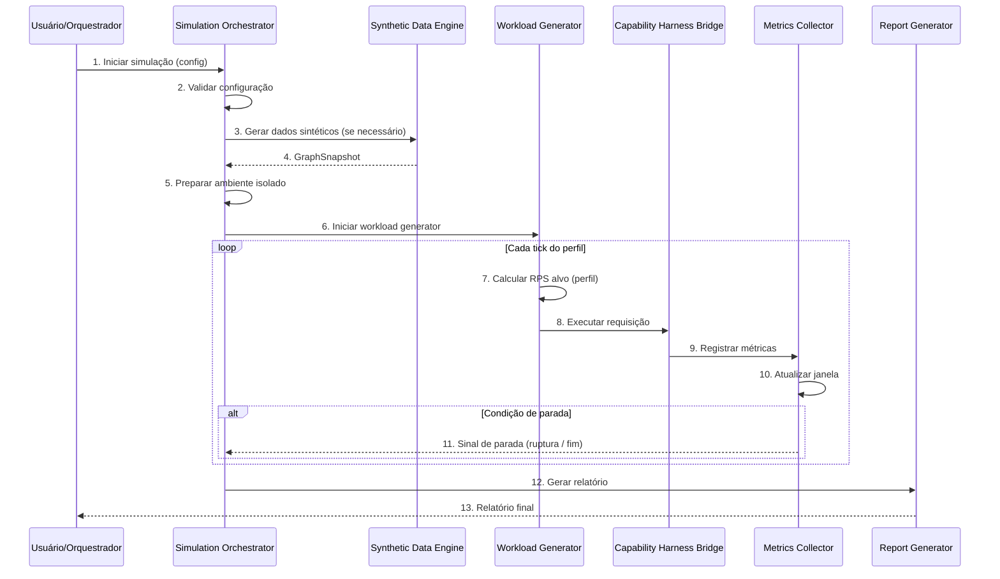

# APOS Simulation Harness — Carga, Estresse, Cenários e Replay

**Documento:** SIMULATION_HARNESS.md  
**Release:** R0 | **Sprint:** 0.7  
**Tarefa:** T0.7.5 — Especificação do Simulation Harness  
**Dependência:** HARNESS.md (estrutura geral), CAPABILITY_MODEL.md (modelo de capabilities), CAPABILITY_HARNESS.md (execução)  
**Criado em:** 2026-07-21  
**Versão:** v0.1-draft

---

## Índice

1. [Introdução](#1-introdução)
2. [Tipos de Simulação](#2-tipos-de-simulação)
3. [Geração de Dados Sintéticos](#3-geração-de-dados-sintéticos)
4. [Perfis de Carga](#4-perfis-de-carga)
5. [Medição e Métricas](#5-medição-e-métricas)
6. [Relatório de Simulação](#6-relatório-de-simulação)
7. [Arquitetura do Simulation Harness](#7-arquitetura-do-simulation-harness)
8. [Configuração](#8-configuração)
9. [Referências](#9-referências)

---

## 1. Introdução

### 1.1 O Que É o Simulation Harness

O **Simulation Harness** é o componente do APOS Harness responsável por **simular cenários de carga, estresse e situações hipotéticas** para validar o comportamento do sistema sob condições controladas. Ele permite:

- **Validar desempenho** — medir latência, throughput e utilização de recursos sob carga esperada
- **Encontrar pontos de ruptura** — determinar os limites operacionais do sistema
- **Reproduzir cenários reais** — reexecutar requisições previamente capturadas
- **Explorar hipóteses** — modificar parâmetros sinteticamente e observar impacto no comportamento

### 1.2 Posição na Arquitetura

O Simulation Harness é um dos quatro harnesses especializados da Harness Layer:

```
┌──────────────────────────────────────────────────┐
│                 HARNESS LAYER                     │
│  ┌──────────┐  ┌────────────┐  ┌──────────┐  ┌──│───────┐
│  │  Agent    │  │ Capability │  │Evaluation│  │Simulation│
│  │  Harness  │  │  Harness   │  │ Harness  │  │ Harness │
│  └──────────┘  └────────────┘  └──────────┘  └──────────┘
└──────────────────────────────────────────────────┘
                         │
              ┌──────────▼──────────┐
              │   Capability Router │
              └──────────┬──────────┘
                         │
              ┌──────────▼──────────┐
              │  Capability Harness │
              │   (execução real)   │
              └─────────────────────┘
```

O Simulation Harness **não executa capabilities diretamente** — ele orquestra a execução através do **Capability Harness**, usando o mesmo pipeline de validação, medição e telemetria, mas com dados sintéticos ou replay.

### 1.3 Princípios de Design

1. **Isolamento** — simulações nunca afetam dados reais; usam um grafo sintético ou snapshot isolado
2. **Reprodutibilidade** — toda simulação é determinística quando executada com a mesma semente aleatória
3. **Observabilidade** — todas as métricas são coletadas e exportadas automaticamente
4. **Composabilidade** — cenários podem ser compostos a partir de simulações menores
5. **Segurança** — simulações não persistem eventos no KG real (event_logging = false)

---

## 2. Tipos de Simulação

O Simulation Harness suporta **cinco tipos fundamentais** de simulação, cada um com objetivo, estratégia e configuração específicos.

### 2.1 Visão Geral

| Tipo | Objetivo | Estratégia | Quando Usar |
|------|----------|------------|-------------|
| **Carga** | Verificar comportamento sob volume esperado | Gerar N requisições simultâneas dentro dos limites normais | Antes de deploy, validação de SLA |
| **Estresse** | Encontrar pontos de ruptura | Aumentar gradualmente a carga até falha | Planejamento de capacidade, dimensionamento |
| **Cenário** | Validar fluxos complexos | Executar sequências predefinidas de requisições | Testes de integração, validação de workflows |
| **Hipotético** | Explorar "e se" | Modificar dados do KG sinteticamente e observar impacto | Análise de impacto, planejamento de mudanças |
| **Replay** | Reproduzir situações reais | Reexecutar logs de requisições anteriores | Debug de regressão, validação de correções |

### 2.2 Simulação de Carga

**Propósito:** Validar que o sistema mantém desempenho aceitável sob o volume de requisições esperado em operação normal.

```python
@dataclass
class LoadSimulationConfig:
    type: Literal["load"] = "load"
    target_rps: int                          # Requisições por segundo alvo
    duration_seconds: int                    # Duração da simulação
    profile: LoadProfile                     # Perfil de carga (constant, ramp, spike, step)
    capability_ids: list[str]                # Capabilities a exercitar
    input_generator: str                     # Gerador de inputs sintéticos
    warmup_seconds: int = 0                  # Aquecimento antes da coleta
    cooldown_seconds: int = 0                # Resfriamento após a coleta
    isolate_metrics_per_capability: bool = True  # Métricas separadas por capability
```

**Parâmetros recomendados para simulação de carga típica:**

| Ambiente | target_rps | Duração | Perfil | Concorrência |
|----------|:----------:|:-------:|:------:|:------------:|
| Desenvolvimento | 5 | 60s | constant | 3 |
| Staging | 50 | 300s | ramp | 10 |
| Produção (pré-deploy) | 200 | 600s | step | 20 |

**Exemplo de uso:**

```yaml
# simulation/load-basic.yaml
simulation:
  type: load
  target_rps: 50
  duration_seconds: 300
  profile:
    type: ramp
    ramp_seconds: 60
  capability_ids:
    - "urn:apos:cap:core:graph.traverse"
    - "urn:apos:cap:core:context.assemble"
  input_generator: "kg_random_traversal"
  warmup_seconds: 30
```

### 2.3 Simulação de Estresse

**Propósito:** Encontrar os limites operacionais do sistema aumentando a carga progressivamente até que ocorra degradação ou falha.

```python
@dataclass
class StressSimulationConfig:
    type: Literal["stress"] = "stress"
    min_rps: int                             # RPS inicial
    max_rps: int                             # RPS máximo (ou ilimitado)
    step_rps: int                            # Incremento a cada etapa
    step_duration_seconds: int               # Duração de cada etapa
    fail_conditions: StressFailConditions    # Condições que definem "ruptura"
    capability_ids: list[str]
    input_generator: str

@dataclass
class StressFailConditions:
    max_error_rate: float = 0.05             # 5% de erro = ruptura
    max_latency_p99_ms: float = 5000.0       # 5s P99 = ruptura
    max_resource_cpu_pct: float = 90.0       # 90% CPU = ruptura
    max_resource_memory_pct: float = 85.0    # 85% memória = ruptura
    consecutive_failures: int = 10           # 10 falhas consecutivas = ruptura
```

**Estratégia de execução:**

```
RPS
 ↑
 │           ████ ← max_rps (ruptura detectada)
 │         ██
 │       ██
 │     ██
 │   ██
 │ ██
 │██ ← min_rps
 └──────────────────────────→ Tempo
    ↑ step_duration cada etapa
```

**Exemplo de uso:**

```yaml
# simulation/stress-test.yaml
simulation:
  type: stress
  min_rps: 10
  max_rps: 500
  step_rps: 25
  step_duration_seconds: 30
  fail_conditions:
    max_error_rate: 0.05
    max_latency_p99_ms: 3000.0
    max_resource_cpu_pct: 85.0
  capability_ids:
    - "urn:apos:cap:core:graph.traverse"
  input_generator: "kg_random_traversal"
```

### 2.4 Simulação de Cenário

**Propósito:** Executar sequências predefinidas de requisições que representam fluxos reais de uso do sistema. Diferente dos tipos carga/estresse (focados em volume), o cenário valida a **correção funcional** sob condições realistas.

```python
@dataclass
class ScenarioSimulationConfig:
    type: Literal["scenario"] = "scenario"
    scenarios: list[Scenario]                # Lista de cenários a executar
    parallel: bool = False                   # Executar cenários em paralelo
    iterations: int = 1                      # Repetições de cada cenário

@dataclass
class Scenario:
    id: str                                  # Identificador do cenário
    name: str                                # Nome descritivo
    steps: list[ScenarioStep]                # Passos sequenciais
    setup: ScenarioSetup | None              # Preparação antes do cenário
    teardown: ScenarioTeardown | None        # Limpeza após o cenário
    expected_outcome: str                    # Resultado esperado

@dataclass
class ScenarioStep:
    step_id: str                             # ID do passo
    capability_id: str                       # Capability a executar
    input: dict                              # Parâmetros de entrada
    expected_output: dict | None             # Saída esperada (validação)
    delay_before_ms: int = 0                 # Atraso antes da execução
    depends_on: list[str] | None = None      # Passos anteriores necessários
    timeout_seconds: int = 30                # Timeout específico do passo
```

**Exemplo — Cenário "Análise Completa de Task":**

```yaml
# simulation/scenario-task-analysis.yaml
simulation:
  type: scenario
  iterations: 5
  scenarios:
    - id: "task-full-analysis"
      name: "Análise Completa de uma Task"
      steps:
        - step_id: "1-traverse"
          capability_id: "urn:apos:cap:core:graph.traverse"
          input:
            anchor_urn: "urn:apos:task:{synthetic_id}"
            depth: 2
          timeout_seconds: 10

        - step_id: "2-orphans"
          capability_id: "urn:apos:cap:support:orphans.detect"
          input:
            node_types: ["task", "feature"]
          depends_on: ["1-traverse"]
          timeout_seconds: 15

        - step_id: "3-trust-score"
          capability_id: "urn:apos:cap:governance:trust-score.calculate"
          input:
            target_urn: "urn:apos:task:{synthetic_id}"
            include_factors: true
          depends_on: ["1-traverse"]
          timeout_seconds: 10

        - step_id: "4-impact"
          capability_id: "urn:apos:cap:support:impact.analyze"
          input:
            target_urn: "urn:apos:task:{synthetic_id}"
            change_type: "status_change"
            new_value: "blocked"
            propagate: true
          depends_on: ["1-traverse"]
          timeout_seconds: 15

      expected_outcome: "Análise completa com traverse, orphans, trust score e impacto"
```

### 2.5 Simulação Hipotética

**Propósito:** Explorar cenários "e se" (what-if) manipulando sinteticamente o Knowledge Graph e observando como as capabilities se comportam sob essas condições alteradas.

```python
@dataclass
class HypotheticalSimulationConfig:
    type: Literal["hypothetical"] = "hypothetical"
    kg_modifications: list[KGModification]   # Modificações sintéticas no grafo
    capability_id: str                       # Capability a executar
    capability_input: dict                   # Input para a capability
    baseline_run: bool = True                # Executar baseline (sem modificações) primeiro
    collect_diff: bool = True                # Coletar diff entre baseline e hipotético

@dataclass
class KGModification:
    action: Literal["add_node", "remove_node", "add_edge", "remove_edge",
                    "update_attribute", "add_attribute"]
    target_urn: str                          # Nó alvo
    params: dict                             # Parâmetros da modificação
```

**Categorias de simulação hipotética:**

| Categoria | Descrição | Exemplo |
|-----------|-----------|---------|
| **Crescimento** | Grafo com mais nós e arestas | Adicionar 1000 tasks, 50 features |
| **Degradação** | Grafo com dados corrompidos ou incompletos | Remover arestas obrigatórias, criar órfãos |
| **Carga Atípica** | Distribuição de requisições anormal | 80% das requisições para 1 nó (hotspot) |
| **Latência de Rede** | Atrasos artificiais nas queries do KG | Adicionar 200ms de latência em cada query |
| **Falha Parcial** | Componentes indisponíveis | KG query timeout simulado para certos nós |

**Exemplo — "E se o grafo tiver 10x mais tasks?":**

```yaml
# simulation/hypothetical-growth.yaml
simulation:
  type: hypothetical
  baseline_run: true
  collect_diff: true
  kg_modifications:
    - action: "add_attribute"
      target_urn: "urn:apos:kg:root"
      params:
        key: "synthetic_growth_multiplier"
        value: 10
    - action: "add_node"
      target_urn: "urn:apos:task:synth-001"
      params:
        type: "task"
        attributes:
          name: "Synthetic Task 001"
          status: "in_progress"
    # O gerador sintético se encarrega de criar os 999 restantes
    - action: "add_attribute"
      target_urn: "urn:apos:task:synth-001"
      params:
        key: "synthetic_generator"
        value: "bulk_tasks"
        quantity: 1000
  capability_id: "urn:apos:cap:governance:coverage.report"
  capability_input:
    group_by: "node_type"
```

### 2.6 Simulação de Replay

**Propósito:** Reexecutar requisições reais previamente capturadas em produção ou staging para validar correções, reproduzir bugs, ou comparar comportamento entre versões.

```python
@dataclass
class ReplaySimulationConfig:
    type: Literal["replay"] = "replay"
    source: ReplaySource                     # Fonte dos registros de requisição
    filter: ReplayFilter | None              # Filtro para selecionar requisições
    speed_multiplier: float = 1.0            # Acelerar (>1) ou desacelerar (<1) o replay
    max_requests: int | None = None          # Limitar número de requisições
    fail_on_mismatch: bool = False           # Falhar se saída divergir da original
    compare_fields: list[str] | None = None  # Campos específicos para comparar

@dataclass
class ReplaySource:
    type: Literal["file", "database", "log"]
    path: str | None = None                  # Caminho do arquivo de log (file)
    connection: str | None = None            # String de conexão (database)
    query: str | None = None                 # Query para selecionar registros
    table: str | None = None                 # Tabela de logs

@dataclass
class ReplayFilter:
    capability_ids: list[str] | None = None  # Filtrar por capability
    status: list[str] | None = None          # Filtrar por status (success, error)
    time_range: tuple[str, str] | None = None # Intervalo ISO 8601
    min_duration_ms: float | None = None     # Duração mínima
    max_duration_ms: float | None = None     # Duração máxima
    agent_ids: list[str] | None = None       # Filtrar por agente executor
```

**Formato do registro de requisição (arquivo de replay):**

```json
{
    "requests": [
        {
            "id": "req-001",
            "timestamp": "2026-07-20T14:30:00Z",
            "capability_id": "urn:apos:cap:core:graph.traverse",
            "agent_id": "urn:apos:agent:orchestrator",
            "input": {
                "anchor_urn": "urn:apos:task:oauth-123",
                "depth": 2
            },
            "expected_output": {
                "nodes": [...],
                "stats": {"nodes_visited": 6, "edges_traversed": 8}
            },
            "actual_duration_ms": 340,
            "actual_status": "success",
            "tags": ["production", "staging-us-east-1"]
        }
    ]
}
```

**Exemplo de uso:**

```yaml
# simulation/replay-prod.yaml
simulation:
  type: replay
  source:
    type: file
    path: "logs/production-2026-07-20.ndjson"
  filter:
    capability_ids: ["urn:apos:cap:core:graph.traverse"]
    status: ["success"]
    time_range: ["2026-07-20T10:00:00Z", "2026-07-20T18:00:00Z"]
  speed_multiplier: 2.0
  max_requests: 5000
  fail_on_mismatch: false
  compare_fields: ["stats.nodes_visited", "stats.edges_traversed"]
```

---

## 3. Geração de Dados Sintéticos

### 3.1 Visão Geral

O Simulation Harness inclui um sistema de **geração de dados sintéticos** que popula instâncias do Knowledge Graph com dados realistas para teste. Os geradores produzem nós e arestas que respeitam as regras de integridade, tipos de aresta e padrões de conexão definidos na ontologia do APOS.

### 3.2 Arquitetura dos Geradores

```
┌──────────────────────────────────────┐
│         SyntheticDataEngine          │
│  ┌─────────┐ ┌──────────┐ ┌──────┐  │
│  │Generators│ │Pipelines│ │Seeds │  │
│  └────┬────┘ └──────────┘ └──────┘  │
│       │                              │
│  ┌────▼──────────────────────────┐   │
│  │     Knowledge Graph (test)    │   │
│  └───────────────────────────────┘   │
└──────────────────────────────────────┘
```

### 3.3 Configuração do Gerador Sintético

```python
@dataclass
class SyntheticDataConfig:
    enabled: bool = False                     # Habilitar geração sintética

    # ── Quantidades ────────────────────────────────────
    num_tasks: int = 100                      # Quantidade de tasks
    num_features: int = 10                    # Quantidade de features
    num_releases: int = 3                     # Quantidade de releases
    num_okrs: int = 5                         # Quantidade de OKRs
    num_metrics: int = 15                     # Quantidade de métricas
    num_sprints: int = 4                      # Quantidade de sprints
    num_personas: int = 2                     # Quantidade de personas

    # ── Parâmetros de Conexão ──────────────────────────
    edge_density: float = 0.7                 # Densidade de conexões (0.0 a 1.0)
    orphan_ratio: float = 0.1                 # Proporção de nós órfãos (0.0 a 1.0)
    cycle_probability: float = 0.05           # Probabilidade de ciclo de bloqueio
    connection_noise: float = 0.02            # Ruído: arestas inesperadas (0.0 a 1.0)

    # ── Distribuição de Atributos ──────────────────────
    status_distribution: dict | None = None   # Distribuição de status por tipo
    priority_distribution: dict | None = None # Distribuição de prioridades
    confidence_range: tuple[float, float] = (0.3, 0.99)  # Intervalo de confiança

    # ── Reprodutibilidade ──────────────────────────────
    random_seed: int | None = None            # Semente para reprodutibilidade
    deterministic_names: bool = True          # Nomes previsíveis (task-001, task-002, …)

    # ── Templates ──────────────────────────────────────
    name_templates: dict | None = None        # Templates de nomes por tipo de nó
    description_templates: dict | None = None # Templates de descrições
```

**Distribuição de status padrão:**

| Tipo de Nó | Status | Proporção |
|------------|--------|:---------:|
| Task | `todo` / `in_progress` / `done` / `blocked` / `cancelled` | 30% / 35% / 20% / 10% / 5% |
| Feature | `planned` / `in_progress` / `shipped` / `cancelled` | 25% / 40% / 30% / 5% |
| Release | `planned` / `active` / `shipped` / `rolled_back` | 10% / 30% / 55% / 5% |
| OKR | `draft` / `active` / `achieved` / `cancelled` | 10% / 60% / 25% / 5% |
| Metric | `improving` / `stable` / `declining` / `critical` | 30% / 40% / 20% / 10% |

### 3.4 Geradores Específicos

Cada tipo de nó tem um gerador dedicado que produz atributos realistas:

```python
class TaskGenerator:
    """Gera tasks sintéticas com nomes, descrições e metadados realistas."""

    TEMPLATES = {
        "name_prefixes": [
            "Implementar", "Refatorar", "Corrigir", "Otimizar",
            "Documentar", "Migrar", "Configurar", "Automatizar",
            "Integrar", "Atualizar"
        ],
        "name_suffixes": [
            "módulo de autenticação", "serviço de notificações",
            "API REST", "pipeline de CI/CD", "testes unitários",
            "schema do banco", "endpoint de métricas", "cache distribuído",
            "sistema de filas", "dashboard de monitoramento"
        ],
        "descriptions": [
            "Implementar {suffix} para atender aos requisitos de {feature}",
            "Refatorar {suffix} eliminando dívida técnica identificada em {sprint}",
            "Corrigir bug crítico em {suffix} reportado por {persona}"
        ]
    }

    def generate(self, task_id: int, config: SyntheticDataConfig) -> dict:
        """Gera uma task sintética."""
        prefix = random.choice(self.TEMPLATES["name_prefixes"])
        suffix = random.choice(self.TEMPLATES["name_suffixes"])
        return {
            "urn": f"urn:apos:task:synth-{task_id:04d}",
            "type": "task",
            "attributes": {
                "name": f"{prefix} {suffix}",
                "description": f"Task gerada sinteticamente para simulação.",
                "status": self._pick_status(config),
                "priority": self._pick_priority(config),
                "confidence": random.uniform(*config.confidence_range),
                "synthetic": True
            }
        }

    def _pick_status(self, config: SyntheticDataConfig) -> str:
        dist = config.status_distribution or DEFAULT_STATUS_DIST["task"]
        return random.choices(list(dist.keys()), weights=list(dist.values()))[0]

    def _pick_priority(self, config: SyntheticDataConfig) -> str:
        dist = config.priority_distribution or {"P0": 0.1, "P1": 0.3, "P2": 0.4, "P3": 0.2}
        return random.choices(list(dist.keys()), weights=list(dist.values()))[0]


class GraphGenerator:
    """Gera o grafo completo com conexões (arestas) entre nós sintéticos."""

    def __init__(self, config: SyntheticDataConfig):
        self.config = config
        self.nodes: dict[str, list[dict]] = {}
        self.edges: list[dict] = []

    def generate(self) -> GraphSnapshot:
        """Gera um snapshot completo do grafo sintético."""
        self._generate_nodes()
        self._generate_edges()
        self._generate_orphans()
        self._maybe_add_cycles()
        self._add_noise()
        return GraphSnapshot(
            nodes=sum(self.nodes.values(), []),
            edges=self.edges
        )

    def _generate_nodes(self):
        """Gera todos os nós usando os geradores específicos."""
        task_gen = TaskGenerator()
        feature_gen = FeatureGenerator()
        # ... outros geradores

        for i in range(self.config.num_tasks):
            self.nodes.setdefault("task", []).append(
                task_gen.generate(i, self.config))

    def _generate_edges(self):
        """Conecta nós conforme as regras de integridade e edge_density."""
        for task in self.nodes.get("task", []):
            if random.random() < self.config.edge_density:
                # Conecta a uma feature
                feature = random.choice(self.nodes.get("feature", []))
                self.edges.append({
                    "source": task["urn"],
                    "target": feature["urn"],
                    "type": "contribui_para",
                    "weight": random.uniform(0.1, 1.0)
                })

    def _generate_orphans(self):
        """Deixa uma proporção de nós sem as arestas obrigatórias."""
        for node_type, node_list in self.nodes.items():
            orphan_count = int(len(node_list) * self.config.orphan_ratio)
            orphans = random.sample(node_list, orphan_count)
            # Remove arestas desses nós (já geradas ou futuras)
            self._mark_as_orphan(orphans)

    def _maybe_add_cycles(self):
        """Adiciona ciclos de bloqueio com probabilidade configurada."""
        if random.random() < self.config.cycle_probability:
            tasks = self.nodes.get("task", [])
            if len(tasks) >= 3:
                cycle_tasks = random.sample(tasks, 3)
                for i in range(len(cycle_tasks)):
                    self.edges.append({
                        "source": cycle_tasks[i]["urn"],
                        "target": cycle_tasks[(i + 1) % len(cycle_tasks)]["urn"],
                        "type": "bloqueia",
                        "weight": 1.0
                    })

    def _add_noise(self):
        """Adiciona arestas inesperadas (ruído) para simular dados imperfeitos."""
        pairs = list(itertools.combinations(
            [n for nodes in self.nodes.values() for n in nodes], 2
        ))
        sample_size = int(len(pairs) * self.config.connection_noise)
        for source, target in random.sample(pairs, min(sample_size, len(pairs))):
            edge_type = random.choice(EDGE_TYPES)
            self.edges.append({
                "source": source["urn"],
                "target": target["urn"],
                "type": edge_type,
                "weight": random.uniform(0.1, 1.0),
                "synthetic_noise": True
            })
```

### 3.5 Snapshot do Grafo Sintético

O resultado da geração é um **GraphSnapshot** — uma fotografia completa e auto-contida do grafo de teste:

```python
@dataclass
class GraphSnapshot:
    """Snapshot completo do grafo sintético para simulação."""

    nodes: list[dict]                        # Todos os nós gerados
    edges: list[dict]                        # Todas as arestas geradas
    generated_at: str = field(               # Timestamp de geração
        default_factory=lambda: datetime.now(timezone.utc).isoformat()
    )
    config: SyntheticDataConfig | None = None  # Configuração usada
    stats: dict | None = None                # Estatísticas do snapshot

    def compute_stats(self) -> dict:
        """Calcula estatísticas descritivas do snapshot."""
        node_types = {}
        for node in self.nodes:
            nt = node.get("type", "unknown")
            node_types[nt] = node_types.get(nt, 0) + 1

        edge_types = {}
        for edge in self.edges:
            et = edge.get("type", "unknown")
            edge_types[et] = edge_types.get(et, 0) + 1

        return {
            "total_nodes": len(self.nodes),
            "total_edges": len(self.edges),
            "node_types": node_types,
            "edge_types": edge_types,
            "density": (2 * len(self.edges)) / (len(self.nodes) * (len(self.nodes) - 1))
                if len(self.nodes) > 1 else 0,
            "orphan_count": self._count_orphans(),
            "cycle_count": self._count_cycles(),
        }
```

### 3.6 Geradores de Input para Capacidades

Além de gerar o grafo, o Simulation Harness inclui **geradores de input** que produzem parâmetros de entrada realistas para cada tipo de capability:

| Gerador | Capability | Parâmetros Gerados |
|---------|------------|-------------------|
| `kg_random_traversal` | `graph.traverse` | anchor_urn aleatório + depth aleatório |
| `kg_random_trust` | `trust-score.calculate` | target_urn aleatório, include_factors true/false |
| `kg_random_orphan_check` | `orphans.detect` | node_types aleatório, min_confidence aleatório |
| `kg_random_query` | `query.execute` | query_id aleatório (Q01–Q16), params do grafo |
| `kg_random_context` | `context.assemble` | anchor_urn aleatório, max_tokens aleatório |

```python
class InputGeneratorRegistry:
    """Registro central de geradores de input para simulações."""

    _generators: dict[str, type[InputGenerator]] = {}

    @classmethod
    def register(cls, name: str, generator: type[InputGenerator]):
        cls._generators[name] = generator

    @classmethod
    def get(cls, name: str) -> InputGenerator:
        if name not in cls._generators:
            raise ValueError(f"Gerador '{name}' não registrado")
        return cls._generators[name]()

    @classmethod
    def generate_input(cls, name: str, snapshot: GraphSnapshot) -> dict:
        generator = cls.get(name)
        return generator.generate(snapshot)


# Exemplo de gerador registrado
@dataclass
class RandomTraversalGenerator(InputGenerator):
    """Gera inputs aleatórios para graph.traverse."""

    def generate(self, snapshot: GraphSnapshot) -> dict:
        anchor = random.choice(snapshot.nodes)
        return {
            "anchor_urn": anchor["urn"],
            "depth": random.randint(1, 5),
            "edge_filters": random.choices(
                EDGE_TYPES, k=random.randint(0, 3)
            ) if random.random() > 0.5 else None
        }
```

---

## 4. Perfis de Carga

### 4.1 Visão Geral dos Perfis

Os perfis de carga definem **como o volume de requisições varia ao longo do tempo** durante uma simulação. O Simulation Harness suporta quatro perfis fundamentais.

| Perfil | Gráfico Conceitual | Descrição | Uso Típico |
|--------|-------------------|-----------|------------|
| **constant** | `──────` | Volume estável durante toda a simulação | Baseline, validação de SLA |
| **ramp** | `╱────` | Aumento gradual até o pico, depois mantém | Aquecimento realista, encontrar limite suave |
| **spike** | `╱╲╱╲` | Picos periódicos de carga sobre uma linha base | Testar elasticidade, bursts de tráfego |
| **step** | `⬆⬆⬆` | Incrementos discretos de carga | Observar comportamento em cada patamar |

### 4.2 Perfil Constant

```python
@dataclass
class ConstantProfile:
    type: Literal["constant"] = "constant"
    target_rps: int                          # RPS constante
    duration_seconds: int                    # Duração total

    def rps_at(self, elapsed_seconds: float) -> int:
        """Retorna o RPS alvo no instante elapsed_seconds."""
        return self.target_rps
```

**Comportamento:**
- Carga plana do início ao fim
- Ideal para medir latência e throughput em regime permanente
- Deve ser precedido de warmup para estabilização

### 4.3 Perfil Ramp

```python
@dataclass
class RampProfile:
    type: Literal["ramp"] = "ramp"
    start_rps: int = 0                       # RPS inicial
    target_rps: int                          # RPS final (pico)
    ramp_seconds: int                        # Tempo para atingir o pico
    hold_seconds: int = 0                    # Tempo mantendo o pico após ramp

    def rps_at(self, elapsed_seconds: float) -> int:
        if elapsed_seconds <= self.ramp_seconds:
            progress = elapsed_seconds / self.ramp_seconds
            return int(self.start_rps + (self.target_rps - self.start_rps) * progress)
        else:
            return self.target_rps
```

**Comportamento:**
- Aumento linear do RPS inicial até o alvo
- Opcionalmente mantém o pico por `hold_seconds`
- Ideal para simular crescimento gradual de tráfego
- Permite observar em que ponto a latência começa a degradar

### 4.4 Perfil Spike

```python
@dataclass
class SpikeProfile:
    type: Literal["spike"] = "spike"
    base_rps: int                            # RPS da linha base
    peak_rps: int                            # RPS no pico do spike
    spike_duration_seconds: int              # Duração de cada spike
    interval_seconds: int                    # Intervalo entre spikes
    total_duration_seconds: int              # Duração total

    def rps_at(self, elapsed_seconds: float) -> int:
        cycle_position = elapsed_seconds % (self.spike_duration_seconds + self.interval_seconds)
        if cycle_position < self.spike_duration_seconds:
            # Durante o spike
            progress = cycle_position / self.spike_duration_seconds
            if progress < 0.5:
                # Subida do spike (primeira metade)
                return int(self.base_rps + (self.peak_rps - self.base_rps) * (progress * 2))
            else:
                # Descida do spike (segunda metade)
                return int(self.base_rps + (self.peak_rps - self.base_rps) * (2 - progress * 2))
        else:
            return self.base_rps
```

**Comportamento:**
- Linha base constante com picos periódicos em formato de dente de serra
- Cada spike: sobe até o pico e retorna à base
- Ideal para testar elasticidade, escalabilidade automática e recuperação pós-pico

### 4.5 Perfil Step

```python
@dataclass
class StepProfile:
    type: Literal["step"] = "step"
    start_rps: int                           # RPS inicial
    step_increment: int                      # Incremento por degrau
    step_duration_seconds: int               # Duração de cada degrau
    total_steps: int                         # Número de degraus

    @property
    def total_duration_seconds(self) -> int:
        return self.step_duration_seconds * self.total_steps

    def rps_at(self, elapsed_seconds: float) -> int:
        step = min(int(elapsed_seconds / self.step_duration_seconds), self.total_steps - 1)
        return self.start_rps + step * self.step_increment
```

**Comportamento:**
- Incrementos discretos em intervalos regulares
- Cada degrau mantém carga constante por `step_duration_seconds`
- Ideal para teste de estresse estruturado: observar métricas em cada patamar
- Facilita a identificação do ponto exato de degradação

### 4.6 Comparação entre Perfis

| Característica | constant | ramp | spike | step |
|:---------------|:--------:|:----:|:-----:|:----:|
| Carga máxima previsível | ✅ Sim | ✅ Sim (final) | ❌ Não (cíclico) | ✅ Sim (último degrau) |
| Aquecimento gradual | ❌ | ✅ | ❌ | Parcial |
| Teste de recuperação | ❌ | ❌ | ✅ | ❌ |
| Identificação de limite | ❌ | Parcial | ❌ | ✅ |
| Realismo de tráfego | Baixo | Médio | Alto (bursts) | Baixo |
| Complexidade de análise | Baixa | Média | Alta | Média |

### 4.7 Perfil Composto

Simulações avançadas podem usar um **perfil composto** que encadeia múltiplos perfis em sequência:

```python
@dataclass
class CompositeProfile:
    type: Literal["composite"] = "composite"
    stages: list[ProfileStage]               # Estágios encadeados

@dataclass
class ProfileStage:
    profile: ConstantProfile | RampProfile | SpikeProfile | StepProfile
    label: str                               # Rótulo do estágio (ex: "warmup", "stress", "cooldown")
    collect_metrics: bool = True             # Coletar métricas neste estágio
```

**Exemplo:**

```yaml
profile:
  type: composite
  stages:
    - label: "warmup"
      profile:
        type: ramp
        start_rps: 5
        target_rps: 50
        ramp_seconds: 60
      collect_metrics: false

    - label: "steady-state"
      profile:
        type: constant
        target_rps: 50
        duration_seconds: 120
      collect_metrics: true

    - label: "stress-steps"
      profile:
        type: step
        start_rps: 50
        step_increment: 25
        step_duration_seconds: 30
        total_steps: 10
      collect_metrics: true

    - label: "cooldown"
      profile:
        type: ramp
        start_rps: 300
        target_rps: 0
        ramp_seconds: 30
      collect_metrics: false
```

---

## 5. Medição e Métricas

### 5.1 Dimensões de Medição

O Simulation Harness coleta métricas em **quatro dimensões** durante toda a simulação:

| Dimensão | O Que Mede | Unidade | Frequência |
|----------|------------|:-------:|:----------:|
| **Latência** | Tempo de resposta das capabilities | milissegundos (ms) | Por requisição |
| **Throughput** | Volume de requisições processadas | req/s (RPS) | A cada 1s (janela) |
| **Error Rate** | Proporção de requisições com erro | % | A cada 1s (janela) |
| **Recursos** | Consumo de CPU, memória, KG ops | % / MB / count | A cada 5s |

### 5.2 Coleta de Métricas

```python
@dataclass
class SimulationMetricsCollector:
    """Coletor de métricas durante uma simulação."""

    # ── Latência ──────────────────────────────────────
    latencies_ms: list[float] = field(default_factory=list)
    latency_p50: float = 0.0
    latency_p95: float = 0.0
    latency_p99: float = 0.0
    latency_max: float = 0.0
    latency_min: float = 0.0
    latency_mean: float = 0.0
    latency_stddev: float = 0.0

    # ── Throughput ────────────────────────────────────
    rps_history: list[float] = field(default_factory=list)  # RPS a cada segundo
    rps_mean: float = 0.0
    rps_peak: float = 0.0
    total_requests: int = 0
    total_requests_success: int = 0
    total_requests_failed: int = 0

    # ── Error Rate ────────────────────────────────────
    error_rate_history: list[float] = field(default_factory=list)  # % a cada segundo
    error_rate_mean: float = 0.0
    error_rate_peak: float = 0.0
    errors_by_type: dict[str, int] = field(default_factory=dict)

    # ── Recursos ──────────────────────────────────────
    cpu_usage_history: list[float] = field(default_factory=list)  # % a cada 5s
    memory_usage_history: list[float] = field(default_factory=list)  # MB a cada 5s
    cpu_usage_peak: float = 0.0
    memory_usage_peak: float = 0.0
    kg_ops_total: int = 0
    kg_ops_per_request: float = 0.0

    # ── Por Capability ────────────────────────────────
    per_capability: dict[str, "SimulationMetricsCollector"] = field(default_factory=dict)

    def record_request(self, capability_id: str, latency_ms: float,
                       success: bool, error_type: str | None = None,
                       kg_ops: int = 0):
        """Registra métricas de uma requisição individual."""
        self.latencies_ms.append(latency_ms)
        self.total_requests += 1
        self.kg_ops_total += kg_ops

        if success:
            self.total_requests_success += 1
        else:
            self.total_requests_failed += 1
            if error_type:
                self.errors_by_type[error_type] = \
                    self.errors_by_type.get(error_type, 0) + 1

        # Registrar também no contador por capability
        if capability_id not in self.per_capability:
            self.per_capability[capability_id] = SimulationMetricsCollector()
        self.per_capability[capability_id].record_request(
            capability_id, latency_ms, success, error_type, kg_ops
        )

    def snapshot_second(self, rps: float, error_rate: float):
        """Registra snapshot de um segundo de simulação."""
        self.rps_history.append(rps)
        self.error_rate_history.append(error_rate)

    def snapshot_resources(self, cpu_pct: float, memory_mb: float):
        """Registra snapshot de recursos."""
        self.cpu_usage_history.append(cpu_pct)
        self.memory_usage_history.append(memory_mb)

    def compute(self) -> "SimulationMetricsCollector":
        """Calcula estatísticas finais a partir dos dados brutos."""
        if not self.latencies_ms:
            return self

        sorted_lat = sorted(self.latencies_ms)
        n = len(sorted_lat)

        self.latency_min = sorted_lat[0]
        self.latency_max = sorted_lat[-1]
        self.latency_mean = sum(sorted_lat) / n
        self.latency_p50 = sorted_lat[int(n * 0.50)]
        self.latency_p95 = sorted_lat[int(n * 0.95)]
        self.latency_p99 = sorted_lat[int(n * 0.99)]
        self.latency_stddev = statistics.stdev(sorted_lat) if n > 1 else 0.0

        self.rps_mean = statistics.mean(self.rps_history) if self.rps_history else 0.0
        self.rps_peak = max(self.rps_history) if self.rps_history else 0.0

        self.error_rate_mean = statistics.mean(self.error_rate_history) \
            if self.error_rate_history else 0.0
        self.error_rate_peak = max(self.error_rate_history) \
            if self.error_rate_history else 0.0

        self.cpu_usage_peak = max(self.cpu_usage_history) \
            if self.cpu_usage_history else 0.0
        self.memory_usage_peak = max(self.memory_usage_history) \
            if self.memory_usage_history else 0.0
        self.kg_ops_per_request = self.kg_ops_total / n if n > 0 else 0.0

        # Computar também por capability
        for cap_id in self.per_capability:
            self.per_capability[cap_id].compute()

        return self
```

### 5.3 Tabela de Métricas

| Métrica | Descrição | Unidade | Fonte | Agregação |
|---------|-----------|:-------:|:-----:|:---------:|
| `latency_p50` | Mediana da latência | ms | Histograma | Por simulação |
| `latency_p95` | Percentil 95 da latência | ms | Histograma | Por simulação |
| `latency_p99` | Percentil 99 da latência | ms | Histograma | Por simulação |
| `latency_max` | Latência máxima observada | ms | Histograma | Por simulação |
| `latency_mean` | Latência média | ms | Média aritmética | Por simulação |
| `latency_stddev` | Desvio padrão da latência | ms | Desvio padrão | Por simulação |
| `rps_mean` | Throughput médio | req/s | Média da janela | Por simulação |
| `rps_peak` | Throughput máximo (pico) | req/s | Máx da janela | Por simulação |
| `total_requests` | Total de requisições | count | Contagem | Por simulação |
| `error_rate_mean` | Taxa de erro média | % | Média da janela | Por simulação |
| `error_rate_peak` | Taxa de erro máxima | % | Máx da janela | Por simulação |
| `errors_by_type` | Distribuição de erros por tipo | dict | Contagem | Por simulação |
| `cpu_usage_peak` | Pico de uso de CPU | % | Máx da amostra | Por simulação |
| `memory_usage_peak` | Pico de uso de memória | MB | Máx da amostra | Por simulação |
| `kg_ops_per_request` | Operações médias no KG por req | count | Média | Por simulação |

### 5.4 Métricas por Capability

Todas as métricas acima são coletadas **agregadas** (para toda a simulação) e **discriminadas por capability**. Isso permite identificar gargalos específicos:

```json
{
    "simulation": { "latency_p95": 1200, "error_rate_mean": 0.02 },
    "per_capability": {
        "urn:apos:cap:core:graph.traverse": {
            "latency_p95": 850,
            "error_rate_mean": 0.01
        },
        "urn:apos:cap:governance:trust-score.calculate": {
            "latency_p95": 4200,
            "error_rate_mean": 0.08
        }
    }
}
```

### 5.5 Métricas Durante a Simulação (Streaming)

Durante a execução, as métricas são emitidas em tempo real via um **stream de eventos** para monitoramento:

```python
@dataclass
class SimulationMetricEvent:
    timestamp: str                           # ISO 8601
    elapsed_seconds: float                   # Segundos desde o início
    current_rps: float                       # RPS atual
    target_rps: int                          # RPS alvo do perfil
    latency_p50_window: float                # P50 da janela atual (10s)
    latency_p95_window: float                # P95 da janela atual (10s)
    error_rate_window: float                 # Taxa de erro da janela atual
    cpu_usage_pct: float                     # CPU atual
    memory_usage_mb: float                   # Memória atual
    stage: str | None                        # Estágio atual (se perfil composto)
```

---

## 6. Relatório de Simulação

### 6.1 Estrutura do Relatório

Ao final de cada simulação, o Simulation Harness gera um **relatório estruturado** contendo todas as métricas, configurações e análises.

```python
@dataclass
class SimulationReport:
    """Relatório completo de uma simulação."""

    # ── Metadados ─────────────────────────────────────
    id: str                                  # UUID da simulação
    name: str                                # Nome descritivo
    timestamp: str                           # ISO 8601 de início
    duration_seconds: float                  # Duração real

    # ── Configuração ──────────────────────────────────
    config: LoadSimulationConfig | StressSimulationConfig | \
            ScenarioSimulationConfig | HypotheticalSimulationConfig | \
            ReplaySimulationConfig                      # Configuração usada

    synthetic_data: SyntheticDataConfig | None           # Configuração do grafo sintético
    snapshot_stats: dict | None                          # Estatísticas do snapshot

    # ── Métricas Agregadas ────────────────────────────
    metrics: SimulationMetricsCollector                  # Métricas consolidadas

    # ── Resultados por Tipo ───────────────────────────
    stress_result: StressResult | None                   # Apenas simulação de estresse
    scenario_results: list[ScenarioResult] | None         # Apenas simulação de cenário
    hypothetical_diff: dict | None                       # Apenas simulação hipotética
    replay_comparison: ReplayComparison | None            # Apenas simulação de replay

    # ── Anomalias ─────────────────────────────────────
    anomalies: list[SimulationAnomaly]                   # Eventos anômalos detectados

    # ── Resumo ────────────────────────────────────────
    summary: SimulationSummary                            # Resumo executivo

    def to_json(self) -> str:
        """Serializa o relatório para JSON."""
        return json.dumps(self, cls=SimulationEncoder, indent=2)

    def to_markdown(self) -> str:
        """Gera versão Markdown do relatório para leitura humana."""
        return MarkdownReportBuilder.build(self)
```

### 6.2 Formato do Relatório (Markdown)

```markdown
# Relatório de Simulação: {name}

**ID:** {id}  
**Tipo:** {simulation_type}  
**Início:** {timestamp}  
**Duração:** {duration_seconds}s  
**Snapshot Sintético:** {nodes} nós, {edges} arestas

---

## Resumo Executivo

| Indicador | Valor | Status |
|-----------|:-----:|:------:|
| Throughput Médio | {rps_mean} req/s | {🟢/🟡/🔴} |
| Latência P95 | {latency_p95} ms | {🟢/🟡/🔴} |
| Latência P99 | {latency_p99} ms | {🟢/🟡/🔴} |
| Taxa de Erro | {error_rate}% | {🟢/🟡/🔴} |
| Pico CPU | {cpu_peak}% | {🟢/🟡/🔴} |
| Pico Memória | {memory_peak} MB | {🟢/🟡/🔴} |

**Status: ✅ APROVADO** / ⚠️ **ATENÇÃO** / ❌ **REPROVADO**

---

## Métricas de Latência

| Métrica | Valor | Alvo | Veredito |
|---------|:-----:|:----:|:--------:|
| Média | {mean} ms | ≤ {target} ms | 🟢/🔴 |
| P50 | {p50} ms | ≤ {target} ms | 🟢/🔴 |
| P95 | {p95} ms | ≤ {target} ms | 🟢/🔴 |
| P99 | {p99} ms | ≤ {target} ms | 🟢/🔴 |
| Máxima | {max} ms | — | — |
| Desvio Padrão | {stddev} ms | — | — |

## Throughput ao Longo do Tempo

```
RPS
 300 |            ████
 250 |         ████  ████
 200 |       ██        ██
 150 |    ███            ███
 100 |  ██                  ██
  50 |██                      ████
   0 └──────────────────────────────→ Tempo (s)
      0    60   120   180   240   300
     ■ Alvo    ■ Real    ■ Limite de Erro
```

## Taxa de Erro ao Longo do Tempo

```
Erro %
  10 |                          ██
   8 |                       ██  ██
   6 |                    ████  ████
   4 |                 ██
   2 |  ████████████████
   0 └──────────────────────────────→ Tempo (s)
```

## Erros por Tipo

| Tipo de Erro | Ocorrências | % do Total |
|--------------|:-----------:|:----------:|
| timeout | {n} | {p}% |
| rate_limited | {n} | {p}% |
| precondition_fail | {n} | {p}% |
| invalid_input | {n} | {p}% |

## Métricas por Capability

| Capability | Requisições | P50 (ms) | P95 (ms) | P99 (ms) | Erro % |
|------------|:----------:|:--------:|:--------:|:--------:|:------:|
| graph.traverse | {n} | {ms} | {ms} | {ms} | {p}% |
| trust-score.calculate | {n} | {ms} | {ms} | {ms} | {p}% |

## Utilização de Recursos

| Recurso | Pico | Média |
|---------|:----:|:-----:|
| CPU | {peak}% | {mean}% |
| Memória | {peak} MB | {mean} MB |
| KG Ops/Req | — | {n} |

## Anomalias Detectadas

| Timestamp | Tipo | Descrição |
|-----------|------|-----------|
| {time} | Latency Spike | P95 ultrapassou 5000ms por 10s consecutivos |
| {time} | Error Burst | Taxa de erro > 10% por 5s |
| {time} | Resource Throttle | CPU > 90% por 30s |

## Configuração da Simulação

```yaml
{tipo}: {config_yaml}
```
```

### 6.3 Relatório JSON (para Consumo Programático)

```json
{
    "id": "sim-a1b2c3d4",
    "name": "Estresse progressivo - trust-score",
    "type": "stress",
    "timestamp": "2026-07-21T14:00:00Z",
    "duration_seconds": 315.0,

    "config": {
        "type": "stress",
        "min_rps": 10,
        "max_rps": 500,
        "step_rps": 25,
        "step_duration_seconds": 30,
        "fail_conditions": {
            "max_error_rate": 0.05,
            "max_latency_p99_ms": 3000.0,
            "max_resource_cpu_pct": 85.0
        }
    },

    "metrics": {
        "latency_p50": 420.0,
        "latency_p95": 2100.0,
        "latency_p99": 3800.0,
        "latency_max": 5200.0,
        "latency_mean": 680.0,
        "latency_stddev": 340.0,
        "rps_mean": 187.5,
        "rps_peak": 375.0,
        "total_requests": 45200,
        "total_requests_success": 44100,
        "total_requests_failed": 1100,
        "error_rate_mean": 2.43,
        "error_rate_peak": 8.1,
        "cpu_usage_peak": 88.0,
        "memory_usage_peak": 720.0,
        "kg_ops_per_request": 4.2,
        "per_capability": {
            "urn:apos:cap:governance:trust-score.calculate": {
                "latency_p95": 3400.0,
                "error_rate_mean": 4.1
            }
        }
    },

    "stress_result": {
        "rupture_detected": true,
        "rupture_at_rps": 375,
        "rupture_at_step": 15,
        "rupture_reason": "P99 latency exceeded 3000ms threshold",
        "rupture_timestamp": "2026-07-21T14:04:30Z",
        "sustainable_rps": 350,
        "safety_margin_pct": 6.7
    },

    "anomalies": [
        {
            "timestamp": "2026-07-21T14:03:15Z",
            "elapsed_seconds": 195.0,
            "type": "latency_spike",
            "severity": "warning",
            "message": "P95 latency jumped from 1200ms to 4500ms",
            "rps_at_event": 350,
            "duration_seconds": 12.0
        }
    ],

    "summary": {
        "verdict": "failed",
        "reason": "Ponto de ruptura detectado em 375 RPS. Sistema sustenta 350 RPS com margem de 6.7%.",
        "recommendations": [
            "Otimizar capability trust-score.calculate (P95 3400ms vs. alvo 2000ms)",
            "Aumentar memory limit do agente trust-score (pico 720MB > 512MB)",
            "Considerar rate limiting preventivo a partir de 300 RPS"
        ],
        "score": 72.3
    }
}
```

### 6.4 Resultados Específicos por Tipo de Simulação

#### Simulação de Estresse — StressResult

```python
@dataclass
class StressResult:
    rupture_detected: bool                   # Ruptura foi detectada?
    rupture_at_rps: int | None               # RPS no momento da ruptura
    rupture_at_step: int | None              # Degrau da ruptura
    rupture_reason: str | None               # Causa primária da ruptura
    rupture_metrics: dict | None             # Métricas no momento da ruptura
    sustainable_rps: int                     # RPS máximo sustentável abaixo da ruptura
    safety_margin_pct: float                 # Margem de segurança (%)

    @property
    def verdict(self) -> str:
        if not self.rupture_detected:
            return "passed"
        if self.safety_margin_pct >= 20:
            return "passed_with_margin"
        if self.safety_margin_pct >= 5:
            return "borderline"
        return "failed"
```

#### Simulação de Cenário — ScenarioResult

```python
@dataclass
class ScenarioResult:
    scenario_id: str                         # ID do cenário
    passed: bool                             # Todos os passos OK?
    steps: list[ScenarioStepResult]          # Resultado de cada passo
    total_duration_ms: float                 # Duração total do cenário
    errors: list[dict]                       # Erros encontrados

@dataclass
class ScenarioStepResult:
    step_id: str                             # ID do passo
    capability_id: str                       # Capability executada
    status: Literal["success", "failed", "skipped", "timeout"]
    duration_ms: float                       # Duração da execução
    output_match: bool | None                # Output corresponde ao esperado?
    error: str | None                        # Mensagem de erro (se falhou)
    kg_ops: int                              # Operações no KG
```

#### Simulação Hipotética — HypotheticalDiff

```python
@dataclass
class HypotheticalDiff:
    baseline_metrics: SimulationMetricsCollector   # Métricas sem modificações
    hypothetical_metrics: SimulationMetricsCollector  # Métricas com modificações
    diff: dict[str, float]                         # Diferença percentual por métrica
    impact_assessment: str                         # Avaliação textual do impacto
```

#### Simulação de Replay — ReplayComparison

```python
@dataclass
class ReplayComparison:
    total_replayed: int                       # Total de requisições reexecutadas
    total_matched: int                        # Saídas idênticas ao original
    total_diverged: int                       # Saídas diferentes do original
    total_failed: int                         # Falhas na reexecução
    diverged_examples: list[dict]             # Exemplos de divergência
    match_rate_pct: float                     # Proporção de match
    regression_count: int                     # Regressões detectadas
    improvement_count: int                    # Melhorias detectadas
```

---

## 7. Arquitetura do Simulation Harness

### 7.1 Componentes

```
┌──────────────────────────────────────────────────────────────┐
│                     Simulation Harness                       │
│                                                              │
│  ┌─────────────────┐  ┌──────────────────┐  ┌────────────┐  │
│  │  Simulation      │  │  Workload        │  │  Metrics   │  │
│  │  Orchestrator    │─▶│  Generator       │─▶│  Collector │  │
│  └─────────────────┘  └──────────────────┘  └────────────┘  │
│           │                                                   │
│           ▼                                                   │
│  ┌─────────────────┐  ┌──────────────────┐  ┌────────────┐  │
│  │  Synthetic       │  │  Scenario        │  │  Report    │  │
│  │  Data Engine     │  │  Engine          │  │  Generator │  │
│  └─────────────────┘  └──────────────────┘  └────────────┘  │
│                                                              │
│  ┌──────────────────────────────────────────────────────┐   │
│  │           Capability Harness Bridge                  │   │
│  │  (executa capabilities reais com dados simulados)    │   │
│  └──────────────────────────────────────────────────────┘   │
└──────────────────────────────────────────────────────────────┘
```

### 7.2 Ciclo de Vida de uma Simulação



### 7.3 Simulation Orchestrator

```python
class SimulationOrchestrator:
    """Orquestrador central do Simulation Harness."""

    async def run(self, config: SimulationConfig) -> SimulationReport:
        """Executa uma simulação completa."""
        # 1. Validar configuração
        self._validate_config(config)

        # 2. Gerar dados sintéticos (se aplicável)
        snapshot = None
        if self._needs_synthetic_data(config):
            snapshot = await self.synthetic_engine.generate(config.synthetic_data)

        # 3. Criar workload generator
        generator = WorkloadGenerator(config, snapshot)

        # 4. Configurar coletores de métricas
        collector = SimulationMetricsCollector()

        # 5. Executar simulação
        try:
            async for event in generator.run():
                collector.record_request(
                    capability_id=event.capability_id,
                    latency_ms=event.duration_ms,
                    success=event.success,
                    error_type=event.error_type,
                    kg_ops=event.kg_ops
                )

                # Snapshot periódico
                if event.is_snapshot_tick:
                    collector.snapshot_second(
                        rps=event.window_rps,
                        error_rate=event.window_error_rate
                    )

        except SimulationAborted as e:
            collector.snapshot_second(
                rps=e.current_rps,
                error_rate=e.current_error_rate
            )

        # 6. Calcular estatísticas
        collector.compute()

        # 7. Gerar relatório
        report = ReportGenerator.generate(
            config=config,
            metrics=collector,
            snapshot=snapshot,
            abort_reason=e if 'e' in locals() else None
        )

        return report

    def _validate_config(self, config: SimulationConfig):
        """Valida a configuração da simulação."""
        assert config.target_rps > 0, "target_rps deve ser > 0"
        assert config.duration_seconds > 0, "duration deve ser > 0"
        assert config.capability_ids, "Pelo menos uma capability é necessária"
        # Validações específicas por tipo
```

### 7.4 Workload Generator

O Workload Generator é o componente que **executa as requisições** de acordo com o perfil de carga:

```python
class WorkloadGenerator:
    """Gera a carga de trabalho conforme o perfil configurado."""

    def __init__(self, config: SimulationConfig, snapshot: GraphSnapshot | None):
        self.config = config
        self.snapshot = snapshot
        self.input_generator = InputGeneratorRegistry.get(config.input_generator)
        self.profile = config.profile
        self.start_time: float = 0.0

    async def run(self) -> AsyncIterator[ExecutionEvent]:
        """Gera eventos de execução conforme o perfil."""
        self.start_time = time.monotonic()
        tick_duration = 1.0  # 1 segundo por tick

        while True:
            elapsed = time.monotonic() - self.start_time
            if elapsed >= self.profile.total_duration:
                break

            target_rps = self.profile.rps_at(elapsed)

            # Dispara requisições deste tick
            tasks = []
            for _ in range(target_rps):
                capability_id = random.choice(self.config.capability_ids)
                inp = self.input_generator.generate(self.snapshot)
                tasks.append(self._execute(capability_id, inp))

            # Executa em paralelo (lote do tick)
            results = await asyncio.gather(*tasks, return_exceptions=True)

            # Emite eventos
            for r in results:
                if isinstance(r, ExecutionEvent):
                    yield r
                elif isinstance(r, Exception):
                    yield ExecutionEvent(
                        capability_id="unknown",
                        duration_ms=0,
                        success=False,
                        error_type=str(type(r).__name__)
                    )

            # Aguarda o próximo tick (compensa o tempo gasto)
            next_tick = self.start_time + (elapsed // tick_duration + 1) * tick_duration
            await asyncio.sleep(max(0, next_tick - time.monotonic()))

    async def _execute(self, capability_id: str, inp: dict) -> ExecutionEvent:
        """Executa uma requisição individual via Capability Harness Bridge."""
        start = time.monotonic()
        try:
            result = await self.capability_bridge.execute(
                capability_id=capability_id,
                input_data=inp,
                snapshot=self.snapshot
            )
            duration_ms = (time.monotonic() - start) * 1000
            return ExecutionEvent(
                capability_id=capability_id,
                duration_ms=duration_ms,
                success=True,
                kg_ops=result.get("kg_ops", 0)
            )
        except Exception as e:
            duration_ms = (time.monotonic() - start) * 1000
            return ExecutionEvent(
                capability_id=capability_id,
                duration_ms=duration_ms,
                success=False,
                error_type=str(type(e).__name__)
            )
```

### 7.5 Capability Harness Bridge

A ponte entre o Simulation Harness e o **Capability Harness** garante que as simulações executem capabilities reais em um ambiente controlado:

```python
class CapabilityHarnessBridge:
    """Ponte entre Simulation Harness e Capability Harness.

    Garante que simulações executem capabilities reais sem afetar o KG real.
    """

    def __init__(self, real_harness: CapabilityHarness):
        self.real_harness = real_harness
        self.snapshot_store: dict[str, GraphSnapshot] = {}

    async def execute(self, capability_id: str, input_data: dict,
                       snapshot: GraphSnapshot | None = None) -> dict:
        """Executa uma capability usando snapshot sintético como KG."""
        # Se há snapshot, substitui o KG real pelo sintético
        if snapshot:
            snapshot_id = id(snapshot)
            self.snapshot_store[snapshot_id] = snapshot

            # Injeta contexto do snapshot na requisição
            input_data["_synthetic_kg_snapshot_id"] = snapshot_id
            input_data["_synthetic_kg"] = True

        # Garante que event_logging está desligado
        original_event_logging = self.real_harness.config.event_logging
        self.real_harness.config.event_logging = False

        try:
            result = await self.real_harness.execute(
                CapabilityRequest(
                    capability_id=capability_id,
                    params=input_data
                )
            )
            return {
                "status": result.status,
                "output": result.output,
                "kg_ops": result.metrics.get("kg_ops", 0),
                "duration_ms": result.metrics.get("latency_ms", 0)
            }
        finally:
            self.real_harness.config.event_logging = original_event_logging
            if snapshot and snapshot_id in self.snapshot_store:
                del self.snapshot_store[snapshot_id]
```

---

## 8. Configuração

### 8.1 Configuração Global (YAML)

```yaml
# config/simulation-harness.yaml
simulation_harness:
  # ── Timeouts ──────────────────────────────────────────
  default_timeout_seconds: 300               # Timeout padrão por simulação
  request_timeout_seconds: 30                # Timeout por requisição individual
  max_simulation_duration_seconds: 3600      # Duração máxima de uma simulação

  # ── Concorrência ──────────────────────────────────────
  max_concurrent_requests: 50                # Requisições simultâneas máximas
  max_concurrent_capabilities: 20            # Capabilities simultâneas

  # ── Data Generation ───────────────────────────────────
  synthetic_data:
    max_nodes_per_snapshot: 10000            # Máximo de nós por snapshot sintético
    max_edges_per_snapshot: 50000            # Máximo de arestas por snapshot
    snapshot_cache_ttl_seconds: 3600         # Cache de snapshots (1 hora)

  # ── Metrics ───────────────────────────────────────────
  metrics:
    enabled: true
    window_seconds: 10                       # Janela para métricas em tempo real
    histogram_buckets: [10, 50, 100, 200, 500, 1000, 2000, 5000, 10000]
    resource_sample_interval_seconds: 5

  # ── Recording ─────────────────────────────────────────
  record_requests: true                      # Salvar requisições para replay futuro
  record_output: true                        # Salvar outputs para comparação
  max_recorded_requests: 100000              # Máximo de requisições gravadas

  # ── Reporting ─────────────────────────────────────────
  report:
    auto_generate: true                      # Gerar relatório automaticamente
    include_raw_data: false                  # Incluir dados brutos no relatório
    export_formats: ["json", "markdown"]     # Formatos de exportação
    export_path: "reports/simulations/"      # Caminho de exportação
    notify_on_completion: true               # Notificar ao finalizar

  # ── Safety ────────────────────────────────────────────
  safety:
    max_error_rate_abort: 0.25               # Abortar se erro > 25%
    max_consecutive_failures: 50             # Abortar se 50 falhas consecutivas
    abort_on_precondition_fail: true         # Abortar se pré-condição falhar
    isolate_kg: true                         # Isolar KG (nunca usar dados reais)
```

### 8.2 Configuração por Tipo de Simulação

| Parâmetro | Carga | Estresse | Cenário | Hipotético | Replay |
|-----------|:-----:|:--------:|:-------:|:----------:|:------:|
| `request_timeout_seconds` | 30 | 15 | 30 | 60 | 30 |
| `max_concurrent_requests` | 50 | 100 | 10 | 20 | 50 |
| `metrics.window_seconds` | 10 | 5 | — | 30 | 10 |
| `safety.max_error_rate_abort` | 0.25 | 0.10 | 0.50 | 0.25 | 0.05 |
| `record_requests` | false | false | true | true | true |
| `synthetic_data.max_nodes` | 1000 | 5000 | 500 | 10000 | 0 |

---

## 9. Referências

### Documentos Internos do APOS (Sprint 0.7)

| Documento | Descrição |
|-----------|-----------|
| [HARNESS.md](HARNESS.md) | Especificação geral do Harness, arquitetura e integrações |
| [CAPABILITY_HARNESS.md](CAPABILITY_HARNESS.md) | Execução de capabilities, timeouts, retries e rollback |
| [EVALUATION_HARNESS.md](EVALUATION_HARNESS.md) | Testes de capabilities, métricas de qualidade, comparação A/B |
| [AGENT_HARNESS.md](AGENT_HARNESS.md) | Ciclo de vida de agentes, health check, warm-up e cool-down |

### Dependências Ascendentes (Sprints Anteriores)

| Documento | Sprint | Conteúdo Relevante |
|-----------|:------:|--------------------|
| [CAPABILITY_MODEL.md](../sprint-0.6/CAPABILITY_MODEL.md) | 0.6 | Estrutura de capabilities, domínios e efeitos |
| [KNOWLEDGE_GRAPH.md](../sprint-0.4/KNOWLEDGE_GRAPH.md) | 0.4 | Estrutura de nós, arestas, URNs e regras de integridade |
| [QUERY_PATTERNS.md](../sprint-0.4/QUERY_PATTERNS.md) | 0.4 | Padrões de navegação Q01–Q16 |
| [CONTEXT_MODEL.md](../sprint-0.5/CONTEXT_MODEL.md) | 0.5 | Pipeline de montagem de contexto |
| [ONTOLOGY_FOUNDATIONS.md](../ONTOLOGY_FOUNDATIONS.md) | R0 | Conceitos, relações e restrições da ontologia |

---

**Criado em:** 2026-07-21  
**Versão:** v0.1-draft  
**Próximo passo:** Implementação do Simulation Harness no código do APOS, integração com Capability Harness Bridge e geração de cenários de teste iniciais.
